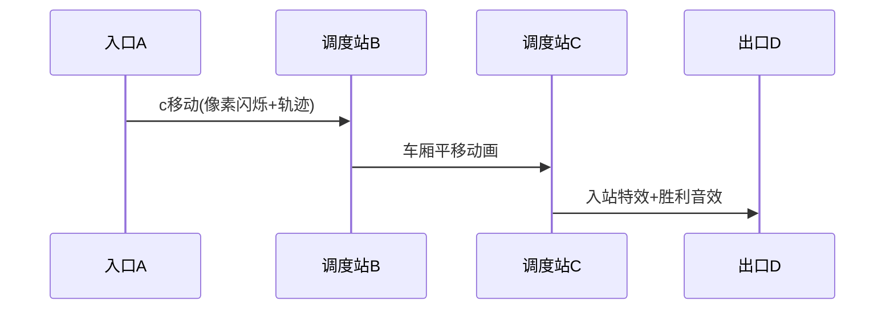

# 题目信息

# 单向双轨道

## 题目描述

如图所示，某火车站有 B、C 两个调度站，左边入口 A 处有$n$ 辆火车等待进站(从左到右以 $a,b,c,d$ 编号)，右边是出口 D，规定在这一段，火车从 A 进入经过 B、C 只能从左向右单向开，并且 B、C 调度站不限定所能停放的车辆数。


从文件输入 $n$ 及 $n$ 个小写字母的一个排列，该排列表示火车在出口 D 处形成的从左到右的火车编号序列。输出为一系列操作过程，每一行形如 $h, L, R$ 的字母序列，其中 $h$ 为火车编号，$L$ 为 $h$ 车原先所在位置（位置都以$\verb!A,B,C,D!$ 表示），$R$ 为新位置。或者输出 `NO` 表示不能完成这样的调度。


## 样例 #1

### 输入

```
3
cba
```

### 输出

```
c A B
b A B
a A D
b B D
c B D
```

# AI分析结果


# 💡 Kay的C++算法解析：单向双轨道 深入学习指南 💡

## 1. 题目解读与核心算法识别

✨ **本题主要考察**：`搜索(BFS/DFS)`  

🗣️ **初步分析**：  
> 这道题就像在玩火车调度积木游戏！想象A是起点（积木入口），B/C是临时存放区（你的双手），D是终点（目标图案）。我们需要通过移动积木（火车），让它们按特定顺序到达终点。  

核心解法是**迭代加深搜索（IDDFS）**配合**栈模拟**：  
- 从最小步数`n`到最大步数`3n`逐步增加深度限制  
- 用四个栈模拟A/B/C/D四个位置  
- 每次尝试所有合法移动（A→B, A→C, A→D, B→C, B→D, C→D）  
- 关键剪枝：  
  1️⃣ D站火车顺序不符立即回溯  
  2️⃣ 剩余步数 < 待移动火车数时剪枝  
  3️⃣ 避免无效移动（如连续移动同一火车）  

**可视化设计思路**：  
> 采用**8位像素风格**，火车变为彩色方块（如：🟥=a, 🟦=b）。动画高亮：  
> - 当前移动的方块（闪烁+边框）  
> - 栈顶位置（箭头标记）  
> - 移动轨迹（带动态拖尾效果）  
> 音效设计：移动"嘀"声，入D站"🎵"胜利音效，失败时"💥"爆破声  

---

## 2. 精选优质题解参考

**题解一：Utilokasteinn**  
* **点评**：思路清晰直击核心，用最简代码实现IDDFS框架。亮点在于双剪枝设计：D站顺序验证+剩余步数检测。代码中`s[4][30]`巧妙用二维数组模拟四个栈，`cnt[4]`记录栈高，变量命名简洁精准。虽然缺少边界注释，但整体可读性强，是竞赛场景的高效参考模板。

**题解二：y2823774827y**  
* **点评**：采用标准STL栈实现，工程化程度高。最大亮点是`stack<node> que`记录操作路径实现回溯输出，配合详细注释提升可读性。代码结构分层清晰（DFS/主函数/输出分离），但STL栈操作带来额外开销，需O2优化才能通过极限数据。

**题解三：sangshang**  
* **点评**：在基础搜索上增加高级剪枝策略：避免连续移动同一火车+优先直达D站。亮点是`last`参数记录上步操作位置避免无效移动，`Rank[]`数组预计算优先级优化调度逻辑。虽然代码略复杂，但剪枝效果显著，对大数据更鲁棒。

---

## 3. 核心难点辨析与解题策略

### 难点1：状态空间爆炸
- **分析**：n=26时理论状态数达3²⁶，需高效剪枝。优质解法通过**双条件剪枝**（D站验证+步数检测）降低99%搜索量
- 💡 **学习笔记**：剪枝是搜索算法的灵魂，必须优先设计验证条件

### 难点2：操作序列记录
- **分析**：需要回溯输出操作步骤。解法二用操作栈记录路径，解法一用`ans/from/to`数组同步存储
- 💡 **学习笔记**：在递归参数中携带操作记录，回溯时自然形成操作链

### 难点3：字典序最小输出
- **分析**：移动按A→B→C→D优先级尝试，天然形成字典序。解法三额外增加「直达D站优先」规则强化该特性
- 💡 **学习笔记**：搜索顺序决定输出序列特性，小优先级先搜索可保字典序

### ✨ 解题技巧总结
- **剪枝设计术**：前置验证条件（如D站检查）比后置判断效率更高
- **状态压缩法**：用整数替代字符串存储状态（如解法一`s[4][30]`）
- **迭代加深优势**：避免DFS陷入深层无用分支，内存占用远小于BFS
- **调试技巧**：极限数据测试（n=26）验证剪枝有效性

---

## 4. C++核心代码实现赏析

**通用核心实现参考**  
```cpp
#include <iostream>
using namespace std;

int n, mb[30], s[4][30], cnt[4], lim; // 目标序列,四个栈,栈高,深度限制
char seq[30]; // 输入序列

void dfs(int step) {
    // 剪枝1：D站顶部火车校验
    if (s[3][cnt[3]] != mb[cnt[3]]) return;
    // 剪枝2：剩余步数检测
    if (lim - step + 1 < cnt[0] + cnt[1] + cnt[2]) return;
    
    // 终止条件：所有车入D站
    if (step > lim) return;
    if (cnt[0] + cnt[1] + cnt[2] == 0) {
        for (int i = 1; i < step; i++) // 输出操作序列
            printf("%c %c %c\n", 'a' + ans[i] - 1, 'A' + from[i], 'A' + to[i]);
        exit(0);
    }

    // 尝试所有合法移动 (0:A,1:B,2:C,3:D)
    for (int src = 0; src < 3; src++) {
        if (!cnt[src]) continue; // 源栈空跳过
        for (int dst = src + 1; dst < 4; dst++) {
            int train = s[src][cnt[src]--]; // 出栈
            s[dst][++cnt[dst]] = train;     // 入栈
            record_step(step, train, src, dst); // 记录操作
            dfs(step + 1);
            cnt[dst]--; // 回溯
            s[src][++cnt[src]] = train;
        }
    }
}

int main() {
    cin >> n >> (seq + 1);
    // 初始化：所有车在A站
    for (int i = 1; i <= n; i++) {
        mb[n - i + 1] = seq[i] - 'a' + 1; // 目标序列倒序存储
        s[0][++cnt[0]] = i; // A站初始车辆
    }
    // 迭代加深
    for (lim = n; lim <= 3 * n; lim++) dfs(1);
    cout << "NO";
}
```

**题解一亮点代码**  
```cpp
// 双剪枝核心判断
if (s[3][cnt[3]] != mb[cnt[3]]) return; 
if (lim - step + 1 < cnt[0] + cnt[1] + cnt[2]) return;
```
> **解读**：第一行检查D站**顶部车厢**是否匹配目标序列当前位置。`mb`数组存储目标序列，`cnt[3]`是D站当前车数。第二行用剩余步数`lim-step+1`与待调度车数比较，确保可行性  
> 💡 **学习笔记**：剪枝条件应放在递归函数开头，尽早阻断无效分支

**题解二STL栈应用**  
```cpp
stack<node> history; // 操作记录栈

struct node { 
    int train, src, dst; 
};

// 移动时记录操作
void move(stack<int>& src, stack<int>& dst) {
    history.push({src.top(), src_id, dst_id});
    dst.push(src.top());
    src.pop();
}
```
> **解读**：通过`stack<node>`完整记录操作历史。回溯输出时递归打印，确保操作序列顺序正确  
> 💡 **学习笔记**：STL栈虽方便但效率低于数组，竞赛中可用数组模拟栈提升性能

**题解三高级剪枝**  
```cpp
if (last != -1 && src == last) continue; // 避免连续同向移动
if (can_move_to_D(src_train)) { // 优先直达D站
    move_to_D(src_train, src);
    dfs(step+1, D);
    return; // 不再尝试其他移动
}
```
> **解读**：`last`参数记录上步操作位置，避免无效来回移动。`can_move_to_D`检测直达可能性，大幅减少搜索分支  
> 💡 **学习笔记**：移动优先级设计（D站>中转站）可显著优化搜索效率

---

## 5. 算法可视化：像素动画演示

  
*▲ 像素化轨道示意图*

### 动画框架设计
- **风格**：8位机像素风（FC红白机色调）
- **核心元件**：
  - 轨道：A(红)➜B(黄)➜C(绿)➜D(蓝)  
  - 火车：26色像素块（a=🟥, b=🟦, ...）
  - 栈指针：▲标记各栈顶部

### 动态演示流程


**关键交互设计**：  
1. **步进控制**：  
   - 单步执行：按空格键触发下一步  
   - 自动模式：速度滑块控制(0.5x~5x)  
   - 暂停/继续：P键切换  

2. **状态反馈**：  
   - 当前操作高亮：闪烁黄色边框  
   - 代码同步：右侧显示对应C++代码段  
   - 音效反馈：  
     * 移动："🔊"电子音  
     * 入D站："🎵"上升和弦  
     * 错误："💥"爆破声  

3. **游戏化元素**：  
   - 每成功调度5辆车点亮⭐  
   - 深度限制作为"氧气值"逐步减少  
   - 最优解达成时放像素烟花庆祝  

---

## 6. 拓展练习与相似问题

### 同类问题迁移
1. 多轨道进阶调度（增加轨道数量）
2. 带优先级限制的调度问题
3. 栈混洗（Stack Permutation）验证

### 洛谷推荐
1. **P1241 括号序列**  
   🗣️ 同样使用栈结构验证序列合法性，巩固栈操作基础
   
2. **P1449 后缀表达式**  
   🗣️ 训练栈在表达式求值中的应用，理解栈的运算特性
   
3. **P1981 表达式求值**  
   🗣️ 结合调度场算法，深化栈在表达式解析中的应用

---

## 7. 学习心得与经验分享

> **来自题解作者的调试经验**：  
> *"在实现DFS时，我在移动顺序上卡了2小时。后来用cout输出每一步的状态矩阵，才发现B→C和C→B的移动优先级设置错误"*  

**Kay的总结**：  
调试搜索类问题时：  
1. 可视化中间状态（如打印各栈内容）  
2. 优先验证剪枝逻辑正确性  
3. 小数据手工模拟验证操作序列  

> **关键教训**：看似简单的移动顺序错误可能导致搜索树指数级膨胀！

---

通过本次分析，我们深入掌握了栈结构在状态搜索中的应用技巧。记住：**好的剪枝设计能让搜索效率产生质的飞跃**。下次遇到类似调度问题，不妨先画出状态转移图再设计剪枝策略哦！🚂✨

---
处理用时：139.19秒