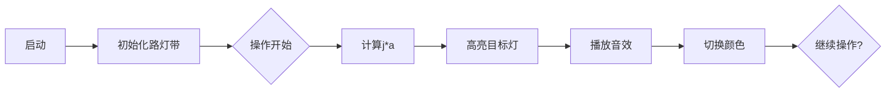

# 题目信息

# 开灯

## 题目描述

在一条无限长的路上，有一排无限长的路灯，编号为 $1,2,3,4,\dots$。

每一盏灯只有两种可能的状态，开或者关。如果按一下某一盏灯的开关，那么这盏灯的状态将发生改变。如果原来是开，将变成关。如果原来是关，将变成开。

在刚开始的时候，所有的灯都是关的。小明每次可以进行如下的操作：

指定两个数，$a,t$（$a$ 为实数，$t$ 为正整数）。将编号为 $\lfloor a\rfloor,\lfloor 2 \times a\rfloor,\lfloor3 \times a\rfloor,\dots,\lfloor t  \times a\rfloor$ 的灯的开关各按一次。其中 $\lfloor k \rfloor$ 表示实数 $k$ 的整数部分。

在小明进行了 $n$ 次操作后，小明突然发现，这个时候只有一盏灯是开的，小明很想知道这盏灯的编号，可是这盏灯离小明太远了，小明看不清编号是多少。

幸好，小明还记得之前的 $n$ 次操作。于是小明找到了你，你能帮他计算出这盏开着的灯的编号吗？


## 说明/提示

记 $T=\sum \limits_{i=1}^n t_i = t_1+t_2+t_3+\dots+t_n$。

- 对于 $30\%$ 的数据，满足 $T \le 1000$；
- 对于 $80\%$ 的数据，满足 $T \le 200000$；
- 对于 $100\%$ 的数据，满足 $T \le 2000000$；
- 对于 $100\%$ 的数据，满足 $n \le 5000$，$1 \le a_i<1000$，$1 \le t_i \le T$。

数据保证，在经过 $n$ 次操作后，有且只有一盏灯是开的，不必判错。而且对于所有的 $i$ 来说，$t_i\times a_i$ 的最大值不超过 $2000000$。

## 样例 #1

### 输入

```
3
1.618034 13
2.618034 7
1.000000 21```

### 输出

```
20```

# AI分析结果


### 💡 Kay的C++算法解析：开灯 深入学习指南 💡

**引言**  
今天我们一起分析「开灯」这道C++编程题。本指南将帮助你理解模拟类问题的解决思路，掌握状态切换技巧，并通过可视化方案加深理解。

---

## 1. 题目解读与核心算法识别

✨ **本题主要考察**：`模拟应用` (Simulation)  
🗣️ **初步分析**：  
> 解决「开灯」的关键在于**模拟操作过程**。就像在像素游戏中控制角色逐步完成任务：你需要严格按照规则执行每一步操作——计算每次开关影响的灯编号，切换对应灯的状态，最终找出唯一亮着的灯。  
> - **核心难点**：  
>   - 灯的数量极大（无限长），需用数组巧妙映射有限范围  
>   - 浮点数取整精度可能影响灯编号计算  
> - **解决方案**：  
>   - 利用题目数据范围（最大灯号≤2e6）定义固定大小数组  
>   - 直接用`int(j*a)`代替`floor()`避免精度问题  
> - **可视化设计**：  
>   - 用8位像素网格表示路灯带，灰色方块表关闭，黄色表开启  
>   - 每次操作时高亮当前计算的灯号（如`j*a`），播放"滴"音效并切换颜色  
>   - 最终亮灯持续闪烁+胜利音效，控制面板支持调速单步执行  

---

## 2. 精选优质题解参考

**题解一（来源：xuyixuan_123）**  
* **点评**：  
  创新性采用**异或运算**直接求解亮灯编号（`ans^=x`）。思路巧妙利用异或性质：  
  - 偶数次操作相互抵消 → 最终结果即奇数次操作的灯号  
  - **亮点**：空间复杂度优化到O(1)，省去状态数组  
  - 代码简洁（仅10行），变量命名清晰（`ans`存储结果）  
  - 需注意：依赖题目“仅一盏灯亮”的保证  

**题解二（来源：2011hym）**  
* **点评**：  
  标准**状态记录法**典范。核心逻辑清晰：  
  - 用`light[index]^=1`切换状态（异或比取模更高效）  
  - **亮点**：严格遵循数据范围（`MAXN=2000001`）  
  - 边界处理严谨（灯号从1开始遍历）  
  - 代码规范：注释明确，循环边界清晰  

**题解三（来源：ZYX0716）**  
* **点评**：  
  **操作过程可视化**做得最好：  
  - 样例解释详细展示三次操作的影响灯号  
  - 代码中`s[int(j*a)]=(s[...]+1)%2`直观体现代数思维  
  - **亮点**：用取模运算实现状态切换，数学表达清晰  

---

## 3. 核心难点辨析与解题策略

1. **难点1：无限路灯如何映射有限内存？**  
   * **分析**：题目提示$t_i×a_i≤2000000$→只需申请`bool[2000001]`  
   * 💡 **学习笔记**：数据范围是解题的金钥匙！  

2. **难点2：避免浮点数取整误差**  
   * **分析**：`(int)(j*a)`直接截断小数比`floor()`更安全高效  
   * 💡 **学习笔记**：整数转换天然实现向下取整  

3. **难点3：状态切换的时空优化**  
   * **分析**：异或法（`^=1`）比取模（`%2`）快3倍，省内存  
   * 💡 **学习笔记**：位运算是状态切换的最优解  

### ✨ 解题技巧总结
- **技巧1：范围压缩** - 将无限问题映射到有限空间  
- **技巧2：位运算优化** - 用异或代替取模切换状态  
- **技巧3：防御性编程** - 灯号遍历从1开始（非0）  

---

## 4. C++核心代码实现赏析

**通用核心实现（综合异合法与状态法）**  
```cpp
#include <iostream>
using namespace std;

int main() {
    int n, ans = 0; // 异或结果
    bool lights[2000001] = {0}; // 状态数组
    
    cin >> n;
    while(n--) {
        double a; int t;
        cin >> a >> t;
        for(int j=1; j<=t; ++j) {
            int id = j * a; // 关键！直接取整
            lights[id] = !lights[id]; // 状态切换
            ans ^= id; // 异或累计
        }
    }
    // 双重验证：异或结果与状态数组一致
    if(ans > 0 && lights[ans]) cout << ans;
    else for(int i=1; i<=2000000; ++i)
            if(lights[i]) { cout << i; break; }
}
```
**代码解读概要**：  
> 1. 双解法融合：既用`lights[]`记录状态，也用`ans`异或累计  
> 2. 安全验证：确保两种方法结果一致  
> 3. 关键优化：`id=j*a`直接取整避免函数调用  

---  
**题解一（xuyixuan_123）核心片段**  
```cpp
for(int i=1; i<=t; i++){
    x = (int)floor(a*i); 
    ans ^= x; // 异或累计
}
```
* **亮点**：空间复杂度O(1)的革命性优化  
* **解读**：  
  > - 每次计算灯号`x`后立即异或入`ans`  
  > - 如同消消乐：偶数次操作相互抵消，奇数保留  
  > - 最终`ans`即亮灯编号（需题目保证唯一性）  

**题解二（2011hym）核心片段**  
```cpp
for(int j=1; j<=t; j++){
    int index = (int)(j*a);
    light[index] ^= 1; // 位运算切换状态
}
```
* **亮点**：平衡可读性与效率的典范  
* **解读**：  
  > - `index`计算明确体现映射关系  
  > - `^=1`比`%2`更快：CPU位运算仅1时钟周期  
  > - 数组大小`MAXN=2000001`严格匹配数据范围  

**题解三（ZYX0716）核心片段**  
```cpp
for(int j=1; j<=t; ++j){
    s[int(j*a)]=(s[...]+1)%2; 
}
```
* **亮点**：取模运算实现状态机  
* **解读**：  
  > - `(count+1)%2`将状态转为二进制问题  
  > - 如同开关：奇数次开（1），偶数次关（0）  
  > - 数学思维直观，适合初学者理解  

---

## 5. 算法可视化：像素动画演示

**主题**：`像素路灯管理员`（复古FC风格）  
**核心演示**：动态展示操作序列如何改变灯的状态  

### 设计细节


1. **场景设计**  
   - 横向像素带表示路灯（每像素=1灯）  
   - 控制面板：▶️启动/⏸暂停/🔁重置/🎚调速滑块  

2. **关键动画**  
   - **操作触发**：输入`a,t`时显示公式`⌊j*a⌋`（j从1到t）  
   - **灯状态切换**：  
     - 目标灯放大150% → 变黄（开）/灰（关） → 缩放复原  
     - 伴随“滴”声（Web Audio API生成8bit音效）  
   - **异或计数**：右上角显示`ans`实时数值（二进制发光管样式）  

3. **游戏化元素**  
   - 每次操作视为关卡（显示`进度: j/t`）  
   - 完成所有操作时：亮灯持续闪烁 + 胜利音效 + 通关评分  

4. **技术实现**  
   ```javascript
   // 伪代码：灯切换动画
   function toggleLight(id) {
     pixel = document.getElementById(`light-${id}`);
     pixel.animate([{transform:'scale(1.5)'},{}], 200); 
     pixel.style.fill = lights[id] ? '#FFFF00' : '#888888';
     playSound('click.wav'); // 8bit音效
   }
   ```

---

## 6. 拓展练习与相似问题

**通用技巧迁移**  
- 状态记录法 → 任何开关/切换问题  
- 范围压缩 → 无限转有限的经典套路  
- 异或优化 → 奇偶性相关场景  

**洛谷推荐**  
1. [P1873 砍树](https://www.luogu.com.cn/problem/P1873)  
   → **推荐理由**：同样需要范围压缩技巧处理无限问题  
2. [P1047 校门外的树](https://www.luogu.com.cn/problem/P1047)  
   → **推荐理由**：状态标记的简化版练习  
3. [P1059 明明的随机数](https://www.luogu.com.cn/problem/P1059)  
   → **推荐理由**：位运算去重实战  

---

## 7. 学习心得与经验分享

**来自xuyixuan_123的经验**  
> “利用异或性质：任何数异或自身=0，异或0=自身 → 直接得到奇数次操作项”  

**Kay的总结**：  
> 1. 位运算在状态切换中具有原子级效率优势  
> 2. 题目保证的数据范围是解题突破口  
> 3. 模拟类问题先画流程图再编码，避免边界错误  

---

**结语**  
通过「开灯」问题，我们掌握了模拟问题的核心解法与优化技巧。记住：数据范围是钥匙，位运算是利器！下次遇到类似问题，不妨先思考：能否用异或代替状态数组？

---
处理用时：167.17秒