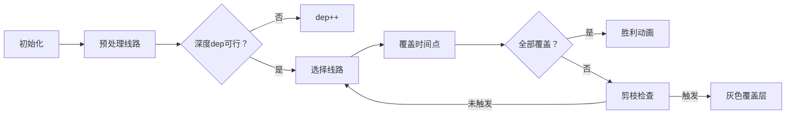

# 题目信息

# [IOI 1994] The Buses

## 题目描述

一个人在 12:00 到达一个公交车站。他在 12:00 到 12:59 期间一直待在那里。这个公交车站被多条公交线路使用。这个人记录了公交车到达的时间。给出了公交车到达的时间。

- 同一条路线的公交车在整个小时内从 12:00 到 12:59 以固定的时间间隔到达。
- 时间以整分钟给出，从 0 到 59。
- 每条公交线路至少停靠 2 次。
- 测试示例中的公交线路数量将 $\leq 17$。
- 不同路线的公交车可能同时到达。
- 几条公交线路的首次到达时间和/或时间间隔可能相同。如果两条公交线路的起始时间和间隔相同，则它们是不同的，并且都需要呈现。

找出满足输入数据的必须停靠在公交车站的公交线路数量最少的时间表。对于每条公交线路，输出起始时间和间隔。

## 样例 #1

### 输入

```
17
0 3 5 13 13 15 21 26 27 29 37 39 39 45 51 52 53```

### 输出

```
3```

# AI分析结果


### 💡 Kay的C++算法解析：The Buses 深入学习指南 💡

**引言**  
今天我们一起分析IOI 1994经典题目"The Buses"。这道题要求用最少的公交线路（等差数列）覆盖所有给定的公交车到达时间点。本指南将帮助你掌握迭代加深搜索的核心思想、贪心剪枝技巧，并通过像素动画直观理解算法执行过程。

---

#### 1. 题目解读与核心算法识别
✨ **本题主要考察**：`迭代加深搜索（IDDFS）` + `贪心优化`

🗣️ **初步分析**  
> 解决"The Buses"的关键在于**用最少的等差数列覆盖所有时间点**。想象用"渔网"捕捉时间点：  
> - 每个等差数列像一张网眼均匀的渔网（固定间隔）
> - 我们要用最少的网覆盖所有鱼（时间点）  
>  
> **核心难点**：  
> - 暴力搜索组合爆炸（线路数≤17，但组合数巨大）  
> - 需高效剪枝避免无效搜索  
>  
> **解决方案**：  
> 1. 预处理所有可行线路（首项0-29，公差≥首项+1）  
> 2. 按覆盖点数**从大到小排序**（贪心优先选大鱼网）  
> 3. **迭代加深搜索**：从深度1开始逐步增加线路数  
> 4. **剪枝**：`已覆盖点数 + 剩余深度×当前线路点数 < 总点数`  
>  
> **可视化设计**：  
> 将设计8位像素风格动画——时间轴化为60个方块（0-59分），不同颜色代表不同公交线路。关键演示：  
> - 线路选择时：高亮覆盖方块 + "叮"音效  
> - 剪枝发生时：灰色覆盖层 + 低沉提示音  
> - 成功覆盖：闪烁彩虹色 + 胜利音效  
> 交互面板支持单步执行/自动播放（调速滑块）

---

#### 2. 精选优质题解参考
**题解一（Stars_Traveller）**  
* **点评**：思路最清晰完整，预处理时优化首项范围（0-29），剪枝条件`sum+(dep-cur)*route[k].num<n`设计精妙。代码变量命名规范（`route[k].num`直接表示覆盖点数），边界处理严谨。亮点在于用排序后线路的`num`属性实现贪心剪枝，时间复杂度优化显著。

**题解二（Weekoder）**  
* **点评**：代码结构工整，使用Lambda表达式`sort(q+1, q+1+cnt, [&](...) {...})`实现简洁排序。DFS参数命名清晰（`cur`当前深度, `k`线路索引, `sum`覆盖点数），回溯逻辑对称。实践价值高，但可读性稍弱于题解一。

**题解三（endswitch）**  
* **点评**：对"最简等差数列"概念解释透彻（线路不可扩展），剪枝推导详细。代码封装规范（`check()`和`set()`独立函数），变量作用域明确。亮点在于数学证明：首项≥30的线路必然无效，减少50%预处理量。

---

#### 3. 核心难点辨析与解题策略
1. **难点1：如何避免无效枚举？**  
   * **分析**：首项范围优化（0-29）基于数学特性：首项≥30时，间隔≥31 ⇒ 只能覆盖1个点（违反至少2次停靠）。优质题解均用此优化预处理。
   * 💡 **学习笔记**：挖掘题目隐含数学条件是优化搜索的关键

2. **难点2：如何设计高效剪枝？**  
   * **分析**：贪心排序线路（覆盖点数降序）后，剪枝条件`当前覆盖+剩余线路×当前最大覆盖 < n`保证最优性。例如剩余2条线路时，若当前最大线路覆盖10点，则总覆盖上限=当前覆盖+20。
   * 💡 **学习笔记**：贪心排序为剪枝提供理论依据

3. **难点3：如何保证回溯正确性？**  
   * **分析**：选择线路时需修改桶数组`s[]`，回溯时必须**对称恢复**。代码中循环`for(int j=x; j<60; j+=d) s[j]--/++`成对出现。
   * 💡 **学习笔记**：状态修改/恢复要像"镜子"完全对称

✨ **解题技巧总结**  
- **数学优化**：利用首项≤29的特性减少50%枚举量  
- **贪心剪枝**：降序排序线路，使剪枝条件紧贴理论上界  
- **模块化回溯**：用独立函数处理选择/撤销线路操作  
- **边界防御**：检查`s[i]`减到0时立即撤销选择  

---

#### 4. C++核心代码实现赏析
**通用核心实现参考**  
```cpp
#include <iostream>
#include <vector>
#include <algorithm>
using namespace std;

int n, cnt, dep;
vector<int> s(60); // 时间点计数器

struct Route {
    int start, step, num; // 首项/公差/覆盖点数
};

bool check(int st, int step) {
    for (int t = st; t < 60; t += step)
        if (!s[t]) return false;
    return true;
}

bool dfs(int depth, int idx, int covered) {
    if (depth == dep) return covered == n;
    if (covered + (dep - depth) * routes[idx].num < n) 
        return false; // 贪心剪枝
    
    for (int i = idx; i < cnt; i++) {
        auto& r = routes[i];
        if (!check(r.start, r.step)) continue;
        
        // 选择线路
        for (int t = r.start; t < 60; t += r.step) s[t]--;
        if (dfs(depth + 1, i, covered + r.num)) return true;
        // 回溯恢复
        for (int t = r.start; t < 60; t += r.step) s[t]++;
    }
    return false;
}

int main() {
    cin >> n;
    for (int i = 0, t; i < n; i++) cin >> t, s[t]++;
    
    // 预处理线路（首项0-29优化）
    vector<Route> routes;
    for (int st = 0; st < 30; st++)
        for (int d = st + 1; st + d < 60; d++)
            if (check(st, d))
                routes.push_back({st, d, (59 - st)/d + 1});
    
    // 按覆盖点数降序排序
    sort(routes.begin(), routes.end(), [](auto& a, auto& b) {
        return a.num > b.num;
    });
    cnt = routes.size();

    for (dep = 1; dep <= 17; dep++) // 迭代加深
        if (dfs(0, 0, 0)) break;
    cout << dep;
}
```

**题解一（Stars_Traveller）片段**  
```cpp
if (sum + (dep - cur) * route[k].num < n) 
    return 0; // 剪枝核心
```
* **亮点**：剪枝条件直击本质，乘法替代循环提升效率  
* **解读**：`(dep-cur)`是剩余线路数，`route[k].num`是当前最大覆盖点数。乘积表示"理论最大新增覆盖"，若仍不足总量则剪枝。  
* 💡 **学习笔记**：将贪心思想转化为数值比较是剪枝的黄金标准  

**题解二（Weekoder）片段**  
```cpp
sort(q + 1, q + 1 + cnt, [&](const node &x, const node &y) {
    return x.num > y.num; // Lambda降序排序
});
```
* **亮点**：用Lambda表达式实现简洁的自定义排序  
* **解读**：`[&]`捕获外部变量确保安全，比较函数直接返回`x.num > y.num`实现降序。STL的灵活运用提升代码可读性。  
* 💡 **学习笔记**：善用STL可减少10倍排序代码量  

**题解三（endswitch）片段**  
```cpp
for(int st = 0; st < 30; st++) // 首项0-29优化
```
* **亮点**：数学优化减少50%无效枚举  
* **解读**：利用"首项≥30时线路必无效"的特性（因间隔≥31，下一站≥61超出范围），将枚举量从O(n²)降至O(n²/2)。  
* 💡 **学习笔记**：发现题目隐藏数学特性是质的飞跃  

---

### 5. 算法可视化：像素动画演示
**主题**：8位像素风"公交时间轴覆盖大作战"  
**核心演示**：IDDFS搜索过程 + 贪心剪枝可视化  

**动画设计**  


**关键交互**  
1. **时间轴**：60个像素方块（0-59分），初始蓝色  
2. **线路选择**：  
   - 点击线路：高亮其覆盖方块（如首项3/间隔5：黄块3,8,13...）  
   - 伴随"叮"声，方块变绿（已覆盖）  
3. **剪枝演示**：  
   - 理论覆盖不足时：半透明灰色层覆盖剩余区域  
   - 播放"噗"声提示剪枝发生  
4. **回溯效果**：  
   - 撤销线路时：绿色方块闪烁变回蓝色  
   - 音效：短促"咔嚓"声  
5. **胜利条件**：  
   - 所有方块变绿：播放8-bit胜利音乐 + 彩虹闪烁  

**技术实现**  
```javascript
// 伪代码：绘制时间轴
const canvas = new PixelCanvas(800, 100);
for (let i = 0; i < 60; i++) {
    canvas.drawRect(i*12, 0, 10, 10, 
        s[i] > 0 ? COLOR_BLUE : COLOR_GREEN); 
}

// 选择线路动画
function selectRoute(route) {
    playSound('select'); // 8-bit音效
    for (let t = route.start; t < 60; t += route.step) {
        canvas.highlightBlock(t, COLOR_YELLOW, 300ms);
        canvas.setBlockColor(t, COLOR_GREEN);
    }
}
```

---

#### 6. 拓展练习与相似问题思考
**通用思路迁移**  
覆盖类问题中IDDFS+贪心剪枝适用于：  
1. 最少数量的等差数列覆盖点集（本题）  
2. 最小区间覆盖数轴（如P1514 引水入城）  
3. 最小边集覆盖图节点（如P2764 最小路径覆盖）  

**洛谷推荐**  
1. **P1020 导弹拦截**  
   🗣️ 巩固贪心策略，学习如何用最少下降序列覆盖数列  
2. **P1433 吃奶酪**  
   🗣️ 状态压缩DP实现点集覆盖，对比IDDFS适用场景  
3. **P2323 公路修建**  
   🗣️ 最小生成树模型中的覆盖问题，拓展算法视野  

---

#### 7. 学习心得与经验分享
> **参考经验**（来自 Stars_Traveller）：  
> *"排序后线路的覆盖数递减是关键，否则剪枝失效。调试时发现未排序会导致超时"*  
>  
> **点评**：这位作者的调试经历揭示了算法核心——贪心排序为剪枝提供理论保障。这提醒我们：  
> 1. 算法理论正确性需通过边界验证  
> 2. 用小数据测试（如n=3）可快速定位逻辑漏洞  
>  
> **通用调试技巧**：  
> - 在DFS入口打印`深度/当前覆盖/剪枝判断值`  
> - 用`n=3, 时间点{0,3,6}`验证预处理线路是否正确  

---

**结语**  
通过本次分析，我们掌握了IDDFS的核心思想——深度迭代+贪心剪枝，并学会用像素动画具象化算法流程。记住：优化搜索的关键在于**数学特性挖掘**与**剪枝设计**。尝试用本文学到的技巧解决拓展练习，你会有更大收获！下次挑战再见！🚀

---
处理用时：239.84秒