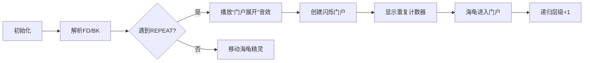

# 题目信息

# logo语言

## 题目描述

Logo 语言命令可以指挥海龟在屏幕中爬行。本问题只使用 Logo 语言的三个语句：前进 `FD`，倒退 `BK` 和重复 `REPEAT`，因此，海龟只在一条直线上来回爬行。输入一行 logo 的命令行，输出海龟在屏幕中离开原来位子的距离（假设屏幕很大，可以让海龟移开 $10^9$ 的距离）。

例如：

- 输入 `FD 100` ，输出：$100$。

- 输入 `FD 100 BK 150`， 输出：$50$。

- 输入 `REPEAT 5[FD 100 BK 50]`， 输出：$250$。

- 输入 `REPEAT 5[FD 50 REPEAT 10[FD 100]]`， 输出：$5250$。

## 说明/提示

每个语句输入数据的绝对值不超过 $1000$。输出结果不会超过 $10^9$。


## 样例 #1

### 输入

```
FD 100
```

### 输出

```
100
```

# AI分析结果


### 💡 Kay的C++算法解析：Logo语言 深入学习指南 💡

#### 1. 题目解读与核心算法识别
✨ **本题主要考察**：`递归解析`与`栈应用`  

🗣️ **初步分析**：
> 解决Logo语言解析题，就像拆解俄罗斯套娃——每个REPEAT命令都包裹着新的命令层。核心思想是通过递归或栈逐层解析嵌套命令，最终累计算移动距离。
   - 递归法直接模拟命令嵌套结构，代码简洁但需注意边界；栈法则显式管理命令层级，适合避免递归深度限制
   - 可视化设计将聚焦：① 海龟位置实时更新 ② REPEAT区块高亮与展开动画 ③ 嵌套层级深度标记
   - 采用8位像素风格：海龟用16x16像素精灵，REPEAT区块用闪烁边框，移动时播放FC游戏步进音效，嵌套解析完成时触发"升级"音效

---

#### 2. 精选优质题解参考
**题解一 (作者：a1_1)**  
* **点评**：递归实现堪称教科书级——仅42行完成核心逻辑。亮点在于：  
  ✅ 用`while(cin>>c)`自动处理输入流终结  
  ✅ 精妙处理空REPEAT命令(`if(c==']')break`)  
  ✅ 用`getchar()`吸收多余字符保持流同步  
  ⚠️ 需注意：变量名`v`/`l`可读性可提升  

**题解二 (作者：封禁用户)**  
* **点评**：教学级递归解析，特别适合初学者：  
  ✅ 中文注释详细解释每个变量作用  
  ✅ 用`wz`变量明确处理命令后缀(EPEAT/K/D)  
  ✅ 递归边界处理清晰(`if(ch==']')break`)  
  ⚠️ 函数命名`func()`可更具体(如`parseCommand()`)  

**题解三 (作者：RenaMoe)**  
* **点评**：工业级栈实现解决方案：  
  ✅ 手写栈避免STL开销  
  ✅ `k[top]`存储REPEAT次数，`stack[top]`存当前层位移  
  ✅ 精妙处理连续嵌套(`while(s[len]==' ]')`)  
  ✅ 显示清空栈层(`stack[top]=0`)防内存残留  

---

#### 3. 核心难点辨析与解题策略
1. **嵌套REPEAT的层级管理**  
   * **分析**：REPEAT内可能包含新REPEAT，形成多层嵌套。递归法天然匹配树形结构；栈法则需显式记录层级深度和重复次数。关键变量是`当前层级索引`和`重复计数器`
   * 💡 **学习笔记**：嵌套解析本质是深度优先遍历命令树

2. **命令流与字符解析同步**  
   * **分析**：混合命令如`REPEAT 5[FD 50] BK 20`需精确分割。技巧：  
     - 递归法：用`getchar()`吸收空格/括号  
     - 栈法：预处理括号匹配(如题解八的`link[]`数组)
   * 💡 **学习笔记**：输入流处理是文本解析类题目的核心难点

3. **位移计算的乘法效应**  
   * **分析**：REPEAT的本质是乘法器——`REPEAT k[cmd]`等效`k*∑cmd位移`。必须：  
     - 递归法：返回内层位移乘k  
     - 栈法：弹出时用`top-1层位移 += k * top层位移`
   * 💡 **学习笔记**：REPEAT在AST中本质是乘法运算符

### ✨ 解题技巧总结
- **递归四要素**：终止条件(`]`)、本层操作(FD/BK)、递归入口(REPEAT+`[`)、结果聚合(return l)
- **栈操作黄金法则**：遇到`[`压栈新层，`]`弹栈计算
- **防御性编程**：空REPEAT处理(`REPEAT 0[]`)、输入流终结检测(EOF)
- **位移计算铁律**：最终结果取绝对值(`abs(displacement)`)

---

#### 4. C++核心代码实现赏析
**通用递归实现参考**  
* **说明**：综合题解一、二优点的精简版本
```cpp
#include <iostream>
using namespace std;

int parse() {
    char cmd, tmp;
    int val, dis = 0;
    while (cin >> cmd) {
        if (cmd == ']') break;
        string suffix;
        cin >> suffix >> val;
        tmp = getchar(); // 吸收空格或'['

        if (cmd == 'R') { // REPEAT
            dis += val * parse();
            tmp = getchar(); // 吸收']'后空格
        } 
        else if (cmd == 'F') dis += val; // FD
        else if (cmd == 'B') dis -= val; // BK
        
        if (tmp == ']') break;
    }
    return dis;
}

int main() {
    cout << abs(parse());
    return 0;
}
```
* **代码解读概要**：  
  > 1. `parse()`递归处理命令流  
  > 2. `while(cin>>cmd)`自动处理输入终结  
  > 3. `getchar()`吸收分隔符保持流同步  
  > 4. 递归计算嵌套位移后聚合结果  

---

**题解一：递归片段赏析**  
```cpp
if (c == 'R') {
    v = getchar(); // '['
    l += k * dg(); // 核心：递归计算内层位移
    v = getchar(); // ']'
}
```
* **代码解读**：  
  > ✅ `dg()`递归返回内层位移  
  > ✅ `k * dg()`实现REPEAT乘法效应  
  > ✅ 双`getchar()`精确跳过括号边界  

**题解三：栈实现片段赏析**  
```cpp
else if (s[0]=='R') {
    k[top] = read(); // 存储REPEAT次数
    top++;          // 压栈新层
    stack[top] = 0; // 清空新层位移
}
```
* **代码解读**：  
  > ✅ `k[]`与`stack[]`双数组模拟栈  
  > ✅ 显式清空新层避免脏数据  
  > ✅ `top++`对应`[`开启新作用域  

---

#### 5. 算法可视化：像素动画演示
* **主题**："海龟探险"8位像素游戏  
* **核心演示**：REPEAT区块展开为发光门户，海龟穿越门户执行嵌套命令  

**关键帧设计**：  


**交互细节**：  
1. **门户动画**：  
   - REPEAT k[cmd]触发16x16像素门户动画  
   - 门户边框按`k`值显示数字（FC字体）  
   - 海龟进入时播放"warp"音效  

2. **位移可视化**：  
   ```plaintext
   初始位置: (0, 0)
   FD 100 -> [>>>>>>>>>>] 进度条填充+位置更新至(100,0)
   BK 50  -> [<<<<<]      进度条回撤+位置回退至(50,0)
   ```

3. **嵌套高亮**：  
   - 层级1：蓝色边框  
   - 层级2：绿色边框+背景网格  
   - 层级3：红色边框+脉冲光效  

**音效系统**：  
- `FD/BK`：8-bit步进音(频率随位移量变化)  
- `REPEAT`：门户展开时低音鼓声  
- 嵌套完成：FC游戏升级音效  

---

#### 6. 拓展练习与相似问题思考
* **算法迁移场景**：  
  1. 数学表达式解析（含括号优先级）  
  2. JSON/XML层级数据解析  
  3. 编程语言解释器开发  

* **洛谷题目推荐**：  
  1. **P1928 外星密码**  
     🗣️ 嵌套压缩串解析，与本题目递归结构高度一致  
  2. **P1175 表达式的转换**  
     🗣️ 中缀表达式处理，强化栈操作技巧  
  3. **P1739 表达式括号匹配**  
     🗣️ 基础括号匹配，训练预处理能力  

---

#### 7. 学习心得与经验分享
> **题解一作者经验**：  
> *"交10次A了2次...特判REPEAT 1[] BK 1"*  
>   
> **Kay点评**：  
> 空REPEAT是经典边界陷阱！调试时：  
> 1. 添加`if(cmd=='R' && next_char==']')`特判  
> 2. 单元测试需覆盖：`REPEAT 0[]`/`REPEAT 1[]`  
> 3. 递归法注意`getchar()`在空区块的副作用  

---

通过本次分析，我们深度解剖了Logo解析的递归与栈实现精髓。记住：好的解析器像精密钟表——每个字符都要严丝合缝！下次遇到嵌套结构时，不妨回想这只在像素世界中穿梭的海龟🐢。

---
处理用时：110.08秒