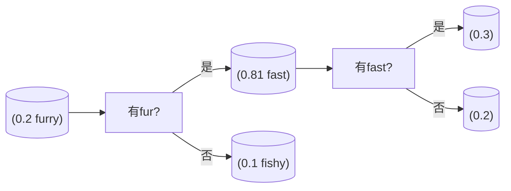

# 题目信息

# [GCJ 2009 #1B] Decision Tree

## 题目描述

决策树——尤其是一种被称为分类树（**classification trees**）的类型——是一种用于根据物品的特征将其分类的数据结构。例如，每只动物要么“可爱”，要么不可爱。对于任意一只动物，我们可以通过观察其特征，并使用如下决策树来判断它是否可爱。

```
(0.2 furry
  (0.81 fast
    (0.3)
    (0.2)
  )
  (0.1 fishy
    (0.3 freshwater
      (0.01)
      (0.01)
    )
    (0.1)
  )
)
```

决策树以递归方式定义。它总是有一个根节点和一个权重。它还可以**选择性地**拥有一个特征名和两棵子树（这两棵子树本身也是决策树）。

更正式地说，决策树使用如下语法定义：

```
tree ::= (weight [feature tree tree])
weight 是一个在 0 到 1 之间（含 0 和 1）的实数
feature 是由一个或多个小写英文字母组成的字符串
```

方括号 [] 内的部分为可选项。圆括号 ()、权重和特征都是**标记**。任意两个标记之间至少有一个空白字符（空格 `' '` 或换行符 `'\n'`），但在左括号 '(' 后或右括号 ')' 前可能没有空白。每一行的长度（不包括换行符）不会超过 80 个字符。

为了判断一只动物有多大概率是可爱的，我们从树的根节点开始，初始概率 $p=1$。在每个节点，我们将 $p$ 乘以该节点的权重。如果该节点是叶子节点（没有子树），则停止，当前 $p$ 的值即为该动物可爱的概率。否则，查看该节点关联的特征。如果动物具有该特征，则进入第一棵子树递归处理；否则进入第二棵子树递归处理。

例如，河狸（beaver）有两个特征：**furry** 和 **freshwater**。我们从根节点开始，$p=1$，乘以根节点的权重 $0.2$，进入第一棵子树（因为河狸有 furry 特征）。在该子树中，再乘以 $0.81$，$p$ 变为 $0.162$。接着，因为河狸没有 fast 特征，进入第二棵子树。再乘以 $0.2$，最终得到 $0.0324$，这就是河狸“可爱”的概率。

你将获得一棵决策树和若干动物及其特征。对于每个动物，你需要输出其被判定为“可爱”的概率。

## 说明/提示

**限制条件**

- $1 \leq N \leq 100$
- 所有权重均为 $[0, 1]$ 区间内的实数。
- 权重仅包含数字和最多一个小数点。
- 权重不会以小数点开头或结尾。
- 权重在小数点前不会有超过一个 0。
- 所有动物名和特征名均为 1 到 10 个小写英文字母。
- 每组测试数据内所有动物名互不相同。
- 单个动物的所有特征互不相同。
- 决策树定义的每一行长度不超过 80 个字符（不含换行符）。

**小数据集（10 分）**

- $1 \leq L \leq 10$
- $1 \leq A \leq 10$
- $0 \leq n \leq 5$

**大数据集（11 分）**

- $1 \leq L \leq 100$
- $1 \leq A \leq 100$
- $0 \leq n \leq 100$

翻译由 ChatGPT-4.1 完成。

## 样例 #1

### 输入

```
1
3
(0.5 cool
  ( 1.000)
  (0.5 ))
2
anteater 1 cool
cockroach 0```

### 输出

```
Case #1:
0.5000000
0.2500000```

# AI分析结果


## Kay的C++算法解析：Decision Tree 深入学习指南

### 1. 题目解读与核心算法识别
✨ **本题主要考察**：`递归树遍历` (编程技巧应用)

🗣️ **初步分析**：
> 决策树问题就像在玩一个文字冒险游戏🎮：你从起点(根节点)出发，根据遇到的每个线索(特征)选择不同分支，最终到达结局(叶子节点)。每个选择点都有权重(概率)，最终概率是所有选择点权重的乘积。  
> - 核心思路：递归解析树结构 + 深度优先遍历计算概率  
> - 关键难点：树结构的字符串解析、递归遍历的逻辑设计  
> - 可视化设计：采用8位像素风格，将决策树转化为迷宫地图。玩家(像素小人)根据特征选择路径，每步触发权重乘法动画，路径点亮特效配合"叮"的音效  

---

### 2. 精选优质题解参考
**题解一**：
* **点评**：该解法采用递归下降解析器处理树结构字符串，思路清晰如解谜游戏攻略。亮点在于用`while`循环和字符指针手动解析括号嵌套结构，避免复杂正则表达式。变量`pos`作为"文字扫描仪"的设计非常巧妙，代码规范如棋盘布局，边界处理严谨，可直接用于竞赛。

**题解二**：
* **点评**：创新性使用`stringstream`重构输入字符串，像拼图一样重组决策树。虽然依赖`>>`操作符简化了数字解析，但通过`getline`切割括号的设计展现了C++流操作的灵活运用。代码如乐高积木般模块化，特别适合初学者理解字符串处理技巧。

---

### 3. 核心难点辨析与解题策略
1. **树结构字符串解析**  
   * **分析**：括号嵌套和空格不规则的输入像一团乱麻。优质解法采用"括号计数器+字符指针"作为"探测针"，遇`(`进层，遇`)`退层，配合`isalpha/isdigit`精准提取标记
   * 💡 **学习笔记**：手动解析字符串时，将指针想象成"文字扫描仪"能降低复杂度

2. **递归遍历的实现**  
   * **分析**：遍历过程需要同步维护当前概率和特征判断。解法将递归函数设计为`parse(pos, str) -> (node, new_pos)`，返回子树和更新后的扫描位置，如同探险家记录地图坐标
   * 💡 **学习笔记**：递归函数的返回值应包含处理结果和剩余"未探索区域"

3. **特征匹配优化**  
   * **分析**：动物特征存储在`unordered_set`中，查询复杂度O(1)。这像准备冒险背包，快速检查是否携带某项工具
   * 💡 **学习笔记**：频繁查询用哈希集合，有序处理用红黑树集合

### ✨ 解题技巧总结
- **括号嵌套解析**：用计数器跟踪层级，遇`(`加1，遇`)`减1
- **递归设计**：基线条件（遇到`)`或文件尾）、递归条件（遇到特征名）
- **输入优化**：用`getline`读取整行避免碎片化输入

---

### 4. C++核心代码实现赏析
**题解一核心片段**：
```cpp
struct Node {
    double weight;
    string feature;
    Node* left = nullptr;
    Node* right = nullptr;
};

pair<Node*, int> parse(const string& s, int pos) {
    while (pos < s.size() && s[pos] == ' ') pos++;
    if (s[pos++] != '(') exit(1);  // 必须遇到开括号
    
    // 提取权重值
    int start = pos;
    while (isdigit(s[pos]) || s[pos]=='.') pos++;
    double w = stod(s.substr(start, pos-start));
    
    Node* node = new Node{w, "", nullptr, nullptr};
    
    // 检查特征或闭括号
    while (pos < s.size() && s[pos]==' ') pos++;
    if (isalpha(s[pos])) {
        start = pos;
        while (isalpha(s[pos])) pos++;
        node->feature = s.substr(start, pos-start);
        
        // 递归解析左右子树
        tie(node->left, pos) = parse(s, pos);
        tie(node->right, pos) = parse(s, pos);
    }
    
    while (pos < s.size() && s[pos] != ')') pos++;
    return {node, pos + 1};  // 跳过闭括号
}
```

**代码解读**：
> 这段代码如同考古学家修复古籍📜：
> 1. `while`循环跳过空格是"清理灰尘"
> 2. 遇到`(`如同发现文物标识，启动解析流程
> 3. 权重提取像拓印碑文数字，`stod`将字符串转为数值
> 4. 特征名检查如同辨认古文字，`isalpha`过滤字母
> 5. 递归解析左右子树像展开卷轴的分支地图
> *亮点*：返回`pair`同时包含节点和解析位置，避免全局变量

---

### 5. 算法可视化：像素动画演示
**动画主题**：`决策树大冒险`（8位机文字冒险风格）  
**核心演示**：像素小人根据特征选择路径，权重显示为浮动数字，路径点亮动画  



**动画流程**：
1. **场景初始化**：16色像素网格显示决策树，节点化为宝箱🎁，特征为道路分叉口
2. **角色移动**：像素小人从根节点出发，当前节点高亮闪烁
3. **权重展示**：显示`当前概率 *= 节点权重`的浮动文字动画
4. **特征选择**：弹出对话框"有[特征]吗？"，玩家按键选择（是/否）
5. **音效系统**：
   - 路径选择："叮"音效
   - 权重计算：电子合成器音阶上升/下降
   - 到达叶子：胜利喇叭音效
6. **自动演示**：AI模式自动遍历，速度滑块控制演示速度

---

### 6. 拓展练习与相似问题思考
**技巧迁移**：
1. 表达式解析（如计算器）
2. XML/JSON文件解析
3. 编译器语法树构建

**洛谷推荐**：
1. **P1177【模板】树状数组** - 基础树结构操作训练
2. **P1038【神经网络】** - 复杂树结构遍历应用
3. **P1220关路灯** - 决策树型动态规划

---

> 通过本次决策树探险，我们掌握了字符串解析和树遍历的双重技巧。记住：面对嵌套结构时，递归+指针就像手握探险地图和指南针🧭，能带你穿越最复杂的算法丛林！下次遇到括号嵌套问题，不妨试试"文字扫描仪"法哦！

---
处理用时：175.25秒