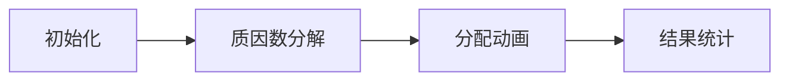

# 题目信息

# [NOIP 2001 普及组] 最大公约数和最小公倍数问题

## 题目描述

输入两个正整数 $x_0, y_0$，求出满足下列条件的 $P, Q$ 的个数：

1. $P,Q$ 是正整数。

2. 要求 $P, Q$ 以 $x_0$ 为最大公约数，以 $y_0$ 为最小公倍数。

试求：满足条件的所有可能的 $P, Q$ 的个数。

## 说明/提示

$P,Q$ 有 $4$ 种：

1. $3, 60$。
2. $15, 12$。
3. $12, 15$。
4. $60, 3$。

对于 $100\%$ 的数据，$2 \le x_0, y_0 \le {10}^5$。

**【题目来源】**

NOIP 2001 普及组第二题

## 样例 #1

### 输入

```
3 60
```

### 输出

```
4
```

# AI分析结果


### 💡 Kay的C++算法解析：最大公约数和最小公倍数问题 深入学习指南 💡

**引言**  
今天我们一起分析NOIP 2001普及组的经典题目《最大公约数和最小公倍数问题》。这道题考察数学思维与算法优化的结合，本指南将带你理解核心原理，掌握高效解法。

---

## 1. 题目解读与核心算法识别

✨ **本题主要考察**：`数学性质应用` + `枚举优化`  

🗣️ **初步分析**：
> 解决本题的关键在于运用数学性质：**两数乘积 = 最大公约数 × 最小公倍数**（即 `P×Q = x0×y0`）。  
> - **核心思路**：通过枚举 `x0*y0` 的因数，利用对称性将枚举范围优化到 `√(x0*y0)`  
> - **难点处理**：当 `x0=y0` 时需特判重复计数，使用 `__gcd` 函数快速验证条件  
> - **可视化设计**：将质因数分配过程设计为像素方块配对游戏（见第5节），用不同颜色方块表示质因数，动态展示分配过程  

---

## 2. 精选优质题解参考

<eval_intro>
根据思路清晰性、代码优化度和数学深度，精选三条代表性题解：
</eval_intro>

**题解一：樱雪喵（数学优化+代码简洁）**  
* **点评**：抓住 `P×Q=x0×y0` 的核心性质，将枚举范围优化至平方根级别。代码使用 `__gcd` 函数简洁高效（时间复杂度 O(√n)），边界处理完整（`x0=y0` 特判）。亮点在于数学推导与代码优化的完美平衡，是竞赛标准解法。

**题解二：sochiji（质因数分解法）**  
* **点评**：创新性从算术基本定理切入，将问题转化为质因数分配问题（时间复杂度 O(√(y0/x0))）。代码实现质因数分解过程清晰，变量名规范（如 `quotient`）。亮点在于揭示问题本质：**答案 = 2^(质因数个数)**，提供全新视角。

**题解三：zhangboju（数学证明完整）**  
* **点评**：详细推导 `gcd` 与 `lcm` 的数学原理，手写递归版 `gcd` 函数展示算法本质。代码包含完整类型声明（`long long` 防溢出），逻辑推导过程具教学价值，适合基础巩固。

---

## 3. 核心难点辨析与解题策略

<difficulty_intro>
解决本题需突破三大关键点：
</difficulty_intro>

1.  **难点1：理解数学性质关联**  
    * **分析**：必须明确 `P×Q = gcd(P,Q)×lcm(P,Q)` 的数学原理（樱雪喵/sochiji均用此简化问题）  
    * 💡 **学习笔记**：掌握数论基础性质是转化复杂条件的钥匙

2.  **难点2：避免超时枚举**  
    * **分析**：优质解法均将枚举范围从 `[1, x0*y0]` 优化至 `[1, √(x0*y0)]`，利用 `P↔Q` 对称性将计算量降为平方根级（樱雪喵题解第8行）  
    * 💡 **学习笔记**：当问题存在对称性时，枚举范围优化是通用技巧

3.  **难点3：处理特殊边界**  
    * **分析**：`x0=y0` 时 `P=Q` 导致重复计数，需在最终答案减1（樱雪喵题解第6行）  
    * 💡 **学习笔记**：边界测试是代码健壮性的保障

### ✨ 解题技巧总结
<summary_best_practices>
通用解题策略：
</summary_best_practices>
- **技巧1：数学性质转化** - 将复杂条件转化为数学等式（如 `P×Q=x0*y0`）  
- **技巧2：枚举范围优化** - 利用对称性减少枚举量（√n 级复杂度）  
- **技巧3：问题等价转换** - 将原问题转化为质因数分配问题（sochiji解法）  

---

## 4. C++核心代码实现赏析

<code_intro_overall>
**通用核心实现**（综合樱雪喵与sochiji解法）：
</code_intro_overall>
```cpp
#include <iostream>
#include <cmath>
using namespace std;

int main() {
    long long x0, y0;
    cin >> x0 >> y0;
    if (y0 % x0 != 0) { // 无解特判
        cout << 0;
        return 0;
    }
    
    long long product = x0 * y0;
    long long ans = 0;
    
    // 枚举到平方根优化
    for (long long i = 1; i <= sqrt(product); ++i) {
        if (product % i == 0 && __gcd(i, product/i) == x0) {
            ans += 2; // 计数P/Q互换
        }
    }
    
    if (x0 == y0) ans--; // 重复计数修正
    cout << ans;
}
```
**代码解读概要**：  
1. 先检查 `y0%x0≠0` 的无解情况  
2. 枚举因数时利用 `i ≤ sqrt(product)` 优化  
3. `__gcd` 快速验证最大公约数条件  
4. 最终修正 `x0=y0` 的特殊情况  

---
<code_intro_selected>
**优质题解片段赏析**：
</code_intro_selected>

**题解一：樱雪喵（数学优化）**  
* **亮点**：极致简洁的枚举优化  
* **核心代码**：
  ```cpp
  for(long long i=1;i<=sqrt(n);i++){
      if(n%i==0&&__gcd(i,n/i)==m) ans+=2;
  }
  ```
* **代码解读**：  
  > `i` 从1遍历到 `√n`，若 `i` 是 `n` 的因数且满足gcd条件，则 `(i, n/i)` 和 `(n/i, i)` 都是解（`ans+=2`）。  
  > **注意**：全局变量 `ans` 需在外部初始化

**题解二：sochiji（质因数分解）**  
* **亮点**：避开枚举直接计算质因数  
* **核心代码**：
  ```cpp
  while (quotient > 1) {
      if (quotient % currentFactor == 0) {
          count++; // 发现新质因数
          while (quotient % currentFactor == 0)
              quotient /= currentFactor;
      }
      currentFactor++;
  }
  cout << (1 << count); // 2^count
  ```
* **代码解读**：  
  > 对 `y0/x0` 做质因数分解，每个质因数有两种分配方式（给P或Q），故总解数为 `2^(质因数个数)`  

**题解三：zhangboju（手写gcd）**  
* **亮点**：递归实现gcd教学  
* **核心代码**：
  ```cpp
  long long gcd(long long x, long long y) {
      if (y == 0) return x;
      return gcd(y, x % y);
  }
  ```
* **代码解读**：  
  > 基于欧几里得定理：`gcd(a,b) = gcd(b, a%b)`，递归至 `b=0` 时得到结果  

---

## 5. 算法可视化：像素动画演示

<visualization_intro>
**主题**：8-bit风格质因数分配游戏  
**核心演示**：将质因数分配过程转化为像素方块配对
</visualization_intro>

### 动画设计（复古红白机风格）：


**关键帧步骤**：  
1. **场景初始化**  
   - 左侧像素方块：`x0`（蓝色） 
   - 右侧像素方块：`y0`（红色）
   - 控制面板：▶️单步执行 🔄自动播放（调速滑块）

2. **质因数分解过程**  
   - 分解 `y0/x0`：每个质因数显示为不同颜色方块（例：2=黄色，3=绿色）
   - 音效：质因数分离时播放“叮”声（Web Audio API）

3. **质因数分配动画**  
   ```python
   for 质因数 in 质因数列表:
       显示选择框： [P] ← 方块 → [Q]
       用户选择方向后，方块飞入对应区域
       计数器更新：2^n → 2^(n+1)
   ```
   - 视觉反馈：被选中的方块闪烁，移动轨迹带像素拖尾特效

4. **结果验证**  
   - 成功：显示绿色✅ + 胜利音效（8-bit和弦）
   - 失败：显示红色❎ + 低沉提示音

**交互设计**：  
- 按A键快速分配，B键回退  
- 完成所有分配后解锁“无尽模式”（随机生成数据）

---

## 6. 拓展练习与相似问题思考

<similar_problems_intro>
掌握核心思路后，可挑战同类问题：
</similar_problems_intro>

1. **洛谷 P1072** [NOIP2009] Hankson的趣味题  
   → **推荐理由**：进阶版GCD/LCM应用，需处理多条件约束

2. **洛谷 P1069** 细胞分裂  
   → **推荐理由**：质因数分解的灵活应用，强化因子分配思维

3. **洛谷 P1414** 又是毕业季II  
   → **推荐理由**：多个数GCD问题，训练枚举优化技巧

---

## 7. 学习心得与经验分享

<insights_intro>
题解中的调试经验：
</insights_intro>
> **樱雪喵的调试提醒**：  
> “注意 `x0=y0` 时会出现重复计数，需在最终答案减1”  
> → **Kay总结**：特殊边界测试是避免WA的关键，建议用 `3 3` 等数据验证

---

**结语**  
通过数学性质转化和枚举优化，我们高效解决了GCD/LCM计数问题。记住：理解基础数论性质 + 掌握枚举优化技巧 = 解决多数数学类编程题。继续挑战拓展题目，巩固技能吧！💪

---
处理用时：159.25秒