# 题目信息

# 「LAOI-12」MST?

## 题目背景


## 题目描述

给定 $n,m$ 两个正整数，构造无重边**无自环**的一张连通无向图，共 $n$ 个结点和 $m$ 条边权分别为 $1\sim m$ 的边，使得其最小生成树的边权和最大。

你只需要输出最小生成树的边权和对 $998244353$ 取模的值即可。

## 说明/提示

### 样例解释

对于样例一中的第一组测试数据，构造如下：


此时答案为 $1+2+4=7$。

### 数据范围

**本题采用捆绑测试。**

|子任务编号|$T$|$n$|特殊性质|分值|
|:-:|:-:|:-:|:-:|:-:|
|$1$|$\le5$|$\le5$|无|$5$|
|$2$|$\le10^6$|$\le10^3$|无|$10$|
|$3$|$\le5$|$\le10^6$|无|$15$|
|$4$|$\le10^6$|$\le10^6$|无|$20$|
|$5$|$\le10^6$|$\le10^{18}$|$n=m$|$5$|
|$6$|$\le10^6$|$\le10^{18}$|无|$45$|

对于 $100\%$ 的测试数据，满足 $1\le T \le 10^6$，$4\le n\le m\le 10^{18}$，$m\le \frac{n\times(n-1)}{2}$。

## 样例 #1

### 输入

```
3
4 6
4 5
5 8```

### 输出

```
7
7
14```

# AI分析结果


```markdown
---
# 💡 Kay的C++算法解析：MST? 深入学习指南 💡

> 今天我们来分析构造最大边权和最小生成树问题。本指南将帮你理解贪心策略、数学推导与优化技巧，并通过像素动画直观展示算法核心。

## 1. 题目解读与核心算法识别

✨ **本题主要考察**：`贪心策略` + `数学推导`

🗣️ **初步分析**：  
> 本题要求通过合理分配边权（1~m），构造连通图使得最小生成树（MST）边权和最大化。**核心贪心策略**可比喻为“城市规划”：  
> - **浪费小边权**：将小边权用作“市内小道”（完全图内部边），避免其进入MST  
> - **保留大边权**：大边权作为“城际高速”（连接新点的边），必须加入MST  
>  
> **关键步骤**：  
> 1. 确定最大完全图规模 `x` 使 `x(x-3)/2 + n ≤ m`（消耗边权）  
> 2. 计算两部分边权和：  
>    - 完全图构建过程选入MST的边（数列求和）  
>    - 剩余点连接边（最大边权等差数列）  
>  
> **可视化设计**：  
> 采用**8位像素风格**模拟城市扩张：  
> - 红色像素块：当前加入MST的边（播放“叮”声效）  
> - 灰色像素块：浪费的小边权（播放“噗”声效）  
> - 绿色箭头：新点连接过程（伴随“连接”音效）  
> - 控制面板：调速滑块观察边权分配过程

---

## 2. 精选优质题解参考

### 题解一：MPLN（数学公式法）
* **点评**：  
  通过严谨数学推导得出通项公式，代码极简（仅10行）。亮点在于：  
  - **公式优化**：直接解二次方程求 `x`，避免二分  
  - **代码简洁**：用 `__int128` 处理大数，时间复杂度 `O(T)`  
  - **实践价值**：竞赛场景高效，注意浮点精度处理

### 题解二：Sliarae（二分+公式）
* **点评**：  
  思路清晰，分阶段解释构造逻辑。亮点：  
  - **二分安全**：整数二分避免浮点误差  
  - **变量命名**：`L/R/mid` 明确表达搜索范围  
  - **可读性**：详细注释数列求和公式推导过程

### 题解三：lllyyykkk（二分+求和优化）
* **点评**：  
  侧重公式的模块化计算，亮点包括：  
  - **边界处理**：`res=n` 预设保证连通性  
  - **常数优化**：预计算模逆元加速取模  
  - **调试友好**：分离数列和与连接边计算

---

## 3. 核心难点辨析与解题策略

### 难点1：确定完全图规模 `x`
* **分析**：  
  `x` 需满足消耗边数 ≤ 总边数：`x(x-1)/2 + (n-x) ≤ m`。通过求根公式：  
  ```math
  x = \left\lfloor \frac{3 + \sqrt{9 + 8(m-n)}}{2} \right\rfloor
  ```
  关键变量 `m-n` 反映边数余量，推导需结合不等式变形。

### 难点2：数列求和公式推导
* **分析**：  
  被选入MST的边权序列为 `1,2,4,7,11...`（二阶等差）。前 `k` 项和：  
  ```math
  S_k = \frac{k(k^2 + 5)}{6}
  ```
  需用平方和公式展开推导，注意整数除法取整方向。

### 难点3：大数运算与取模
* **分析**：  
  `n,m≤1e18` 时：  
  - 优先用 `__int128` 中间计算（如MPLN解法）  
  - 或分步除系数避免溢出（如lllyyykkk解法）

### ✨ 解题技巧总结
> - **贪心建模**：将边权分配转化为完全图扩张+链式连接  
> - **公式化简**：二阶等差求和转化为多项式运算  
> - **边界防御**：`x=min(x, n-1)` 防止负数项  
> - **调试技巧**：对拍验证 `n=4,m=6` 等小数据

---

## 4. C++核心代码实现赏析

### 本题通用核心实现（公式法）
```cpp
#include <cmath>
#include <cstdio>
using namespace std;
const int MOD = 998244353;

int main() {
    int T;
    scanf("%d", &T);
    while (T--) {
        long long n, m;
        scanf("%lld%lld", &n, &m);
        __int128 x = 1.5 + sqrt(2.25 + 2.0*(m-n)); // 关键公式
        __int128 part1 = (x*x + 5) * x / 6;        // 数列和
        __int128 part2 = (2*m - n + x + 2) * (n-1 - x) / 2; // 大边权和
        printf("%lld\n", (long long)((part1 + part2) % MOD));
    }
    return 0;
}
```
* **代码解读概要**：  
  - 输入 `n,m` 后直接计算 `x`  
  - `part1`：完全图构建中选入MST的边权和  
  - `part2`：剩余点连接边的等差数列和  
  - 用 `__int128` 防溢出，最终取模输出

### 题解片段赏析
**MPLN（公式法）**  
```cpp
__int128 x = 1.5 + sqrt(2.25 - 2*(n-m));
__int128 ans = (x*x+5)*x/6 + (2*m-n+x+2)*(n-1-x)/2;
```
* **亮点**：单行完成核心计算  
* **学习笔记**：注意 `2.25-2*(n-m)` 等价于 `2.25+2*(m-n)`

**Sliarae（二分法）**  
```cpp
LL L=1, R=min(n-1,LL(2e9));
while(L<=R){
  LL mid=(L+R)>>1;
  if(m < mid*(mid-1)/2 + (n-mid)) R=mid-1;
  else L=mid+1;
}
LL x=L; // 二分确定x
```
* **亮点**：`R=min(n-1,2e9)` 约束搜索空间  
* **学习笔记**：终止时 `x=L` 为第一个不满足条件的值

---

## 5. 算法可视化：像素动画演示

### 设计说明
> **主题**：像素城市扩张模拟  
> **目标**：直观展示边权分配策略对MST的影响

### 动画要素
| 元素          | 表现方式                          | 作用               |
|---------------|-----------------------------------|--------------------|
| 完全图        | 红色像素块组成的紧凑城区          | 已连通区域         |
| 新点          | 闪烁绿色方块                      | 待连接节点         |
| MST选边       | 黄色高亮+“叮”声效                 | 边加入MST          |
| 浪费边        | 灰色连线+“噗”声效                | 消耗小边权         |
| 控制面板      | 速度滑块/暂停/重置                | 交互控制           |

### 关键帧流程

```mermaid
graph LR
A[初始化] --> B[加入点2：边权1入MST]
B --> C[构建3点完全图：边权3浪费]
C --> D[加入点4：边权4入MST]
D --> E[构建4点完全图：边权5-7浪费]
E --> F[连接剩余点...]
```


### 动态规则
1. **完全图扩张**  
   - 每加入新点，将其与所有已有点连边（像素块扩散动画）  
   - 新连边：若为当前MST所需则黄色高亮，否则灰色淡化
   
2. **边权分配**  
   - 进度条显示已用边权（1~m）  
   - 当前边权显示在像素块上方

3. **游戏化激励**  
   - 完成完全图：播放8-bit胜利音效+金币掉落动画  
   - 错误连接：短促警示音+红色闪烁

---

## 6. 拓展练习与相似问题思考

### 通用技巧迁移
> 本题贪心思想可用于：  
> 1. 最值型MST构造（如最小化最大边权）  
> 2. 带约束的图生成问题（如度数限制）  
> 3. 数列与不等式结合的最优化问题

### 推荐练习（洛谷）
1. **P3366 【模板】最小生成树**  
   🗣️ 巩固Kruskal和Prim基础，理解MST性质  
2. **P1967 货车运输**  
   🗣️ 在最大生成树问题上应用类似贪心思维  
3. **P4180 严格次小生成树**  
   🗣️ 进阶练习，学习MST性质与替换边技巧  

---

## 7. 学习心得与经验分享
> **MPLN的经验**：  
> “推导题，难点在找到规律后推出公式”  
>   
> **Kay点评**：  
> 本题的数学推导具有代表性，先观察小数据规律（如n=4,m=6），再用数列知识推广至通解，是解决构造类问题的有效路径。注意验证公式在边界情况的表现！

> **调试技巧补充**：  
> 当 `n-1-x<0` 时，公式中第二部分为负值，此时物理意义是“完全图已包含所有点，无需额外连接边”。建议用 `max(0, n-1-x)` 避免逻辑混淆。

---

通过本次分析，我们深入理解了贪心策略与数学推导在构造问题中的应用。记住：将复杂问题分解为完全图构建+链式扩展两阶段，是解决此类题目的钥匙。下次见！💪

---
处理用时：403.27秒