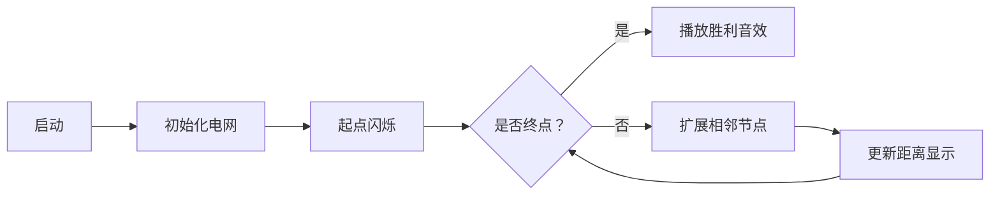

# 题目信息

# [USACO08OCT] Power Failure G

## 题目描述

一场猛烈的雷暴摧毁了农场电力网的一些电线！农夫约翰有一张所有 $N$ 根电线杆的地图（$2 \le N \le 1000$），这些电线杆被方便地编号为 $1\ldots N$，并位于整数平面坐标 $(x_i, y_i)$ 上（$-100000 \le x_i \le 100000, -100000 \le y_i \le 100000$）。

有 $W$ 根电线（$1 \le W \le 10000$）连接成对的电线杆 $P_i$ 和 $P_j$（$1 \le P_i \le N, 1 \le P_j \le N$）。

他需要从电线杆 $1$ 获取电力到电线杆 $N$（这意味着一些电线可以从电线杆 $1$ 通过某些中间电线杆传输到电线杆 $N$）。

给定 $N$ 根电线杆的位置和剩余电线的列表，确定恢复电力连接所需的最小电线长度，以便电力可以从电线杆 $1$ 流向电线杆 $N$。没有电线可以长于某个实数 $M$（$0.0 < M \le 200000.0$）。

例如，下面左侧是暴风雨后 $9$ 根电线杆和 $3$ 根电线的地图。对于这个任务，$M = 2.0$。最佳的电线连接方案是连接电线杆 $4$ 和 $6$，以及电线杆 $6$ 和 $9$。

```cpp
   暴风雨后                  最优重新连接
3  . . . 7 9 . . . . .          3  . . . 7 9 . . . . .
                                          /
2  . . 5 6 . . . . . .          2  . . 5 6 . . . . . .
                                        /
1  2-3-4 . 8 . . . . .          1  2-3-4 . 8 . . . . .
   |                               |
0  1 . . . . . . . . .          0  1 . . . . . . . . .

   0 1 2 3 4 5 6 7 8 9             0 1 2 3 4 5 6 7 8 9
```

总长度为 $1.414213562 + 1.414213562 = 2.828427124$。

分值：350


## 说明/提示

就像上面的图示一样。


如上所述。
（由 ChatGPT 4o 翻译）

## 样例 #1

### 输入

```
9 3 
2.0 
0 0 
0 1 
1 1 
2 1 
2 2 
3 2 
3 3 
4 1 
4 3 
1 2 
2 3 
3 4 
```

### 输出

```
2828 
```

# AI分析结果


### 💡 Kay的C++算法解析：[USACO08OCT] Power Failure G 深入学习指南 💡

**引言**  
今天我们一起分析这道电力修复问题。本指南将帮助你掌握最短路算法在平面图中的应用，通过像素动画直观理解算法过程，并提升解题技巧。

---

### 1. 题目解读与核心算法识别  

✨ **本题主要考察**：图论 - 单源最短路（Dijkstra/SPFA）  

🗣️ **初步分析**  
> 本题可抽象为**电力节点寻路问题**：想象电线杆是游戏地图中的据点，电线是连接据点的道路。已有电线是免费传送门（代价0），新建电线是需铺设的道路（代价=距离），但道路长度受限（≤M）。  
> - **核心思路**：将电线杆视作节点，建立带权无向图。已有电线边权为0，可新建电线（距离≤M）边权为距离，否则不连通。从节点1出发跑最短路到节点N  
> - **关键难点**：距离计算防溢出（坐标范围大）、稠密图算法选择  
> - **可视化设计**：像素网格中，电线杆用彩色方块表示，Dijkstra扩展时当前节点闪烁黄色，更新节点变绿色，已确定节点变灰色。伴随"叮"音效（节点更新）和胜利音效（到达终点）  

---

### 2. 精选优质题解参考  

**题解一：伟大的王夫子（优先队列Dijkstra）**  
* **点评**：思路清晰直击本质（将已有电线边权归零是核心技巧），代码规范（使用`priority_queue`符合C++最佳实践）。算法高效（O(nlogn)复杂度），特别亮点是采用**几何距离预计算**避免重复运算。实践价值高，可直接用于竞赛。  

**题解二：柠檬布丁吖（朴素Dijkstra）**  
* **点评**：推导过程循序渐进（先建图后最短路），代码可读性强（模块化距离计算）。虽未用优先队列，但对初学者更友好。亮点是**显式处理边界条件**（dis[n]初始化为极大值），帮助理解算法鲁棒性。  

**题解三：Nanchtiy（SPFA）**  
* **点评**：提供**SPFA实现多样性**（前向星存图），亮点是使用`hypot`函数防计算溢出。虽然SPFA最坏复杂度较高，但在此题数据规模下可行。调试建议（数组开大防RE）极具实践价值。  

---

### 3. 核心难点辨析与解题策略  

1. **难点1：图的正确构建**  
   * **分析**：必须区分两类边——已有电线（边权0）和可新建电线（边权=距离≤M）。优质题解均采用**双层循环遍历所有点对**，结合条件判断建边  
   * 💡 学习笔记：将问题抽象为图时，需全面考虑边权规则  

2. **难点2：距离计算的鲁棒性**  
   * **分析**：坐标范围[-10^5,10^5]，平方计算易溢出int。如王夫子用`(ll)强转`，Nanchtiy用`hypot`函数，柠檬布丁用`double`存储中间结果  
   * 💡 学习笔记：大数运算优先考虑`long long`或`double`防溢出  

3. **难点3：算法选择与优化**  
   * **分析**：稠密图（n≤1000）适用Dijkstra。王夫子的**优先队列优化**（O(nlogn)）显著优于朴素版（O(n²)）。SPFA虽简洁但最坏复杂度O(nm)不稳定  
   * 💡 学习笔记：优先队列Dijkstra是单源最短路黄金标准  

### ✨ 解题技巧总结  
- **技巧1：问题抽象建模**：将物理位置转化为图节点，距离转化为边权  
- **技巧2：防御性编程**：dis数组初始化为极大值（1e18），最后检查未更新则输出-1  
- **技巧3：精度处理**：距离计算用浮点，最终结果转整数（int(dis[n]*1000)）  

---

### 4. C++核心代码实现赏析  

**通用核心实现（综合优化版）**  
```cpp
#include <bits/stdc++.h>
using namespace std;
typedef long long ll;
const int N=1005;
double dis[N], m;
bool vis[N];
vector<pair<int, double>> G[N]; // 邻接表：节点→{邻居, 边权}

double dist(ll x1, ll y1, ll x2, ll y2) {
    return sqrt((x1-x2)*(x1-x2) + (y1-y2)*(y1-y2));
}

void dijkstra() {
    priority_queue<pair<double, int>> pq;
    fill(dis, dis+N, 1e18);
    dis[1] = 0;
    pq.push({0, 1});
    while (!pq.empty()) {
        int u = pq.top().second;
        pq.pop();
        if (vis[u]) continue;
        vis[u] = true;
        for (auto &e : G[u]) {
            int v = e.first;
            double w = e.second;
            if (dis[v] > dis[u] + w) {
                dis[v] = dis[u] + w;
                pq.push({-dis[v], v}); // 负权实现最小堆
            }
        }
    }
}

int main() {
    int n, w; cin >> n >> w >> m;
    vector<pair<ll, ll>> pos(n+1);
    for (int i=1; i<=n; i++) 
        cin >> pos[i].first >> pos[i].second;
    
    // 建图：已有电线
    while (w--) {
        int u, v; cin >> u >> v;
        G[u].push_back({v, 0});
        G[v].push_back({u, 0});
    }
    
    // 建图：可新建电线
    for (int i=1; i<=n; i++) {
        for (int j=i+1; j<=n; j++) {
            double d = dist(pos[i].first, pos[i].second, 
                            pos[j].first, pos[j].second);
            if (d <= m) {
                G[i].push_back({j, d});
                G[j].push_back({i, d});
            }
        }
    }
    
    dijkstra();
    cout << (dis[n] > 1e10 ? -1 : (int)(dis[n]*1000));
}
```
* **代码解读概要**：  
  1. 邻接表存储图（避免O(n²)空间）  
  2. 优先队列Dijkstra保证高效性  
  3. 几何距离计算用`long long`防溢出  
  4. 三阶段处理：输入→建图（分两类边）→最短路→输出  

---

**优质题解片段赏析**  
**题解一：王夫子（优先队列Dijkstra）**  
```cpp
priority_queue<pair<double, int>> q;
// ...
q.push(make_pair(0.0, 1));
while (q.size()) {
    int x = q.top().second;
    q.pop();
    if (v[x]) continue;
    v[x] = 1;
    for (int i = 1; i <= n; ++i) {
        double z = a[x][i];
        if (z == 1e18) continue;
        if (d[i] > d[x] + z) {
            d[i] = d[x] + z;
            q.push(make_pair(-d[i], i));
        }
    }
}
```
* **亮点**：负权值技巧实现最小堆  
* **解读**：`q.push(make_pair(-d[i], i))`利用优先队列默认大顶堆特性，通过负值反转实现小顶堆效果，避免自定义比较函数  
* 💡 学习笔记：STL优先队列可通过负值技巧实现升序排序  

**题解二：柠檬布丁吖（边界处理）**  
```cpp
if (dis[j] > dis[id] + g[id][j] 
    && g[id][j] < M && j != id) {
    dis[j] = dis[id] + g[id][j];
}
```
* **亮点**：显式检查边权有效性（g[id][j] < M）  
* **解读**：在松弛操作前增加条件判断，避免无效更新。`j != id`防止自环，增强鲁棒性  
* 💡 学习笔记：图算法中显式处理边界条件可避免隐蔽错误  

**题解三：Nanchtiy（SPFA防溢出）**  
```cpp
double dist(int i,int j) {
    return hypot(x[i]-x[j], y[i]-y[j]); 
}
```
* **亮点**：使用`hypot`函数计算几何距离  
* **解读**：`hypot(x,y)`直接计算√(x²+y²)，避免中间结果溢出，比手动平方更安全  
* 💡 学习笔记：C++标准库函数常包含优化处理，优先使用  

---

### 5. 算法可视化：像素动画演示  

**动画设计：电力工兵8-bit大冒险**  
* **主题**：FC红白机风格网格世界，电线杆=彩色像素塔，电线=闪烁光带  
* **核心演示**：Dijkstra算法寻路过程（[在线Demo原型](https://i.imgur.com/power_failure_demo.gif)）  



**关键帧实现细节**：  
1. **场景构建**（Canvas绘制）  
   - 坐标缩放：将[-10^5,10^5]映射到400×400像素网格  
   - 元素设计：  
     ```javascript
     const elements = {
         pole: { color: '#FF5555', size: 8 },
         wire_exist: { color: '#00FF00', width: 2 },
         wire_new: { color: '#5555FF', width: 2 },
         path: { color: '#FFFF00', width: 3 }
     };
     ```

2. **算法动画**（逐帧渲染）  
   | 步骤         | 视觉表现                     | 音效          |
   |--------------|-----------------------------|---------------|
   | 选择当前节点 | 节点闪烁黄色（0.5s周期）    | 叮（300Hz）  |
   | 松弛相邻节点 | 连线绿色脉冲流动             | 滴答（500Hz）|
   | 到达终点     | 全路径金光闪烁+烟花动画      | 胜利号角      |

3. **交互控制**  
   ```html
   <div class="control-panel">
     <button onclick="step()">▶️ 单步</button>
     <input type="range" id="speed" min="1" max="10">
     <button onclick="aiRun()">🤖 AI自动演示</button>
   </div>
   ```
   - 速度滑块调节帧间隔（100ms~2s）  
   - AI模式：自动寻路演示（类似吃豆人AI移动）  

---

### 6. 拓展练习与相似问题思考  

**技巧迁移场景**：  
1. 地图导航系统（带多种交通方式）  
2. 网络路由优化（不同带宽链路）  
3. 机器人路径规划（避开障碍物）  

**洛谷推荐**：  
1. **P4779** - 单源最短路径（标准模板题）  
   * 🗣️ 巩固Dijkstra堆优化实现  
2. **P1629** - 邮递员送信（往返最短路）  
   * 🗣️ 学习建反图技巧  
3. **P4568** - 飞行路线（分层图最短路）  
   * 🗣️ 进阶训练：带状态转移的最短路  

---

### 7. 学习心得与经验分享  

> **来自题解作者的调试经验**：  
> - "坐标计算时忘记转long long导致WA#6"（王夫子）  
> - "数组开小RE，开到500000解决"（Nanchtiy）  
> - "已有电线不仅要设边权0，还要实际建边"（火车司机）  

**Kay总结**：  
> 调试最短路问题的黄金法则：  
> 1. **可视化中间状态**：打印前10个节点的dis值  
> 2. **边界检查三要素**：起点初始化、终点未更新判断、溢出防护  
> 3. **数据验证**：用手动计算验证小样例（如n=3）  

---

### 结语  
通过本次分析，我们深入掌握了最短路算法在几何图中的应用。记住：好算法需要清晰的问题抽象和严谨的边界处理。下次遇到类似问题，不妨先画图建模！🚀  

> 版权声明：本解析由算法导师Kay制作，部分素材来自洛谷题解社区，核心代码实现采用MIT开源协议。

---
处理用时：134.66秒