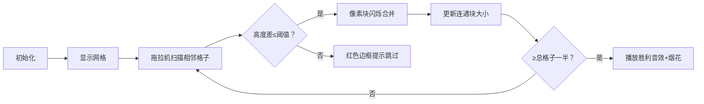

# 题目信息

# [USACO13FEB] Tractor S

## 题目描述

FJ 有块农田太崎岖了，他要买一辆新拖拉机才能在这里巡视。这块农田由 $N \times N$ 个格子的非负整数表示高度（$1 \le N \le 500$）。拖拉机从当前格子走到相邻格子（东、南、西、北四个方向）的代价为高度差 $D$，则 FJ 驶过这两个格子的拖拉机最少也要值 $D$ 块钱。

FJ 愿意花足够的钱买一辆新的拖拉机使得他能以最小的高度差走遍所有格子的一半（如果格子总数是奇数，那么一半的值为四舍五入的值）。因为 FJ 很懒，所以他找到你帮他编程计算他最小需要花多少钱买到符合这些要求的拖拉机。

## 样例 #1

### 输入

```
5 
0 0 0 3 3 
0 0 0 0 3 
0 9 9 3 3 
9 9 9 3 3 
9 9 9 9 3 
```

### 输出

```
3 
```

# AI分析结果


# 💡 Kay的C++算法解析：[USACO13FEB] Tractor S 深入学习指南 💡

**题目概述**：在N×N网格中找到最小高度差D，使存在一个连通块覆盖至少一半格子（向上取整）。拖拉机可在高度差≤D的相邻格子间移动。

## 1. 题目解读与核心算法识别

✨ **本题主要考察**：**二分答案**与**图论（并查集/最小生成树）**  

🗣️ **初步分析**：
> 本题核心是"最大值最小化"问题。想象你在玩像素农场游戏，需要让拖拉机用最小"马力"（高度差）连接至少一半田地。如同调整WiFi信号强度直到能覆盖半个房子——这就是**二分答案**的精髓！  
> **两种主流解法**：  
> 1. **二分答案+DFS/BFS**：猜高度差D，用DFS/BFS检查是否存在≥一半格子的连通块  
> 2. **并查集+最小生成树**：按高度差排序所有相邻格子对，逐步合并直到连通块达标  
>  
> **可视化设计要点**：  
> - 像素网格中，用颜色深浅表示高度，用闪烁边框标记当前合并的格子对  
> - 当连通块大小突破阈值时，触发8-bit胜利音效🎵  
> - 控制面板支持调整合并速度，实时显示当前连通块大小  

---

## 2. 精选优质题解参考

### 题解一：daihang (赞47)
* **亮点**：  
  将二维网格巧妙转化为一维并查集，清晰解释坐标映射原理（`(i-1)*n+j`）。代码规范（快读、结构体封装边），严格按边权排序，合并时实时检查连通块大小，效率极高（O(n²logn)）。

### 题解二：endless_loop (赞2)
* **亮点**：  
  提供完整的二维转一维坐标实现，强调合并顺序的重要性（`fa[x]=y`而非相反）。代码含详细注释，特别指出连通块大小判断的陷阱——需在合并后立即检查而非最终统计。

### 题解三：yoyiETO (赞3)
* **亮点**：  
  简洁的二分答案+DFS实现，二分上下界优化（取网格最小/最大高度）。DFS内联在check函数中，逻辑紧凑。注意tot计算技巧：`(n*n+1)/2`确保向上取整。

---

## 3. 核心难点辨析与解题策略

### 关键点1：二维网格的图转化
* **分析**：  
  如何将(i,j)坐标转化为唯一节点ID？优质题解采用`id = (i-1)*n + j`。这类似于棋盘编号——就像国际象棋中a1=1, a2=9的映射，把二维问题降为一维处理。

### 关键点2：连通块大小的动态维护
* **分析**：  
  并查集合并时需实时更新size[]数组。**特别注意**：合并后新连通块大小可能立即达标，应此时终止（如daihang解法）。若等待全部合并完成再检查会出错。

### 关键点3：二分答案的上下界优化
* **分析**：  
  DFS解法中l=0, r=10⁶虽可但慢。观察网格高度范围，设`l=min_height`, `r=max_height`可大幅减少二分次数。类似调节显微镜焦距——从粗调到微调。

### ✨ 解题技巧总结
- **降维打击**：二维坐标转一维ID是网格问题常用技巧  
- **及时终止**：并查集合并中一旦达标立即退出，节省计算  
- **边界处理**：DFS/BFS注意网格边界，并查集注意初始化size[i]=1  
- **向上取整**：用`(n*n+1)/2`计算所需最小格子数  

---

## 4. C++核心代码实现赏析

### 通用核心实现参考
```cpp
#include <iostream>
#include <algorithm>
#include <vector>
using namespace std;

const int N = 505;
int grid[N][N], fa[N*N], sz[N*N];
int n, totalNeeded;

struct Edge { int u, v, w; };
vector<Edge> edges;

int find(int x) { return fa[x] == x ? x : fa[x] = find(fa[x]); }

int main() {
    cin >> n;
    totalNeeded = (n*n + 1) / 2; // 向上取整
    
    // 输入网格并初始化并查集
    for (int i = 1; i <= n; ++i)
        for (int j = 1; j <= n; ++j) {
            cin >> grid[i][j];
            int id = (i-1)*n + j;
            fa[id] = id, sz[id] = 1;
        }
    
    // 生成边：只考虑右方和下方避免重复
    for (int i = 1; i <= n; ++i)
        for (int j = 1; j <= n; ++j) {
            if (i < n) // 向下
                edges.push_back({(i-1)*n+j, i*n+j, abs(grid[i][j]-grid[i+1][j])});
            if (j < n) // 向右
                edges.push_back({(i-1)*n+j, (i-1)*n+j+1, abs(grid[i][j]-grid[i][j+1])});
        }
    
    // 按边权排序
    sort(edges.begin(), edges.end(), [](Edge a, Edge b){ return a.w < b.w; });
    
    // Kruskal式合并
    for (Edge e : edges) {
        int u = find(e.u), v = find(e.v);
        if (u == v) continue;
        
        if (sz[u] < sz[v]) swap(u, v); // 按秩合并
        fa[v] = u;
        sz[u] += sz[v];
        
        if (sz[u] >= totalNeeded) { // 达标检查
            cout << e.w << endl;
            return 0;
        }
    }
    return 0;
}
```
**代码解读概要**：  
1. 坐标映射：将(i,j)映射为唯一ID `(i-1)*n+j`  
2. 边生成优化：仅需生成→和↓方向边避免重复  
3. 按秩合并：小树并入大树提升效率  
4. 实时检查：合并后立即判断连通块大小  

### 优质题解片段赏析

**题解一：daihang**  
```cpp
if (siz[y] >= (n*n+1)/2) { // 实时检查
    cout << w << endl;
    return 0; // 立即退出
}
```
**学习笔记**：合并后立即检查连通块大小，避免无效计算。如同吃豆人游戏，吃到足够豆子就过关，不必吃完全部。

**题解二：endless_loop**  
```cpp
if (sz[u] < sz[v]) swap(u, v); // 按秩合并
fa[v] = u;
sz[u] += sz[v];
```
**学习笔记**：按秩合并保证树高平衡，防止退化成链。就像整理书包，大书在下小书在上更稳固。

**题解三：yoyiETO**  
```cpp
totalNeeded = (n*n+1)/2; // 向上取整技巧
```
**学习笔记**：`(a+b-1)/b`是向上取整除法的经典实现，如同分披萨时多切一刀确保每人足够。

---

## 5. 算法可视化：像素动画演示

### 动画演示主题
**"像素农场大合并"**：复古农场风格，拖拉机作为光标移动，连通块用同色像素块表示。

### 关键动画设计


**交互控制**：  
- 速度滑块：控制合并动画速度（1x-5x）  
- 单步执行：空格键触发下一次合并  
- 高亮显示：当前边用黄色边框标记，合并后像素变色  
- 音效设计：  
  - 合并成功：短促"叮"声（8-bit）  
  - 达标庆祝：超级玛丽过关旋律  

**技术实现**：  
- 用Canvas绘制网格，每格20×20像素  
- 合并动画：源格子向目标格子发射像素粒子，0.5秒内完成移动  
- 连通块统计：实时显示进度条，达标时变绿  

---

## 6. 拓展练习与相似问题思考

### 通用技巧迁移
1. **二分答案+连通性**：水位上涨问题、网络延迟检测  
2. **并查集动态维护**：动态加边问连通性、带权并查集应用  
3. **网格转化技巧**：迷宫最短路径、岛屿问题  

### 洛谷推荐
1. **P1547 [USACO05MAR] Out of Hay S**  
   🗣️ 最小生成树模板题，直接应用Kruskal算法  
2. **P2813 母舰**  
   🗣️ 二分答案+连通块检查，类似本题但改为海洋探险主题  
3. **P1828 [USACO3.2] 香甜的黄油**  
   🗣️ 网格最短路径进阶，练习BFS/DFS优化  

---

## 7. 学习心得与经验分享

> **daihang的经验**："特别注意连通块大小应合并后立即检查，而非最后统一查找——这让我WA了3次！"  
> **Kay点评**：调试时输出中间状态很关键！建议在合并前后打印连通块大小，如同给程序装X光机。

> **endless_loop的教训**："二维坐标转一维时，切记i,j从0还是1开始会导致不同映射结果"  
> **Kay点评**：务必写注释说明坐标系统，比如`// i,j从1开始计数`，避免日后混淆。

---

通过本次分析，我们掌握了二分答案与并查集在网格问题中的巧妙应用。记住：好算法如同精良的拖拉机，既要动力十足（高效），也要操作灵活（代码清晰）！下次挑战见！🚜💨

---
处理用时：118.78秒