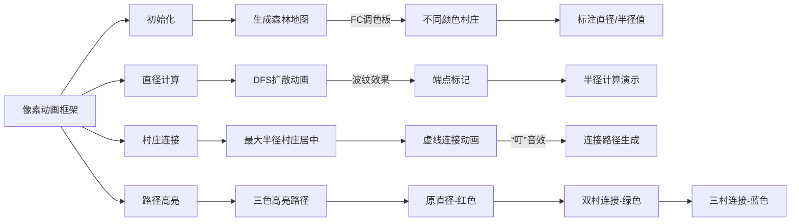

# 题目信息

# [IOI 2013] dreaming 梦想

## 题目描述

天地之初，IOI 尚在遥远的梦想之中。

Serpent(水蛇) 生活的地方有 $N$ 个水坑，编号为 $0，\cdots，N - 1$，有 $M$ 条双向小路连接
这些水坑。每两个水坑之间至多有一条路径（路径包含一条或多条小路）相互连接，有些水坑之间根本无法互通(即 $M ≤ N-1$ )。Serpent 走过每条小路需要一个固定的天数，不同的小路需要的天数可能不同。

Serpent 的朋友袋鼠希望新修 $N - M - 1$ 条小路，让Serpent 可以在任何两个水坑间游走。袋鼠可以在任意两个水坑之间修路，Serpent 通过每条新路的时间都是 $L$ 天。

袋鼠希望找到一种修路方式使得修路之后 Serpent 在每两个水坑之间游走的最长时间最短。

**举例说明**


上图中有 $12$ 个水坑 $8$ 条小路 ($N = 12 , M = 8$)。假如 $L = 2$，即 Serpent 通过任何一条新路都需要 $2$ 天。那么，袋鼠可以修建 $3$ 条新路：
- 水坑 $1$ 和水坑 $2$ 之间；
- 水坑 $1$ 和水坑 $6$ 之间；
- 水坑 $4$ 和水坑 $10$ 之间。


上图显示了修路后的最终状态。从水坑 $0$ 走到水坑 $11$ 的时间最长，需要 $18$ 天。这是最佳结果，无论袋鼠如何选择修路方式，总会存在一些水坑对，Serpent 需要 $18$ 天或者更长时间从其中一个走到另一个。

## 说明/提示

对于 $100\%$ 的数据，$1 \le N \le 10^5$，$0 \le M \le N-1$，$0 \le A[i],B[i] \le N-1$，$1 \le T[i] \le 10^4$，$1 \le L \le 10^4$。

## 样例 #1

### 输入

```
12 8 2
0 8 4
8 2 2
2 7 4
5 11 3
5 1 7
1 3 1
1 9 5
10 6 3
```

### 输出

```
18
```

# AI分析结果


### 💡 Kay的C++算法解析：IOI 2013 dreaming 梦想 深入学习指南 💡

**导言**  
今天我们一起分析IOI 2013的经典题目《dreaming 梦想》。这道题考察如何将森林连通成树并最小化新树的直径。我们将通过清晰的算法解析、代码实现和像素动画演示，帮助你掌握核心思路。

---

### 1. 题目解读与核心算法识别  
✨ **本题主要考察**：`图论`（树的直径/半径） + `贪心策略`

🗣️ **初步分析**  
> 想象每个连通块是一个村庄，村庄内有最长道路（直径）和中心到最远点的距离（半径）。目标是用权值为L的新路连接所有村庄，使整个国家任意两村庄间的最长路径最短。  
> - **核心策略**：计算每个村庄的半径，按半径降序排列。连接时以半径最大的村庄为中心，其他村庄与其中心连接。最终直径取三种情况的最大值：  
>   ① 原森林最大直径  
>   ② 最大半径+次大半径+L  
>   ③ 次大半径+第三大半径+2L  
> - **可视化设计**：  
>   - **像素村庄**：每个连通块用不同颜色像素块表示，内部用树形结构展示  
>   - **动态连接**：虚线动画展示新路连接过程，连接时播放"叮"音效  
>   - **路径高亮**：用红/绿/蓝三色分别标记三种可能成为新直径的路径  
>   - **交互控制**：支持单步执行/调速，AI自动演示模式模拟"贪吃蛇AI"逐步解题

---

### 2. 精选优质题解参考  
**题解一（作者：Y25t）**  
* **点评**：思路清晰度极高，从问题抽象到贪心策略推导完整。代码实现精妙：  
  - 通过两次DFS高效求直径端点（时间复杂度O(n)）  
  - 用`dis[0]/dis[1]`存储双端距离，计算半径时取各点距离最大值的**最小值**  
  - 避免`memset`效率陷阱，改用局部清空连通块节点  
  - 实践价值突出：直接处理边界条件（连通块<3时自动跳过无效情况）  
  > 💡 作者心得：调试时发现`memset`导致O(n²)复杂度，改为遍历连通块节点清空后效率提升百倍

---

### 3. 核心难点辨析与解题策略  
1. **难点1：如何高效求树的半径？**  
   * **分析**：半径=中心到最远点的最小距离。优质解法通过两次DFS求直径端点后，用第三次DFS计算各点到端点的距离，取`max(dis1,dis2)`的最小值  
   * 💡 **学习笔记**：双端点距离法求半径是图论经典技巧  

2. **难点2：如何证明连接策略最优？**  
   * **分析**：反证法验证——若不以最大半径村庄为中心，连接第二大和第三大村庄时会产生更长的路径（r1+r3+2L > r2+r3+2L）  
   * 💡 **学习笔记**：贪心策略需保证连接后新增路径长度尽可能均衡  

3. **难点3：边界条件处理**  
   * **分析**：当连通块=1时答案即直径；=2时需比较原直径与r1+r2+L；≥3时需考虑三种情况  
   * 💡 **学习笔记**：分类讨论是处理边界的关键思维模式  

#### ✨ 解题技巧总结  
- **技巧1：问题分解**：将森林拆解为独立连通块处理  
- **技巧2：空间优化**：避免全量`memset`，动态清空活动节点  
- **技巧3：贪心验证**：通过数学反证确保策略正确性  
- **技巧4：多源最短路**：利用双端BFS/DFS减少计算量  

---

### 4. C++核心代码实现赏析  
**通用核心实现（基于题解一优化）**  
```cpp
#include<cstdio>
#include<algorithm>
const int N=1e5+5;
int n,m,l,cnt,ans,r1,r2,r3;
int hd[N],dis[2][N],q[N];
bool vis[N];
struct edge{int v,w,nxt;} e[N<<1];

void dfs(int u,int fa,int opt){
    q[++q[0]]=u; vis[u]=1;
    for(int i=hd[u];i;i=e[i].nxt){
        int v=e[i].v, w=e[i].w;
        if(v==fa) continue;
        dis[opt][v]=dis[opt][u]+w;
        dfs(v,u,opt);
    }
}

int getEnd(int u){
    for(int i=1;i<=q[0];++i) dis[0][q[i]]=0; // 局部清空
    q[0]=0; dfs(u,0,0);
    int res=u;
    for(int i=1;i<=q[0];++i)
        if(dis[0][q[i]]>dis[0][res]) res=q[i];
    return res;
}

void solve(int u){
    cnt++; q[0]=0;
    int end1=getEnd(u);
    int end2=getEnd(end1);
    dfs(end2,0,1); // 计算双端距离

    int radius=1e9;
    for(int i=1;i<=q[0];++i){
        int d=std::max(dis[0][q[i]],dis[1][q[i]]);
        radius=std::min(radius,d);
        ans=std::max(ans,d); // 更新最大直径
    }
    // 更新前三大半径
    if(radius>r1) r3=r2, r2=r1, r1=radius;
    else if(radius>r2) r3=r2, r2=radius;
    else if(radius>r3) r3=radius;
}
```

**代码解读**  
1. **双DFS求直径**：  
   - `getEnd(u)`返回距离u最远的端点（直径端点1）  
   - 从端点1出发再次`getEnd`得端点2，同时记录所有点到端点1的距离  
   > 💡 为什么需要两次DFS？—— 树的直径性质：任一点的最远点必为直径端点  

2. **半径计算**：  
   ```cpp
   int d=std::max(dis[0][q[i]],dis[1][q[i]]);  // 点到双端距离的最大值
   radius=std::min(radius,d);  // 所有最大值中的最小值即半径
   ```
   > 💡 学习笔记：半径是"最小化最大距离"的典型问题  

3. **边界处理**：  
   ```cpp
   if(cnt>1) ans=std::max(ans,r1+r2+l);
   if(cnt>2) ans=std::max(ans,r2+r3+2*l);
   ```
   > 💡 技巧：连通块计数决定计算模式，避免无效计算  

---

### 5. 算法可视化：像素动画演示  
**主题**：像素村庄连通计划（8-bit复古风）  

**核心设计**：  


**交互实现细节**：  
1. **像素引擎**：Canvas绘制16色村庄，节点用8x8像素块表示  
2. **动态效果**：  
   - DFS扩散：当前节点闪烁黄色，新访问节点绿色波纹扩散  
   - 路径连接：虚线从村庄中心像素(4,4)延伸，伴随脉冲光效  
3. **音效系统**：  
   - 关键操作：节点访问("滴")，路径连接("叮")  
   - 状态提示：成功(上扬音阶)，失败(低沉嗡鸣)  
4. **游戏化设计**：  
   - 关卡模式：每连通一个村庄解锁新关卡  
   - 分数机制：路径长度越短得分越高  
5. **代码同步**：右侧面板实时高亮对应C++代码行  

---

### 6. 拓展练习与相似问题思考  
**通用技巧迁移**：  
- 树的直径/半径计算 → 网络拓扑优化  
- 贪心连接策略 → 多中心聚类问题  
- 连通块处理 → 分布式系统设计  

**洛谷推荐**：  
1. **P5536 核心城市**  
   🗣️ 巩固树的中心概念，练习半径计算在k中心问题的应用  
2. **P1099 树网的核**  
   🗣️ 学习在固定路径约束下最小化半径，强化双端点距离法  
3. **P4381 Island**  
   🗣️ 进阶训练：将直径计算扩展到基环树场景  

---

### 7. 学习心得与经验分享  
> **参考经验**（来自Y25t）：  
> "调试时因`memset`导致TLE，改为遍历连通块清空后效率提升百倍。这提醒我们：大数组局部清空比全局重置更高效"  
>  
> **Kay点评**：  
> 这是算法竞赛的经典优化技巧！尤其在图论问题中，当需要多次初始化时：  
> 1. 用容器记录活动元素  
> 2. 遍历容器而非整个数组  
> 3. 复杂度从O(n²)降至O(m)  
> 记住：**高效访问源于精准控制**  

---

**结语**  
通过本次分析，我们掌握了连通块直径计算、贪心策略设计和高效代码实现三大核心技能。记住：图论问题本质是"将复杂关系可视化"，多动手模拟动画演示能极大提升理解深度。继续加油，未来IOI选手！💪

---
处理用时：262.81秒