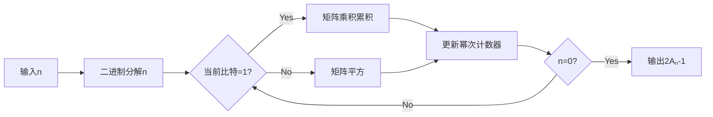

# 题目信息

# [GCJ 2008 #1A] Numbers

## 题目描述

在本题中，你需要找出数字 $(3 + \sqrt{5})^n$ 小数点前的最后三位数字。

例如，当 $n = 5$ 时，$(3 + \sqrt{5})^5 = 3935.73982\dots$，答案是 $935$。

当 $n = 2$ 时，$(3 + \sqrt{5})^2 = 27.4164079\dots$，答案是 $027$。

## 说明/提示

**数据范围**

- $1 \leq T \leq 100$

**小数据集（15 分，测试点 1 - 可见）**

- $2 \leq n \leq 30$

**大数据集（35 分，测试点 2 - 隐藏）**

- $2 \leq n \leq 2\times10^{10}$

由 ChatGPT 4.1 翻译

## 样例 #1

### 输入

```
2
5
2```

### 输出

```
Case #1: 935
Case #2: 027```

# AI分析结果


### 💡 Kay的C++算法解析：[GCJ 2008 #1A] Numbers 深入学习指南 💡

#### 1. 题目解读与核心算法识别
✨ **本题主要考察**：`数学推导 + 矩阵快速幂`  
🗣️ **初步分析**：  
> 计算 $(3+\sqrt{5})^n$ 的整数部分后三位，核心在于**巧妙避开无理数运算**。  
> - **数学比喻**：就像用"影子"（共轭数 $3-\sqrt{5}$）抵消无理部分，将问题转化为纯整数运算。  
> - **核心难点**：  
>   - 发现 $0<(3-\sqrt{5})^n<1$ 的特性  
>   - 推导递推关系 $A_n=3A_{n-1}+5B_{n-1}$  
>   - 用矩阵快速幂处理 $n≤2×10^{10}$  
> - **可视化设计**：  
>   - 像素动画展示矩阵幂运算（高亮矩阵乘法步骤）  
>   - 双进度条：$\sqrt{5}$ 计算值（红色） vs 共轭抵消值（蓝色）  
>   - 8-bit音效：矩阵乘法时触发"按键声"，完成时播放胜利音效  

---

#### 2. 精选优质题解参考
**题解一 (作者：RAY091016)**  
* **点评**：  
  思路直击核心——通过共轭性质导出整数序列，矩阵构造清晰（$ \begin{bmatrix}3&5\\1&3\end{bmatrix} $）。代码中 `ans=(tmp.a[1][1]*2-1)%mod` 精准实现数学推导，变量命名简洁（`A`, `B`）。亮点是完整推导了状态转移矩阵的生成过程，实践可直接用于竞赛。

**题解二 (作者：__coderyc__)**  
* **点评**：  
  创新性地从特征方程推导线性递推 $a_n=6a_{n-1}-4a_{n-2}$，提供另一种矩阵形式 $ \begin{bmatrix}6&-4\\1&0\end{bmatrix} $。代码亮点在于严谨处理负数取模（`if(t<0)t+=mod`），对边界条件考虑周全，教学价值在于展示同一问题的多元解法。

**题解三 (来源：《挑战程序设计竞赛》)**  
* **点评**：  
  最佳教学示范！深入解释共轭的数学本质（"共轭相乘得整数"），强调 $a_n$ 与 $b_n$ 的对称关系。代码片段虽简略但直指核心——`A[0][0]*2+MOD-1` 体现问题精髓，附带的数学扩展（共轭性质总结）极具启发性。

---

#### 3. 核心难点辨析与解题策略
1. **难点1：无理数精度处理**  
   * **分析**：直接计算 $\sqrt{5}$ 在 $n>50$ 时必然溢出。优质题解均用 $(3-\sqrt{5})^n<1$ 的特性，通过共轭对 $2A_n-1$ 获取整数部分。  
   * 💡 **学习笔记**：无理数问题常可转化为整数序列问题。

2. **难点2：递推关系建立**  
   * **分析**：两种路径——  
     - 展开 $(3+\sqrt{5})(A_{i}+B_i\sqrt{5})$ 得矩阵递推（题解1/3）  
     - 解特征方程 $x^2-6x+4=0$ 得线性递推（题解2）  
   * 💡 **学习笔记**：递推关系是算法的心脏，决定代码结构。

3. **难点3：超大n的优化**  
   * **分析**：矩阵快速幂将 $O(n)$ 优化到 $O(\log n)$，核心在于矩阵乘法的结合律：  
     ```math
     \begin{bmatrix}3&5\\1&3\end{bmatrix}^n = \begin{bmatrix}3&5\\1&3\end{bmatrix}^{n/2} × \begin{bmatrix}3&5\\1&3\end{bmatrix}^{n/2}
     ```
   * 💡 **学习笔记**：指数级加速常伴随分治思想。

### ✨ 解题技巧总结
- **技巧1：数学转化优先**：将复杂问题转化为已知数学模型（如本题的整数序列）  
- **技巧2：对称性利用**：共轭、逆元等对称性质可简化问题  
- **技巧3：矩阵封装术**：固定尺寸矩阵建议用`struct`而非`vector`提升效率  
- **技巧4：输出防坑**：牢记`printf("%03d")`补零格式  

---

#### 4. C++核心代码实现赏析
**通用核心实现**  
```cpp
#include <iostream>
using namespace std;
const int MOD = 1000;

struct Matrix {
    int a[2][2] = {{3,5}, {1,3}};
    Matrix operator*(const Matrix& m) const {
        Matrix res;
        for(int i=0; i<2; ++i) 
        for(int k=0; k<2; ++k) 
        for(int j=0; j<2; ++j) 
            res.a[i][j] = (res.a[i][j] + a[i][k]*m.a[k][j]) % MOD;
        return res;
    }
};

Matrix pow(Matrix base, long long n) {
    Matrix res{{1,0},{0,1}}; // 单位矩阵
    while(n) {
        if(n & 1) res = res * base;
        base = base * base;
        n >>= 1;
    }
    return res;
}

int main() {
    int T; cin >> T;
    for(int t=1; t<=T; ++t) {
        long long n; cin >> n;
        Matrix M = pow(Matrix{}, n);
        int ans = (2 * M.a[0][0] - 1) % MOD;
        printf("Case #%d: %03d\n", t, (ans+MOD)%MOD);
    }
}
```
* **代码解读概要**：  
  - 通过`struct`封装2×2矩阵，重载`*`运算符实现模乘  
  - 快速幂分解：$n=13$ → $8+4+1$ 次矩阵乘法  
  - 最终结果由 $2A_n-1 \mod 1000$ 得到  

---

**题解一核心片段赏析**  
```cpp
matrix operator*(matrix A,matrix B){
    matrix C; // 三重循环矩阵乘法
    for(int i=1;i<=2;i++) for(int j=1;j<=2;j++) 
    for(int k=1;k<=2;k++) 
        C.a[i][j] = (C.a[i][j] + A.a[i][k]*B.a[k][j]) % mod;
    return C;
}```
* **亮点**：教科书式矩阵乘法实现  
* **学习笔记**：三重循环中`k`在最内层优化缓存访问  

**题解二核心片段赏析**  
```cpp
long long x = (M_exp.m[0][0] * 6 + M_exp.m[0][1] * 2) % mod;
if (x < 0) x += mod; // 负数取模处理
```
* **亮点**：严谨处理负值，避免`%`的负数行为  
* **学习笔记**：竞赛中需显式修正负余数：`(a%MOD + MOD)%MOD`  

---

#### 5. 算法可视化：像素动画演示  
**主题**："共轭勇者"的像素数学冒险  
**核心演示**：  

**动画设计**：  
1. **场景**：8-bit风格数学实验室，左侧矩阵熔炉（加热时触发音效），右侧共轭天平  
2. **关键帧**：  
   - **帧1**：$n$的二进制流（像素方块从右向左移动）  
   - **帧2**：当比特=1时，熔炉发出红光，矩阵乘积累积（"叮"声）  
   - **帧3**：共轭天平实时显示：左盘 $(3+\sqrt{5})^n$ vs 右盘 $(3-\sqrt{5})^n$（蓝块逐渐缩小）  
   - **帧4**：胜利时熔炉喷出金色数字（如"935"），播放FC胜利音乐  
3. **交互控制**：  
   - 速度滑块：调节比特处理速度  
   - 暂停/继续：冻结矩阵变换过程  
   - 重置：清空熔炉，天平归零  

---

#### 6. 拓展练习与相似问题
1. **洛谷 P1939**：模板题矩阵加速数列  
   → *推荐理由*：巩固矩阵快速幂的模板实现  
2. **洛谷 P5175**：数列 $a_n=2a_{n-1}+a_{n-2}$  
   → *推荐理由*：训练递推式转矩阵的能力  
3. **洛谷 P1306**：斐波那契公约数  
   → *推荐理由*：在经典问题中深化矩阵应用  

---

#### 7. 学习心得与经验
> **来自《挑战程序设计竞赛》的启示**：  
> "共轭不仅是一种技巧，更是一种思维模式——通过对称性将复杂问题镜像为简单问题。"  
> **Kay总结**：本题精妙之处在于用纯整数运算解决无理数问题，这种"化虚为实"的思想在密码学等领域广泛应用。调试时建议打印中间矩阵值，比跟踪 $\sqrt{5}$ 更高效！

---
**记住**：当问题包含不可计算元素时，**寻找其对称伙伴**往往是破局关键！下次遇到类似挑战，不妨问问自己："这个问题的共轭是什么？" 💪

---
处理用时：133.24秒