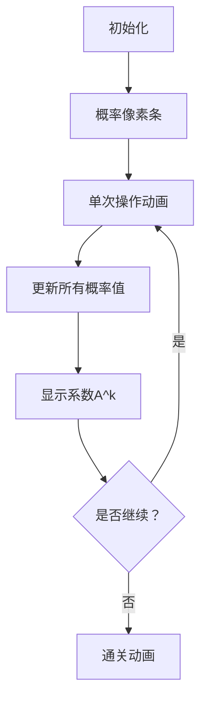

# 题目信息

# The Da Vinci Code

## 题目背景

> 圣杯在罗斯琳教堂下静待。  
> 大师杰作掩映中相拥入眠。  
> 剑刃圣杯守护着她的门宅。  
> 星空下她可安息无碍。

好的题目不需要花里胡哨的背景。

## 题目描述

给定一个长度为 $n$ 的数列 $a$，初始情况下 $a_i=i$。

另有一个取值在 $[1,n]$ 内的随机的整数 $x$，它取 $i$ 的概率为 $b_i$。

接下来进行 $k$ 次操作，每次**均匀随机**地选两个 $[1,n]$ 中的整数 $i,j$（允许 $i=j$），交换 $a_i,a_j$ 的值（如果 $i=j$ 则什么也不干）。问最后 $x$ 在位置 $i$ 上的概率，你需要对所有 $1\leq i\leq n$ 求出答案。你需要输出答案模 $3221225473$ 的值。

我们定义 $x$ 在位置 $i$ 上指 $a_i=x$。

## 说明/提示

#### 【样例解释】

对于样例 #1：

$b$ 数组为 $\{2134949164 ,1086276310\}$，操作 $9$ 次后 $x$ 在两个位置的概率均为 $\dfrac12$。

对于样例 #2：

$b$ 数组为 $\{1863763622,1043615898,1055155266,1556793106,1763540175,1239801170,1141007183\}$。

#### 【数据范围】
对于 $100\%$ 的数据：

* $2\leq n\leq2\times10^7$，$0\leq k,seed<2^{64}$。
* $1<b_i<3221225473$，$\sum\limits_{i=1}^n b_i\equiv 1\pmod{3221225473}$。
* 数据保证 $1<b_n<3221225473$ 且 $3221225473$ 是质数。

---

**本题采用捆绑测试**。

| $\text{Subtask}$ |$n\le$|$k\le$|分值|
|:-:|:-:|:-:|:-:|
|$0$|$2$|$2^{64}-1$|$1$|
|$1$|$5$|$5$|$4$|
|$2$|$200$|$200$|$6$|
|$3$|$200$|$2^{64}-1$|$9$|
|$4$|$2000$|$2000$|$7$|
|$5$|$2\times10^7$|$1$|$5$|
|$6$|$10^6$|$10^6$|$8$|
|$7$|$2\times10^7$|$10^7$|$10$|
|$8$|$10^6$|$2^{64}-1$|$15$|
|$9$|$2\times10^7$|$2^{64}-1$|$35$|

## 样例 #1

### 输入

```
2 9 998244353
```

### 输出

```
2684354563
```

## 样例 #2

### 输入

```
7 3 123456789
```

### 输出

```
24313281849
```

## 样例 #3

### 输入

```
10 9000000000000000000 1000000000000000000
```

### 输出

```
20026214895
```

## 样例 #4

### 输入

```
4 0 123456789
```

### 输出

```
12357556560
```

# AI分析结果


### 💡 Kay的C++算法解析：The Da Vinci Code 深入学习指南 💡

<introduction>
今天我们来分析洛谷P8944 "The Da Vinci Code" 这道概率与线性变换结合的经典题目。本指南将解析随机交换操作对概率分布的影响，帮助大家掌握线性递推的快速求解技巧，并设计生动的像素动画加深理解。
</introduction>

---

## 1. 题目解读与核心算法识别

✨ **本题主要考察**：`数学（概率递推）`  

🗣️ **初步分析**：
> 解决本题的关键在于理解**概率分布的线性变换**。想象你有一组彩色液体（概率分布），每次操作就像摇晃瓶子——液体位置变化但有规律可循。  
> - 通过分析单次操作对概率的影响，得到递推式：$b_i' = \frac{n-2}{n}b_i + \frac{2}{n^2}$  
> - 核心难点在于处理$k \leq 2^{64}$的迭代，需用快速幂实现$O(\log k)$求解  
> - 可视化设计聚焦：①概率值用像素条高度表示 ②操作次数进度条 ③系数$A^k$实时显示  
> - 复古游戏化方案：采用"概率大冒险"主题，每次操作触发8-bit音效，AI自动演示模式支持调速，通关动画展示最终分布

---

## 2. 精选优质题解参考

**题解一（cyffff）**  
* **点评**：直击问题本质，推导出简洁的线性变换公式$b_i \leftarrow A \cdot b_i + B$，并创新性采用**非矩阵的快速幂解法**。代码亮点在于：  
  - 用等比数列求和公式$S = \frac{1-A^k}{1-A}$避免矩阵运算  
  - 边界处理完善（特判$A=1$即$n=2$的情况）  
  - 变量命名规范（`coef`/`constant`清晰表达线性关系）  
  - 空间复杂度$O(1)$，完美适配$n \leq 2 \times 10^7$的限制  

**题解二（Missa）**  
* **点评**：通过**不动点理论**（$X=\frac{1}{n}$）简化推导过程，揭示概率分布向均匀分布收敛的本质。代码优势：  
  - 将变换转化为$p_u - \frac{1}{n} = (\frac{n-2}{n})^k (p_u' - \frac{1}{n})$  
  - 全程使用`unsigned long long`严谨处理模数$3221225473$  
  - 函数封装规范（`qpow`独立为模块）  

**题解三（Register_int）**  
* **点评**：传统概率DP思路，定义$dp_{0}$（数在原位）/$dp_{1}$（数不在原位）状态。亮点：  
  - 矩阵快速幂实现$O(\log k)$状态转移  
  - 给出完整状态转移方程：  
    $dp_{i,0} = \frac{n^2-2n+2}{n^2}dp_{i-1,0} + \frac{2n-2}{n^2}dp_{i-1,1}$  
  - 强调答案计算$ans_i = b_i dp_{k,0} + (1-b_i)dp_{k,1}$  

---

## 3. 核心难点辨析与解题策略

1.  **难点：概率变换的建模**  
    * **分析**：随机交换不是简单的位置交换，而是整个概率分布的线性重组。优质题解通过计算期望值，发现变换是仿射变换：$f(x) = Ax + B$  
    * 💡 **学习笔记**：抓住"期望的线性性"，将随机操作转化为确定性变换  

2.  **难点：超大k的迭代优化**  
    * **分析**：$k$可达$2^{64}$，直接模拟不可行。需用快速幂计算：  
      $A^k$ 和 $S = \begin{cases} 
      k \cdot B & A=1 \\
      B \frac{1-A^k}{1-A} & A \neq 1 
      \end{cases}$  
    * 💡 **学习笔记**：快速幂是迭代优化的核心，复杂度从$O(k)$降至$O(\log k)$  

3.  **难点：边界条件与数值稳定性**  
    * **分析**：当$n=2$时$A=0$需特殊处理；模数$3221225473 > 2^{31}$需用`unsigned long long`  
    * 💡 **学习笔记**：特判是避免除零错误的关键，大模数运算警惕整数溢出  

### ✨ 解题技巧总结
- **技巧1：问题转化** - 将随机操作转化为确定性线性变换  
- **技巧2：快速幂泛化** - 不仅用于求幂，还可解线性递推$f^{(k)}(x) = A^k x + B \frac{1-A^k}{1-A}$  
- **技巧3：不动点理论** - 通过$f(X)=X$找到收敛值$\frac{1}{n}$简化计算  

---

## 4. C++核心代码实现赏析

**通用核心实现参考**  
```cpp
const uint mod = 3221225473u;

uint qpow(uint a, ull b) { // 快速幂
  uint res = 1;
  while (b) {
    if (b & 1) res = (ull)res * a % mod;
    a = (ull)a * a % mod;
    b >>= 1;
  }
  return res;
}

int main() {
  // 生成b数组（略）
  uint inv_n = qpow(n, mod - 2);
  uint A = (ull)(n - 2) * inv_n % mod;   // 系数A
  uint B = (ull)2 * inv_n % mod * inv_n % mod; // 系数B
  
  uint Ak = qpow(A, k);  // A^k
  uint S = (A == 1) ? (ull)k % mod * B % mod  // 特判A=1
          : (ull)B * (1 - Ak + mod) % mod * qpow(1 - A + mod, mod - 2) % mod;
  
  for (int i = 1; i <= n; i++) {
    uint res = ((ull)b[i] * Ak + S) % mod; // 最终概率
    ans ^= (ull)res * i;
  }
}
```

**题解一核心片段（cyffff）**  
```cpp
uint k1 = (ull)(n-2)*in%mod; // A
uint b1 = (ull)2*in2%mod;    // B
if(k==1) { k2=k1; b2=b1; }
else {
  uint ki = qpow(k1+mod-1, mod-2); // 1/(1-A)
  k2 = qpow(k1, k);                // A^k
  b2 = (ull)(k2+mod-1) * ki % mod * b1 % mod; // S
}
```
* **亮点**：非矩阵实现，完美平衡效率与可读性  
* **代码解读**：  
  > 1. `k1`对应线性系数$A$，`b1`对应常数项$B$  
  > 2. 当$k=1$时直接使用原系数  
  > 3. 否则计算$S = B \frac{1-A^k}{1-A}$，其中`ki`是$(1-A)$的逆元  
  > 4. 最终$b_i = A^k \cdot b_i + S$  
* 💡 **学习笔记**：等比数列求和公式可避免矩阵运算  

**题解二核心片段（Missa）**  
```cpp
LL invn = inv(n);          // 1/n
LL s = qpow(invn*(n-2)%mod, k); // ( (n-2)/n )^k
for(int i=1; i<=n; i++) {
  LL t = (b[i] - invn + mod) % mod; // p_u - 1/n
  t = t * s % mod;         // 乘以系数
  t = (t + invn) % mod;   // 加回1/n
}
```
* **亮点**：通过不动点理论简化计算  
* **代码解读**：  
  > 1. 计算偏移量$t = b_i - \frac{1}{n}$  
  > 2. 迭代后偏移量衰减为$t \cdot (\frac{n-2}{n})^k$  
  > 3. 最终概率 = 衰减后的偏移量 + $\frac{1}{n}$  
* 💡 **学习笔记**：不动点是概率收敛的锚点  

---

## 5. 算法可视化：像素动画演示

* **主题**：概率大冒险（8-bit风格）  
* **核心演示**：概率分布随操作次数的演化过程  

### 动画设计（Canvas实现）


1. **场景初始化**  
   - 8-bit风格网格：$n$个垂直像素条，高度表示$b_i$值  
   - 控制面板：开始/暂停/单步/速度滑块（1x-1000x）  
   - 状态栏：显示当前操作次数$c$和系数$A^{k-c}$  

2. **操作动画（关键帧）**  
   ```javascript
   function drawFrame() {
     // 高亮当前操作：随机选择两个位置
     highlightCells(i, j); 
     playSound('swap'); // 8-bit音效
     
     // 所有像素条高度按公式更新
     for (let pos = 0; pos < n; pos++) {
       newHeight[pos] = A * currentHeight[pos] + B;
     }
     animateBars(newHeight); // 像素条高度渐变
   }
   ```

3. **游戏化元素**  
   - **音效设计**：  
     * 操作音效：NES风格"滴"声  
     * 通关音效：马里奥过关旋律  
   - **进度系统**：每完成$\log_2 k$次操作点亮一颗星星  
   - **AI演示模式**：自动调速保证30秒内演示完任意$k$  

4. **教学提示**  
   > "当前系数$A^c$=$0.87$，概率分布向均匀值$1/n$收敛中..."

---

## 6. 拓展练习与相似问题思考

* **技巧迁移场景**：  
  1. 人口迁移模型（城市间人口比例变化）  
  2. 马尔可夫链状态转移  
  3. 线性递推式$x_{n+1}=ax_n+b$的求解  

* **洛谷推荐**：  
  1. **P1939** 矩阵加速数列  
     🗣️ 巩固线性递推的矩阵快速幂解法  
  2. **P1397** [NOI2013] 矩阵游戏  
     🗣️ 练习高维线性变换的迭代技巧  
  3. **P1349** 广义斐波那契数列  
     🗣️ 掌握特征方程与快速幂的结合应用  

---

## 7. 学习心得与经验分享

> **来自Missa的经验**：  
> "处理$3221225473$这样的大模数时，必须全程使用`unsigned long long`，否则溢出错误难以调试"  
>  
> **Kay点评**：  
> 这是数值计算的黄金法则：  
> 1. 预估中间结果最大值$>2^{32}$必须用64位整数  
> 2. 模乘运算必须用`(ull)a * b % mod`形式  
> 3. 减法操作后立即`+ mod`防负值  

---

<conclusion>
通过本次分析，我们掌握了概率线性变换的核心思想与快速实现技巧。记住Kay的总结：**随机现象背后有确定性，超大迭代可用对数优化**。多动手实现像素动画，感受概率分布的演化过程，定能提升你的算法直觉！下次挑战再见~ ✨
</conclusion>

---
处理用时：179.84秒