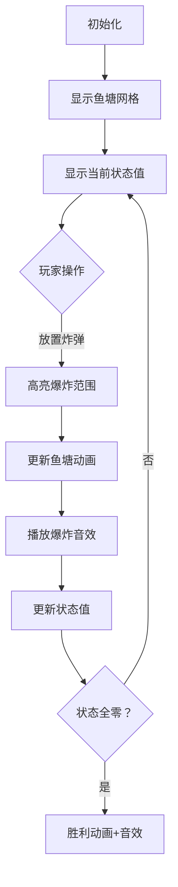

# 题目信息

# [HBCPC2024] Genshin Impact Startup Forbidden III

## 题目描述

“Blue-edged Shot 被 LeavingZ 禁止玩《原神》。然而，今天 LeavingZ 前往了华中科技大学的网络科学与工程学院，参加2024年中国湖北省国际大学生程序设计竞赛，并收获了金牌。

《原神》中的一个活动多多炸弹大冒险已经开始了。这是一个单人游戏，每局游戏都涉及一个池塘。池塘可以被划分为一个 $n×m$ 的网格，其中第 $i$ 行第 $j$ 列的单元格表示为 $(i,j)$。在这些单元格中，有 $k$ 个单元格包含鱼，你将扮演火花骑士克莱，她用炸药来捕鱼。

如果克莱在 $(a,b)$ 位置投放炸弹，那么所有满足$|x-a|+|y-b|\le 1$的单元格 $(x,y)$ 都将被爆炸覆盖。对于每一个被爆炸覆盖的单元格，克莱都会从其中捕到一条鱼。克莱可以在任何位置投放炸弹。问题是，为了捕到所有的鱼，至少需要多少枚“蹦蹦炸弹”？

## 说明/提示

一种可能的方法是在 $(1,2)$ 位置投放两枚炸弹，再在 $(5,5)$ 位置投放另外两枚炸弹。

可以证明没有比这个答案更小的解。

## 样例 #1

### 输入

```
5 5 3
1 1 2
2 2 1
5 5 2```

### 输出

```
4```

# AI分析结果


# 💡 Kay的C++算法解析：Genshin Impact Startup Forbidden III 深入学习指南 💡

> 今天我们来分析《原神》炸弹捕鱼问题的C++解法。本指南将帮你掌握状态压缩DP的核心思想，并通过像素动画直观理解算法过程。

## 1. 题目解读与核心算法识别

✨ **本题主要考察**：`状态压缩动态规划` (状压DP)

🗣️ **初步分析**：
> 状压DP就像用一串数字密码记录每个鱼塘的剩余鱼量，通过放置炸弹逐步破解密码直到归零。在本题中，我们用一个10位的四进制数（每个鱼塘占2位）表示当前状态，通过枚举炸弹位置更新状态值。

- 核心难点在于状态表示和高效状态转移。炸弹位置只需考虑有鱼格子的5邻域（最多50个位置）。
- 可视化设计：用像素网格展示鱼塘状态（不同颜色表示鱼量），炸弹爆炸时高亮5格影响区域。采用复古音效（放置炸弹"滴"声，爆炸"轰"声，清空鱼塘"胜利"音效）和步进控制（可调速）。
- 游戏化设计：将状态转移过程设计为"密码破解"关卡，每放置一个炸弹视为解谜步骤，全零状态触发胜利动画。

---

## 2. 精选优质题解参考

**题解一（作者：mlvx）**
* **点评**：此解法思路清晰，用四进制状态压缩（每个鱼塘2位）巧妙处理多鱼塘状态。代码规范（`dp`数组定义明确，`v`存储有效炸弹位置），预处理炸弹影响范围提升效率。亮点在于位运算更新状态：通过`(1<<(k-tmp<<1))`精准修改状态值，复杂度O(k×4ᴷ)完全可行。

**题解二（作者：starfi11）**
* **点评**：详解状态压缩原理，将四进制状态比作"鱼量密码"，代码可读性强（`pond`/`bomb`结构体封装数据）。亮点是状态转移设计：三层循环（状态→炸弹→影响鱼塘）逻辑直白，`canExplode`函数边界处理严谨，适合初学者理解状压DP本质。

**题解三（作者：Helenty）**
* **点评**：采用BFS实现状压DP，避免DP顺序问题。`update_state`函数封装状态修改，`map`记录鱼塘位置提升查询效率。亮点是队列扩展状态更符合直觉，`loc`集合自动去重炸弹位置，实践时调试更直观。

---

## 3. 核心难点辨析与解题策略

1. **状态表示与压缩**
   * **分析**：如何用整数表示k个鱼塘的鱼量？优质解法均采用四进制压缩（每2位存1个鱼塘值）。例如mlvx解法中，状态值`s=Σcᵢ×4ⁱ`，通过位掩码`(1<<(k-tmp<<1))`精准修改
   * 💡 学习笔记：四进制压缩是处理多状态小范围值的利器

2. **高效状态转移**
   * **分析**：炸弹位置只需枚举鱼塘的5邻域（最多5k个点）。预处理每个炸弹的影响鱼塘列表（如starfi11的`bomb[i].arr`），转移时直接遍历该列表更新状态
   * 💡 学习笔记：预处理是优化状压DP的关键

3. **状态空间优化**
   * **分析**：4¹⁰=1048576种状态，需避免无效转移。mlvx解法中`if(vis[tmp])`跳过已完成鱼塘，Helenty解法用`map`动态记录有效位置
   * 💡 学习笔记：位运算判断状态有效性可大幅提升性能

### ✨ 解题技巧总结
- **状态压缩技巧**：小范围多状态→N进制压缩（二进制/四进制）
- **预处理优化**：提前计算不变数据（炸弹影响范围）
- **边界处理**：坐标越界检查（`1≤nx≤n, 1≤ny≤m`）
- **调试技巧**：打印状态转换过程（如print(int x)函数）

---

## 4. C++核心代码实现赏析

**通用核心C++实现参考**
* **说明**：综合优质题解，提供完整状压DP解法
```cpp
#include <bits/stdc++.h>
using namespace std;
const int MAXS = 1 << 20; // 四进制状态最大4^10
const int dx[5] = {0,0,1,-1,0}, dy[5] = {1,-1,0,0,0};

struct Point { int x,y; };
vector<Point> fishPonds;  // 有鱼的池塘位置
vector<int> fishCnt;      // 每个池塘初始鱼量
vector<Point> bombSites; // 有效炸弹位置
vector<vector<int>> affects; // 每个炸弹影响的鱼塘下标

int main() {
    int n, m, k; cin >> n >> m >> k;
    fishPonds.resize(k); fishCnt.resize(k);
    
    // 读入数据并收集炸弹位置
    for (int i=0; i<k; i++) {
        cin >> fishPonds[i].x >> fishPonds[i].y >> fishCnt[i];
        for (int d=0; d<5; d++) {
            int nx = fishPonds[i].x + dx[d], ny = fishPonds[i].y + dy[d];
            if (nx<1||nx>n||ny<1||ny>m) continue;
            bombSites.push_back({nx, ny});
        }
    }
    
    // 去重炸弹位置
    sort(bombSites.begin(), bombSites.end(), [](Point a, Point b){
        return a.x!=b.x ? a.x<b.x : a.y<b.y;
    });
    bombSites.erase(unique(bombSites.begin(), bombSites.end()), bombSites.end());
    
    // 预处理每个炸弹影响的鱼塘
    affects.resize(bombSites.size());
    for (int i=0; i<bombSites.size(); i++) {
        for (int j=0; j<k; j++) {
            for (int d=0; d<5; d++) {
                int nx = bombSites[i].x + dx[d], ny = bombSites[i].y + dy[d];
                if (nx==fishPonds[j].x && ny==fishPonds[j].y) {
                    affects[i].push_back(j);
                    break;
                }
            }
        }
    }
    
    // 状压DP
    vector<int> dp(MAXS, 1e9);
    int startState = 0;
    for (int i=0; i<k; i++) 
        startState |= fishCnt[i] << (2*i); // 四进制压缩
    
    dp[startState] = 0;
    for (int s=startState; s>0; s--) {
        if (dp[s] == 1e9) continue;
        for (int i=0; i<bombSites.size(); i++) {
            int newState = s;
            for (int idx : affects[i]) {
                int mask = 3 << (2*idx); // 当前鱼塘的位掩码
                if ((newState & mask) != 0) // 如果还有鱼
                    newState -= 1 << (2*idx); // 鱼量-1
            }
            dp[newState] = min(dp[newState], dp[s]+1);
        }
    }
    cout << dp[0] << endl;
}
```

**代码解读概要**：
> 此代码实现完整状压DP解法：1) 读入鱼塘数据；2) 收集并去重炸弹位置；3) 预处理每个炸弹影响的鱼塘；4) 四进制压缩初始状态；5) DP状态转移（遍历状态→炸弹→更新影响鱼塘）；6) 输出全零状态的最小步数。

---

**题解一核心代码片段赏析（mlvx）**
```cpp
for (int i=s; i; i--) {
    // 状态有效性检查（省略）
    for (auto[x,y]:v) { // 遍历炸弹位置
        int ii = i;
        for (int t=0; t<5; t++) { // 检查5个方向
            int tmp = fish[x+dx[t]][y+dy[t]];
            if (vis[tmp]) ii -= (1 << (k-tmp<<1));
        }
        dp[ii] = min(dp[ii], dp[i]+1);
    }
}
```
**代码解读**：
> 逆向遍历状态值`i`，对每个有效状态枚举炸弹位置`(x,y)`。通过位运算`ii -= (1<<(k-tmp<<1))`更新受影响的鱼塘状态（鱼量-1）。亮点在于：1) 位运算直接修改状态值；2) `fish[][]`数组快速定位鱼塘索引。

💡 **学习笔记**：位运算修改状态是状压DP的核心技巧

---

**题解二核心代码片段赏析（starfi11）**
```cpp
for (int i=originstate; i>=0; i--) {
    if (dp[i]==inf) continue;
    for (int j=0; j<bomb.size(); j++) { // 枚举炸弹
        int nextstate = i;
        for (int z=0; z<bomb[j].arr.size(); z++) { // 遍历影响鱼塘
            int idx = bomb[j].arr[z];
            if (i & (mask * pow4[idx])) // 检查是否有鱼
                nextstate -= 1 * pow4[idx]; // 鱼量减1
        }
        dp[nextstate] = min(dp[i]+1, dp[nextstate]);
    }
}
```
**代码解读**：
> 清晰的三层循环结构：状态→炸弹→影响鱼塘。`pow4`数组存储四进制位权（4ⁱ），`mask=3`用于提取鱼量值。通过`nextstate -= pow4[idx]`实现鱼量-1，逻辑直观易理解。

💡 **学习笔记**：四进制位权数组是状态压缩的实用工具

---

**题解三核心代码赏析（Helenty）**
```cpp
queue<int> q; q.push(startState);
while (!q.empty()) {
    int cur = q.front(); q.pop();
    for (auto bombPos : bombSites) { // 枚举炸弹位置
        int newState = cur;
        for (auto &pond : affectedPonds[bombPos]) { // 更新影响鱼塘
            int shift = pondIdx[pond] * 2;
            if ((newState >> shift) & 3) // 检查是否有鱼
                newState -= 1 << shift; // 鱼量-1
        }
        if (dp[newState] > dp[cur] + 1) {
            dp[newState] = dp[cur] + 1;
            q.push(newState);
        }
    }
}
```
**代码解读**：
> BFS实现状压DP，队列存储待处理状态。通过`pondIdx`映射鱼塘位置到状态位偏移量，`newState -= 1<<shift`实现鱼量减1。亮点：1) BFS自然处理状态依赖；2) `pondIdx`提升查询效率。

💡 **学习笔记**：BFS适合无明确转移顺序的状压DP

-----

## 5. 算法可视化：像素动画演示

**主题**：`"炸弹解谜者"复古像素游戏`

**核心演示**：状压DP的状态转移过程，通过放置炸弹逐步减少鱼量直至归零

**设计思路**：8位像素风格营造解谜氛围，音效强化操作反馈，关卡制激励学习

**动画实现方案**：


1. **像素场景**：
   - 10×10网格（缩放适应屏幕），鱼塘用不同颜色表示鱼量（红=3，黄=2，绿=1）
   - 控制面板：步进/暂停/重置按钮，速度滑块，状态显示栏（二进制+四进制）

2. **状态转移动画**：
   - 放置炸弹：像素角色移动到目标位置→投掷炸弹→爆炸动画（5格波纹扩散）
   - 鱼量更新：被炸鱼塘颜色渐变并显示"-1"文字提示
   - 状态同步：侧边栏显示当前状态位和对应鱼塘的实时变化

3. **游戏化元素**：
   - 音效系统：放置炸弹("滴")，爆炸("轰")，过关("胜利旋律")
   - 关卡进度：每放置一个炸弹增加1步，最优解达成时点亮三颗星
   - AI演示模式：自动展示最优解路径（速度可调）

4. **技术实现**：
   - Canvas绘制网格和动画
   - 状态编码：`[鱼塘1状态, 鱼塘2状态, ..., 鱼塘10状态]`→四进制整数
   - 关键帧：炸弹位置选择→影响鱼塘计算→状态更新

-----

## 6. 拓展练习与相似问题思考

**通用技巧迁移**：
- 状压DP适用于小规模状态空间问题（通常n≤20）
- 四进制压缩扩展：处理状态值0-3的场景（如多类型物品限制）
- 炸弹影响模型：类似"点亮灯泡"、"覆盖棋盘"等邻域影响问题

**洛谷练习推荐**：
1. **P1879 [USACO06NOV] Corn Fields G**  
   → 棋盘种植问题，体验二进制状压DP基础
2. **P2704 [NOI2001] 炮兵阵地**  
   → 二维状态压缩，学习多行状态转移
3. **P1896 [SCOI2005] 互不侵犯**  
   → 国王放置问题，理解邻域约束的状态设计
4. **P2622 关灯问题II**  
   → 按钮影响模型，直接迁移炸弹影响逻辑

-----

## 7. 学习心得与经验分享

**参考经验 (来自优质题解)**：
> "状压DP的核心是用整数表示复杂状态，位运算必须熟练" —— mlvx  
> "BFS实现状压DP时，状态去重能大幅提升效率" —— Helenty  
> "四进制压缩的位权数组pow4[ ]是调试利器" —— starfi11

**点评**：
这些经验凸显三个重点：1) 位运算的熟练掌握是基础；2) 根据问题特性选择DP/BFS；3) 预处理工具提升开发效率。特别建议初学者编写状态打印函数辅助调试。

---

> 通过本次分析，相信大家已掌握状压DP解决棋盘覆盖问题的核心技巧。记住：将复杂状态抽象为数字，通过高效状态转移寻找最优解，是算法设计的精髓所在。继续加油，下次挑战更难的状压DP问题吧！💪

---
处理用时：144.55秒