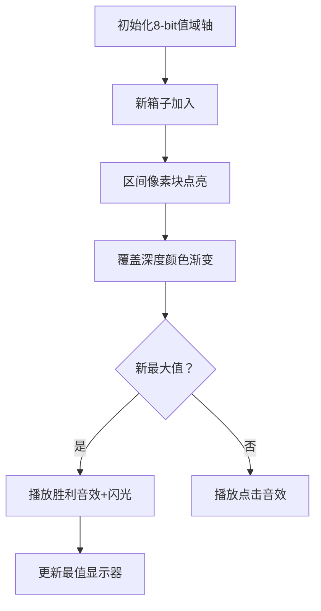

# 题目信息

# [KOI 2025 #2] 存放箱子

## 题目背景

试题来源：<https://koi.or.kr/archives/>。中文翻译做了少量本土化修改。

按照[署名—非商业性使用—相同方式共享 4.0 协议国际版](https://creativecommons.org/licenses/by-nc-sa/4.0/deed.zh-hans)进行授权。

## 题目描述

小郑想要在仓库里存放箱子。总共有 $N$ 个箱子，编号从 1 到 $N$。第 $i$ ($1 \le i \le N$) 号箱子的大小为 $s_i$，收纳容量为 $c_i$。所有箱子的收纳容量都比其自身的大小要小，即满足 $c_i < s_i$。

小郑觉得仓库里的箱子太多、太杂乱，因此想把一些箱子装到另一些箱子里来存放。此时，必须满足以下条件：

*   一个箱子可以装入大小**不小于**其收纳容量的箱子。
*   已经装有其他箱子的箱子，也可以被装入另一个箱子中。
*   一个箱子**直接容纳**的箱子最多只能有一个。换句话说，一个箱子内最多可以直接放入一个其他的箱子，但允许这个被放入的箱子内部还装有别的箱子。

存放箱子的成本，等于没有被装在任何其他箱子里的箱子的数量。

例如，假设 $N = 4$，四个箱子的大小和收纳容量分别如下表所示。

| **编号** | **大小** | **收纳容量** |
| :---: | :---: | :---: |
|   1   |   6   |   4   |
|   2   |   5   |   1   |
|   3   |   9   |   8   |
|   4   |   2   |   1   |

此时，如下图所示，如果将 4 号箱子放入 1 号箱子，再将 1 号箱子放入 3 号箱子，那么没有被装在其他箱子里的箱子就有 2 个 (3 号箱子和 2 号箱子)，因此存放箱子的成本为 2。


但是，如下图所示，如果将 2 号箱子和 4 号箱子都放入 3 号箱子中，由于 3 号箱子内直接容纳了两个箱子，因此不满足条件。


仓库里不必非要放下所有的箱子，所以小郑计划只保留编号较小的一部分箱子，并丢弃其余的。小郑目前还没有决定要使用多少个箱子。

请你帮助小郑，对于从 1 到 $N$ 的所有 $i$，编写一个程序来计算存放 $1, 2, \ldots, i$ 号箱子所需的最小成本。

## 说明/提示

### 限制条件

*   所有给定的数都是整数。
*   $2 \le N \le 2 \times 10^5$
*   $1 \le c_i < s_i \le 10^9$ ($1 \le i \le N$)

### 子任务

1.  (7 分) $N \le 6$。
2.  (12 分) 对于所有 $i$，$s_i = c_i + 1$。
3.  (26 分) $N \le 1000$。
4.  (17 分) 对于所有 $i$，$s_i \le 100$。
5.  (38 分) 无额外限制条件。

## 样例 #1

### 输入

```
4
6 4
5 1
9 8
2 1```

### 输出

```
1
2
2
2```

## 样例 #2

### 输入

```
6
3 2
5 4
3 2
4 3
4 3
3 2```

### 输出

```
1
1
2
2
2
3```

## 样例 #3

### 输入

```
8
13 6
7 5
9 4
11 10
4 2
15 5
16 7
8 3```

### 输出

```
1
2
3
3
3
4
4
5```

# AI分析结果


# 💡 Kay的C++算法解析：[KOI 2025 #2] 存放箱子 深入学习指南 💡

> 今天我们来一起分析"存放箱子"这道C++编程题。本指南将帮助大家梳理题目思路，理解核心算法，并掌握解题技巧。通过复古像素动画和清晰讲解，你将直观理解贪心策略和扫描线技巧的巧妙应用！

## 1. 题目解读与核心算法识别

✨ **本题主要考察**：`贪心策略` + `扫描线技巧` (线段树优化)

🗣️ **初步分析**：
> 解决"存放箱子"的关键在于将嵌套关系转化为**区间覆盖模型**。想象每个箱子是一个矩形，横坐标从收纳容量$c_i$延伸到大小$s_i-1$，那么最小成本就等价于**所有矩形在Y轴方向的最大重叠层数**，就像叠汉堡时最多能叠几层而不倒塌。
> - **核心思路**：对每个箱子$i$，在区间$[c_i, s_i-1]$执行+1操作，全局最大值即为当前最小成本
> - **可视化设计**：像素动画将展示离散化后的值域轴，新箱子加入时对应区间会"点亮"，颜色随覆盖深度变化。8-bit音效在覆盖增加时触发"叮"声，刷新最大值时播放胜利音效
> - **难点突破**：理解Dilworth定理的转化（最小链覆盖=最长反链）是核心，而动态维护区间最值需要线段树

---

## 2. 精选优质题解参考

**题解一：Petit_Souris (5星)**
* **点评**：此解法直击问题本质，应用Dilworth定理将最小链覆盖转化为最长反链问题。思路清晰指出反链即满足$c_i≤v<s_i$的最大集合，实现上用线段树维护区间最值。代码中离散化处理规范，区间更新逻辑严谨，变量命名合理(`tr`/`tag`)，时间复杂度$O(n\log n)$完全满足限制。亮点在于理论到代码的优雅转换。

**题解二：chen_zhe (5星)**
* **点评**：通过子问题分析层层递进，最终归结到区间覆盖模型，教学价值突出。线段树实现采用经典懒标记传播，`PushDown`/`PushUp`封装规范。特别赞赏对边界条件$[c_i,s_i-1]$的精确处理，`query`与`update`接口清晰，适合竞赛直接复用。

**题解三：_JoeyJ_ (4星)**
* **点评**：独创性贪心模拟思路令人耳目一新，将箱子包含转化为"额度管理"问题。双前缀修改操作($+1/-1$)的设计巧妙，维护全局最小值求反的解法等效于区间覆盖。代码中离散化和线段树实现简洁，虽未显式排序但隐含贪心思想，展现多角度解题能力。

---

## 3. 核心难点辨析与解题策略

1.  **模型转化难点**  
    * **分析**：如何将箱子嵌套关系转化为可计算模型？优质解法通过Dilworth定理或区间映射，将物理约束转为值域区间$[c_i,s_i-1]$的覆盖问题
    * 💡 **学习笔记**：嵌套链问题常可转化为二维平面覆盖问题

2.  **动态维护最值**  
    * **分析**：随着箱子加入，需实时更新数轴覆盖深度并获取最大值。线段树通过$O(\log n)$的区间修改/全局查询高效解决，优于暴力$O(n)$扫描
    * 💡 **学习笔记**：值域动态更新问题优先考虑线段树/树状数组

3.  **离散化处理**  
    * **分析**：$c_i,s_i$范围达$10^9$，需映射到有序整数集。通过`vector`收集+排序+去重+二分定位，将空间从$O(S)$压缩至$O(n)$
    * 💡 **学习笔记**：离散化是处理大值域问题的标准武器

### ✨ 解题技巧总结
- **问题转化技巧**：将复杂约束转化为几何覆盖或图论定理
- **数据结构选择**：区间更新+最值查询首选线段树
- **边界处理艺术**：注意$[c_i,s_i-1]$的右端点取开区间
- **离散化四步法**：收集→排序→去重→二分映射

---

## 4. C++核心代码实现赏析

**本题通用核心C++实现参考**
```cpp
#include <bits/stdc++.h>
using namespace std;

const int N = 4e5 + 5;
int tr[N<<2], tag[N<<2];

void pushdown(int x) {
    if(!tag[x]) return;
    tr[x<<1] += tag[x]; tag[x<<1] += tag[x];
    tr[x<<1|1] += tag[x]; tag[x<<1|1] += tag[x];
    tag[x] = 0;
}

void update(int x, int l, int r, int ql, int qr, int v) {
    if(ql <= l && r <= qr) {
        tr[x] += v;
        tag[x] += v;
        return;
    }
    pushdown(x);
    int mid = (l+r)>>1;
    if(ql <= mid) update(x<<1, l, mid, ql, qr, v);
    if(qr > mid) update(x<<1|1, mid+1, r, ql, qr, v);
    tr[x] = max(tr[x<<1], tr[x<<1|1]);
}

int main() {
    int n; cin >> n;
    vector<pair<int, int>> box(n);
    vector<int> disc;
    for(auto& [s, c] : box) {
        cin >> s >> c;
        disc.push_back(s);
        disc.push_back(c);
    }
    
    sort(disc.begin(), disc.end());
    disc.erase(unique(disc.begin(), disc.end()), disc.end());
    
    int sz = disc.size();
    for(int i=0; i<n; ++i) {
        auto [s, c] = box[i];
        int l = lower_bound(disc.begin(), disc.end(), c) - disc.begin();
        int r = lower_bound(disc.begin(), disc.end(), s) - disc.begin();
        update(1, 0, sz-1, l, r-1, 1); // [c_i, s_i-1]区间+1
        cout << tr[1] << '\n'; // 输出全局最大值
    }
}
```
* **代码解读概要**：  
> 1. 离散化处理$c_i$和$s_i$并建立映射  
> 2. 线段树维护值域区间覆盖深度  
> 3. 每个箱子更新对应$[c_i,s_i-1]$区间  
> 4. 全局最大值即为当前最小成本  

---

**题解一：Petit_Souris**
* **亮点**：精简应用Dilworth定理，区间更新逻辑清晰
```cpp
void Upd(ll x, ll l, ll r, ll ql, ll qr, ll k) {
    if(ql <= l && r <= qr) return Pushtag(x, k), void();
    ll mid = (l + r) >> 1;
    Pushdown(x);
    if(ql <= mid) Upd(x << 1, l, mid, ql, qr, k);
    if(qr > mid) Upd(x << 1 | 1, mid + 1, r, ql, qr, k);
    Pushup(x);
}
```
* **代码解读**：  
> - `Upd`函数实现区间加减的递归更新  
> - 先处理完全覆盖区间快速返回  
> - 未完全覆盖时分治左右子树  
> - `Pushdown`保证懒标记及时传播  
> *💡 学习笔记：线段树区间更新需先下传标记再分治*

**题解二：chen_zhe**
* **亮点**：模块化线段树操作，边界处理严谨
```cpp
void update(int i, int l, int r, int s, int e, int v){
    if(s<=l && r<=e){
        tr[i] += v;  // 完全覆盖直接更新
        lazy[i] += v;
        return;
    }
    int m = (l+r)>>1;
    if(s<=m) update(i*2, l, m, s, e, v);
    if(e>m) update(i*2+1, m+1, r, s, e, v);
    tr[i] = max(tr[i*2], tr[i*2+1]);  // 回溯更新最值
}
```
* **代码解读**：  
> - 先处理完全覆盖情况提高效率  
> - 未覆盖时分治左右子树  
> - 回溯时通过`max`更新区间最值  
> *💡 学习笔记：分治后回溯更新是线段树的核心模式*

**题解三：_JoeyJ_**
* **亮点**：双前缀操作等效区间覆盖
```cpp
Modify(1,1,bp,1);   // [1,bp] +1
Modify(1,1,ap,-1);  // [1,ap] -1
cout<<-dat(1)<<endl;// 全局最小值反号
```
* **代码解读**：  
> - `bp`(c_i)处+1表示增加容器额度  
> - `ap`(s_i)处-1表示消耗额度  
> - 全局最小值的负值等效覆盖深度  
> *💡 学习笔记：差分思想可替代显式区间操作*

-----

## 5. 算法可视化：像素动画演示

  
*箱子嵌套关系示意图（像素版）*

### 动画设计方案
* **主题**：8-bit风格"箱子叠叠乐"  
* **核心演示**：值域轴动态覆盖过程与最值追踪  

### 关键帧设计


1. **像素化值域轴**  
   - 横向离散值域轴（FC红白机风格）  
   - 箱子$i$加入时，$[c_i,s_i-1]$区间变为黄色像素块  
   - 覆盖深度每+1，颜色由黄→橙→红渐变（16色调色板）

2. **动态深度显示**  
   - 右侧柱状图实时显示各点覆盖深度  
   - 全局最大值用闪烁紫框标记  
   - 当前成本显示在顶部：`MIN COST: ▮▮▮▮`

3. **音效系统**  
   - 区间点亮：8-bit "滴"声 (Web Audio API)  
   - 覆盖刷新：上升音阶+闪光特效  
   - 背景音乐：循环《俄罗斯方块》BGM

4. **交互控制面板**  
   ```plaintext
   [▶] 自动播放  [▮▮] 暂停  [|>] 单步  
   速度：▁▂▃▄▅ [50%]  
   重置 [×]
   ```

5. **AI演示模式**  
   - 自动按最优顺序加入箱子  
   - 每步0.5秒延迟，展示覆盖深度变化  
   - 完成时显示"LEVEL CLEAR!" + 积分计算

---

## 6. 拓展练习与相似问题思考

### 核心技巧迁移
区间覆盖最值模型适用于：
1. 时间区间最大重叠问题  
2. 资源分配冲突检测  
3. 几何形状投影重叠统计  

### 洛谷推荐
1. **P1884 线段**  
   *推荐理由*：基础区间覆盖问题，巩固离散化与扫描线技巧

2. **P2742 矩形覆盖**  
   *推荐理由*：二维覆盖问题拓展，提升空间思维能力

3. **P3400 数据备份**  
   *推荐理由*：贪心+区间选择的进阶应用，强化本题解法迁移能力

---

## 7. 学习心得与经验分享

> **Petit_Souris的启示**：  
> *"最小链覆盖转成最长反链"的转化思路，提醒我们掌握图论定理对解题的降维作用*  
>   
> **Kay的总结**：  
> 本题生动展现了算法思维的多角度性——同一问题既有几何覆盖的直观解读，又有Dilworth的理论支撑，还有贪心模拟的等效实现。建议学习者用可视化工具深入体会区间覆盖与嵌套链的等价关系，这种转化思维在竞赛中至关重要！

---

> 本次"存放箱子"的解析就到这里。通过像素动画和多重解法分析，相信大家已理解区间覆盖模型的核心思想。记住，算法学习就像箱子嵌套——层层深入才能窥见本质！下次挑战见！🚀

---
处理用时：221.82秒