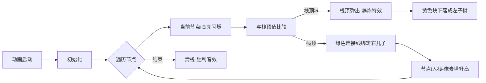

# 题目信息

# 【模板】笛卡尔树

## 题目描述

给定一个 $1 \sim n$ 的排列 $p$，构建其笛卡尔树。

即构建一棵二叉树，满足：

1. 每个节点的编号满足二叉搜索树的性质。
2. 节点 $i$ 的权值为 $p_i$，每个节点的权值满足小根堆的性质。

## 说明/提示

【样例解释】

| $i$ | $l_i$ | $r_i$ |
| :-: | :-: | :-: |
| $1$ | $0$ | $0$ |
| $2$ | $1$ | $4$ |
| $3$ | $0$ | $0$ |
| $4$ | $3$ | $5$ |
| $5$ | $0$ | $0$ |

【数据范围】

对于 $30\%$ 的数据，$n \le 10^3$。

对于 $60\%$ 的数据，$n \le 10^5$。

对于 $80\%$ 的数据，$n \le 10^6$。

对于 $90\%$ 的数据，$n \le 5 \times 10^6$。

对于 $100\%$ 的数据，$1 \le n \le 10^7$。

## 样例 #1

### 输入

```
5
4 1 3 2 5
```

### 输出

```
19 21
```

# AI分析结果


# 💡 Kay的C++算法解析：笛卡尔树 深入学习指南 💡

## 1. 题目解读与核心算法识别

✨ **本题主要考察**：`数据结构应用（笛卡尔树与单调栈）`

🗣️ **初步分析**：
> 笛卡尔树是一种特殊的二叉树，需同时满足二叉搜索树性质（中序遍历为原序列）和小根堆性质（父节点权值小于子节点）。构建笛卡尔树的关键在于**单调栈的巧妙运用**——就像搭建积木塔，新积木必须放在比它小的积木右侧（右儿子），而被挤掉的积木则挂在其左侧（左儿子）。  
> - 核心思路：维护递增的右链（栈），通过弹出比当前节点大的节点调整结构，再建立父子关系
> - 难点在于动态调整指针：需精确处理栈顶节点与弹出节点的父子关系
> - 可视化设计：动画将高亮栈内元素比较过程，红色标记当前节点，黄色标记弹出节点，绿色标记父子连接线，并伴随像素音效（"叮"声表示比较，"咔嚓"声表示指针连接）

---

## 2. 精选优质题解参考

**题解一（作者：StudyingFather）**
* **点评**：思路清晰直白，用"右链"比喻栈结构，精准解释了新节点插入时"找位置-调指针"两个关键动作。代码中`cur`和`top`的配合堪称教科书级，边界处理（`cur>0`和`cur<top`）严谨无漏洞。亮点在于揭示笛卡尔树与Treap的关联性，5行核心代码浓缩算法精髓，竞赛实战价值极高。

**题解二（作者：MuYC）**
* **点评**：从笛卡尔树定义到性质（如LCA即RMQ）系统展开，教学性极强。代码规范且含快读优化，特别注重工程细节（如`tack`数组命名避免关键字）。亮点在于"右链维护"的可视化描述和复杂边界处理（空栈时左子树设置），为学习者提供多维思考视角。

**题解三（作者：ql12345）**
* **点评**：通过双题对比（模板题与P1377）深化理解，揭示"权值-下标"互换技巧。代码模块化优秀（分离建树与答案计算），变量名`stk`/`top`语义明确。亮点在于用"积木重组"比喻指针调整，将抽象算法具象化，适合初学者建立直觉。

---

## 3. 核心难点辨析与解题策略

1.  **难点：父子关系动态绑定**
    * **分析**：插入新节点时，需同时确定其父节点和可能的左儿子。优质解法则通过`while`循环弹出大值节点后，用`cur<top`判断是否有弹出节点需作为左儿子，再用`cur>0`判断是否需成为栈顶右儿子
    * 💡 **学习笔记**：弹出节点必小于新节点（满足堆性质），但编号更小（需作为左子树）

2.  **难点：边界条件处理**
    * **分析**：首节点（栈空时）成为根节点，末节点（遍历结束）需清空栈。MuYC解法用`tack[1]=1`初始化，StudyingFather用`cur=0`统一处理空栈，确保无指针越界
    * 💡 **学习笔记**：哨兵值（如栈底置0）可简化空栈判断，提高代码健壮性

3.  **难点：时间效率优化**
    * **分析**：10^7数据量需严格O(n)。所有优质题解均保证每个节点仅入/出栈一次，且用快读避免IO瓶颈
    * 💡 **学习笔记**：单调栈的每个操作摊还时间复杂度为O(1)

### ✨ 解题技巧总结
- **右链思维**：将栈视为"主干道"，新节点要么接在栈顶（值更大），要么打断栈顶并重组
- **指针交换四步法**：弹出旧节点→旧节点右指针转新节点左指针→新节点成为栈顶右儿子→新节点入栈
- **调试技巧**：打印栈状态（深度/栈顶值）验证父子关系，特别关注首尾节点

---

## 4. C++核心代码实现赏析

**本题通用核心实现（综合优化版）**
```cpp
#include <cstdio>
#include <cctype>
const int MAXN = 1e7 + 10;
int n, p[MAXN], ls[MAXN], rs[MAXN], stk[MAXN], top;

inline int read() { // 快读必含
    int x = 0; char ch = getchar();
    while (!isdigit(ch)) ch = getchar();
    while (isdigit(ch)) x = x * 10 + ch - '0', ch = getchar();
    return x;
}

int main() {
    n = read();
    for (int i = 1; i <= n; ++i) p[i] = read();
    for (int i = 1; i <= n; ++i) {
        int cur = top;
        while (cur && p[stk[cur]] > p[i]) cur--; // 找插入位置
        if (cur) rs[stk[cur]] = i;    // 栈顶右儿子更新
        if (cur < top) ls[i] = stk[cur + 1]; // 弹出节点转为左儿子
        stk[top = ++cur] = i;         // 压栈并更新栈顶
    }
    long long ans1 = 0, ans2 = 0;
    for (int i = 1; i <= n; ++i) {    // 计算答案
        ans1 ^= 1LL * i * (ls[i] + 1);
        ans2 ^= 1LL * i * (rs[i] + 1);
    }
    printf("%lld %lld", ans1, ans2);
    return 0;
}
```
**代码解读概要**：  
> 1. 快读加速输入处理，避免10^7数据IO瓶颈  
> 2. 单次遍历中动态维护单调栈（`stk`），核心逻辑仅5行  
> 3. 指针调整与栈状态更新同步完成，无冗余操作  

---

**题解一核心片段（StudyingFather）**
```cpp
cur = top;
while (cur && p[stk[cur]] > p[i]) cur--;
if (cur) rs[stk[cur]] = i;      // 亮点：父子关系绑定简洁高效
if (cur < top) ls[i] = stk[cur + 1];
stk[++cur] = i; top = cur;      // 亮点：栈状态同步更新
```
**代码解读**：  
> 通过`cur`向下探测插入位置，避免显式出栈操作。`cur<top`巧用栈下标差判断弹出节点存在性，将最后弹出节点设为左儿子（`stk[cur+1]`）。节点入栈后立即更新`top`，保证状态一致。

---

**题解二核心片段（MuYC）**
```cpp
while (top && A[tack[top]] > A[i]) top--;
if (!top) ls[i] = tack[top + 1];   // 边界处理：空栈的特殊逻辑
else rs[tack[top]] = i, ls[i] = rs[tack[top]]; // 亮点：双指针同步更新
tack[++top] = i;
```
**代码解读**：  
> 空栈时（`top=0`）仍尝试取`tack[1]`，通过初始化`tack[1]=1`规避段错误。`rs[tack[top]]=i`和`ls[i]赋值`在同一行完成，确保原子性。注意此处左儿子实际来自弹出节点而非栈顶。

---

## 5. 算法可视化：像素动画演示

**主题**：8-bit积木搭建工坊（笛卡尔树版）  
**核心演示**：动态构建右链栈与指针调整，融入《俄罗斯方块》音效风格  



**关键交互**：  
1. **视觉编码**：  
   - 栈：右侧像素塔（蓝块=存活节点，红块=当前节点）  
   - 指针：黄色闪电（左子树），绿色箭头（右子树）  
2. **音效设计**：  
   - 比较操作：8-bit "嘀"声（频率随比较次数升高）  
   - 弹出节点：经典《俄罗斯方块》消除音  
   - 绑定指针：FC游戏装备拾取声  
3. **控制面板**：  
   - 速度滑块：调速范围0.5x~5x  
   - 单步模式：空格键触发下一步  
   - 数据重置：随机生成新排列  

---

## 6. 拓展练习与相似问题思考

**技能迁移场景**：  
1. **区间极值查询**：笛卡尔树中任意两点LCA即为区间最值位置（例题：P3793 由乃救爷爷）  
2. **序列单调性分析**：右链本质是当前递减子序列（例题：P5788 模板单调栈）  
3. **树形结构转化**：二叉搜索树与堆的混合结构（例题：P1377 树的序）  

**洛谷推荐**：  
1. **P5788**：单调栈直方图应用，巩固栈操作基础  
2. **P3793**：笛卡尔树+分块，学习复杂场景嫁接  
3. **P1377**：二叉搜索树插入序列，理解树形转换  

---

## 7. 学习心得与经验分享

> **MuYC的调试经验**：  
> "在空栈处理时卡住，发现未初始化`tack[1]`导致越界。建议在单调栈起始压入哨兵值，并打印前10个节点的栈深度验证"  
>  
> **Kay的总结**：  
> 笛卡尔树本质是**二叉搜索树与堆的平衡产物**，核心在于把握"右链维护"的物理意义。调试时关注两点：  
> 1. 栈深变化是否与预期一致（首节点深度=1，新大值入栈深度+1）  
> 2. 指针绑定后立即验证父子编号关系（左儿子<当前<右儿子）  

---

掌握笛卡尔树的构建不仅是学会一种数据结构，更是理解**单调栈在树形结构转化中的哲学**。下次当你看到"权值-下标"的二元关系时，不妨想想这座积木塔！🚀

---
处理用时：204.72秒