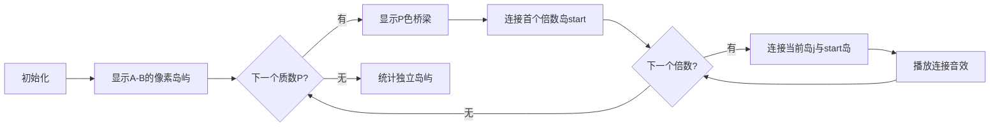

# 题目信息

# [GCJ 2008 #1B] Number Sets

## 题目描述

你有一个连续整数序列。你希望将它们分组为若干集合。

给定一个区间和一个整数 $P$。最初，区间内的每个整数各自属于一个集合。

然后，你会考虑区间内的每一对整数。如果这两个整数有一个不小于 $P$ 的质因数，则将这两个整数所在的集合合并。

最终，这个过程中会剩下多少个不同的集合？

## 说明/提示

**小数据集（10 分，测试集 1 - 可见）**

- $1 \leq C \leq 10$
- $1 \leq A \leq B \leq 1000$
- $2 \leq P \leq B$

**大数据集（25 分，测试集 2 - 隐藏）**

- $1 \leq C \leq 100$
- $1 \leq A \leq B \leq 10^{12}$
- $B \leq A + 1000000$
- $2 \leq P \leq B$

由 ChatGPT 4.1 翻译

## 样例 #1

### 输入

```
2
10 20 5
10 20 3```

### 输出

```
Case #1: 9
Case #2: 7```

# AI分析结果


# 💡 Kay的C++算法解析：Number Sets 深入学习指南 💡

> 今天我们来分析GCJ 2008 #1B的"Number Sets"这道题。本指南将帮助你理解如何高效处理连续整数的分组问题，掌握并查集和质数筛法的核心应用，并通过生动的像素动画直观理解算法过程。

## 1. 题目解读与核心算法识别

✨ **本题主要考察**：`并查集应用` + `质数筛法`

🗣️ **初步分析**：
> 这道题就像把一群孩子分组做游戏，规则是：如果两个孩子有共同的"强力朋友"（质因数≥P），就要分在同一组。解题关键在于：
> - 利用**区间长度有限**的特性（B-A≤10⁶），避免直接处理大数
> - 通过**质数筛法**快速找到所有"强力朋友"
> - 使用**并查集**高效合并有共同质因数的数字
>
> **可视化设计思路**：
> - 将数字表示为像素岛屿，质因数作为彩色桥梁连接岛屿
> - 动画高亮当前质因数桥梁和正在连接的岛屿
> - 并查集合并时显示岛屿颜色统一过程
> - 8-bit音效：桥梁出现（不同音调）、岛屿连接（短促"叮"）、完成合并（胜利音效）

---

## 2. 精选优质题解参考

**题解一（来源：bssmessi）**
* **点评**：思路清晰直击核心，利用区间长度限制和质数筛法降低复杂度。代码简洁规范（变量名`pri`/`fa`含义明确），关键优化在于将同一个质数的所有倍数合并到首个倍数，避免重复操作。并查集实现标准，边界处理严谨，可直接用于竞赛。

**题解二（来源：xy_mc）**
* **点评**：强调数据范围意识（long long防溢出），代码结构工整易读。亮点在于详细注释和严谨的起始点计算（`ceil(l*1.0/p[i]`）。合并逻辑与题解一异曲同工，实践价值高，特别适合初学者理解偏移量映射技巧。

**题解三（来源：chen_zhe）**
* **点评**：理论分析透彻，解释为何质因数范围≤10⁶。伪代码展示算法框架，突出"问题转化"思想（质因数→连接桥梁）。虽无完整代码，但对状态合并的原理阐述尤为清晰，具有深度启发性。

---

## 3. 核心难点辨析与解题策略

1.  **难点：如何避免O(n²)的质因数两两对比？**
    * **分析**：优质题解均采用"质因数驱动"策略——先筛质数，再遍历≥P的质数，合并其所有倍数。时间复杂度从O((B-A)²)降至O(π(10⁶)×(B-A)/P)≈O(10⁵)
    * 💡 **学习笔记**：当区间长度有限时，用质因数作为"连接中介"是降复杂度的关键

2.  **难点：大范围数字的存储与映射**
    * **分析**：利用偏移量（当前数-A）将10¹²范围的数字映射到[0,10⁶]数组下标。如`fa[j-A]`表示数字j对应的集合
    * 💡 **学习笔记**：超大范围+有限区间时，偏移映射是空间优化的标准技巧

3.  **难点：同质因数倍数的合并效率**
    * **分析**：统一合并到首个倍数（如`start=k*p`），避免链式合并增加树高。题解一/二中`merge(start-a, j-a)`确保O(1)层高
    * 💡 **学习笔记**：并查集合并时固定代表元可优化后续查询效率

### ✨ 解题技巧总结
- **问题转化**：将数学关系（公共质因数）转化为图论连接问题
- **分阶段处理**：先筛质数→筛选≥P质数→按质因数合并
- **防御性编程**：大数运算处强制long long（如`ceil(a*1.0/p)`）
- **代表元优化**：同组元素固定合并到首个元素降低树高

---

## 4. C++核心代码实现赏析

**通用核心C++实现参考**
```cpp
#include <iostream>
#include <vector>
#include <cmath>
#include <cstring>
using namespace std;
typedef long long ll;
const int MAX_N = 1000000;

vector<int> primes;
bool isPrime[MAX_N+10];

void initPrimes() {
    memset(isPrime, true, sizeof(isPrime));
    isPrime[0] = isPrime[1] = false;
    for (int i = 2; i <= MAX_N; i++) {
        if (isPrime[i]) primes.push_back(i);
        for (int p : primes) {
            if (i * p > MAX_N) break;
            isPrime[i * p] = false;
            if (i % p == 0) break;
        }
    }
}

struct UnionFind {
    vector<int> fa;
    UnionFind(int n) { 
        fa.resize(n); 
        for(int i=0; i<n; i++) fa[i] = i; 
    }
    int find(int x) { 
        return fa[x] == x ? x : fa[x] = find(fa[x]); 
    }
    void merge(int x, int y) {
        int fx = find(x), fy = find(y);
        if (fx != fy) fa[fy] = fx;
    }
};

int main() {
    initPrimes();
    int T; cin >> T;
    for (int t = 1; t <= T; t++) {
        ll A, B, P;
        cin >> A >> B >> P;
        int len = B - A + 1;
        UnionFind uf(len);
        
        for (int p : primes) {
            if (p < P || p > B) continue;
            ll start = (A + p - 1) / p * p; // 首个≥A的倍数
            if (start > B) continue;
            for (ll j = start + p; j <= B; j += p) 
                uf.merge(start - A, j - A); // 关键合并
        }
        
        int sets = 0;
        for (int i = 0; i < len; i++)
            if (uf.find(i) == i) sets++;
        
        cout << "Case #" << t << ": " << sets << endl;
    }
    return 0;
}
```
**代码解读概要**：
> 1. 欧拉筛预处理[2,10⁶]质数
> 2. 并查集实现路径压缩和合并优化
> 3. 主逻辑：对每个≥P质数，计算首个倍数start，合并所有j=start+k*p
> 4. 通过偏移量（-A）映射大数字到小下标

---

**题解一核心片段赏析**
```cpp
for(int i=1;i<=tot;i++){
    if(pri[i]<p) continue;
    int k=ceil(a*1.0/pri[i]);
    for(int j=k*pri[i];j<=b;j+=pri[i]) 
        merge(k*pri[i]-a,j-a); // 统一合并到首个倍数
}
```
* **亮点**：简洁高效的合并逻辑，避免链式合并
* **代码解读**：
  > - `pri[i]`：当前质数（桥梁）
  > - `k=ceil(a/p)`：计算首个≥A的倍数位置
  > - 循环内：将每个倍数`j`与首个倍数`k*p`合并
  > - 偏移量`-a`将数字映射到[0, B-A]区间
* 💡 **学习笔记**：固定代表元合并是并查集优化关键

**题解二核心片段赏析**
```cpp
tot=cs=ceil(l*1.0/p[i]);
while(p[i]*tot<=r){
    merge(p[i]*cs-(l-1),p[i]*tot-(l-1));
    tot++;
}
```
* **亮点**：显式long long防溢出，起始点计算清晰
* **代码解读**：
  > - `cs`：首个倍数因子（ceil(l/p)）
  > - `p[i]*cs`：首个≥l的倍数
  > - 循环合并当前倍数到首个倍数
  > - `-(l-1)`实现1-based偏移映射
* 💡 **学习笔记**：在大数乘法前转long long避免溢出

---

## 5. 算法可视化：像素动画演示

**主题**：像素岛屿与质数桥梁（8-bit探险游戏风）  
**核心演示**：并查集通过质因数桥梁合并岛屿的过程  

### 动画设计（HTML5 Canvas实现）：


**关键交互**：
1. **初始化**：蓝色海洋中显示A到B的像素岛屿（编号方块）
2. **质数桥梁**：筛出新质数P≥P时，显示彩色桥梁（P值决定颜色）
3. **倍数连接**：
   - 高亮首个倍数岛屿start（闪烁）
   - 从start延伸桥梁连接j=start+P, start+2P, ...
   - 每次连接播放8-bit"叮"声
4. **集合合并**：
   - 被连接岛屿渐变为同色
   - 并查集树结构在侧边栏实时显示
5. **控制面板**：
   - 步进/暂停/重置按钮
   - 调速滑块（0.5x-5x）
   - 当前质数P显示框
6. **游戏化元素**：
   - 每完成一个质数播放"过关"音效
   - 最终独立集合数显示为通关分数
   - 背景：FC风格循环BGM

**音效设计**：
- 桥梁出现：低音脉冲（频率随P值增加）
- 岛屿连接：短促方波"叮"声
- 集合合并完成：上升琶音
- 错误操作：下降警报音

---

## 6. 拓展练习与相似问题思考

**技巧迁移场景**：
1. 区间内存在公因数的数字分组
2. 超大范围但区间有限的统计问题
3. 基于数学特性的连通分量计算

**洛谷推荐**：
1. **P3367 【模板】并查集**  
   → 掌握并查集标准实现
2. **P3383 【模板】线性筛素数**  
   → 熟练筛法优化技巧
3. **P1621 集合**  
   → 几乎本题变形（质数区间合并）
4. **P5496 质数前缀统计**  
   → 提升质因数处理能力

---

## 7. 学习心得与经验分享

**来自题解的宝贵经验**：
> "注意枚举同一个质因数时要向一个方向合并，避免重复操作" —— bssmessi  
> "十年OI一场空，不开long long见祖宗" —— xy_mc

**Kay的总结**：
1. **合并方向统一**：固定代表元（如首个倍数）可避免并查集混乱
2. **边界预计算**：ceil(a/p)*p 是计算首个倍数的标准技巧
3. **防御性类型**：涉及大数运算立即切long long
4. **调试技巧**：小数据模拟（如A=10,B=20,P=5）验证合并逻辑

---

> 本次"Number Sets"的解析就到这里。记住核心思想：**将数学关系转化为图连接，利用区间限制优化算法**。多加练习并查集和质数筛法的组合应用，下次遇到类似问题定能迎刃而解！🚀

---
处理用时：208.26秒