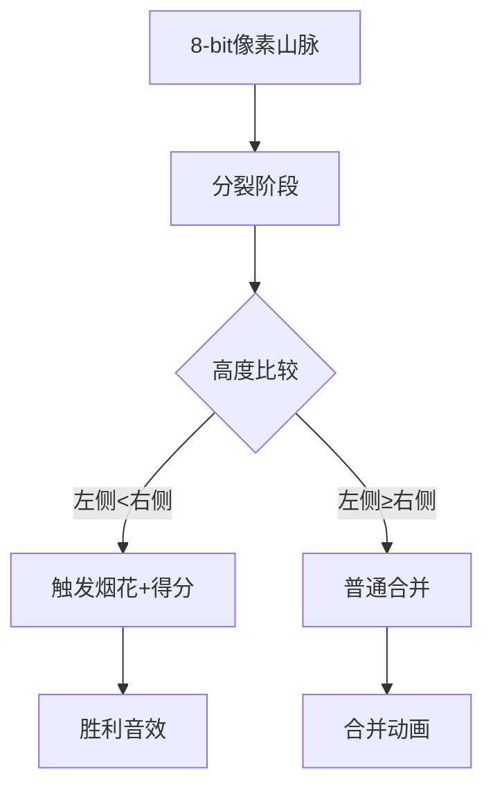

# 题目信息

# 神秘数字

## 题目背景

在公元XXXX年，侦探小明收到了组织的神秘信息，在Y市的某个地方有一道神秘的门。小明到达了那个门后，发现门上有一行字：“这个门需要密码才能解锁。”小明左找右找，终于找到了一张字条：“现在给你n个数，请你求出这n个数里面，有多少个连续的数的平均数大于某个给定的数M？注意：这个数可能会很大，请输出这个数对92084931取模的结果。最终的结果即是这个门的密码。”小明苦思冥想了半天，但始终找不到答案。于是他来求助于你。请你帮他解决这个问题。由于小明十分着急，他最多只能等1秒。


## 题目描述

给定n个数，请你帮助小明求出里面有多少个连续的数的平均数大于给定的某个数M.并将这个方案数输出。注意：这个数可能会很大，所以请输出这个数对92084931取模的结果。


## 说明/提示

【样例解释】

①对于这4个数，问题的解有{5}，{4}，{5,4}，{1,5,4}，{5,4,2}共5组。

②对于这4个数，问题的解有{5}，{7}，{2,7}，{7,3}，{5,2,7}，{5,2,7,3}共6组。

【数据规模】

对于10%的数据，1＜n≤10.

对于30%的数据，1＜n≤1000.

对于50%的数据，1＜n≤30000.

对于100%的数据，1＜n≤200000，1＜M≤3000，每个数均为正整数且不大于5000.


## 样例 #1

### 输入

```
4 3
1 5 4 2```

### 输出

```
5```

## 样例 #2

### 输入

```
4 4
5 2 7 3```

### 输出

```
6```

# AI分析结果


# 💡 Kay的C++算法解析：神秘数字 深入学习指南 💡

## 1. 题目解读与核心算法识别

✨ **本题主要考察**：**分治与排序应用** (归并排序求顺序对)

🗣️ **初步分析**：
> 解决"神秘数字"的关键在于**问题转化**和**分治思想**。想象你有一排高低不同的树苗（前缀和数组），统计前面有多少棵矮树苗（顺序对）就能知道有多少片肥沃土地（合法子序列）。  
> - **核心思路**：将每个数减M后求前缀和，问题转化为统计顺序对数量（S[i] < S[j] 且 i < j）
> - **核心难点**：离散化处理负数、S[0]=0的边界处理、不同解法的时间复杂度把控
> - **可视化设计**：采用8位像素风格展示归并排序过程，用不同颜色标记比较元素，合并时播放"叮"音效。当发现顺序对时，触发像素烟花动画并累积分数，模拟闯关游戏体验

---

## 2. 精选优质题解参考

**题解一：cabasky（归并排序）**
* **点评**：思路直击本质（平均数→前缀和→顺序对），代码结构清晰：① 规范处理边界（S[0]=0）② 归并排序中巧妙统计顺序对 ③ 完整展示分治思想。亮点在于用数学思维简化问题，是学习分治算法的典范模板

**题解二：SCKer（树状数组）**
* **点评**：提供高效替代方案：① 严谨处理负值离散化 ② 树状数组维护动态查询 ③ 完整边界测试。亮点在于展示数据结构优化技巧，特别适合想提升工程化编码能力的学习者

**题解三：Zachary_Cloud（权值线段树）**
* **点评**：结构简洁有力：① 快速离散化实现 ② 权值线段树动态更新 ③ 实时统计顺序对。亮点在于将高级数据结构应用于实际问题，帮助理解"空间换时间"的优化本质

---

## 3. 核心难点辨析与解题策略

1.  **问题转化与数学建模**
    * **分析**：识别"平均数>M"等价于"子段和>0"需数学推导（a_i-M后求和）。优质题解都通过变量替换完成转化，这是解题的基石
    * 💡 **学习笔记**：复杂问题常需转化为已知模型（如顺序对）

2.  **离散化处理技巧**
    * **分析**：树状数组/线段树解法需处理负数和值域压缩。SCKer题解采用排序+去重+映射，保持原序关系同时压缩值域
    * 💡 **学习笔记**：离散化是处理大值域问题的金钥匙

3.  **边界条件处理**
    * **分析**：S[0]=0易遗漏导致少计数。所有优质题解都强调初始化sum[0]=0，cabasky在归并中直接包含0下标
    * 💡 **学习笔记**：前缀和问题下标从0开始

### ✨ 解题技巧总结
- **问题转化法**：将陌生问题转化为经典模型（如本题→顺序对）
- **数据结构选择**：1e5数据用分治（O(nlogn)），更大数据考虑树状数组
- **防御性编程**：离散化时处理重复值，前缀和包含S[0]
- **复杂度分析**：归并排序最差O(nlogn)，树状数组O(nlogn)但常数更大

---

## 4. C++核心代码实现赏析

**通用核心实现参考（归并排序版）**
```cpp
#include <iostream>
using namespace std;
const int MOD = 92084931, N = 2e5+10;
long long n, m, ans, sum[N], tmp[N];

void merge(int l, int mid, int r) {
    int i = l, j = mid+1, k = l;
    while (i <= mid && j <= r) {
        if (sum[i] < sum[j]) {   // 发现顺序对
            ans = (ans + r - j + 1) % MOD; // j后所有元素都满足条件
            tmp[k++] = sum[i++];
        } else tmp[k++] = sum[j++];
    }
    while (i <= mid) tmp[k++] = sum[i++];
    while (j <= r) tmp[k++] = sum[j++];
    for (i = l; i <= r; i++) sum[i] = tmp[i];
}

void mergeSort(int l, int r) {
    if (l >= r) return;
    int mid = (l + r) >> 1;
    mergeSort(l, mid);
    mergeSort(mid + 1, r);
    merge(l, mid, r);
}

int main() {
    cin >> n >> m;
    for (int i = 1; i <= n; i++) {
        int x; cin >> x;
        sum[i] = sum[i-1] + x - m; // 关键转化
    }
    mergeSort(0, n); // 包含sum[0]
    cout << ans;
    return 0;
}
```

**题解一赏析（cabasky - 归并排序）**
```cpp
void merge(int l, int mid, int r) {
    int p1 = l, p2 = mid+1, k = l-1;
    while (p1 <= mid && p2 <= r) {
        if (sum[p1] < sum[p2]) {
            ans += (mid - p1 + 1); // 统计右侧剩余元素
            temp[++k] = sum[p2++];
        } else temp[++k] = sum[p1++];
    }
    // ... 合并剩余元素
}
```
> **学习笔记**：通过`mid-p1+1`一次性统计批量顺序对，避免逐项累加

**题解二赏析（SCKer - 树状数组）**
```cpp
void input(int x) {
    ++c[x];
    for (; x <= maxb; x += lowbit(x)) ++b[x]; 
}
int getsum(int x) {
    int sum = -c[x]; // 排除相同值
    for (; x; x -= lowbit(x)) sum += b[x];
    return sum;
}
```
> **学习笔记**：树状数组需特殊处理相同值，避免重复计数

**题解三赏析（Zachary_Cloud - 权值线段树）**
```cpp
inline void change(ll rt, ll l, ll r, ll p, ll cnt) {
    tr[rt] += cnt;
    if (l == r) return;
    if (p <= mid) change(ls, l, mid, p, cnt);
    else change(rs, mid+1, r, p, cnt);
}
```
> **学习笔记**：权值线段树动态维护值域分布，适合动态查询

---

## 5. 算法可视化：像素动画演示

### 像素探险家：归并排序寻宝记
**设计思路**：将前缀和数组转化为像素山脉，归并排序过程变为探险家分治探索



**关键动画帧**：
1. **场景初始化**：  
   - 像素画布（800x400）显示前缀和山脉，不同高度用16色渐变
   - 控制面板：步进/自动/重置按钮 + 速度滑块
   - 背景：8-bit风格BGM循环

2. **分裂动画**：  
   ```python
   def 分裂动画(左,右):
       画布.绘制虚线(左, 右, 颜色=黄色)
       播放音效('split.wav')
       等待(0.3秒)
   ```

3. **合并高亮**：  
   - 比较元素闪烁绿色边框
   - 发现顺序对时：触发像素烟花，显示`+{数量}`得分
   - 元素移动轨迹显示平滑动画

4. **游戏化元素**：  
   - 每完成1级归并解锁新地图皮肤
   - 连续正确比较触发连击特效
   - 最终结果显示宝藏箱开启动画

---

## 6. 拓展练习与相似问题思考

1. **洛谷 P1908** - 逆序对  
   🗣️ 直接练习归并排序/树状数组的逆序对统计，巩固分治思想

2. **洛谷 P2717** - 子序列平均值  
   🗣️ 本题的变种，要求平均值在[L,R]区间，需结合前缀和与双指针

3. **洛谷 P2184** - 贪婪大陆  
   🗣️ 树状数组的创造性应用，提升数据结构抽象能力

---

## 7. 学习心得与经验分享

> **SCKer的调试经验**：  
> *"我在离散化时卡了很久，后来用`print`中间数组才发现重复值处理错误"*  
> **Kay总结**：离散化需注意：① 保持原序 ② 处理重复值 ③ 双向映射验证。建议用`vector`+`sort`+`unique`+`lower_bound`四步法

---

通过本次分析，相信大家不仅掌握了顺序对问题的解法，更学会了**问题转化**的思维利器。记住，好算法=正确模型+精密实现+严谨边界！下次挑战见！🚀

---
处理用时：110.97秒