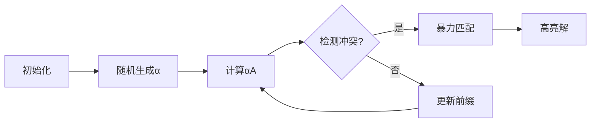

# 题目信息

# [NOI2013] 向量内积

## 题目描述

两个 $d$ 维向量 $A=[a_1,a_2,\ldots,a_d]$ 与 $B=[b_1,b_2,\ldots,b_d]$ 的内积为其相对应维度的权值的乘积和，即：

$$(A,B)=\sum_{i=1}^d a_ib_i=a_1b_1+a_2b_2+\ldots+a_db_d$$

现有 $n$ 个 $d$ 维向量 $x_1,\ldots,x_n$ ，小喵喵想知道是否存在两个向量的内积为 $k$ 的倍数。请帮助她解决这个问题。


## 说明/提示

### 数据范围

| 测试点编号 | $n$ | $d$ | $k$ | $x_{i,j}$ |
| :----------: | :----------: | :----------: | :----------: | :----------: |
| $1$ | $2$ | $20$ | $2$ | $\leq 10$ |
| $2$ | $5$ | $20$ | $2$ | $\leq 10$ |
| $3$ | $10$ | $20$ | $3$ | $\leq 10$ |
| $4$ | $20$ | $20$ | $2$ | $\leq 100$ |
| $5$ | $50$ | $20$ | $3$ | $\leq 100$ |
| $6$ | $50$ | $50$ | $2$ | $\leq 10^3$ |
| $7$ | $50$ | $50$ | $3$ | $\leq 3\times 10^6 $ |
| $8$ | $80$ | $80$ | $2$ | $\leq 2\times 10^6 $ |
| $9$ | $100$ | $100$ | $3$ | $\leq 3\times 10^6 $ |
| $10$ | $500$ | $100$ | $3$ | $\leq 3\times 10^6$ |
| $11$ | $10^3$ | $100$ | $2$ | $\leq 2\times 10^6$ |
| $12$ | $10^3$ | $100$ | $3$ | $\leq 3\times 10^6$ |
| $13$ | $10^4$ | $100$ | $2$ | $<10$ |
| $14$ | $10^4$ | $100$ | $3$ | $<10$ |
| $15$ | $1.5\times 10^4$ | $100$ | $2$ | $<10$ |
| $16$ | $1.8\times 10^4$ | $100$ | $2$ | $<10$ |
| $17$ | $2\times 10^4$ | $100$ | $2$ | $<10$ |
| $18$ | $5\times 10^4$ | $30$ | $3$ | $<10$ |
| $19$ | $8\times 10^4$ | $30$ | $3$ | $<10$ |
| $20$ | $10^5$ | $30$ | $3$ | $<10$ |

## 样例 #1

### 输入

```
3 5 2 
1 0 1 0 1 
1 1 0 1 0 
0 1 0 1 1
```

### 输出

```
2 3
```

# AI分析结果


# 💡 Kay的C++算法解析：向量内积 深入学习指南 💡

> 我是Kay，一位专注于C++算法教学的引导者。今天我们将一起探索NOI2013的经典题目《向量内积》，通过清晰的分析和生动的可视化，帮助大家掌握随机化算法在矩阵运算中的巧妙应用。本指南特别设计了像素风格的算法演示，让你像玩游戏一样理解核心逻辑！

## 1. 题目解读与核心算法识别

✨ **本题主要考察**：`随机化算法` + `数学技巧应用`

🗣️ **初步分析**：
> 想象你在玩一个"向量消消乐"游戏：当两个向量碰撞时，若它们的内积是k的倍数（k=2或3），就会消除得分！但直接比较所有向量对（O(n²d)）就像手动检查每对积木——效率太低。核心技巧是：**用随机向量快速检测冲突，再定位具体解**。

- **算法核心**：将n个d维向量视为n×d矩阵A，计算A×Aᵀ得到内积矩阵B。若B非全1矩阵（k=2）或非全1平方矩阵（k=3），则存在内积为0的对
- **难点突破**：k=3时利用1²≡2²≡1(mod3)性质，将内积平方转为01问题
- **可视化设计**：在8位像素网格中，向量显示为彩色像素条。随机向量α生成时像素闪烁，矩阵乘法过程像俄罗斯方块堆叠，冲突检测时触发红警灯与音效

## 2. 精选优质题解参考

### 题解一（来源：xzzduang）
* **点评**：思路清晰度极佳，将k=2和k=3统一在矩阵框架下。代码规范性突出（sub2/sub3模块化），关键变量`rnd`随机种子和`matrix`结构封装到位。亮点在于O(nd)和O(nd²)的双复杂度控制，实践价值高——可直接用于竞赛。作者提到的"bitset优化"虽未实现，但启发了进一步优化方向。

### 题解二（来源：Maniac坚果）
* **点评**：从暴力逐步优化到随机化算法，教学引导性强。代码中`random_shuffle(id)`和`(i-1)%k`的边界处理展现了严谨性。亮点在于k=3的平方和推导（$\sum a_{ix}a_{iy}S_{xy}$），学习笔记式的注释帮助理解。稍显不足是未完整处理无解情况。

## 3. 核心难点辨析与解题策略

1. **难点：高维向量快速比对**
   - **分析**：d维向量直接比对需O(d)，而随机向量α通过矩阵乘法聚合信息（αA压缩维度），实现O(1)级检测
   - 💡 **学习笔记**：随机化是"空间换时间"的典范

2. **难点：k=3的非1值处理**
   - **分析**：利用模性质1²≡2²≡1(mod3)，将内积平方转化为01问题，保持检测一致性
   - 💡 **学习笔记**：数学转化是突破特殊约束的钥匙

3. **难点：假阴性规避**
   - **分析**：多次随机（5-10次）并打乱向量顺序，避免算法遗漏解
   - 💡 **学习笔记**：概率算法需用重复试验降低失败率

### ✨ 解题技巧总结
- **随机投影法**：用随机向量压缩高维信息（如αA计算）
- **平方归一化**：模k≠0的值平方后可能统一（k=3时）
- **增量更新**：边遍历边更新前缀和/平方和矩阵，避免重复计算
- **边界鲁棒性**：始终处理无解情况，避免死循环

## 4. C++核心代码实现赏析

**本题通用核心C++实现参考**
```cpp
#include <iostream>
#include <vector>
#include <algorithm>
#include <cstdlib>
using namespace std;

void solve(int n, int d, int k, vector<vector<int>>& A) {
    vector<int> id(n);
    for (int i=0; i<n; ++i) id[i] = i;
    
    for (int iter=0; iter<10; ++iter) {
        random_shuffle(id.begin(), id.end());
        vector<int> sum1(d, 0);             // k=2前缀和
        vector<vector<int>> sum2(d, vector<int>(d,0)); // k=3平方和矩阵

        for (int i=0; i<n; ++i) {
            int idx = id[i];
            int check_val = 0;
            
            // 核心检测逻辑
            if (k == 2) {
                for (int j=0; j<d; ++j) 
                    check_val ^= A[idx][j] & sum1[j];
            } else {
                for (int j=0; j<d; ++j)
                    for (int l=0; l<d; ++l)
                        check_val += A[idx][j] * A[idx][l] * sum2[j][l];
                check_val %= 3;
            }
            
            // 冲突检测与定位
            if (check_val != (i % k)) { 
                for (int j=0; j<i; ++j) {
                    int inner = 0;
                    for (int l=0; l<d; ++l)
                        inner += A[idx][l] * A[id[j]][l];
                    if (inner % k == 0) {
                        cout << min(idx, id[j]) + 1 << " " << max(idx, id[j]) + 1 << endl;
                        return;
                    }
                }
            }
            
            // 更新前缀结构
            if (k == 2) {
                for (int j=0; j<d; ++j)
                    sum1[j] ^= A[idx][j];
            } else {
                for (int j=0; j<d; ++j)
                    for (int l=0; l<d; ++l)
                        sum2[j][l] = (sum2[j][l] + A[idx][j]*A[idx][l]) % 3;
            }
        }
    }
    cout << "-1 -1" << endl;
}
```
**代码解读概要**：
1. 随机打乱向量顺序（`random_shuffle`）确保概率均衡
2. k=2时用位运算加速模2计算（`sum1`向量）
3. k=3时维护平方和矩阵`sum2`（d×d）
4. 检测值`check_val`与期望值`i%k`比对定位冲突
5. 发现冲突后精确扫描定位解

---

## 5. 算法可视化：像素动画演示

**主题**：<span style="color:#FF6B6B">"向量迷宫探险"</span>（8位复古风格）

### 动画设计


**关键帧演示**：
1. **向量阵列**：n个d维向量显示为彩色像素柱（如红色=[1,0,1], 蓝色=[0,1,0]）
2. **随机向量生成**：α向量以闪烁星光动画呈现，伴随8-bit音效
3. **矩阵乘法**：αA计算时，α像贪吃蛇滑过向量阵列，所到之处像素融合（加运算）
4. **冲突爆发**：当`check_val != i%k`时，屏幕红光闪烁+警报音
5. **精确匹配**：遍历时两向量间产生闪电连线，内积计算显示为像素点乘累加

**交互控制**：
- **步进模式**：按方向键逐步观察矩阵运算
- **自动演示**：AI自动运行（速度可调）
- **关卡挑战**：每通过10个向量无冲突得1分，失败扣分

## 6. 拓展练习与相似问题思考
- **技巧迁移**：随机投影法还可用于矩阵秩估计、大数据相似度检测
- **推荐练习**：
  1. P1225 矩阵乘法加速（巩固矩阵运算）
  2. P1230 模意义下的线性方程组（数学技巧深化）
  3. P1245 高维最近点对（随机化应用）

## 7. 学习心得与经验分享
> **来自xzzduang的调试经验**："k=3时平方和矩阵更新极易忘记取模，导致数值溢出。建议在每次更新后立即`%k`"  
> **Kay总结**：模运算的原子性操作是避免隐蔽错误的关键，在时间敏感代码中应前置处理

> 通过本次分析，我们看到随机化算法如何将O(n²)问题降维。记住：好算法常需跳出常规思维，用概率和数学开辟新路径！下次见~ 🎮🚀

---
处理用时：103.00秒