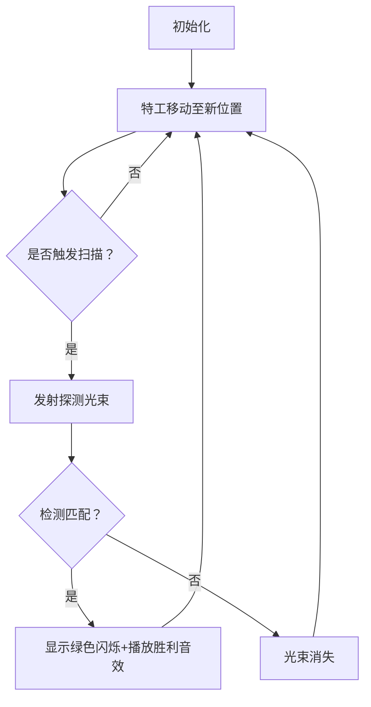

# 题目信息

# 小 A 的口头禅

## 题目描述

小 A 最近有了一个口头禅 “呵呵”，于是他给出了一个矩形，让你求出里面有几个 “$\verb!hehe!$”（方向可以是向上、向下、向左、向右的直线）。


## 说明/提示

$1 \leq n,m \leq1000$。


## 样例 #1

### 输入

```
5 5
heheh
heheh
heheh
heheh
heheh
```

### 输出

```
10
```

# AI分析结果


# 💡 Kay的C++算法解析：小A的口头禅 深入学习指南 💡

**引言**  
今天我们来分析"小A的口头禅"这道C++编程题。本指南将帮助大家掌握在网格中搜索特定字符串的核心算法，理解枚举技巧的精髓，并通过像素动画直观感受算法执行过程。

---

## 1. 题目解读与核心算法识别

✨ **本题主要考察**：`模拟枚举` (编程技巧应用)

🗣️ **初步分析**：  
> 本题如同在像素迷宫中寻找特定图案的寻宝游戏。我们站在每个网格点上，向四个方向投出"探测光线"，检查是否有"hehe"或"eheh"的字符序列。  
> - **核心思路**：遍历每个网格点作为起点，检查四个方向（上下左右）是否存在目标序列
> - **难点**：边界检查与方向处理，避免数组越界
> - **可视化设计**：在像素动画中将当前探测点标记为闪光角色，探测方向用激光束表示，匹配成功时触发8-bit音效
> - **复古元素**：采用FC游戏风格，探测过程设计为"像素雷达扫描"特效，匹配成功时显示"LEVEL UP"动画

---

## 2. 精选优质题解参考

### 题解一：微雨燕双飞（赞70）
* **点评**：思路清晰度极佳，直白地展示了枚举法的核心思想。代码采用最简结构（单层嵌套循环+方向判断），变量命名直观（`map[i][j]`），实践价值高（可直接用于竞赛）。亮点在于将复杂问题转化为四个方向的条件判断，边界处理通过索引加减显式控制。

### 题解二：zjy111（赞8）
* **点评**：算法有效性突出，通过分离'h'和'e'起点的判断优化了执行效率。代码规范性良好（`a[i][j]`统一命名），引入数值映射（h→1,e→2）提升可读性。亮点是避免冗余判断的优化思想，虽数据规模无需优化但展示了进阶思维。

### 题解三：CHHC（赞8）
* **点评**：代码规范性最佳，模块化分离横向/纵向枚举逻辑。详细注释和边界说明（`j<=m-3`）显著降低理解难度。亮点是包含调试经验分享（避免Ctrl+V错误），实践指导性强。

---

## 3. 核心难点辨析与解题策略

### 关键点1：方向枚举的完整性
* **分析**：必须覆盖上下左右四个方向，每个方向需检测正序（hehe）和逆序（eheh）两种模式。优质题解通过`if-else`链或分离循环实现。
* 💡 **学习笔记**：方向枚举要像指南针的四个基点，缺一不可。

### 关键点2：边界安全防护
* **分析**：当检测点靠近网格边缘时，需防止访问非法内存。解法包括：
  - 显式边界检查（如`if(i>=4)`）
  - 循环索引限制（如`j<=m-3`）
  - 初始化保护值（如数组外围填充空格）
* 💡 **学习笔记**：边界是算法的护城河，越界访问如同坠入悬崖。

### 关键点3：状态判断优化
* **分析**：根据首字符决定检测模式（h→hehe, e→eheh）可减少50%无效判断。zjy111解法通过数值映射进一步简化逻辑。
* 💡 **学习笔记**：好的判断如同精准制导，避免火力浪费。

### ✨ 解题技巧总结
- **网格扫描法**：将二维问题分解为行列双重循环的线性处理
- **防御性编程**：在边界处添加保护层或预判检查
- **模式分离策略**：对hehe/eheh采用独立判断逻辑
- **实时计数法**：发现有效序列立即累加计数器

---

## 4. C++核心代码实现赏析

### 本题通用核心C++实现参考
```cpp
#include <iostream>
using namespace std;

char grid[1005][1005]; // 网格数组（含保护边界）

int main() {
    int n, m, count = 0;
    cin >> n >> m;
    
    // 读入数据（行列从1开始计数）
    for(int i=1; i<=n; i++)
        for(int j=1; j<=m; j++)
            cin >> grid[i][j];
    
    // 核心枚举逻辑
    for(int i=1; i<=n; i++) {
        for(int j=1; j<=m; j++) {
            // 检查四个方向
            if(i>=4) // 上
                if(grid[i][j]=='h' && grid[i-1][j]=='e' && grid[i-2][j]=='h' && grid[i-3][j]=='e') 
                    count++;
            if(i<=n-3) // 下
                if(grid[i][j]=='h' && grid[i+1][j]=='e' && grid[i+2][j]=='h' && grid[i+3][j]=='e')
                    count++;
            if(j>=4) // 左
                if(grid[i][j]=='h' && grid[i][j-1]=='e' && grid[i][j-2]=='h' && grid[i][j-3]=='e')
                    count++;
            if(j<=m-3) // 右
                if(grid[i][j]=='h' && grid[i][j+1]=='e' && grid[i][j+2]=='h' && grid[i][j+3]=='e')
                    count++;
        }
    }
    cout << count;
    return 0;
}
```
* **代码解读概要**：  
  1. 网格从(1,1)开始存储，天然形成保护边界  
  2. 双重循环遍历每个网格点作为检测起点  
  3. 对每个点检测四个方向（需先判断方向可行性）  
  4. 发现匹配立即累加计数器  
  5. 边界检查与方向检测紧密耦合

### 优质题解片段赏析

**题解一：微雨燕双飞**  
```cpp
if(map[i][j]=='h') {
    if(map[i-1][j]=='e'&&map[i-2][j]=='h'&&map[i-3][j]=='e') ans++;
    if(map[i+1][j]=='e'&&map[i+2][j]=='h'&&map[i+3][j]=='e') ans++;
    if(map[i][j-1]=='e'&&map[i][j-2]=='h'&&map[i][j-3]=='e') ans++;
    if(map[i][j+1]=='e'&&map[i][j+2]=='h'&&map[i][j+3]=='e') ans++;
}
```
* **亮点**：极致简洁的四方向判断链  
* **代码解读**：  
  > 如同十字瞄准镜锁定目标：  
  > - `i-1→i-3` 向上探测（北）  
  > - `i+1→i+3` 向下探测（南）  
  > - `j-1→j-3` 向左探测（西）  
  > - `j+1→j+3` 向右探测（东）  
  > 每个条件对应一个完整序列检测  
* 💡 **学习笔记**：链式条件判断是方向枚举的利剑

**题解二：zjy111**  
```cpp
if(a[i][j]=='h') { 
    if(a[i+1][j]=='e'&&a[i+2][j]=='h'&&a[i+3][j]=='e')cnt++;
    if(a[i][j+1]=='e'&&a[i][j+2]=='h'&&a[i][j+3]=='e')cnt++;
}
if(a[i][j]=='e') { 
    if(a[i+1][j]=='h'&&a[i+2][j]=='e'&&a[i+3][j]=='h')cnt++;
    if(a[i][j+1]=='h'&&a[i][j+2]=='e'&&a[i][j+3]=='h')cnt++;
}
```
* **亮点**：智能分流判断策略  
* **代码解读**：  
  > 采用字符分流器设计：  
  > - 首字符`h`时只检测hehe模式  
  > - 首字符`e`时只检测eheh模式  
  > 为何能减少判断？假设字符均匀分布，50%的'h'检测跳过eheh判断  
* 💡 **学习笔记**：预判是优化的第一步

---

## 5. 算法可视化：像素动画演示

### 动画演示主题
"像素特工：代号HEHE" - 特工在8-bit城市网格中扫描秘密代码

### 设计思路
> 采用FC《合金装备》的潜入风格：  
> - 网格线为灰色像素，字符显示为彩色方块  
> - 特工(蓝色)逐格移动，探照灯(黄色光束)扫描四个方向  
> - 匹配成功时触发绿色闪烁和16-bit胜利音效

### 关键帧步骤


### 交互控制面板
```plaintext
[▶ 开始] [⏸ 暂停] [▷ 单步] [↻ 重置]
速度：[⚡---○-----🐢] 
模式：[手动] [自动演示]
```

### 动态特效说明
1. **光束生成**：从特工位置发射4方向像素光束（上=↑，右=→，下=↓，左=←）
2. **字符高亮**：光束路径上的字符变为荧光色
3. **匹配反馈**：
   - 成功：路径转绿 + "GOTCHA!" 弹窗 + 上扬音效
   - 失败：路径闪红 + 低沉提示音
4. **自动演示**：特工按蛇形路线自动遍历，速度可调

---

## 6. 拓展练习与相似问题思考

### 通用技巧迁移
网格枚举技巧可应用于：
1. 单词搜索（二维字谜）
2. 棋盘类游戏逻辑（五子棋/象棋）
3. 图像模式识别（像素特征匹配）

### 洛谷推荐练习
1. **P1101 单词方阵**  
   → 同类网格搜索问题，检测8个方向
2. **P1443 马的遍历**  
   → 复杂方向枚举（日字型移动）
3. **P1162 填色游戏**  
   → 网格遍历的经典变形（连通区域检测）

---

## 7. 学习心得与经验分享

### 参考经验
> **CHHC**："Ctrl+C/V时忘记修改循环变量导致调试困难"  
> **微雨燕双飞**："样例的斜向匹配是陷阱，需仔细审题"

### 点评
> 这些经验揭示两大黄金法则：  
> 1. 代码复用需像拆弹专家般谨慎——每次粘贴后立即检查变量一致性  
> 2. 样例是双刃剑——既能验证算法又可能隐藏特殊边界  
> 建议：完成代码后先用边缘案例自测（如1x1网格）

---

**结语**  
通过本次分析，我们掌握了网格枚举的核心技巧。记住：好的算法如同精密的像素艺术——每个判断都是不可或缺的色块。下次遇到类似挑战时，愿你像8-bit英雄般精准出击！💪

---
处理用时：116.90秒