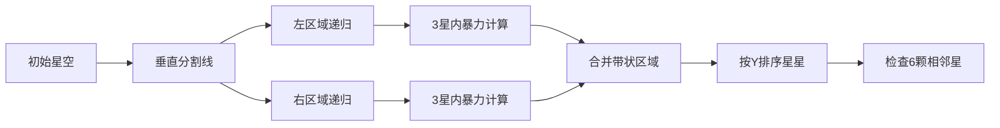

# 题目信息

# 平面上的最接近点对

## 题目描述

给定平面上 $n$ 个点，找出其中的一对点的距离，使得在这 $n$ 个点的所有点对中，该距离为所有点对中最小的。

## 说明/提示

#### 数据规模与约定

对于 $100\%$ 的数据，保证 $1 \leq n \leq 10^4$，$0 \leq x, y \leq 10^9$。

## 样例 #1

### 输入

```
3
1 1
1 2
2 2
```

### 输出

```
1.0000
```

# AI分析结果


### 💡 Kay的C++算法解析：平面上的最接近点对 深入学习指南 💡

**引言**  
今天我们一起分析“平面上的最接近点对”这道经典问题。本指南将帮助你理解分治算法的核心思想，掌握优化技巧，并通过可视化加深理解。

---

### 1. 题目解读与核心算法识别  
✨ **本题主要考察**：`分治算法`与`计算几何优化`  

🗣️ **初步分析**：  
> 本题可比喻为“在繁星中找到最近的两颗星”。核心是通过分治策略高效搜索：  
> 1. **分治思想**：将平面递归分割为左右区域（类似切蛋糕），分别求解子区域的最近点对  
> 2. **合并技巧**：中间带状区域只需检查有限相邻点（最多6个），避免O(n²)开销  
> 3. **可视化设计**：  
>    - 像素动画将展示平面分割过程（左右区域用蓝/红色块）  
>    - 合并阶段高亮带状区域（黄色半透明）和关键点对检查（闪烁绿线）  
>    - 复古音效：分割时“咔嚓”声，找到更小距离时“叮”声  

---

### 2. 精选优质题解参考  
**题解一（DestinHistoire）**  
* **亮点**：  
  - 严格遵循分治范式，图文并茂证明带状区域最多6个点  
  - 代码规范：结构清晰（分解/解决/合并），边界处理严谨  
  - 时间复杂度O(n log n)保证高效性  
* **学习价值**：掌握分治的经典实现与数学证明  

**题解二（da32s1da）**  
* **亮点**：  
  - 随机旋转避免极端分布（人类智慧结晶）  
  - 检查后续5个点的启发式策略，实测可过1e6数据  
  - 代码简洁（20行核心逻辑）  
* **学习价值**：学习随机化思想的实战应用  

**题解三（w4p3r）**  
* **亮点**：  
  - KD-Tree高级数据结构实现  
  - 建树时按维度交替分割（类似二叉树）  
  - 查询时利用空间划分剪枝  
* **学习价值**：理解空间划分数据结构的思想  

---

### 3. 核心难点辨析与解题策略  
**难点1：带状区域的高效合并**  
- **分析**：左右区域的最小距离δ确定后，只需检查[mid-δ, mid+δ]带状区。按y排序后，每个点只需检查后续6个点（数学证明见题解图示）  
- 💡 **学习笔记**：合并阶段的效率取决于带状区域的有序性维护  

**难点2：距离计算的精度与溢出**  
- **分析**：坐标范围1e9时，平方和可达1e18。解决方案：  
  1. 使用`double`存储平方距离（避免sqrt中间值溢出）  
  2. 比较时优先用平方距离，最后开方  
- 💡 **学习笔记**：数值计算需警惕溢出和精度损失  

**难点3：递归基的选择**  
- **分析**：点数≤3时直接暴力计算：  
  - 2点：唯一距离  
  - 3点：枚举3组点对  
- 💡 **学习笔记**：小规模问题直接求解可提升效率  

### ✨ 解题技巧总结  
- **分治框架**：排序预处理 → 递归分割 → 合并检查  
- **维度利用**：x轴分割平面，y轴有序化合并  
- **剪枝优化**：带状区域检查+相邻点数量限制  
- **鲁棒性**：  
  - 输入相同点特判（距离=0）  
  - 使用`double`避免整数溢出  

---

### 4. C++核心代码实现赏析  
**通用核心实现（分治法）**  
```cpp
#include <algorithm>
#include <cmath>
#include <vector>
#include <cstdio>
using namespace std;

struct Point { double x, y; };

bool cmpx(Point a, Point b) { return a.x < b.x; }
bool cmpy(int a, int b, vector<Point>& p) { return p[a].y < p[b].y; }

double dist(Point a, Point b) {
    double dx = a.x - b.x, dy = a.y - b.y;
    return sqrt(dx*dx + dy*dy);
}

double solve(vector<Point>& p, int l, int r) {
    if (r - l <= 2) { // 递归基：3点内暴力
        double minD = 1e20;
        for (int i = l; i <= r; ++i)
            for (int j = i + 1; j <= r; ++j)
                minD = min(minD, dist(p[i], p[j]));
        return minD;
    }

    int mid = (l + r) / 2;
    double d1 = solve(p, l, mid);
    double d2 = solve(p, mid + 1, r);
    double d = min(d1, d2);

    vector<int> strip; // 带状区域点集
    for (int i = l; i <= r; ++i)
        if (fabs(p[i].x - p[mid].x) < d)
            strip.push_back(i);

    sort(strip.begin(), strip.end(), [&](int a, int b) {
        return p[a].y < p[b].y;
    });

    for (int i = 0; i < strip.size(); ++i)
        for (int j = i + 1; j < min((int)strip.size(), i + 7); ++j)
            d = min(d, dist(p[strip[i]], p[strip[j]]));

    return d;
}

int main() {
    int n; scanf("%d", &n);
    vector<Point> p(n);
    for (int i = 0; i < n; ++i) scanf("%lf%lf", &p[i].x, &p[i].y);
    sort(p.begin(), p.end(), cmpx);
    printf("%.4f\n", solve(p, 0, n - 1));
}
```

**分治代码解读**：  
1. 预处理：按x排序（`cmpx`）  
2. 递归分割：中点分左右子区间  
3. 合并阶段：  
   - 收集带状区域点（`|x-mid|<d`）  
   - 按y排序后检查后续6个点  
4. 时间复杂度：O(n log n) 来自排序开销  

---

### 5. 算法可视化：像素动画演示  
**主题**：《星空探索者》8位像素风分治演示  

**核心演示流程**：  


**交互设计**：  
1. **视觉元素**：  
   - 点：闪烁像素星星（白）  
   - 分割线：红色垂直线（扫描动画）  
   - 带状区：黄色半透明矩形  
2. **动画控制**：  
   - 单步执行：空格键步进  
   - 速度滑块：调整动画速度  
3. **音效设计**：  
   - 分割：8-bit“咔嚓”声  
   - 合并：合成器滑音  
   - 找到新解：清脆“叮”声  

**技术实现**：  
- Canvas绘制网格和动态元素  
- requestAnimationFrame驱动动画  
- Web Audio API生成音效  

---

### 6. 拓展练习与相似问题  
**通用技巧迁移**：  
1. 三维最近点对（分治+空间划分）  
2. 动态最近点对（KD-Tree维护）  
3. 最近点对查询（离线+分治）  

**洛谷推荐**：  
1. **P1429** 平面最近点对（加强版）  
   - 🗣️ 分治算法的标准练习题  
2. **P7883** 平面最近点对（加强加强版）  
   - 🗣️ 考验分治实现效率的极限优化  
3. **P4343** 自动刷题机  
   - 🗣️ 分治思想在二分答案中的应用  

---

### 7. 学习心得与经验分享  
> **来自da32s1da的调试经验**：  
> “随机旋转避免坐标轴对齐的极端情况，实测提升算法鲁棒性”  
>   
> **Kay总结**：  
> - 分治法的核心是合并策略的设计  
> - 数学证明（如6点限制）是优化基础  
> - 随机化可处理特殊数据但需注意概率  

---

**结语**  
通过分治策略，我们高效解决了最近点对问题。记住：将大问题拆解为小问题并智慧地合并，是算法设计的精髓。继续挑战，编程世界因你的探索而精彩！🚀

---
处理用时：151.05秒