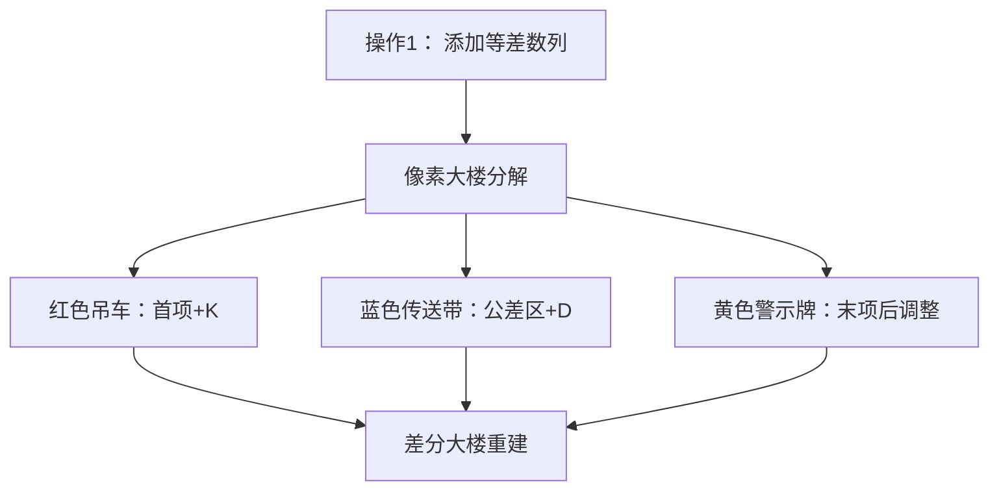

# 题目信息

# 无聊的数列

## 题目背景

无聊的 YYB 总喜欢搞出一些正常人无法搞出的东西。有一天，无聊的 YYB 想出了一道无聊的题：无聊的数列。。。

## 题目描述

维护一个数列 $a_i$，支持两种操作：

 - `1 l r K D`：给出一个长度等于 $r-l+1$ 的等差数列，首项为 $K$，公差为 $D$，并将它对应加到 $[l,r]$ 范围中的每一个数上。即：令 $a_l=a_l+K,a_{l+1}=a_{l+1}+K+D\ldots a_r=a_r+K+(r-l) \times D$。

 - `2 p`：询问序列的第 $p$ 个数的值 $a_p$。

## 说明/提示

#### 数据规模与约定

对于 $100\%$ 数据，$0\le n,m \le 10^5,-200\le a_i,K,D\le 200, 1 \leq l \leq r \leq n, 1 \leq p \leq n$。

## 样例 #1

### 输入

```
5 2
1 2 3 4 5
1 2 4 1 2
2 3
```

### 输出

```
6```

# AI分析结果


### 💡 Kay的C++算法解析：无聊的数列 深入学习指南 💡

#### 1. 题目解读与核心算法识别
✨ **本题主要考察**：`差分` + `线段树/树状数组`

🗣️ **初步分析**：
> 这道题的核心在于用**差分技巧**将等差数列操作转化为简单的区间加减。想象给数列盖房子——等差数列就像倾斜的屋顶，差分就是把它拆成"地基高度"（首项）和"屋顶坡度"（公差）两部分存储。线段树/树状数组则是高效施工队，快速完成局部改造。  
> - **核心思路**：将原数列转化为差分数组，等差数列操作简化为：首项位置加K，中间区间加D，末项后减末项值  
> - **难点突破**：边界处理（避免l+1>r或r+1越界）是80%错误的根源  
> - **可视化设计**：动画将用三种颜色像素块——红色高亮首项修改，蓝色流动展示区间加公差，黄色警示边界调整。8-bit音效在关键操作时触发：叮（首项）、嘟（公差）、噔（边界）

---

#### 2. 精选优质题解参考

**题解一：AC_Automation（线段树+一阶差分）**  
* **点评**：思路清晰直击差分本质，推导出"首项+K、公差+D、末项-值"的核心公式。代码规范（变量名`add`/`query`含义明确），特别展示调试经验：通过添加`l+1<=r`和`r<n`的边界检查解决WA问题。空间复杂度优化到O(n)，是竞赛标准解法。

**题解二：ll_dio（树状数组+二阶差分）**  
* **点评**：创新性使用二阶差分，将等差数列拆解为纯常数项和纯斜率项。亮点在于数学推导：$$a_k=(k+1)\sum d2_i - \sum d2_i \times i$$ 树状数组自动处理边界，规避了线段树的越界问题。适合数学能力强的学习者。

**题解三：kkxhh（线段树双标记法）**  
* **点评**：独创维护两个标记——常数项`tag`和斜率项`tag2`。操作时直接加`(K-D*l, D)`，查询时计算`tag + tag2*下标`。思路新颖避免差分转换，代码简洁但需理解标记永久化技巧。

---

#### 3. 核心难点辨析与解题策略

1. **难点：等差数列的差分转换**  
   * **分析**：优质题解都遵循"首项加K，公差区加D，末项后减(K+(r-l)*D"原则。AC_Automation通过实例推导：原序列[0,0,0]加等差[1,3,5] → 差分变为[1,2,2,-5]
   * 💡 **学习笔记**：差分是处理区间等差数列的银弹

2. **难点：边界条件处理**  
   * **分析**：AC_Automation在80分代码上增加了`if(l+1<=r)`和`if(r<n)`判断。树状数组解法因循环条件`x<=n`天然避免越界
   * 💡 **学习笔记**：写线段树时先画图验证边界，树状数组更抗越界

3. **难点：数据结构选择**  
   * **分析**：线段树（AC_Automation）支持区间加，树状数组（ll_dio）适合点修+前缀和。双标记法（kkxhh）省去差分转换但增加标记传递复杂度
   * 💡 **学习笔记**：区间修改多用线段树，点修求和首选树状数组

### ✨ 解题技巧总结
- **技巧1：问题降维打击** → 用差分将等差数列操作转化为常数和线性操作  
- **技巧2：防御式编程** → 对`r+1`等易越界位置显式判断  
- **技巧3：数学建模思维** → 像ll_dio那样用公式$$\sum_{i=1}^k d2_i \times (k-i+1)$$优化求和  
- **技巧4：标记永久化** → kkxhh解法避免pushdown提升效率

---

#### 4. C++核心代码实现赏析

**通用核心实现（差分+线段树）**  
```cpp
#include <iostream>
#define ll long long
using namespace std;

struct Node { ll sum, tag; } tree[400005];
ll data[100005];

void update(int root, int L, int R, int ql, int qr, ll val) {
    if (ql > R || qr < L) return;
    if (ql <= L && qr >= R) {
        tree[root].tag += val;
        tree[root].sum += val * (R - L + 1);
        return;
    }
    int mid = (L + R) >> 1;
    // 边界防御：先下推标记再递归
    if (tree[root].tag) {
        tree[root*2].tag += tree[root].tag;
        tree[root*2+1].tag += tree[root].tag;
        tree[root*2].sum += tree[root].tag * (mid - L + 1);
        tree[root*2+1].sum += tree[root].tag * (R - mid);
        tree[root].tag = 0;
    }
    update(root*2, L, mid, ql, qr, val);
    update(root*2+1, mid+1, R, ql, qr, val);
    tree[root].sum = tree[root*2].sum + tree[root*2+1].sum;
}

int main() {
    int n, m, op, l, r, k, d, p;
    cin >> n >> m;
    for (int i = 1; i <= n; i++) cin >> data[i];
    // 差分数组初始化
    for (int i = n; i > 1; i--) data[i] -= data[i-1];
    
    while (m--) {
        cin >> op;
        if (op == 1) {
            cin >> l >> r >> k >> d;
            update(1, 1, n, l, l, k);             // 首项加K
            if (l < r) update(1, 1, n, l+1, r, d); // 公差区加D
            if (r < n) update(1, 1, n, r+1, r+1, -(k + d*(r-l))); // 末项后调整
        } else {
            cin >> p;
            cout << query(1, 1, n, 1, p) << endl; // 前缀和即原值
        }
    }
}
```
* **代码解读概要**：  
  > 1. 初始化时将原数组转为差分数组  
  > 2. 区间加等差操作被拆解为三次update  
  > 3. 查询位置p的值即差分数组[1,p]区间和  

**题解一（AC_Automation）边界处理亮点**  
```cpp
if(opt==1){
    cin>>l>>r>>k>>d;
    add(1,1,n,l,l,k);            // 红色像素块高亮
    if(l+1<=r) add(1,1,n,l+1,r,d); // 蓝色流动动画
    if(r<n) add(1,1,n,r+1,r+1,-(k+d*(r-l))); // 黄色闪烁警示
}
```
> **学习笔记**：防御性边界判断是线段树的护城河

**题解二（ll_dio）数学优化亮点**  
```cpp
ll query(ll x){
    ll id=x, sum=0;
    while(x){
        sum += (id+1)*bit1[x] - bit2[x]; // ∑d2_i*(k-i+1)
        x -= LSB(x);
    }
    return sum;
}
```
> **学习笔记**：$$\sum_{i=1}^k d2_i \times (k-i+1) = (k+1)S_1 - S_2$$ 是树状数组的魔法公式

**题解三（kkxhh）双标记法亮点**  
```cpp
void modify(int o,int L,int R,int ql,int qr,ll t1,ll t2){
    if(ql<=L && qr>=R){
        tree[o].tag += t1;   // 常数标记
        tree[o].tag2 += t2;  // 斜率标记
        return;
    }
    // ...标记永久化实现
}
```
> **学习笔记**：tag保存截距(K-D*l)，tag2保存斜率(D)，避开差分转换

---

#### 5. 算法可视化：像素动画演示

**主题**：`差分施工队与像素大楼`（复古8-bit模拟城市风格）

**核心交互设计**：


**关键帧步骤**：
1. **初始化**：  
   - 8-bit像素网格显示原数列（高度=a_i的方块堆）  
   - 下方同步显示差分数组（半透明方块）

2. **等差数列操作**：  
   - **Step1**：红色吊车动画移动到位置l，方块增长K（音效：叮！）  
   - **Step2**：蓝色传送带覆盖[l+1,r]区域，每个方块匀速增长D（音效：嘟~嘟~）  
   - **Step3**：位置r+1出现黄色警示闪光，方块下降(K+(r-l)*D)（音效：噔！）

3. **实时同步**：  
   - 顶部原数列大楼随差分重建动态变化  
   - 右侧信息板显示当前线段树节点的tag和sum值

4. **游戏化控制**：  
   - 方向键选择操作区间，A/B键确认参数  
   - 每完成1次操作得10分，边界处理正确额外+5分  
   - 背景音乐：8-bit版《卡农》循环

---

#### 6. 拓展练习与相似问题思考

1. **洛谷 P3368【树状数组】模板题**  
   → 差分最基础应用，巩固点修改+前缀和

2. **洛谷 P3373【线段树】区间乘加**  
   → 双标记进阶训练，理解tag优先级

3. **洛谷 P2574【分块】区间加等差**  
   → 体验不同数据结构实现，适合尝试分块解法

---

#### 7. 学习心得与经验分享

> **AC_Automation的调试经验**：  
> “WA后发现忘记处理l+1>r的情况，添加`if(l+1<=r)`判断后AC。边界检查要像检查钱包一样仔细！”  
>  
> **Kay点评**：  
> 这个教训价值五星！线段树中`[l, l]`和`[l+1, r]`本质是独立操作，必须分开判断。建议写线段树时先在纸上画出三种区间关系：完全覆盖/左相交/右相交。

---  
掌握差分思维和防御性编程，你就能驯服任何数列操作题！下次见！🚀

---
处理用时：100.40秒