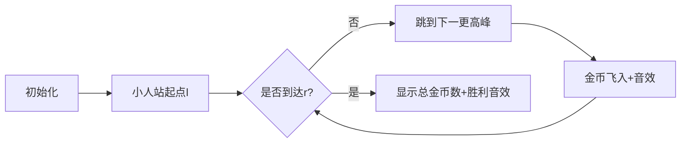

# 题目信息

# Mivik的神力

## 题目背景

$\textcolor{black}{\text{M}} \textcolor{red}{\text{ivik}}$发怒了，机房的$\textcolor{grey}{\text{deco}}$瑟瑟发抖

## 题目描述

$\textcolor{black}{\text{M}} \textcolor{red}{\text{ivik}}$要写一篇文章，在写文章时，他有$n$个备选的单词，第$i$个单词有一个长度$a_i$，$\textcolor{black}{\text{M}} \textcolor{red}{\text{ivik}}$可以选择从第$i$个单词开始写作，一共写$k$秒，第$j$秒会写上第$i+j-1(j\in[1,k])$个单词，并且他在写作时每秒都会获得愉悦值，第$j$秒的愉悦值为$max_{l=i}^{i+j-1} a_l$，现在，请你帮他算出，他每一次写作获得的愉悦值之和

**一句话题意：给出一个序列和多组询问 $(l,q)$ ，求**

$$
\sum_{i=l}^{l+q-1} \max_{l\le j\le i}a_j
$$

**数据要求强制在线**

## 说明/提示

**样例解释**

第一个询问 $1,1$，解密后得到 $l=2,q=1$ ，则按题意可得所求即为区间 $[2,2]$ 的最大值，为 $2$

第一个询问 $1,2$ ，解密后得到 $l=1,q=2$ ，则所求即为区间 $[1,1]$ 和区间 $[1,2]$ 的最大值之和，为 $3$

-----

对于$20\%$的数据，$n \leq 1000$，$t \leq 1000$

对于$100\%$的数据，$n\leq 500000$，$t\leq 500000$，$1 \leq a_i\leq 10^9(i\in [1,n])$

## 样例 #1

### 输入

```
3 2
1 2 3
1 1
1 2```

### 输出

```
2
3```

# AI分析结果


# 💡 Kay的C++算法解析：Mivik的神力 深入学习指南 💡

> 大家好，我是你们的算法导师Kay！今天我们将一起探索「Mivik的神力」这道看似复杂实则精妙的序列问题。我会用清晰的解释和生动的可视化方案，帮助大家掌握其核心算法思想。准备好了吗？让我们开始吧！

## 1. 题目解读与核心算法识别

✨ **本题主要考察**：`单调栈与倍增优化`（或`树形结构转化`）

🗣️ **初步分析**：
> 这道题就像在一条山脉中探险：每个山峰高度是a[i]，从起点l出发，需要计算途径每个位置时所见最高峰的愉悦值之和。关键在于快速跳过"低洼地带"，直接统计高峰的统治范围。

- **核心思路**：预处理每个位置后第一个更高位置（next数组），将序列转化为树/链结构。查询时从起点跳跃统计贡献，直到区间结束。
- **核心难点**：避免暴力跳跃的O(n)复杂度，需用倍增或树上前缀和优化至O(log n)。
- **可视化设计**：采用8-bit像素风格，小人沿山脉跳跃收集金币（贡献值），每次跳到更高峰时播放"叮"音效，到达终点播放胜利音效。自动演示模式像经典平台游戏！

---

## 2. 精选优质题解参考

**题解一：Froggy（倍增法）**
* **点评**：思路清晰展现了"跳跃-统计"的完整逻辑。代码规范（如nxt/f数组含义明确），利用倍增将暴力跳跃优化为O(log n)。亮点在于用单调栈预处理后继关系后，通过f[i][j]精妙存储跳跃2^j步的贡献和。边界处理严谨，可直接用于竞赛。

**题解二：Mivik（树形结构法）**
* **点评**：创新性地将序列转化为树结构（next为父指针）。通过ST表快速定位区间最大值位置，利用树上前缀和O(1)计算路径贡献。亮点是结合两种数据结构优势，理论复杂度最优，树形思想极具启发性。

**题解三：decoqwq（树形结构法）**
* **点评**：与Mivik思路类似但更侧重理论分析，指出可用01RMQ优化ST表。虽未提供完整代码，但树上前缀和的应用思路描述清晰，对理解问题本质很有帮助。

---

## 3. 核心难点辨析与解题策略

### ✨ 三大核心难点
1. **如何避免重复计算？**  
   *分析*：发现区间最大值会"统治"后续区域直到更高值出现。优质解用单调栈预处理next数组标记统治边界。
   *💡学习笔记*：单调栈是处理"下一个更大元素"的利器！

2. **如何加速跳跃过程？**  
   *分析*：Froggy通过倍增数组(nxt[i][j])实现指数级跳跃；Mivik转化为树形结构后用LCA思想加速。
   *💡学习笔记*：当问题链式结构时，倍增或树剖是优化利器。

3. **如何快速计算区间贡献？**  
   *分析*：Froggy用f[i][j]存储跳跃2^j步的贡献和；Mivik预处理树上前缀和dis数组实现O(1)查询。
   *💡学习笔记*：预处理路径和是优化链查询的通用技巧。

### ✨ 解题技巧总结
- **空间换时间**：预处理单调栈/倍增数组/树结构，将查询复杂度从O(n)降至O(log n)
- **链式问题转化**：将序列跳跃转化为树/链操作，复用经典算法
- **边界完备性**：使用哨兵(n+1)处理末尾边界，避免特判
- **在线查询优化**：异或解密与算法分离，保证在线效率

---

## 4. C++核心代码实现赏析

**通用核心实现（Froggy倍增法）**
```cpp
#include<iostream>
#include<cmath>
using namespace std;
typedef long long ll;
const int N=500050;

ll f[N][22], a[N];
int nxt[N][22], st[N], n, Q, MX;

int main() {
    cin >> n >> Q;
    MX = log2(n) + 1;
    for(int i=1; i<=n; i++) cin >> a[i];
    
    // 单调栈预处理next
    int top=0;
    for(int i=1; i<=n; i++) {
        while(top && a[st[top]] < a[i]) 
            nxt[st[top--]][0] = i;
        st[++top] = i;
    }
    while(top) nxt[st[top--]][0] = n+2;
    
    // 初始化倍增数组
    for(int i=1; i<=n; i++) 
        f[i][0] = a[i] * (nxt[i][0] - i);
    
    // 倍增预处理
    for(int j=1; j<=MX; j++) {
        for(int i=1; i<=n; i++) {
            nxt[i][j] = nxt[nxt[i][j-1]][j-1];
            f[i][j] = f[i][j-1] + f[nxt[i][j-1]][j-1];
        }
    }
    
    // 查询处理
    ll ans=0;
    while(Q--) {
        int u, v; cin >> u >> v;
        int l = 1 + (u ^ ans) % n;
        int r = (v ^ (ans+1)) % (n-l+1) + l;
        
        int pos = l; ans = 0;
        for(int i=MX; i>=0; i--) {
            if(nxt[pos][i] <= r) {
                ans += f[pos][i];
                pos = nxt[pos][i];
            }
        }
        ans += a[pos] * (r - pos + 1);
        cout << ans << endl;
    }
    return 0;
}
```
* **代码解读概要**：
  1. 单调栈预处理每个位置后第一个更大位置（next数组）
  2. 初始化倍增数组：f[i][0]存储i到next[i]的贡献
  3. 倍增预处理：nxt[i][j]表跳2^j次位置，f[i][j]表对应贡献和
  4. 查询时从高位到低位尝试跳跃，累加贡献，最后处理剩余区间

---

## 5. 算法可视化：像素动画演示

### 🎮 像素山峰探险
**设计思路**：将序列转化为8-bit风格山脉，像素小人从起点l出发，沿预定路径跳跃收集金币（贡献值），直观展示算法跳跃逻辑。



**关键动画细节**：
1. **场景构建**：  
   - 16色调色板绘制像素山脉，高度对应a[i]值
   - 控制面板含步进/播放/速度滑块（复古游戏机风格）
   - 背景播放FC风格循环BGM

2. **跳跃过程**：  
   - 小人当前位置高亮闪烁，跳跃时显示抛物线轨迹
   - 被统治区间染为同色，金币飞入计数器（伴随"叮"声）
   - 跳到next[i]时播放"跳跃"音效

3. **特殊效果**：  
   - 倍增跳跃时显示2^k步虚影轨迹
   - 到达终点播放胜利旋律，金币计数器爆炸特效
   - 错误操作时播放经典FC"失败"音效

4. **交互设计**：  
   - "AI演示"模式：自动展示跳跃路径（可调速）
   - 关卡模式：每完成1个查询解锁新山脉
   - 连续正确奖励COMBO特效

**技术实现**：  
Canvas绘制山脉/小人动画，Web Audio API播放8-bit音效，requestAnimationFrame控制帧率。

---

## 6. 拓展练习与相似问题思考

### 🔍 核心技巧迁移
单调栈+倍增/树形结构的组合可解决：
1. 区间最值统计问题
2. 序列元素统治范围计算
3. 链式查询优化

### 📚 洛谷推荐
1. **P5788【模板】单调栈**  
   → 掌握next数组预处理基础
2. **P1901 发射站**  
   → 练习单调栈应用及能量传播思想
3. **P3514 LIZ-LLollipop**  
   → 倍增法在序列查询的变式应用

---

## 7. 学习心得与经验分享

> **Froggy的调试经验**：  
> *"提交20次才AC，注意倍增数组边界初始化为n+2"*  
> **Kay点评**：边界处理是竞赛代码的关键！使用哨兵值(n+2)能有效避免复杂特判，建议学习这种防御性编程思维。

> **Mivik的转化思想**：  
> *"发现跳跃路径形成树结构是解题突破口"*  
> **Kay点评**：将序列问题转化为树问题是降维打击的经典思路，这种洞察力需要培养。

---

通过这次探索，相信大家已掌握序列跳跃问题的解决范式。记住：单调栈是预处理利器，倍增/树优化是查询加速的法宝！下次遇到类似问题时，不妨想想今天的像素小人在山脉中跳跃的身影哦~ 💪

---
处理用时：178.02秒