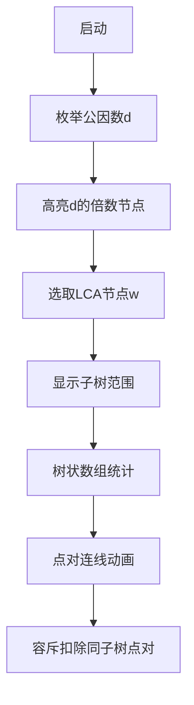

# 题目信息

# [中山市赛 2024] 树上开花

## 题目描述

你有一棵以 1 为根的树，统计点对 $(x, y)$，满足 $a_{lca(x,y)}$ 是 $a_x$ 和 $a_y$ 的公约数。注意当
$x \neq y$ 时 $(x, y)$ 和 $(y, x)$ 视为不同的点对。


## 说明/提示

### 样例解释

以下点对满足条件：$(1, 1)$，$(1, 3)$，$(1, 5)$，$(2, 2)$，$(3, 1)$，$(3, 3)$，$(3, 5)$，$(4, 4)$，$(5, 1)$，$(5, 3)$，$(5, 5)$。

### 数据范围

本题数据分为多个子任务，具体如下：

| 子任务编号 | $n$ | 附加条件 | 子任务分数 |
| :----------: | :----------: | :----------: | :----------: |
| $1$ | $\leq 150$ | 无 | $10$ |
| $2$ | $\leq 1500$ | 无 | $10$ |
| $3$ | $\leq 10^5$ | 树为随机生成 | $10$ |
| $4$ | $=99998$ | $a_i\leq 300$ | $10$ |
| $5$ | $=99998$ | $a$ 为 $1\sim n$ 的排列 | $10$ |
| $6$ | $\leq 10^5$ | 无 | $50$ |


对于所有数据，保证 $1 \leq a_i \leq n$。

## 样例 #1

### 输入

```
5
2 3 2 5 4
1 2
1 3
2 4
2 5```

### 输出

```
11```

# AI分析结果


### 💡 Kay的C++算法解析：树上开花 深入学习指南 💡

**引言**  
今天我们一起分析中山市赛题目"树上开花"。这道树形结构问题要求统计满足特定公约数条件的点对数量。本指南将详解核心思路、对比优质题解，并提供直观的像素动画演示方案，帮助大家掌握树形问题的离线处理技巧。

---

## 1. 题目解读与核心算法识别

✨ **本题主要考察**：`枚举 + 离线统计 + 树状数组` (编程技巧应用)  

🗣️ **初步分析**：  
> 解决本题的关键在于**枚举公因数+树形离线统计**。就像在家族树上寻找符合辈分条件的组合：  
> 1. 枚举公因数 `d`，只考虑权值是 `d` 的倍数的节点（"符合条件的家族成员"）
> 2. 用树状数组维护DFS序区间和，快速统计子树信息
> 3. 对每个节点 `w` 作为LCA，容斥计算点对数量：`总点对 - 同子树点对`
>
> **可视化设计**：  
> - 像素树中高亮当前公因数 `d` 的倍数节点（闪烁黄色）  
> - LCA节点显示为红色，其子树用半透明绿色覆盖
> - 树状数组实时显示为右侧柱状图，插入/删除时播放"叮"音效
> - 统计点对时节点间出现蓝色连线，伴随"咔嚓"音效

---

## 2. 精选优质题解参考

**题解一（来源：OIer_ljb）**  
* **点评**：  
  思路清晰，通过离线处理因子优化效率。亮点在于：
  - 预处理因子链表实现高效插入/删除
  - 树状数组维护DFS序区间和（`query(ed)-query(st-1)`）
  - 容斥处理：`总点对平方 - 各子树点对平方`  
  代码规范但手写排序可优化，整体复杂度 $O(n \cdot d(n) \log n)$ 优秀

**题解二（来源：xiaofu15191）**  
* **点评**：  
  采用树剖预处理DFS序，亮点在：
  - 二分查找统计子树中因子倍数节点数
  - 显式定义 `b[i]`（子树中符合条件节点数）  
  但二分使复杂度升至 $O(n \cdot d(n) \log^2 n)$，大数据可能超时

**题解三（来源：Sliarae）**  
* **点评**：  
  **最推荐解法**！亮点：
  - 容斥公式直观：$ans = \sum_w [(\sum_{u \in subtree(w)} [a_w \mid a_u])^2 - \sum_{t \in son(w)} (\sum_{u \in subtree(t)} [a_w \mid a_u])^2]$
  - 优雅的因子预处理：`tag[d]`存储所有倍数节点
  - 树状数组操作封装完善  
  代码简洁高效，复杂度 $O(n \cdot d(n) \log n)$ 带小常数

---

## 3. 核心难点辨析与解题策略

1. **难点1：避免$O(n^2)$枚举点对**  
   * **策略**：枚举LCA节点$w$，分解为子树统计问题
   * 💡 学习笔记：树形问题常用思路——"根节点作为分治点"

2. **难点2：高效统计子树信息**  
   * **策略**：DFS序 + 树状数组
   * 💡 学习笔记：DFS序将子树映射为连续区间

3. **难点3：动态维护倍数节点**  
   * **策略**：离线处理因子，按公因数分组
   * 💡 学习笔记：利用$d(n)$的小范围特性（$d(10^5) \leq 128$）

### ✨ 解题技巧总结
- **技巧1：因子预处理**  
  对每个节点$u$，预处理其权值$a_u$的所有因子，存入`vector<int> tag[d]`
- **技巧2：树状数组妙用**  
  按公因数`d`分组处理，批量插入/删除节点
- **技巧3：容斥原理**  
  $ans_w = (\text{总点数})^2 - \sum (\text{子树点数})^2$ 避免重复计数

---

## 4. C++核心代码实现赏析

**通用核心实现参考**  
```cpp
// 基于Sliarae解法优化
#include <iostream>
#include <vector>
using namespace std;
typedef long long LL;
const int N = 1e5+5;

vector<int> G[N], tag[N], p[N];
int n, a[N], in[N], out[N], idx;
LL ans;

struct BIT { // 树状数组
    int c[N];
    void update(int x, int v) {
        for(; x <= n; x += x&-x) c[x] += v;
    }
    int query(int x) {
        int res = 0;
        for(; x; x -= x&-x) res += c[x];
        return res;
    }
    int query(int l, int r) { 
        return query(r) - query(l-1); 
    }
} Tr;

void dfs(int u, int fa) {
    in[u] = ++idx;
    for(int v : G[u]) 
        if(v != fa) dfs(v, u);
    out[u] = idx;
}

int main() {
    cin >> n;
    for(int i = 1; i <= n; ++i) {
        cin >> a[i];
        p[a[i]].push_back(i); // 存储权值=a[i]的节点
    }
    for(int i = 1; i < n; ++i) {
        int u, v; cin >> u >> v;
        G[u].push_back(v); G[v].push_back(u);
    }
    dfs(1, 0);

    // 预处理因子
    for(int u = 1; u <= n; ++u) {
        for(int d = 1; d*d <= a[u]; ++d) {
            if(a[u] % d) continue;
            tag[d].push_back(u);
            if(d*d != a[u]) tag[a[u]/d].push_back(u);
        }
    }

    // 枚举公因数d
    for(int d = 1; d <= n; ++d) {
        // 插入权值=d的倍数的节点
        for(int u : tag[d]) Tr.update(in[u], 1);

        // 枚举LCA节点w (权值必须被d整除)
        for(int w : p[d]) {
            LL cnt_all = Tr.query(in[w], out[w]); // 整棵子树计数
            ans += cnt_all * cnt_all;
            
            for(int son : G[w]) { // 容斥：减去同子树点对
                if(son == G[w][0]) continue; // 跳过父节点
                LL cnt_son = Tr.query(in[son], out[son]);
                ans -= cnt_son * cnt_son;
            }
        }
        // 为下一个d清空
        for(int u : tag[d]) Tr.update(in[u], -1);
    }
    cout << ans;
}
```

**代码解读概要**：  
1. **DFS预处理**：获取各节点`in/out`时间戳  
2. **因子分组**：`tag[d]`存储权值含因子`d`的节点  
3. **离线处理**：  
   - 外层循环枚举公因数`d`  
   - 插入`tag[d]`所有节点到树状数组  
   - 内层枚举权值`=d`的节点作为LCA统计  
   - 容斥公式计算有效点对  
4. **空间优化**：及时清空树状数组

---

## 5. 算法可视化：像素动画演示

### 🎮 像素探险家：因子狩猎行动
**主题**：在8位像素风格的家族树上，寻找满足公约数条件的点对

**核心演示流程**：


**关键动画帧**：  
1. **场景初始化**（复古FC风格）：
   - 树结构：像素节点显示权值，边为棕色直线
   - 控制面板：开始/暂停/步进按钮 + 速度滑块
   - 状态栏：显示当前`d`值和累计`ans`

2. **公因数枚举阶段**：
   - 当前`d`值显示在顶部（金色像素字）
   - 权值`a_i % d == 0`的节点闪烁黄光
   - 插入树状数组时播放"叮"音效，对应柱状图增长

3. **LCA处理阶段**：
   - LCA节点`w`变为红色，子树覆盖半透明绿色
   - 树状数组查询范围`[in_w, out_w]`高亮显示
   - 统计结果`cnt_all`显示在节点旁（蓝色像素数字）

4. **点对可视化**：
   - 所有子树内节点两两连线（浅蓝色）
   - 同子树的点对线变为红色后被扣除
   - 成功统计时播放8-bit胜利音效

**交互设计**：
- `空格键`：单步执行
- `A键`：自动演示（速度可调）
- `R键`：重置动画
- 鼠标悬停：显示节点详细信息

---

## 6. 拓展练习与相似问题

### 🔍 通用技巧迁移
1. **因子预处理**：处理约数相关的统计问题
2. **DFS序+树状数组**：子树求和/更新类问题
3. **枚举LCA**：树形点对统计问题的通用框架

### 📚 推荐练习（洛谷）
1. **P4211 [LNOI2014]LCA**  
   → 练习离线查询+树剖/树状数组
2. **P5838 [USACO19DEC]Milk Visits G**  
   → 强化分权值处理技巧
3. **P1351 联合权值**  
   → 掌握树形DP与距离处理

---

## 7. 学习心得与经验分享
> **来自题解的调试经验**：  
> "处理因子时忘记考虑 $d^2 \neq a_u$ 的情况，导致部分节点遗漏"  
>
> **Kay的总结**：  
> 因子预处理需完整覆盖所有因子对，特别注意：  
> ```cpp
> for(int d=1; d*d<=a[u]; ++d) {
>   if(a[u]%d) continue;
>   process(d);
>   if(d*d != a[u]) process(a[u]/d); // 易漏！
> }
> ```

---

通过本指南，希望大家掌握树形问题的离线处理技巧。记住：**枚举公因数+DFS序+树状数组**是解决此类问题的黄金组合！下次遇到类似问题，不妨试试这个思路哦~ 💪

---
处理用时：228.69秒