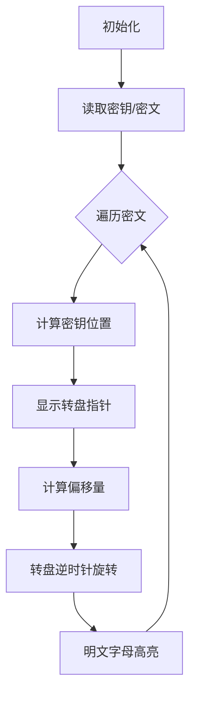

# 题目信息

# [NOIP 2012 提高组] Vigenère 密码

## 题目描述

16 世纪法国外交家 Blaise de Vigenère 设计了一种多表密码加密算法 Vigenère 密码。Vigenère 密码的加密解密算法简单易用，且破译难度比较高，曾在美国南北战争中为南军所广泛使用。

 
在密码学中，我们称需要加密的信息为明文，用 $M$ 表示；称加密后的信息为密文，用 $C$ 表示；而密钥是一种参数，是将明文转换为密文或将密文转换为明文的算法中输入的数据，记为 $k$。在 Vigenère 密码中，密钥 $k$ 是一个字母串，$k=k_1,k_2,…,k_n$。当明文 $M=m_1,m_2,…,m_n$ 时，得到的密文 $C=c_1,c_2,…,c_n$，其中 $c_i$=$m_i \operatorname{\circledR} k_i$，运算 $\circledR$ 的规则如下表所示：

$$\begin{array}{c|cccccccccccccccccccccccccc}
\circledR &\tt A \kern{-5pt} &\tt B \kern{-5pt} &\tt C \kern{-5pt} &\tt D \kern{-5pt} &\tt E \kern{-5pt} &\tt F \kern{-5pt} &\tt G \kern{-5pt} &\tt H \kern{-5pt} &\tt I \kern{-5pt} &\tt J \kern{-5pt} &\tt K \kern{-5pt} &\tt L \kern{-5pt} &\tt M \kern{-5pt} &\tt N \kern{-5pt} &\tt O \kern{-5pt} &\tt P \kern{-5pt} &\tt Q \kern{-5pt} &\tt R \kern{-5pt} &\tt S \kern{-5pt} &\tt T \kern{-5pt} &\tt U \kern{-5pt} &\tt V \kern{-5pt} &\tt W \kern{-5pt} &\tt X \kern{-5pt} &\tt Y \kern{-5pt} &\tt Z \kern{-5pt}  \\\hline
\tt A &\tt A \kern{-5pt} &\tt B \kern{-5pt} &\tt C \kern{-5pt} &\tt D \kern{-5pt} &\tt E \kern{-5pt} &\tt F \kern{-5pt} &\tt G \kern{-5pt} &\tt H \kern{-5pt} &\tt I \kern{-5pt} &\tt J \kern{-5pt} &\tt K \kern{-5pt} &\tt L \kern{-5pt} &\tt M \kern{-5pt} &\tt N \kern{-5pt} &\tt O \kern{-5pt} &\tt P \kern{-5pt} &\tt Q \kern{-5pt} &\tt R \kern{-5pt} &\tt S \kern{-5pt} &\tt T \kern{-5pt} &\tt U \kern{-5pt} &\tt V \kern{-5pt} &\tt W \kern{-5pt} &\tt X \kern{-5pt} &\tt Y \kern{-5pt} &\tt Z \kern{-5pt}  \\
\tt B &\tt B \kern{-5pt} &\tt C \kern{-5pt} &\tt D \kern{-5pt} &\tt E \kern{-5pt} &\tt F \kern{-5pt} &\tt G \kern{-5pt} &\tt H \kern{-5pt} &\tt I \kern{-5pt} &\tt J \kern{-5pt} &\tt K \kern{-5pt} &\tt L \kern{-5pt} &\tt M \kern{-5pt} &\tt N \kern{-5pt} &\tt O \kern{-5pt} &\tt P \kern{-5pt} &\tt Q \kern{-5pt} &\tt R \kern{-5pt} &\tt S \kern{-5pt} &\tt T \kern{-5pt} &\tt U \kern{-5pt} &\tt V \kern{-5pt} &\tt W \kern{-5pt} &\tt X \kern{-5pt} &\tt Y \kern{-5pt} &\tt Z \kern{-5pt} &\tt A \kern{-5pt}  \\
\tt C &\tt C \kern{-5pt} &\tt D \kern{-5pt} &\tt E \kern{-5pt} &\tt F \kern{-5pt} &\tt G \kern{-5pt} &\tt H \kern{-5pt} &\tt I \kern{-5pt} &\tt J \kern{-5pt} &\tt K \kern{-5pt} &\tt L \kern{-5pt} &\tt M \kern{-5pt} &\tt N \kern{-5pt} &\tt O \kern{-5pt} &\tt P \kern{-5pt} &\tt Q \kern{-5pt} &\tt R \kern{-5pt} &\tt S \kern{-5pt} &\tt T \kern{-5pt} &\tt U \kern{-5pt} &\tt V \kern{-5pt} &\tt W \kern{-5pt} &\tt X \kern{-5pt} &\tt Y \kern{-5pt} &\tt Z \kern{-5pt} &\tt A \kern{-5pt} &\tt B \kern{-5pt}  \\
\tt D &\tt D \kern{-5pt} &\tt E \kern{-5pt} &\tt F \kern{-5pt} &\tt G \kern{-5pt} &\tt H \kern{-5pt} &\tt I \kern{-5pt} &\tt J \kern{-5pt} &\tt K \kern{-5pt} &\tt L \kern{-5pt} &\tt M \kern{-5pt} &\tt N \kern{-5pt} &\tt O \kern{-5pt} &\tt P \kern{-5pt} &\tt Q \kern{-5pt} &\tt R \kern{-5pt} &\tt S \kern{-5pt} &\tt T \kern{-5pt} &\tt U \kern{-5pt} &\tt V \kern{-5pt} &\tt W \kern{-5pt} &\tt X \kern{-5pt} &\tt Y \kern{-5pt} &\tt Z \kern{-5pt} &\tt A \kern{-5pt} &\tt B \kern{-5pt} &\tt C \kern{-5pt}  \\
\tt E &\tt E \kern{-5pt} &\tt F \kern{-5pt} &\tt G \kern{-5pt} &\tt H \kern{-5pt} &\tt I \kern{-5pt} &\tt J \kern{-5pt} &\tt K \kern{-5pt} &\tt L \kern{-5pt} &\tt M \kern{-5pt} &\tt N \kern{-5pt} &\tt O \kern{-5pt} &\tt P \kern{-5pt} &\tt Q \kern{-5pt} &\tt R \kern{-5pt} &\tt S \kern{-5pt} &\tt T \kern{-5pt} &\tt U \kern{-5pt} &\tt V \kern{-5pt} &\tt W \kern{-5pt} &\tt X \kern{-5pt} &\tt Y \kern{-5pt} &\tt Z \kern{-5pt} &\tt A \kern{-5pt} &\tt B \kern{-5pt} &\tt C \kern{-5pt} &\tt D \kern{-5pt}  \\
\tt F &\tt F \kern{-5pt} &\tt G \kern{-5pt} &\tt H \kern{-5pt} &\tt I \kern{-5pt} &\tt J \kern{-5pt} &\tt K \kern{-5pt} &\tt L \kern{-5pt} &\tt M \kern{-5pt} &\tt N \kern{-5pt} &\tt O \kern{-5pt} &\tt P \kern{-5pt} &\tt Q \kern{-5pt} &\tt R \kern{-5pt} &\tt S \kern{-5pt} &\tt T \kern{-5pt} &\tt U \kern{-5pt} &\tt V \kern{-5pt} &\tt W \kern{-5pt} &\tt X \kern{-5pt} &\tt Y \kern{-5pt} &\tt Z \kern{-5pt} &\tt A \kern{-5pt} &\tt B \kern{-5pt} &\tt C \kern{-5pt} &\tt D \kern{-5pt} &\tt E \kern{-5pt}  \\
\tt G &\tt G \kern{-5pt} &\tt H \kern{-5pt} &\tt I \kern{-5pt} &\tt J \kern{-5pt} &\tt K \kern{-5pt} &\tt L \kern{-5pt} &\tt M \kern{-5pt} &\tt N \kern{-5pt} &\tt O \kern{-5pt} &\tt P \kern{-5pt} &\tt Q \kern{-5pt} &\tt R \kern{-5pt} &\tt S \kern{-5pt} &\tt T \kern{-5pt} &\tt U \kern{-5pt} &\tt V \kern{-5pt} &\tt W \kern{-5pt} &\tt X \kern{-5pt} &\tt Y \kern{-5pt} &\tt Z \kern{-5pt} &\tt A \kern{-5pt} &\tt B \kern{-5pt} &\tt C \kern{-5pt} &\tt D \kern{-5pt} &\tt E \kern{-5pt} &\tt F \kern{-5pt}  \\
\tt H &\tt H \kern{-5pt} &\tt I \kern{-5pt} &\tt J \kern{-5pt} &\tt K \kern{-5pt} &\tt L \kern{-5pt} &\tt M \kern{-5pt} &\tt N \kern{-5pt} &\tt O \kern{-5pt} &\tt P \kern{-5pt} &\tt Q \kern{-5pt} &\tt R \kern{-5pt} &\tt S \kern{-5pt} &\tt T \kern{-5pt} &\tt U \kern{-5pt} &\tt V \kern{-5pt} &\tt W \kern{-5pt} &\tt X \kern{-5pt} &\tt Y \kern{-5pt} &\tt Z \kern{-5pt} &\tt A \kern{-5pt} &\tt B \kern{-5pt} &\tt C \kern{-5pt} &\tt D \kern{-5pt} &\tt E \kern{-5pt} &\tt F \kern{-5pt} &\tt G \kern{-5pt}  \\
\tt I &\tt I \kern{-5pt} &\tt J \kern{-5pt} &\tt K \kern{-5pt} &\tt L \kern{-5pt} &\tt M \kern{-5pt} &\tt N \kern{-5pt} &\tt O \kern{-5pt} &\tt P \kern{-5pt} &\tt Q \kern{-5pt} &\tt R \kern{-5pt} &\tt S \kern{-5pt} &\tt T \kern{-5pt} &\tt U \kern{-5pt} &\tt V \kern{-5pt} &\tt W \kern{-5pt} &\tt X \kern{-5pt} &\tt Y \kern{-5pt} &\tt Z \kern{-5pt} &\tt A \kern{-5pt} &\tt B \kern{-5pt} &\tt C \kern{-5pt} &\tt D \kern{-5pt} &\tt E \kern{-5pt} &\tt F \kern{-5pt} &\tt G \kern{-5pt} &\tt H \kern{-5pt}  \\
\tt J &\tt J \kern{-5pt} &\tt K \kern{-5pt} &\tt L \kern{-5pt} &\tt M \kern{-5pt} &\tt N \kern{-5pt} &\tt O \kern{-5pt} &\tt P \kern{-5pt} &\tt Q \kern{-5pt} &\tt R \kern{-5pt} &\tt S \kern{-5pt} &\tt T \kern{-5pt} &\tt U \kern{-5pt} &\tt V \kern{-5pt} &\tt W \kern{-5pt} &\tt X \kern{-5pt} &\tt Y \kern{-5pt} &\tt Z \kern{-5pt} &\tt A \kern{-5pt} &\tt B \kern{-5pt} &\tt C \kern{-5pt} &\tt D \kern{-5pt} &\tt E \kern{-5pt} &\tt F \kern{-5pt} &\tt G \kern{-5pt} &\tt H \kern{-5pt} &\tt I \kern{-5pt}  \\
\tt K &\tt K \kern{-5pt} &\tt L \kern{-5pt} &\tt M \kern{-5pt} &\tt N \kern{-5pt} &\tt O \kern{-5pt} &\tt P \kern{-5pt} &\tt Q \kern{-5pt} &\tt R \kern{-5pt} &\tt S \kern{-5pt} &\tt T \kern{-5pt} &\tt U \kern{-5pt} &\tt V \kern{-5pt} &\tt W \kern{-5pt} &\tt X \kern{-5pt} &\tt Y \kern{-5pt} &\tt Z \kern{-5pt} &\tt A \kern{-5pt} &\tt B \kern{-5pt} &\tt C \kern{-5pt} &\tt D \kern{-5pt} &\tt E \kern{-5pt} &\tt F \kern{-5pt} &\tt G \kern{-5pt} &\tt H \kern{-5pt} &\tt I \kern{-5pt} &\tt J \kern{-5pt}  \\
\tt L &\tt L \kern{-5pt} &\tt M \kern{-5pt} &\tt N \kern{-5pt} &\tt O \kern{-5pt} &\tt P \kern{-5pt} &\tt Q \kern{-5pt} &\tt R \kern{-5pt} &\tt S \kern{-5pt} &\tt T \kern{-5pt} &\tt U \kern{-5pt} &\tt V \kern{-5pt} &\tt W \kern{-5pt} &\tt X \kern{-5pt} &\tt Y \kern{-5pt} &\tt Z \kern{-5pt} &\tt A \kern{-5pt} &\tt B \kern{-5pt} &\tt C \kern{-5pt} &\tt D \kern{-5pt} &\tt E \kern{-5pt} &\tt F \kern{-5pt} &\tt G \kern{-5pt} &\tt H \kern{-5pt} &\tt I \kern{-5pt} &\tt J \kern{-5pt} &\tt K \kern{-5pt}  \\
\tt M &\tt M \kern{-5pt} &\tt N \kern{-5pt} &\tt O \kern{-5pt} &\tt P \kern{-5pt} &\tt Q \kern{-5pt} &\tt R \kern{-5pt} &\tt S \kern{-5pt} &\tt T \kern{-5pt} &\tt U \kern{-5pt} &\tt V \kern{-5pt} &\tt W \kern{-5pt} &\tt X \kern{-5pt} &\tt Y \kern{-5pt} &\tt Z \kern{-5pt} &\tt A \kern{-5pt} &\tt B \kern{-5pt} &\tt C \kern{-5pt} &\tt D \kern{-5pt} &\tt E \kern{-5pt} &\tt F \kern{-5pt} &\tt G \kern{-5pt} &\tt H \kern{-5pt} &\tt I \kern{-5pt} &\tt J \kern{-5pt} &\tt K \kern{-5pt} &\tt L \kern{-5pt}  \\
\tt N &\tt N \kern{-5pt} &\tt O \kern{-5pt} &\tt P \kern{-5pt} &\tt Q \kern{-5pt} &\tt R \kern{-5pt} &\tt S \kern{-5pt} &\tt T \kern{-5pt} &\tt U \kern{-5pt} &\tt V \kern{-5pt} &\tt W \kern{-5pt} &\tt X \kern{-5pt} &\tt Y \kern{-5pt} &\tt Z \kern{-5pt} &\tt A \kern{-5pt} &\tt B \kern{-5pt} &\tt C \kern{-5pt} &\tt D \kern{-5pt} &\tt E \kern{-5pt} &\tt F \kern{-5pt} &\tt G \kern{-5pt} &\tt H \kern{-5pt} &\tt I \kern{-5pt} &\tt J \kern{-5pt} &\tt K \kern{-5pt} &\tt L \kern{-5pt} &\tt M \kern{-5pt}  \\
\tt O &\tt O \kern{-5pt} &\tt P \kern{-5pt} &\tt Q \kern{-5pt} &\tt R \kern{-5pt} &\tt S \kern{-5pt} &\tt T \kern{-5pt} &\tt U \kern{-5pt} &\tt V \kern{-5pt} &\tt W \kern{-5pt} &\tt X \kern{-5pt} &\tt Y \kern{-5pt} &\tt Z \kern{-5pt} &\tt A \kern{-5pt} &\tt B \kern{-5pt} &\tt C \kern{-5pt} &\tt D \kern{-5pt} &\tt E \kern{-5pt} &\tt F \kern{-5pt} &\tt G \kern{-5pt} &\tt H \kern{-5pt} &\tt I \kern{-5pt} &\tt J \kern{-5pt} &\tt K \kern{-5pt} &\tt L \kern{-5pt} &\tt M \kern{-5pt} &\tt N \kern{-5pt}  \\
\tt P &\tt P \kern{-5pt} &\tt Q \kern{-5pt} &\tt R \kern{-5pt} &\tt S \kern{-5pt} &\tt T \kern{-5pt} &\tt U \kern{-5pt} &\tt V \kern{-5pt} &\tt W \kern{-5pt} &\tt X \kern{-5pt} &\tt Y \kern{-5pt} &\tt Z \kern{-5pt} &\tt A \kern{-5pt} &\tt B \kern{-5pt} &\tt C \kern{-5pt} &\tt D \kern{-5pt} &\tt E \kern{-5pt} &\tt F \kern{-5pt} &\tt G \kern{-5pt} &\tt H \kern{-5pt} &\tt I \kern{-5pt} &\tt J \kern{-5pt} &\tt K \kern{-5pt} &\tt L \kern{-5pt} &\tt M \kern{-5pt} &\tt N \kern{-5pt} &\tt O \kern{-5pt}  \\
\tt Q &\tt Q \kern{-5pt} &\tt R \kern{-5pt} &\tt S \kern{-5pt} &\tt T \kern{-5pt} &\tt U \kern{-5pt} &\tt V \kern{-5pt} &\tt W \kern{-5pt} &\tt X \kern{-5pt} &\tt Y \kern{-5pt} &\tt Z \kern{-5pt} &\tt A \kern{-5pt} &\tt B \kern{-5pt} &\tt C \kern{-5pt} &\tt D \kern{-5pt} &\tt E \kern{-5pt} &\tt F \kern{-5pt} &\tt G \kern{-5pt} &\tt H \kern{-5pt} &\tt I \kern{-5pt} &\tt J \kern{-5pt} &\tt K \kern{-5pt} &\tt L \kern{-5pt} &\tt M \kern{-5pt} &\tt N \kern{-5pt} &\tt O \kern{-5pt} &\tt P \kern{-5pt}  \\
\tt R &\tt R \kern{-5pt} &\tt S \kern{-5pt} &\tt T \kern{-5pt} &\tt U \kern{-5pt} &\tt V \kern{-5pt} &\tt W \kern{-5pt} &\tt X \kern{-5pt} &\tt Y \kern{-5pt} &\tt Z \kern{-5pt} &\tt A \kern{-5pt} &\tt B \kern{-5pt} &\tt C \kern{-5pt} &\tt D \kern{-5pt} &\tt E \kern{-5pt} &\tt F \kern{-5pt} &\tt G \kern{-5pt} &\tt H \kern{-5pt} &\tt I \kern{-5pt} &\tt J \kern{-5pt} &\tt K \kern{-5pt} &\tt L \kern{-5pt} &\tt M \kern{-5pt} &\tt N \kern{-5pt} &\tt O \kern{-5pt} &\tt P \kern{-5pt} &\tt Q \kern{-5pt}  \\
\tt S &\tt S \kern{-5pt} &\tt T \kern{-5pt} &\tt U \kern{-5pt} &\tt V \kern{-5pt} &\tt W \kern{-5pt} &\tt X \kern{-5pt} &\tt Y \kern{-5pt} &\tt Z \kern{-5pt} &\tt A \kern{-5pt} &\tt B \kern{-5pt} &\tt C \kern{-5pt} &\tt D \kern{-5pt} &\tt E \kern{-5pt} &\tt F \kern{-5pt} &\tt G \kern{-5pt} &\tt H \kern{-5pt} &\tt I \kern{-5pt} &\tt J \kern{-5pt} &\tt K \kern{-5pt} &\tt L \kern{-5pt} &\tt M \kern{-5pt} &\tt N \kern{-5pt} &\tt O \kern{-5pt} &\tt P \kern{-5pt} &\tt Q \kern{-5pt} &\tt R \kern{-5pt}  \\
\tt T &\tt T \kern{-5pt} &\tt U \kern{-5pt} &\tt V \kern{-5pt} &\tt W \kern{-5pt} &\tt X \kern{-5pt} &\tt Y \kern{-5pt} &\tt Z \kern{-5pt} &\tt A \kern{-5pt} &\tt B \kern{-5pt} &\tt C \kern{-5pt} &\tt D \kern{-5pt} &\tt E \kern{-5pt} &\tt F \kern{-5pt} &\tt G \kern{-5pt} &\tt H \kern{-5pt} &\tt I \kern{-5pt} &\tt J \kern{-5pt} &\tt K \kern{-5pt} &\tt L \kern{-5pt} &\tt M \kern{-5pt} &\tt N \kern{-5pt} &\tt O \kern{-5pt} &\tt P \kern{-5pt} &\tt Q \kern{-5pt} &\tt R \kern{-5pt} &\tt S \kern{-5pt}  \\
\tt U &\tt U \kern{-5pt} &\tt V \kern{-5pt} &\tt W \kern{-5pt} &\tt X \kern{-5pt} &\tt Y \kern{-5pt} &\tt Z \kern{-5pt} &\tt A \kern{-5pt} &\tt B \kern{-5pt} &\tt C \kern{-5pt} &\tt D \kern{-5pt} &\tt E \kern{-5pt} &\tt F \kern{-5pt} &\tt G \kern{-5pt} &\tt H \kern{-5pt} &\tt I \kern{-5pt} &\tt J \kern{-5pt} &\tt K \kern{-5pt} &\tt L \kern{-5pt} &\tt M \kern{-5pt} &\tt N \kern{-5pt} &\tt O \kern{-5pt} &\tt P \kern{-5pt} &\tt Q \kern{-5pt} &\tt R \kern{-5pt} &\tt S \kern{-5pt} &\tt T \kern{-5pt}  \\
\tt V &\tt V \kern{-5pt} &\tt W \kern{-5pt} &\tt X \kern{-5pt} &\tt Y \kern{-5pt} &\tt Z \kern{-5pt} &\tt A \kern{-5pt} &\tt B \kern{-5pt} &\tt C \kern{-5pt} &\tt D \kern{-5pt} &\tt E \kern{-5pt} &\tt F \kern{-5pt} &\tt G \kern{-5pt} &\tt H \kern{-5pt} &\tt I \kern{-5pt} &\tt J \kern{-5pt} &\tt K \kern{-5pt} &\tt L \kern{-5pt} &\tt M \kern{-5pt} &\tt N \kern{-5pt} &\tt O \kern{-5pt} &\tt P \kern{-5pt} &\tt Q \kern{-5pt} &\tt R \kern{-5pt} &\tt S \kern{-5pt} &\tt T \kern{-5pt} &\tt U \kern{-5pt}  \\
\tt W &\tt W \kern{-5pt} &\tt X \kern{-5pt} &\tt Y \kern{-5pt} &\tt Z \kern{-5pt} &\tt A \kern{-5pt} &\tt B \kern{-5pt} &\tt C \kern{-5pt} &\tt D \kern{-5pt} &\tt E \kern{-5pt} &\tt F \kern{-5pt} &\tt G \kern{-5pt} &\tt H \kern{-5pt} &\tt I \kern{-5pt} &\tt J \kern{-5pt} &\tt K \kern{-5pt} &\tt L \kern{-5pt} &\tt M \kern{-5pt} &\tt N \kern{-5pt} &\tt O \kern{-5pt} &\tt P \kern{-5pt} &\tt Q \kern{-5pt} &\tt R \kern{-5pt} &\tt S \kern{-5pt} &\tt T \kern{-5pt} &\tt U \kern{-5pt} &\tt V \kern{-5pt}  \\
\tt X &\tt X \kern{-5pt} &\tt Y \kern{-5pt} &\tt Z \kern{-5pt} &\tt A \kern{-5pt} &\tt B \kern{-5pt} &\tt C \kern{-5pt} &\tt D \kern{-5pt} &\tt E \kern{-5pt} &\tt F \kern{-5pt} &\tt G \kern{-5pt} &\tt H \kern{-5pt} &\tt I \kern{-5pt} &\tt J \kern{-5pt} &\tt K \kern{-5pt} &\tt L \kern{-5pt} &\tt M \kern{-5pt} &\tt N \kern{-5pt} &\tt O \kern{-5pt} &\tt P \kern{-5pt} &\tt Q \kern{-5pt} &\tt R \kern{-5pt} &\tt S \kern{-5pt} &\tt T \kern{-5pt} &\tt U \kern{-5pt} &\tt V \kern{-5pt} &\tt W \kern{-5pt}  \\
\tt Y &\tt Y \kern{-5pt} &\tt Z \kern{-5pt} &\tt A \kern{-5pt} &\tt B \kern{-5pt} &\tt C \kern{-5pt} &\tt D \kern{-5pt} &\tt E \kern{-5pt} &\tt F \kern{-5pt} &\tt G \kern{-5pt} &\tt H \kern{-5pt} &\tt I \kern{-5pt} &\tt J \kern{-5pt} &\tt K \kern{-5pt} &\tt L \kern{-5pt} &\tt M \kern{-5pt} &\tt N \kern{-5pt} &\tt O \kern{-5pt} &\tt P \kern{-5pt} &\tt Q \kern{-5pt} &\tt R \kern{-5pt} &\tt S \kern{-5pt} &\tt T \kern{-5pt} &\tt U \kern{-5pt} &\tt V \kern{-5pt} &\tt W \kern{-5pt} &\tt X \kern{-5pt}  \\
\tt Z &\tt Z \kern{-5pt} &\tt A \kern{-5pt} &\tt B \kern{-5pt} &\tt C \kern{-5pt} &\tt D \kern{-5pt} &\tt E \kern{-5pt} &\tt F \kern{-5pt} &\tt G \kern{-5pt} &\tt H \kern{-5pt} &\tt I \kern{-5pt} &\tt J \kern{-5pt} &\tt K \kern{-5pt} &\tt L \kern{-5pt} &\tt M \kern{-5pt} &\tt N \kern{-5pt} &\tt O \kern{-5pt} &\tt P \kern{-5pt} &\tt Q \kern{-5pt} &\tt R \kern{-5pt} &\tt S \kern{-5pt} &\tt T \kern{-5pt} &\tt U \kern{-5pt} &\tt V \kern{-5pt} &\tt W \kern{-5pt} &\tt X \kern{-5pt} &\tt Y \kern{-5pt}  \\

\end{array}
$$

Vigenère 加密在操作时需要注意：

1. $\circledR$ 运算忽略参与运算的字母的大小写，并保持字母在明文 $M$ 中的大小写形式；
2. 当明文 $M$ 的长度大于密钥 $k$ 的长度时，将密钥 $k$ 重复使用。

例如，明文 $M=\texttt{Helloworld}$，密钥 $k=\texttt{abc}$ 时，密文 $C=\texttt{Hfnlpyosnd}$。

$$
\def{\arraystretch}{1.5}
\begin{array}{|c|c|c|c|c|c|c|c|c|c|c|} \hline
\textsf{明文} & \tt H & \tt e & \tt l & \tt l & \tt o & \tt w & \tt o & \tt r & \tt l & \tt d \\  \hline
\textsf{密钥} & \tt a & \tt b & \tt c & \tt a & \tt b & \tt c & \tt a & \tt b & \tt c & \tt a \\  \hline
\textsf{密文} & \tt H & \tt f & \tt n & \tt l & \tt p & \tt y & \tt o & \tt s & \tt n & \tt d \\  \hline
\end{array}
$$


## 说明/提示

对于 $100\%$ 的数据，输入的密钥的长度不超过 $100$，输入的密文的长度不超过 $1000$，且都仅包含英文字母。

NOIP 2012 提高组 第一天 第一题

## 样例 #1

### 输入

```
CompleteVictory
Yvqgpxaimmklongnzfwpvxmniytm```

### 输出

```
Wherethereisawillthereisaway```

# AI分析结果


### 💡 Kay的C++算法解析：Vigenère密码 深入学习指南 💡

#### 1. 题目解读与核心算法识别
✨ **本题主要考察**：`字符串处理与模运算应用`

🗣️ **初步分析**：
> 解决Vigenère密码的关键在于理解其**字母偏移变换规则**。就像密码转盘锁：密钥字母决定偏移量（如A=0偏移，B=1偏移），密文字母通过反向偏移还原明文。核心难点是处理大小写统一和边界循环（Z到A的衔接）。  
> - 所有优质题解都采用`(密文字母 - 密钥字母 + 26) % 26`的核心公式，区别在于大小写处理和代码实现技巧  
> - 可视化将设计为**像素密码机**：用转盘动画展示字母偏移过程，高亮当前操作的密钥字母和密文字母，通过颜色区分大小写  
> - 复古设计：FC红白机风格的机械转盘，伴随齿轮转动的8-bit音效，每解密一个字母触发"咔嗒"声，完整解密播放胜利旋律

---

#### 2. 精选优质题解参考
**题解一 (作者：ingu)**  
* **点评**：此解法巧妙运用**ASCII位运算**（`&31`提取字母序号），将解密公式精炼为单行三元表达式。亮点在于：  
  - 思路直击本质：通过`(c[i]&31)-1`获取密钥偏移量，避免大小写判断分支  
  - 代码极简高效（10行内解决），空间复杂度O(1)  
  - 实践价值高：可直接用于竞赛，但需注意字符编码原理的理解  

**题解二 (作者：Sinwind)**  
* **点评**：采用**标准化大小写+统一公式**的稳健方法。亮点在于：  
  - 逻辑清晰分层：`toupper`统一计算基准，`isupper`保留原始大小写  
  - 模块化设计：单独`decryption`函数增强可读性  
  - 边界处理严谨：`+26`确保模运算不出现负数  

**题解三 (作者：ShirasuAzusaSaikou)**  
* **点评**：最优美的**现代C++实现**。亮点在于：  
  - 智能类型推导：`auto&`遍历配合三目运算符  
  - 高效内存管理：无额外字符串拷贝  
  - 行业最佳实践：`ios::sync_with_stdio(false)`加速IO  

---

#### 3. 核心难点辨析与解题策略
1. **难点：字母偏移的循环边界处理**  
   * **分析**：当密文字母小于密钥字母时（如A-B），需+26回绕到字母表末端。优质解法通过`(C-K+26)%26`统一处理，+26消除负数影响  
   * 💡 **学习笔记**：模运算是处理循环边界的银弹  

2. **难点：大小写混合处理**  
   * **分析**：需保持密文原始大小写。Sinwind解法用`isupper`记录状态，Shirasu解法用`(ch>'a'?a:A)`动态判断  
   * 💡 **学习笔记**：加解密时只关心字母序数，大小写是输出时的"皮肤"  

3. **难点：密钥循环重用机制**  
   * **分析**：当`i%key_len`实现密钥循环，ingu解法以`i%k.length()`精炼实现  
   * 💡 **学习笔记**：循环索引取模是处理重复模式的通用技巧  

✨ **解题技巧总结**  
- **问题转化技巧**：将字母操作转化为数字运算（A=0, B=1...）  
- **位运算优化**：用`&31`替代大小写判断（需理解ASCII编码）  
- **防御性编程**：统一转为大写计算，输出时还原原始大小写  

---

#### 4. C++核心代码实现赏析
**本题通用核心实现参考**  
* **说明**：综合优质题解思路，保留原始大小写的最简实现  
```cpp
#include <iostream>
#include <cctype>
using namespace std;

int main() {
    string key, cipher;
    cin >> key >> cipher;
    for (int i = 0; i < cipher.length(); ++i) {
        char k = key[i % key.length()];
        char base = isupper(cipher[i]) ? 'A' : 'a';   // 基准字母
        int offset = (tolower(k) - 'a') % 26;         // 密钥偏移量
        int plain = (cipher[i] - base - offset + 26) % 26;
        cout << char(plain + base);
    }
    return 0;
}
```
* **代码解读概要**：  
  - 第7行：动态计算密钥循环位置  
  - 第8行：根据密文字母确定大小写基准  
  - 第9行：统一转为小写计算偏移量  
  - 第10行：核心解密公式处理负值  
  - 第11行：还原原始大小写输出  

**题解一 (ingu) 片段赏析**  
```cpp
int t = (k[i%k.length()]&31)-1;  // 密钥字母序数(0-25)
c[i] = (c[i]&31)-t > 0 ? c[i]-t : c[i]-t+26;
```
* **代码解读**：  
  > `&31`妙用：字母ASCII码后5位即字母序数（A=00001, B=00010）  
  > 三元表达式实现：偏移后值>0直接减，否则加26循环到末尾  
  > *学习笔记：位运算处理字符效率极高，但需确保环境使用ASCII编码*

**题解二 (Sinwind) 片段赏析**  
```cpp
char decryption(char c, char k) {
    char temp_c = toupper(c);
    char temp_k = toupper(k);
    char base = isupper(c) ? 'A' : 'a'; 
    return base + (temp_c - temp_k + 26) % 26;
}
```
* **代码解读**：  
  > 函数封装体现模块化思想，`toupper`统一计算基准  
  > `(temp_c-temp_k+26)%26`确保结果在0-25范围内  
  > *学习笔记：函数封装提升代码复用性和可测试性*

**题解三 (ShirasuAzusaSaikou) 片段赏析**  
```cpp
for(int i=0; i<c.size(); i++) {
    char k_char = tolower(k[i%k.size()]);
    int offset = c[i] - (c[i] >= 'a' ? 'a' : 'A');
    cout << char((offset - (k_char - 'a') + 26) % 26 + (c[i] >= 'a' ? 'a' : 'A'));
}
```
* **代码解读**：  
  > 动态选择基准字母：`c[i]>='a'?a:A`  
  > 内联计算偏移量避免中间变量  
  > *学习笔记：在保持可读性的前提下精简代码是高级技巧*

---

#### 5. 算法可视化：像素密码机
**动画演示主题**：`复古密码转盘机`  

**核心演示内容**：  
- 像素化字母转盘（26格，A-Z红蓝双色区分大小写）  
- 密钥字母触发指针旋转，密文字母高亮显示偏移过程  

**像素动画方案**：  


1. **8-bit像素风格**  
   - 转盘：直径256px的圆盘，26等分扇形区（每格40px宽）  
   - 字母像素块：16x16px，大写亮红色（#FF5555），小写亮蓝色（#5555FF）  

2. **核心交互演示**  
   ```javascript
   function decryptAnimation() {
       // 转盘旋转公式：rotation = (currentIndex - keyOffset) * 13.846° 
       cipherChar.highlight("gold", 300); // 密文字母金色高亮
       disk.rotate(-offset * 13.846);     // 逆时针旋转偏移角度
       playSound("click");                // 齿轮声效
       plainChar.popUp();                 // 明文字母像素弹出效果
   }
   ```

3. **游戏化设计**  
   - **关卡机制**：每10个字母为一关，通关触发8-bit胜利音效  
   - **动态计分板**：实时显示解密进度和准确率  
   - **AI演示模式**：自动播放解密过程（调速滑块控制0.5x-5x速度）  

4. **音效系统**  
   | 事件 | 音效 | 频率 |
   |---|---|----|
   | 单字母解密 | 短促"咔嗒"声 | 440Hz方波 |
   | 关卡完成 | 上升琶音 | 784Hz→1046Hz |
   | 全部完成 | 胜利旋律 | 《超级玛丽》过关片段 |

---

#### 6. 拓展练习与相似问题
1. **同类思维扩展**  
   - 凯撒密码（固定偏移量）  
   - 栅栏密码（位置重排）  
   - 仿射密码（线性变换）  

2. **洛谷进阶题目**  
   - **P1914 凯撒密码**：固定偏移量的简化版  
   - **P1086 花生采摘**：复杂循环索引应用  
   - **P1603 名字缩写**：字符串处理综合训练  

---

#### 7. 学习心得与经验分享
> **作者ingu的调试经验**：  
> *"最初未处理大小写时，遇到'z'-'a'导致负偏移崩溃，通过`&31`位运算统一字母序数解决"*  
> **Kay点评**：  
> 位运算虽高效但依赖字符编码，建议初学者先用`tolower`标准化。核心启示：  
> 1. 加密算法需用极端案例测试（A-Z边界）  
> 2. 输出中间变量`cout<<int(char)`是调试字符问题的利器  

---

通过本次分析，我们深入掌握了字符串处理的核心技巧——字母偏移的数学本质是模26运算，而大小写处理是输出层的"皮肤转换"。记住：优秀的算法=简洁的数学模型+严谨的边界处理！

---
处理用时：119.61秒