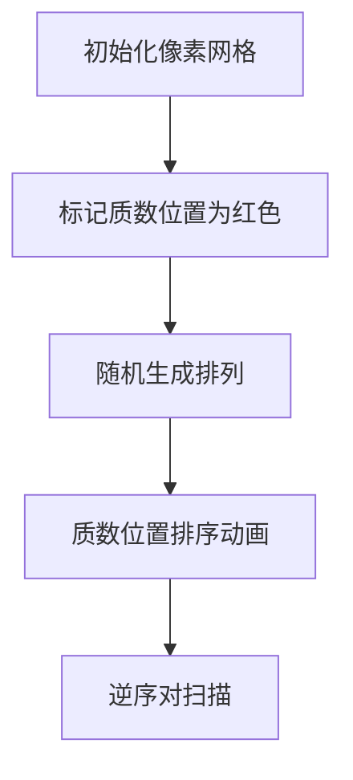

# 题目信息

# [蓝桥杯 2023 国 Java A] 质数排序

## 题目描述

我们定义质数排序为将一个序列中的所有下标为质数的位置进行升序排序，其它位置上的数不变。

例如，对 $8, 7, 6, 5, 4, 3, 2, 1$ 进行质数排序会得到 $8, 2, 4, 5, 6, 3, 7, 1$。给定 $n$，求 $1 \sim n$ 的每个排列进行质数排序后的逆序对的数量的和。由于结果很大，你只需要输出答案对 $998244353$ 取模的结果即可。

## 说明/提示

### 评测用例规模与约定

- 对于 $30\%$ 的评测用例，$n \leq 10$；
- 对于所有评测用例，$1 \leq n \leq 10^6$。

## 样例 #1

### 输入

```
3```

### 输出

```
6```

# AI分析结果


# 💡 Kay的C++算法解析：质数排序 深入学习指南 💡

**引言**  
今天我们来分析蓝桥杯2023国赛题目"质数排序"。这道题要求计算所有排列经过特殊排序后的逆序对总和，涉及组合数学、概率分析和质数处理等核心知识点。

## 1. 题目解读与核心算法识别

✨ **本题主要考察**：`组合数学` + `质数筛法`

🗣️ **初步分析**：  
> 想象你在整理书架：质数位置的书必须按高度排序，其他位置随意摆放。我们需要统计所有摆法产生的"乱序书对"总数。  
> - **核心技巧**：利用期望的线性性质，将逆序对分解为两部分：非质数内部的逆序对（概率1/2）和跨区域的逆序对（与质数排名相关）  
> - **可视化设计**：采用8位像素风格展示数组排序过程，质数位置用红色方块标记，排序时播放"叮"音效；非质数位置用蓝色方块，逆序对出现时闪烁黄光并播放短促音效  

---

## 2. 精选优质题解参考

**题解一（CChord）**  
* **亮点**：  
  ▶️ 思路直击本质：将逆序对分解为两个独立部分计算  
  ▶️ 代码结构清晰：欧拉筛+阶乘预处理+模块化计算  
  ▶️ 高效实现：时间复杂度O(n)，完美处理n=10⁶规模  
  ▶️ 边界严谨：正确处理i=0的特殊情况  

**题解二（kaederei7）**  
* **亮点**：  
  ▶️ 独特视角：从每对元素的角度分析逆序概率  
  ▶️ 深入解释：详细推导跨区域逆序对的概率公式  
  ▶️ 教学价值：帮助理解期望计算的底层原理  

---

## 3. 核心难点辨析与解题策略

1. **难点1：逆序对来源分析**  
   * **突破点**：质数位置排序后内部有序，只需关注：  
     - 非质数位置之间的逆序对  
     - 非质数与质数位置之间的逆序对  
   * 💡 **学习笔记**：分解问题是简化复杂计数问题的关键

2. **难点2：跨区域逆序概率计算**  
   * **解决方案**：  
     - 对每个非质数位置i，计算其值在"自身+所有质数值"中的排名j  
     - 逆序数 = |j - k|（k是i之前的质数数量）  
     - 通过期望均匀分布特性简化计算  
   * 💡 **学习笔记**：概率均匀分布特性可大幅简化组合计数

3. **难点3：大规模质数处理**  
   * **优化方案**：  
     - 使用欧拉筛O(n)预处理质数  
     - 线性预计算阶乘和逆元  
   * 💡 **学习笔记**：预处理是优化复杂度的常用手段

### ✨ 解题技巧总结
- **分解问题法**：将复杂问题拆解为独立子问题（如逆序对分类）  
- **概率转换**：用期望均匀性代替暴力枚举（如排名概率）  
- **预处理优化**：对重复使用的数据（阶乘/质数表）预先计算  

---

## 4. C++核心代码实现赏析

**通用核心实现参考**  
* **说明**：综合优质题解思路，包含欧拉筛、阶乘预处理和核心计算模块  
```cpp
#include<bits/stdc++.h>
#define int long long
using namespace std;
constexpr int mod = 998244353, M = 1e6 + 10;

// 欧拉筛模板
struct Euler{
    vector<int> primes;
    vector<bool> comp;
    Euler(int n){
        comp.resize(n+1);
        for(int i=2; i<=n; i++){
            if(!comp[i]) primes.emplace_back(i);
            for(int j=0; i*primes[j]<=n; j++){
                comp[i*primes[j]] = true;
                if(i%primes[j]==0) break;
            } 
        }
    }
};

// 快速幂求逆元
int qmi(int a, int k, int p){
    int res = 1;
    while(k){
        if(k & 1) res = res * a % p;
        a = a * a % p; k >>= 1;
    }
    return res;
}

vector<int> fact(M); // 阶乘表
void init(){
    fact[0] = 1;
    for(int i=1; i<M; i++) 
        fact[i] = fact[i-1]*i % mod;
}

void solve(){
    int n; cin >> n;
    Euler sieve(n);
    int p = sieve.primes.size(); // 质数个数
    int c = n - p;              // 非质数个数
    int res = 0, k = 0;         // k: 当前位置前的质数计数

    // 计算跨区域逆序对
    for(int i=0; i<n; i++){
        if(i==0 || sieve.comp[i+1]) { // 非质数位置
            int term = (k*(k+1) + (p-k)*(p-k+1))/2 % mod;
            res = (res + term) % mod;
        }
        else k++; // 质数位置
    }
    res = res * fact[n] % mod * qmi(p+1, mod-2, mod) % mod;

    // 加上非质数区域内部逆序对
    res += c*(c-1)%mod * qmi(4,mod-2,mod) % mod * fact[n] % mod;
    cout << res % mod << '\n';
}
```

**关键代码解读**  
1. **欧拉筛结构体**  
   - `comp`数组标记合数，`primes`动态存储质数  
   - 内层循环通过`i%primes[j]==0`保证O(n)复杂度  

2. **核心计算逻辑**  
   - **k的维护**：遍历时遇到质数则k++  
   - **跨区域公式**：`(k(k+1)+(p-k)(p-k+1))/2`对应期望计算  
   - **逆元应用**：通过`qmi(p+1, mod-2, mod)`实现模意义下的除法  

---

## 5. 算法可视化：像素动画演示

**设计主题**：8位机风格的"逆序对冒险"  

### 动画流程


**关键交互设计**：  
1. **像素网格**  
   - 每个数组元素显示为16x16像素方块  
   - 质数位置：红色边框+砖纹填充  
   - 非质数位置：蓝色渐变填充  

2. **排序动画**  
   - 质数位置数值冒泡排序：交换时方块旋转+"咔嗒"音效  
   - 排序完成时播放8-bit胜利音效  

3. **逆序对检测**  
   - 非质数内部：冲突方块闪烁黄色边框+短促"嘟"声  
   - 跨区域：红色与蓝色方块用闪电连接+低沉音效  
   - 控制面板：支持单步执行/调速/重置  

**游戏化元素**：  
- 每完成一个排列显示"逆序对积分"  
- 累计积分解锁不同像素特效  
- AI演示模式：自动生成100个排列并可视化统计分布  

---

## 6. 拓展练习与相似问题思考

**技巧迁移场景**：  
1. 部分排序的统计问题（如仅排序偶数位置）  
2. 带约束的逆序对计数（如值域限制）  
3. 多维度的排序组合问题  

**推荐练习**：  
1. **洛谷 P1908** 逆序对  
   - 基础逆序对统计，巩固树状数组应用  
2. **洛谷 P5149** 会议座位  
   - 结合字符串处理的逆序对变形  
3. **洛谷 P1966** 火柴排队  
   - 通过逆序对解决最优匹配问题  

---

**结语**  
通过本题我们掌握了组合计数与质数处理的结合应用。记住：分解问题+概率分析是解决复杂统计问题的利器！下次遇到类似题目时，不妨先思考："哪些子问题是相互独立的？"

---
处理用时：101.51秒