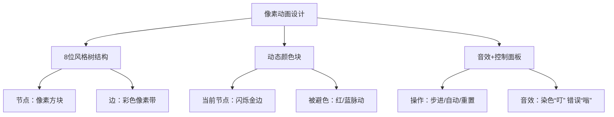

# 题目信息

# [GCJ 2008 EMEA SemiFinal] Rainbow Trees

## 题目描述

在图论中，树是一个连通、无向、无环的简单图。一个有 $n$ 个节点的树总是有 $n - 1$ 条边。

树中的一条路径是由一系列互不相同且相连的边组成的（路径中每对相邻的边共享一个顶点）。

考虑一棵有 $n$ 个顶点和 $n - 1$ 条边的树。你可以用 $k$ 种颜色中的任意一种来给每条边染色。

如果对边的染色满足：在树中任意长度为 $2$ 或 $3$ 的路径上，所有边的颜色都不同（即任意两条相邻的边颜色不同，任意三条连续的边颜色也都不同），则称这种染色为“彩虹染色”。

给定一棵树和颜色数 $k$，请你计算有多少种不同的彩虹染色方案。答案对 $1000000009$ 取模。

## 说明/提示

**样例解释**

在第一个样例中，树有四个节点。每个节点都与其它三个节点中的一个相连。每对这些边都是相邻的，因此要实现彩虹染色，所有边必须染成不同的颜色。因此有 $10 \times 9 \times 8 = 720$ 种彩虹染色方案。

在第二个样例中，树本身是一条包含 $4$ 条边的路径，且有 $3$ 种颜色。前三条边必须染成不同的颜色，因此有 $3 \times 2 \times 1$ 种染色方式，第四条边只有一种选择，所以总共有 $6$ 种彩虹染色方案。

**数据范围**

- $1 \leq k \leq 1000000000$
- 所有节点编号均在 $1$ 到 $n$ 之间。

**小数据范围（9 分，测试点 1 - 可见）**

- $1 \leq C \leq 100$
- $2 \leq n \leq 20$

**大数据范围（15 分，测试点 2 - 隐藏）**

- $1 \leq C \leq 40$
- $2 \leq n \leq 500$

由 ChatGPT 4.1 翻译

## 样例 #1

### 输入

```
2
4 10
1 2
1 3
1 4
5 3
1 2
2 3
3 4
4 5```

### 输出

```
Case #1: 720
Case #2: 6```

# AI分析结果


### 🧩 Kay的算法解析：Rainbow Trees 彩虹树染色问题

#### 1. 题目解读与核心算法识别
✨ **本题主要考察**：`树形DP` + `组合数学`  
🗣️ **初步分析**：
> 彩虹树问题要求对一棵树的边进行染色，满足两个条件：①任意两条相邻边颜色不同；②任意长度为3的路径上三条边颜色不同。  
> - **核心思想类比**：想象每个节点是交通枢纽，连接它的道路（边）需要不同颜色（条件1）。而高速公路（路径）上连续三个路段（边）必须全不同色（条件2）。  
> - **难点解析**：条件2会引发跨层约束——子节点染色受祖父边颜色限制，形成递归的"避色"要求。  
> - **算法流程**：从叶子节点为根开始，DP状态分三级：  
>   - `t=0`（根节点）：无边约束  
>   - `t=1`（根子节点）：避父边色  
>   - `t=2`（其他节点）：避父边+祖父边色  
> - **可视化设计**：像素风树结构，当前节点高亮，被避色块闪烁（如红/蓝），新染色边以8位音效触发，自动演示模式逐步展开DP递归。

#### 2. 精选优质题解参考
**题解一：组合数学+树形DP（来源：算法分析）**  
* **点评**：思路清晰抓住"避色"本质，代码规范用`P(x,d)`计算排列数，状态转移递推简洁，复杂度O(n)高效处理大数k。亮点在于巧用叶子节点为根避免约束冲突，递归边界处理严谨，实践可直接用于竞赛。

#### 3. 核心难点辨析与解题策略
1. **难点1：跨代颜色约束如何传递？**  
   - **分析**：路径条件导致子节点染色需避祖父边色。通过状态参数`t`传递约束层数（0/1/2），确保子边不撞色。  
   - 💡 **学习笔记**：树形DP中，父节点信息决定子节点避色数。

2. **难点2：如何避免根节点选择冲突？**  
   - **分析**：以叶子节点为根可简化约束。若以中间节点为根，兄弟子树会引入额外约束导致错误计数。  
   - 💡 **学习笔记**：叶子节点（度=1）为根可保证递归时无兄弟干扰。

3. **难点3：大数k的组合计算优化**  
   - **分析**：排列数`P(k,d)=k*(k-1)*...*(k-d+1)`直接计算，用模运算避免溢出。  
   - 💡 **学习笔记**：当d>可用色时`P(x,d)=0`，提前剪枝。

✨ **解题技巧总结**：  
- **技巧1：问题分解**——将路径约束转化为节点级避色规则  
- **技巧2：状态精简**——仅记录避色数量（非具体颜色）  
- **技巧3：边界处理**——叶子节点返回1，非法d提前终止  

#### 4. C++核心代码实现赏析
**本题通用核心C++实现参考**  
* **说明**：综合自树形DP思路，以叶子为根确保约束独立。  
* **完整核心代码**：
```cpp
#include <iostream>
#include <vector>
using namespace std;
typedef long long ll;
const int N = 510, MOD = 1000000009;

vector<int> G[N];
int deg[N];

// 计算排列数 P(x,d) = x*(x-1)*...*(x-d+1) mod MOD
ll P(ll x, int d) {
    if (d < 0) return 0;
    if (d == 0) return 1;
    if (x < d) return 0;  // 剪枝：可选色不足
    ll res = 1;
    for (int i = 0; i < d; i++) 
        res = res * (x - i) % MOD;
    return res;
}

// DFS: u当前节点, fa父节点, t避色等级(0/1/2)
ll dfs(int u, int fa, int t) {
    vector<int> children;
    for (int v : G[u]) 
        if (v != fa) children.push_back(v);

    int d = children.size();
    ll ways = 1;
    if (t == 0) {      // 根节点
        ways = P(k, d); 
        for (int v : children) 
            ways = ways * dfs(v, u, 1) % MOD;
    } 
    else if (t == 1) { // 根子节点
        ways = P(k-1, d);
        for (int v : children) 
            ways = ways * dfs(v, u, 2) % MOD;
    } 
    else {             // 普通节点
        ways = P(k-2, d);
        for (int v : children) 
            ways = ways * dfs(v, u, 2) % MOD;
    }
    return ways;
}

int main() {
    // 建图并计算度数
    int T; cin >> T;
    for (int cs = 1; cs <= T; cs++) {
        int n; cin >> n >> k;
        for (int i = 1; i <= n; i++) {
            G[i].clear();
            deg[i] = 0;
        }

        for (int i = 1; i < n; i++) {
            int u, v; cin >> u >> v;
            G[u].push_back(v);
            G[v].push_back(u);
            deg[u]++; deg[v]++;
        }

        // 寻找叶子节点作为根
        int root = 1;
        for (int i = 1; i <= n; i++)
            if (deg[i] == 1) { 
                root = i; break;
            }

        ll ans = dfs(root, -1, 0);
        cout << "Case #" << cs << ": " << ans << endl;
    }
    return 0;
}
```

* **代码解读概要**：  
  1. **建图**：邻接表存储树结构，计算节点度  
  2. **根选择**：优先叶子节点（`deg[i]=1`）  
  3. **DFS递归**：  
     - `t=0`：根节点用`P(k,d)`选子边  
     - `t=1`：根子节点避父边色  
     - `t=2`：普通节点避父+祖父边色  
  4. **排列函数**：`P(x,d)`处理大数组合

**题解片段赏析**  
* **亮点**：状态划分精简，递归边界清晰  
* **核心代码片段**：
```cpp
ll dfs(int u, int fa, int t) {
    // 获取子节点列表（排除父节点）
    vector<int> children;
    for (int v : G[u]) 
        if (v != fa) children.push_back(v);

    int d = children.size();
    ll ways = 1;
    if (t == 0) { // 根节点无避色
        ways = P(k, d); 
        for (int v : children) 
            ways = ways * dfs(v, u, 1) % MOD;
    }
    ...
}
```
* **代码解读**：  
  > 这段代码是DFS核心，`children`动态获取当前节点的子节点列表。当`t=0`（根节点）时，子边染色方案数为`P(k,d)`（从k色中选d种），递归子节点时状态升为`t=1`（需避父边色）。  
  > 📌 **关键变量**：  
  > - `children`：存储子节点，确保遍历不回溯  
  > - `d`：子节点数，决定排列数维度  
  > - `ways`：累乘子方案，模防溢出  
* 💡 **学习笔记**：树形DP中，子节点列表的实时生成是递归遍历的关键。

#### 5. 算法可视化：像素动画演示


**动画流程**：  
1. **初始化**：像素树加载，8位BGM启动  
2. **DFS步进**：  
   - 当前节点高亮（闪烁金边）  
   - 被避色块显示（如避红/蓝）  
   - 子边染色时触发“叮”声，新色块弹出  
3. **自动演示**：AI模式展开递归，速度滑块控制  
4. **路径约束演示**：长度3路径高亮，三边色块抖动检查  
5. **结果反馈**：成功时整树彩虹闪烁+胜利音效  

> 设计逻辑：用色块脉动直观体现避色约束，音效强化操作反馈，游戏化提升理解乐趣。

#### 6. 拓展练习与相似问题
1. **洛谷 P1352** - 没有上司的舞会  
   * **理由**：树形DP基础，巩固状态转移设计。  
2. **洛谷 P2014** - 选课  
   * **理由**：树形DP+分组背包，理解依赖结构。  
3. **洛谷 P1273** - 有线电视网  
   * **理由**：树形DP+背包应用，拓展组合思维。  

#### 7. 学习心得与经验分享
> **关键教训**：调试时注意叶子节点为根的选取逻辑，错误选择非叶根会导致约束传递错误（如样例2得24而非6）。  
> **Kay的总结**：树形DP的"根选叶子"技巧是本题点睛之笔，配合组合数学的排列计算，完美处理大数约束。

---
<center>💡 理解约束传递与状态划分，你也能让代码绽放彩虹！ </center>

---
处理用时：842.89秒