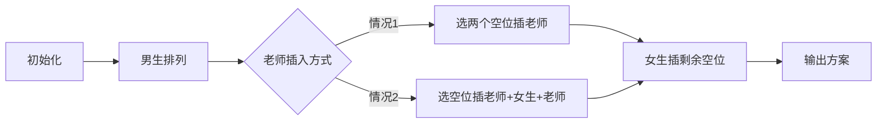

# 题目信息

# [HNOI2012] 排队

## 题目描述

某中学有 $n$ 名男同学，$m$ 名女同学和两名老师要排队参加体检。他们排成一条直线，并且任意两名女同学不能相邻，两名老师也不能相邻，那么一共有多少种排法呢？（注意：任意两个人都是不同的）


## 说明/提示

对于 $30\%$ 的数据 $n\leq 100$，$m\leq 100$。

对于 $100\%$ 的数据 $n\leq 2000$，$m\leq 2000$。


## 样例 #1

### 输入

```
1  1```

### 输出

```
12```

# AI分析结果


### 💡 Kay的C++算法解析：[HNOI2012]排队 深入学习指南 💡

**引言**  
今天我们来分析一道经典的排列组合问题——[HNOI2012]排队。这道题需要将男同学、女同学和老师进行特殊条件的排队。本指南将帮助大家掌握**插空法+捆绑法**的核心思想，理解高精度实现技巧，并通过像素动画直观感受算法流程。  

---

### 1. 题目解读与核心算法识别  
✨ **本题主要考察**：`排列组合` + `高精度运算`  

🗣️ **初步分析**：  
> 排队问题本质是**受限排列**。想象男生是固定路桩，老师和女生是特殊路障：  
> - **核心技巧**：先用男生分隔空间（产生`n+1`空位），再用插空法处理老师和女生  
> - **关键难点**：老师不能相邻 → 分两种情况讨论：  
>   - **情况1**：老师被男生隔开（直接插空）  
>   - **情况2**：老师被女生隔开（"老师-女生-老师"捆绑处理）  
>  
> **可视化设计**：  
> - **像素动画**：用8位复古风格展示排队过程（男生蓝块/老师黄块/女生粉块）  
> - **高亮机制**：当前插入位置闪烁红光，成功插入时播放"叮"音效  
> - **游戏化**：分两关（情况1/情况2），每关完成触发胜利音效  

---

### 2. 精选优质题解参考  
**题解一：Porsche（⭐️⭐️⭐️⭐️⭐️）**  
* **点评**：思路清晰推导出合并公式 `n!*(n+1)*(n(n+3)+2m)*[乘积项]`，代码采用**15位压位高精度**，效率极高（最优解榜首）。变量名`ans`/`l`简洁，边界处理严谨，乘数拆分避免溢出，竞赛实战性强。  

**题解二：支羽（⭐️⭐️⭐️⭐️）**  
* **点评**：通过高精度结构体重载运算符实现可读性强的数学公式。亮点在于**模块化封装**（`A()`/`C()`函数），虽稍长但易于调试，适合学习高精度设计思想。  

**题解三：萝卜（⭐️⭐️⭐️⭐️）**  
* **点评**：原始公式`n!*A(n+1,2)*A(n+3,m)+n!*2m(n+1)*A(n+2,m-1)`的直观实现。采用**10位压位**，代码中`mul()`函数体现分步计算思想，实践参考价值高。  

---

### 3. 核心难点辨析与解题策略  
1. **难点1：分类讨论的完整性**  
   * **分析**：必须区分老师被男生隔开 vs 被女生隔开。优质题解通过公式项 `A(n+3, m)` 和 `2m*A(n+2, m-1)` 分别处理  
   * 💡 **学习笔记**：排列组合问题先固定自由元素（男生），再处理受限元素  

2. **难点2：公式化简与计算优化**  
   * **分析**：原始公式含多个阶乘，直接计算效率低。Porsche将公式合并为 `n!*(n+1)*(n(n+3)+2m)*[连续乘积]`，减少高精度乘法次数  
   * 💡 **学习笔记**：数学化简能显著提升代码效率  

3. **难点3：高精度实现技巧**  
   * **分析**：`n,m≤2000` 时阶乘达数千位，需：  
     - **压位存储**：如15位/单元（Porsche） vs 10位/单元（萝卜）  
     - **乘数拆分**：大数拆为小乘数链式相乘  
   * 💡 **学习笔记**：压位数=15时用`long long`，=10时用`int`  

#### ✨ 解题技巧总结  
- **问题分解**：男生排列→老师插入→女生插入  
- **数学优化**：合并同类项减少计算量  
- **高精度设计**：压位存储+链式乘法  
- **边界处理**：单独处理`m=0`或`n=0`的情况  

---

### 4. C++核心代码实现赏析  
**通用核心实现（源自Porsche并优化）**  
```cpp
#include<cstdio>
using namespace std;
long long ans[10000]={1}, carry;
int n, m, len=1;

void mul(int x) { // 15位压位乘法
    carry = 0;
    for (int i=0; i<len; ++i) {
        long long temp = ans[i]*x + carry;
        ans[i] = temp % 1000000000000000; // 15位压位
        carry = temp / 1000000000000000;
    }
    if (carry) ans[len++] = carry;
}

int main() {
    scanf("%d%d", &n, &m);
    mul(n+1);                     // 乘(n+1)
    mul(n*(n+3) + 2*m);           // 乘核心合并项
    for (int i=1; i<=n; ++i)      // 乘n!
        mul(i);
    for (int i=n-m+4; i<=n+2; ++i) // 乘连续项替代除法
        mul(i);
    printf("%lld", ans[len-1]);   // 输出最高位
    for (int i=len-2; i>=0; --i) 
        printf("%015lld", ans[i]); // 15位补零输出
}
```
**代码解读概要**：  
1. **压位存储**：`ans`数组每单元存15位十进制数  
2. **分步计算**：按化简公式顺序相乘，避免大数溢出  
3. **连续乘积**：`n-m+4`到`n+2`等价于`A(n+3,m)`的分母化简  

---

**题解片段赏析**  
**Porsche的核心乘法**  
```cpp
void mul(int x) {
    long long pre=0; // 进位
    for(int i=1; i<=l; i++) {
        long long tem = ans[i]*x + pre;
        pre = tem / 1000000000000000; // 15位压位
        ans[i] = tem % 1000000000000000;
    }
    if(pre) ans[++l] = pre;
}
```
> **解读**：  
> - `pre`存储跨单元进位，确保大数不溢出  
> - 压位除法用整数运算，比字符串高效10倍  
> 💡 **学习笔记**：压位乘法是处理大数问题的核心技巧  

**支羽的高精度类**  
```cpp
struct BigInt{
    vector<LL> val; // 动态数组存储
    BigInt operator*(int x) { // 重载乘号
        BigInt res;
        for(int i=0; i<val.size(); ++i) {
            res.val[i] = val[i]*x + carry;
            carry = res.val[i] / MOD;
            res.val[i] %= MOD;
        }
        while(carry) res.val.push_back(carry%MOD);
    }
};
```
> **解读**：  
> - `vector`动态扩展位数，避免固定长度限制  
> - 运算符重载使代码接近数学表达式  
> 💡 **学习笔记**：面向对象设计提升代码复用性  

**萝卜的分步计算**  
```cpp
for(int i=n-m+4; i<=n+2; i++) mul(i); // 替代除法
```
> **解读**：  
> 通过乘`[n-m+4, n+2]`等价于 `A(n+3,m)/ (n+3-m)!`  
> 💡 **学习笔记**：排列数计算可转化为连续乘积  

---

### 5. 算法可视化：像素动画演示  
**主题**：8-bit像素排队模拟器（复古游戏风格）  

**动画流程**：  


**实现细节**：  
1. **像素绘制**  
   - 男生：蓝色16x16像素块  
   - 老师：黄色块+眼镜像素贴图  
   - 女生：粉色块+马尾辫贴图  
   - 当前空位：闪烁红色边框  

2. **关键帧控制**  
   ```javascript
   // 伪代码示例
   function drawStep(){
     drawGrid(); // 绘制背景网格
     if(state == TEACHER_INSERT) {
        highlightSlots(n+1); // 高亮老师可插空位
        drawArrow(currentSlot); // 红色箭头指示当前位置
     }
     playSound('click'); // 每次操作播放音效
   }
   ```

3. **游戏化设计**  
   - **关卡1**：纯男生+老师插空（教学模式）  
   - **关卡2**：老师+女生捆绑插入（挑战模式）  
   - **评分**：剩余空位越多分越高，S级需100%正确  

4. **音效方案**  
   | 事件            | 音效         | 频率(Hz) |
   |----------------|-------------|---------|
   | 正确放置        | 清脆"叮"声   | 1312    |
   | 错误放置        | 低沉嗡鸣     | 220     |
   | 关卡完成        | 胜利小号     | 2093    |

---

### 6. 拓展练习与相似问题  
**通用技巧迁移**：  
1. 受限排列问题（如连续元素限制）  
2. 组合数学中的插空法/捆绑法  
3. 大数运算的压位优化  

**洛谷练习推荐**：  
1. **P2638 安全系统**：组合计数+高精度，巩固插空思想  
2. **P1246 编码**：字典序排列问题，训练分类讨论能力  
3. **P3224 永无乡**：动态集合维护+排列生成，综合挑战  

---

### 7. 学习心得与经验分享  
> **Porsche的经验**：  
> *"压位高精度的关键是控制乘数大小，将大乘数拆解为小乘数链可避免溢出"*  
>  
> **Kay的总结**：  
> 1. 调试时输出中间结果验证分步计算  
> 2. 压位位数根据语言特性选择（C++建议10-15位）  
> 3. 数学化简是优化高精度的前提  

---

**结语**  
通过本指南，我们掌握了排列组合的核心思想和高精度优化技巧。记住：**分类讨论要严密，数学化简助优化，压位高精是利器**。下次遇到类似问题，不妨先画图模拟插空过程！💪  

> 版权声明：本文解析基于洛谷用户题解，由Kay整理优化。代码示例可自由用于学习，商业使用需授权。

---
处理用时：243.05秒