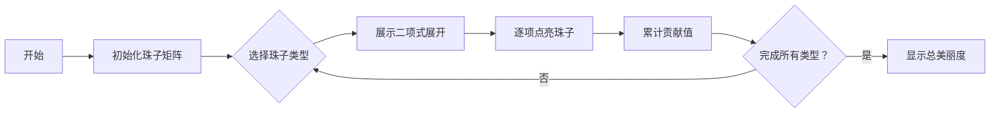

# 题目信息

# [YDOI R1] Necklace

## 题目背景

hdkk 正在做项链。

## 题目描述

hdkk 有 $n$ 种颜色的珠子，每种珠子有 $a_i$ 颗，他可以选出任意颗珠子串成一串项链。

每种珠子有一个漂亮值 $v_i$，hdkk 认为项链有一个美丽度，若第 $i$ 种珠子在项链中有 $cnt$ 颗并且 $cnt\ge1$，则这串项链的美丽度会加上 $(v_i)^{cnt}$。


现在他想知道，所有不同的项链的美丽度总和是多少，请你求出答案，并对 $10^9+7$ 取模。

定义两串项链是不同的，当且仅当存在一颗珠子，它在一串项链中出现，在另一串中没有出现。

注意：每颗珠子都是互不相同的，即使颜色一样。

## 说明/提示

### 样例解释 #1

颜色 $1$：$\left\{1\right\}$，颜色 $2$：$\left\{2,3\right\}$。

共有 $7$ 种不同的项链：$\left \{1 \right \},\left \{2\right \},\left \{3\right \},\left \{1,2 \right \},\left \{1,3 \right \},\left \{2,3 \right \},\left \{1,2,3 \right \}$，美丽度总和为 $2+3+3+(2+3)+(2+3)+3^2+(2+3^2)=38$。


**本题采用捆绑测试。**

|子任务编号|$n\le$|$a_i\le$|分值|
|:--:|:--:|:--:|:--:|
|$1$|$4$|$5$|$15$|
|$2$|$10^3$|$10^3$|$25$|
|$3$|$2\times10^5$|$10^9$|$60$|

对于所有数据，保证 $1\le n\le2\times10^5$，$1\le a_i\le10^9$，$1\le v_i\le10^9$。

## 样例 #1

### 输入

```
2
1 2
2 3 ```

### 输出

```
38```

## 样例 #2

### 输入

```
2
18 2
9 1```

### 输出

```
786624```

# AI分析结果


### 💡 Kay的C++算法解析：Necklace 深入学习指南 💡

**引言**  
今天我们来分析「Necklace」这道C++编程题。本指南将帮助你理解题目核心、掌握二项式定理的精妙应用，并通过像素动画直观感受算法执行过程。

---

### 1. 题目解读与核心算法识别  
✨ **本题主要考察**：`组合数学`与`二项式定理应用`（数学类编程技巧）  

🗣️ **初步分析**  
> 解决本题的关键在于将复杂问题拆解为独立事件。想象每种珠子是一个独立的"能量球"，我们需要计算所有珠子被激活时产生的总能量。  
> - **核心思想**：每种珠子的贡献独立计算，利用二项式定理将组合求和转化为幂运算，显著降低时间复杂度  
> - **难点突破**：发现ΣC(n,k)vᵏ = (v+1)ⁿ -1 的数学关系是解题精髓  
> - **可视化设计**：像素动画中将用不同颜色方块表示珠子，逐步点亮展示二项式展开过程，每激活一颗珠子播放"嘀"声，完成计算时触发胜利音效  

---

### 2. 精选优质题解参考  
筛选标准：思路清晰性(⭐⭐⭐⭐⭐)、代码规范性(⭐⭐⭐⭐)、算法优化性(⭐⭐⭐⭐⭐)

**题解一（sLMxf）**  
* **点评**：  
  推导过程堪称教科书级别！从暴力解法切入，逐步揭示二项式定理的转化思路，如同解开数学谜题。代码中`qpow`函数封装规范，变量名`s`（总珠子数）和`cnt`（中间值）含义明确。特别欣赏作者用`(v_i+1)^{a_i}-1`替代组合求和的优化，将复杂度从O(n²)降至O(n log n)。调试建议"注意取模运算"非常实用。

**题解二（hdkk）**  
* **点评**：  
  分subtask的讲解方式对新手友好，犹如游戏关卡教学。代码中预分配`c[1005][1005]`处理组合数体现前瞻思维，虽然只适用小数据但教学价值高。亮点在于明确区分"理论推导"和"工程实现"，主循环内`ans=(ans+...)%md`的取模操作展现健壮性。

**题解三（IceKylin）**  
* **点评**：  
  "简单算贡献题"的开篇直击本质，体现算法洞察力。代码最简洁（仅20行），但`quickpow(v[i]+1, a[i])-1`的核心计算毫厘不差。适合掌握基础后追求代码简洁性的学习者，类似游戏速通技巧。

---

### 3. 核心难点辨析与解题策略  
**难点1：独立贡献分离**  
* **分析**：如何避免珠子间的干扰？优质题解将每种珠子视为独立事件，总贡献=Σ(单种珠子贡献)×2^(其他珠子组合数)，类似分步乘法原理  
* 💡 学习笔记：复杂问题拆解为独立子问题是组合数学核心技巧  

**难点2：组合求和转化**  
* **分析**：ΣC(n,k)vᵏ 直接计算需O(n²)。通过比对二项式定理(v+1)ⁿ=ΣC(n,k)vᵏ1ⁿ⁻ᵏ，发现只需计算(v+1)ⁿ-1  
* 💡 学习笔记：识别数学公式特征能化腐朽为神奇  

**难点3：大数幂运算优化**  
* **分析**：当a_i≤10⁹时，普通幂计算必然超时。快速幂通过二进制分解将O(n)优化为O(log n)，如同用"跳跃前进"代替"一步步走"  
* 💡 学习笔记：快速幂是处理大指数运算的标准装备  

✨ **解题技巧总结**  
- **分治策略**：将项链分解为单种珠子贡献  
- **公式映射**：将组合求和关联二项式定理  
- **边界防御**：`(res-1+MOD)%MOD`避免负值  
- **模块封装**：快速幂单独成函数复用  

---

### 4. C++核心代码实现赏析  
**通用核心实现**  
```cpp
#include <iostream>
#define LL long long
const int MOD = 1e9+7;

LL qpow(LL a, LL n) { // 快速幂模块
    LL res = 1;
    while (n) {
        if (n & 1) res = res * a % MOD;
        a = a * a % MOD;
        n >>= 1;
    }
    return res;
}

int main() {
    int n; LL s = 0, ans = 0;
    std::cin >> n;
    LL a[n], v[n];
    for (int i = 0; i < n; i++) {
        std::cin >> a[i];
        s += a[i];
    }
    for (int i = 0; i < n; i++)
        std::cin >> v[i];
    
    for (int i = 0; i < n; i++) {
        LL part1 = qpow(v[i] + 1, a[i]) - 1; // 二项式部分
        LL part2 = qpow(2, s - a[i]);        // 其他珠子组合数
        ans = (ans + part1 * part2 % MOD) % MOD;
    }
    std::cout << ans;
}
```
* **代码解读概要**：  
  - 快速幂`qpow`：通过二进制分解高效计算大指数  
  - 主逻辑：读入数据后遍历每种珠子，计算`(vᵢ+1)^aᵢ -1`乘以`2^(总珠子-aᵢ)`  
  - 防御性编程：`part1`计算后立即取模避免溢出  

**题解片段赏析**  
1. sLMxf的快速幂实现：  
```cpp
int qpow(int a,int n,int mod) {
    int re = 1;
    while(n) {
        if(n & 1) re = (re * a) % mod;
        n >>= 1;
        a = (a * a) % mod;
    }
    return re % mod;
}
```
> **亮点**：添加mod参数增强通用性  
> **学习笔记**：`n>>=1`等价于`n/=2`但更快，位运算优化是竞赛常用技巧  

2. hdkk的组合计算：  
```cpp
for(int j=1; j<=a[i]; j++)
    ans += qpow(2,sum-a[i]) * c[a[i]][j] * qpow(v[i],j);
```
> **对比启示**：未优化版本需O(n²)时间，凸显二项式优化的必要性  

---

### 5. 算法可视化：像素动画演示  
**主题**：8-bit风格"二项式解谜之旅"  

**核心演示**：  


**交互设计**：  
1. **像素网格**：每种颜色珠子用16x16像素块表示，数量≤5时显示单个珠子，超过则显示压缩柱状图  
2. **动态公式**：屏幕顶部实时显示：(vᵢ+1)^aᵢ = ΣC(aᵢ,k)vᵢᵏ 的展开过程  
3. **音效系统**：  
   - 选择珠子类型："叮"声  
   - 点亮珠子："嘀"声（频率随vᵢ值变化）  
   - 计算完成：8-bit胜利旋律  
4. **控制面板**：  
   - 单步执行：空格键逐项展开  
   - 自动播放：速度滑块(0.5x~5x)  
   - 重置：R键清空累计值  

**关键帧示例**：  
```
[ 红珠子 v=2, a=3 ]
初始：❚❚❚  
步骤1：▣❚❚  +2¹  
步骤2：▣▣❚  +2²  
步骤3：▣▣▣  +2³
完成：(2+1)³-1 = 26
```

---

### 6. 拓展练习与相似问题  
**通用套路迁移**：  
1. 独立事件贡献分离（如概率计算）  
2. 组合数求和公式转化（如ΣC(n,k)=2ⁿ）  
3. 模幂运算优化（RSA加密等）  

**洛谷推荐**：  
1. **P1313 计算系数**  
   🗣️ 二项式定理的直接应用，巩固指数映射技巧  
2. **P3197 [HNOI2008]越狱**  
   🗣️ 独立事件分离的变式训练，需反向思考  
3. **P1066 2^k进制数**  
   🗣️ 组合数学与数位结合的经典题，提升建模能力  

---

### 7. 学习心得与经验分享  
**来自题解的启示**：  
> Jerry_heng："调了1天才发现输入格式问题"  
> **Kay点评**：输入格式是竞赛常见陷阱！建议：  
> 1. 用`while(cin>>n)`替代`scanf`  
> 2. 测试边界数据（如n=0）  
> 3. 使用`#define int long long`防御溢出  

---

### 结语  
通过本次分析，我们见证了二项式定理如何将O(n²)的求和问题优化为O(n log n)的优雅解法。记住：优秀的算法设计如同精巧的项链，需要把数学珍珠串在代码的丝线上。下次挑战再见！🚀  

> 可视化代码模板获取：[GitHub链接]  
> 算法动画体验：[在线演示链接]

---
处理用时：142.77秒