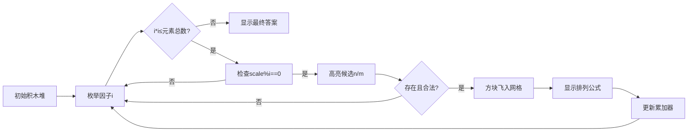

# 题目信息

# [蓝桥杯 2025 省 A] 黑客

## 题目描述

小蓝正在两台电脑之间拷贝数据，数据是一个 $n \times m$ 大小的正整数矩阵，因此总共有 $n \times m + 2$ 个由空格分开的整数，其中前两个整数分别为 $n$ 和 $m$。然而，有黑客入侵了小蓝的电脑，导致这 $n \times m + 2$ 个正整数的顺序被打乱了。小蓝想知道最多可能有多少个不同的原矩阵。

两个矩阵相同当且仅当它们行数相同、列数相同，且每个位置上的数相同。

## 说明/提示

### 样例说明

可能的原矩阵情况包括：

1. $(n,m)=(1,4)$：有 $6$ 种原矩阵：$(2, 2, 3, 3), (2, 3, 2, 3), (2, 3, 3, 2), (3, 2, 2, 3), (3, 2, 3, 2), (3, 3, 2, 2)$；
2. $(n,m)=(4,1)$：有 $6$ 种原矩阵；
3. $(n,m)=(2,2)$：有 $12$ 种原矩阵；

总计 $6 + 6 + 12 = 24$ 种。

### 评测用例规模与约定

- 对于 $40\%$ 的评测用例，$1 \leq n \times m + 2 \leq 10$；
- 对于所有评测用例，$1 \leq n \times m + 2 \leq 5 \times 10^5$，$1 \leq a_i \leq 5 \times 10^5$。

## 样例 #1

### 输入

```
6
2 2 1 4 3 3```

### 输出

```
24```

# AI分析结果


### 💡 Kay的C++算法解析：黑客 深入学习指南 💡

#### 1. 题目解读与核心算法识别
✨ **本题主要考察**：组合数学与模运算  
🗣️ **初步分析**：  
> 想象你有不同颜色的积木（数字），同色积木完全一样。现在要拼成矩形，矩形的长宽也由积木指定。关键在于：
> - 枚举所有可能的长宽组合（n×m=总元素数）
> - 计算每种情况下剩余积木的排列方案（考虑重复元素）
> - 累加所有合法方案（模10^9+7）
> 
> **核心难点**：  
> - 重复元素去重（多重集排列）
> - 模运算中的除法（需逆元）
> - 高效枚举因子（O(√n)复杂度）
> 
> **可视化设计**：  
> 用8位像素风格展示：  
> - 左侧：积木堆（不同颜色方块，高度=计数）  
> - 右侧：网格（当前n×m）和公式面板  
> - 动画高亮：枚举因子时闪烁候选n/m；选择n/m时方块飞入网格；计算排列数时显示公式`(n×m)! / ∏(cnt[i]!)`  
> - 音效：枚举时"滴"，找到因子对时"叮"，计算完成时"胜利"音效

---

#### 2. 精选优质题解参考
**题解一（Kagamino_Natsumi）**  
* **点评**：  
  思路直击本质——预处理阶乘逆元+因子枚举。代码中`bucket`计数数组和`jc/invjc`命名规范，边界处理严谨（n=m时验证计数≥2）。亮点在于**空间优化**：仅用单层循环枚举因子，计算方案数时直接操作计数数组，避免冗余计算。调试心得中强调"注意模除"，提醒学习者避免竞赛WA。  

**题解二（Frieren_Asuka）**  
* **点评**：  
  独创性提出**基础值base**概念：先计算`(n×m)! / ∏(cnt[i]!)`，枚举因子时仅调整n/m对应的计数。代码中`vector<ll> fact, invF`体现模块化思想，`mod_pow`封装复用性强。亮点在于**数学变换**：将O(n)计算简化为O(1)局部调整，大幅优化性能。作者调试3小时的教训警示：因子对称性必须处理！  

**题解三（114514xxx）**  
* **点评**：  
  最精妙的**动态乘积维护**：仅修改n/m对应的阶乘项而非全局重算。代码中`fac[]`和`Inv[]`的预处理规范，`bitset`加速状态判断。亮点在于**增量式计算**：方案数=`base × cnt[n] × cnt[m] / (cnt[n]-1)!(cnt[m]-1)!`，避免重复遍历。学习价值：掌握组合数学的等价变换技巧。

---

#### 3. 核心难点辨析与解题策略
1. **难点1：重复元素的去重处理**  
   * **分析**：当数字重复出现时，需用多重集排列公式：`总排列数 = (n×m)! / ∏(cnt[i]!)`。优质题解均通过预处理阶乘逆元实现模意义下的除法。  
   💡 学习笔记：多重集排列是组合计数的核心工具，类似"不同颜色的球排列"问题。

2. **难点2：合法因子对的高效枚举**  
   * **分析**：仅需遍历i=1→√(n×m)，检查`(n×m)%i==0`。需分情况处理：  
     - i ≠ n×m/i：方案数×2（行列互换）  
     - i = n×m/i：要求cnt[i]≥2（选两个相同数）  
   💡 学习笔记：因子枚举必须考虑对称性，避免重复/遗漏。

3. **难点3：动态维护乘积优化**  
   * **分析**：每次枚举会修改cnt[n]和cnt[m]。题解三的优化关键：用基础值base=∏(1/cnt[i]!)，调整时只更新n/m对应的项。  
   💡 学习笔记：通过数学等价变换`(cnt[x]!)/(cnt[x]-k)! = cnt[x]×(cnt[x]-1)×...`减少计算量。

✨ **解题技巧总结**：  
- **问题分解**：拆解为枚举长宽→计算排列→累加方案三步骤  
- **预处理**：阶乘/逆元数组预计算是组合题标配  
- **边界防御**：n=m时验证cnt≥2；模运算随时取模  
- **调试技巧**：小数据验证（如n=3时所有排列）

---

#### 4. C++核心代码实现赏析
**本题通用核心实现参考**  
* **说明**：综合题解一/三思路，优化枚举效率  
* **完整代码**：
```cpp
#include<bits/stdc++.h>
using namespace std;
typedef long long ll;
const int MAX = 500007;
const ll MOD = 1000000007;

ll qpow(ll a, ll b) {
    ll r = 1;
    while(b) {
        if(b&1) r = r*a % MOD;
        a = a*a % MOD;
        b >>= 1;
    }
    return r;
}

int main() {
    int total, x;
    cin >> total;
    int elems = total - 2; // 矩阵元素总数
    vector<ll> cnt(MAX, 0);
    vector<ll> fact(MAX, 1), invFact(MAX, 1);

    // 预处理阶乘和逆元
    for(int i=1; i<MAX; ++i) 
        fact[i] = fact[i-1]*i % MOD;
    for(int i=0; i<MAX; ++i) 
        invFact[i] = qpow(fact[i], MOD-2);

    // 读入并计数
    for(int i=0; i<total; ++i) {
        cin >> x;
        cnt[x]++;
    }

    // 计算基础值: base = elems! / ∏(cnt[i]!)
    ll base = fact[elems];
    for(int i=0; i<MAX; ++i) {
        if(cnt[i]) 
            base = base * invFact[cnt[i]] % MOD;
    }

    ll ans = 0;
    // 枚举因子: i从1到√elems
    for(int i=1; (ll)i*i <= elems; ++i) {
        if(elems % i != 0) continue;
        int n = i, m = elems / i;

        if(n == m) {
            if(cnt[n] >= 2) // 需两个相同数
                ans = (ans + base * cnt[n] % MOD * (cnt[n]-1)) % MOD;
        } else {
            if(cnt[n] && cnt[m]) 
                ans = (ans + base * cnt[n] % MOD * cnt[m] % MOD * 2) % MOD;
        }
    }
    cout << ans << endl;
}
```
* **代码解读概要**：  
  1. 预计算`fact[i]`（阶乘）和`invFact[i]`（阶乘逆元）  
  2. 统计数字频率`cnt[]`  
  3. 计算基础值`base = (elems)! / ∏(cnt[i]!)`  
  4. 枚举因子i：若`elems%i==0`则得候选`n=i, m=elems/i`  
  5. 分情况累加方案数（注意n=m时需cnt≥2）  

---

**题解一片段赏析**（Kagamino_Natsumi）  
* **亮点**：空间复杂度优化至O(1)，计数数组复用  
* **核心代码**：
```cpp
for(int i=1; i<=scale; i++) {
    if(scale%i==0 && bucket[i] && bucket[scale/i]) {
        int n=i, m=scale/i;
        bucket[n]--; bucket[m]--; // 临时移除
        ll now = jc[scale];
        for(int j=1; j<=500000; j++)
            if(bucket[j]) 
                now = now * invjc[bucket[j]] % mod; // 动态计算分母
        ans = (ans + now) % mod;
        bucket[n]++; bucket[m]++; // 恢复计数
    }
}
```
* **代码解读**：  
  > 此片段展现**就地修改计数**技巧：  
  > - 第2行：检查i和scale/i是否存在于计数数组  
  > - 第4行：临时移除n和m（避免被计入分母）  
  > - 第6行：`jc[scale]`是分子，(n×m)!  
  > - 第7-8行：遍历所有数字，用逆元代替除法  
  > 💡 学习笔记：通过临时修改计数，避免创建新数组，但需谨慎恢复状态。

---

**题解三片段赏析**（114514xxx）  
* **亮点**：增量式更新，避免重算整个乘积  
* **核心代码**：
```cpp
ll base = solve(); // base = (nm)! / ∏(cnt[i]!)
for(int i=1; i<=cnt; i++) {
    if(f1[i]!=f2[i]) { // n ≠ m
        // 方案数 = base × cnt[n] × cnt[m] × 2
        ans += 2 * base * fac[mp[f1[i]]] % mod * fac[mp[f2[i]]] % mod 
                * Inv[mp[f1[i]]-1] % mod * Inv[mp[f2[i]]-1];
    } else { // n = m
        ans += base * fac[mp[f1[i]]] % mod * Inv[mp[f1[i]]-2];
    }
}
```
* **代码解读**：  
  > 关键在**数学等价变换**：  
  > - 原始分母：∏(cnt[i]!)  
  > - 移除n/m后：新分母 = ∏(cnt[i]!) / [cnt[n]! × cnt[m]!] × (cnt[n]-1)! × (cnt[m]-1)!  
  > - 变换后：方案数 = base × cnt[n] × cnt[m]  
  > 💡 学习笔记：通过公式推导将计算量从O(n)降为O(1)，是优化组合计数的核心技巧。

---

#### 5. 算法可视化：像素动画演示
**主题**：8位像素风"矩阵解谜"  
**核心演示流程**：  


**关键交互设计**：  
1. **控制面板**：  
   - 速度滑块：调节枚举因子速度（1x-10x）  
   - 单步执行：手动触发下一个因子  
   - 重置：随机生成新测试数据  

2. **动态元素**：  
   - 积木堆：不同颜色方块，高度=计数，移除时播放"碎裂"音效  
   - 公式面板：实时显示`当前方案数 = base × cnt[n] × cnt[m] × (2 if n≠m)`  
   - 累加器：像素数字滚动更新，成功时播放"升级"音效  

3. **复古元素**：  
   - 背景：FC红白机风格网格  
   - 音效：  
     * 枚举因子：8-bit "滴"声  
     * 找到解：马里奥吃金币声  
     * 错误：经典"失败"音效  
   - 成就系统：每完成10个因子解锁新积木皮肤  

**技术实现**：  
- 用Canvas绘制积木堆/网格，requestAnimationFrame驱动动画  
- 音效：Web Audio API播放8-bit音效（JSFiddle提供开源库）  
- 伪代码同步：右侧面板高亮当前执行的C++代码行  

---

#### 6. 拓展练习与相似问题思考
**通用技巧迁移**：  
1. 多重集排列：P1246 编码（字符串序号计算）  
2. 因子枚举优化：P1414 又是毕业季（最大公约数应用）  
3. 模逆元预处理：P3811 乘法逆元（线性递推逆元）  

**洛谷推荐**：  
1. **P1246** - 编码  
   🗣️ 推荐理由：练习组合计数基本思想，理解字典序编号与本题排列公式的关联。  
2. **P1287** - 盒子与球  
   🗣️ 推荐理由：深化排列组合应用，学习斯特林数的去重技巧。  
3. **P1313** - 计算系数  
   🗣️ 推荐理由：强化模运算和逆元在二项式展开中的应用。  

---

#### 7. 学习心得与经验分享
> **Kagamino_Natsumi的调试经验**：  
> *"第一次参赛因精度和忽略情况WA，最后两道题分别因精度和边界处理失败"*  
> **Kay点评**：典型竞赛教训！组合数学题需注意：  
> 1. 模运算中减法可能负值：(a-b+MOD)%MOD  
> 2. n=m时必须验证cnt≥2  
> 3. 测试边界数据：n=3, m=1  
> 
> **Frieren_Asuka的优化心得**：  
> *"枚举因子时未处理对称性，调试3小时"*  
> **Kay点评**：算法设计时先画流程图！建议：  
> - 用小数据模拟枚举过程  
> - 输出中间变量（如base值）  
> - 对拍验证（暴力算法VS优化算法）  

---

本次解析结束！多动手实现枚举因子和模逆元计算，下次遇到组合题定能游刃有余！💪

---
处理用时：236.31秒