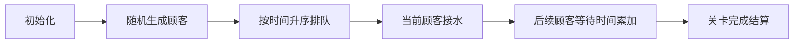

# 题目信息

# 排队接水

## 题目描述

有 $n$ 个人在一个水龙头前排队接水，假如每个人接水的时间为 $T_i$，请编程找出这 $n$ 个人排队的一种顺序，使得 $n$ 个人的平均等待时间最小。


## 说明/提示

$1\le n \leq 1000$，$1\le t_i \leq 10^6$，不保证 $t_i$ 不重复。


## 样例 #1

### 输入

```
10 
56 12 1 99 1000 234 33 55 99 812```

### 输出

```
3 2 7 8 1 4 9 6 10 5
291.90
```

# AI分析结果


### 💡 Kay的C++算法解析：排队接水 深入学习指南 💡

#### 1. 题目解读与核心算法识别
✨ **本题主要考察**：`贪心算法（排序应用）`

🗣️ **初步分析**：
> 解决排队接水问题的关键在于理解贪心算法的核心思想——**“短任务优先”**。想象你在快餐店点餐：如果让点单最快的人先结账，整个队伍的等待时间就会大幅减少！  
> 在本题中，我们通过排序将接水时间最短的人排在前面，从而最小化后续所有人的累计等待时间。数学证明表明：交换任意相邻两人位置时，时间短者在前总等待时间更少，因此整体升序排列是最优解。

- **核心难点**：正确推导等待时间公式（第i个人让后续n-i人等待），并处理排序后序号的输出。
- **可视化设计**：在像素动画中，用不同颜色方块表示人员（蓝色=已接水，黄色=当前接水，红色=等待），动态展示时间累加过程。关键步骤高亮：排序过程、当前接水人员时间×剩余等待人数。
- **复古游戏化**：采用FC红白机风格，音效设计：接水开始（8-bit水滴声）、人员移动（像素脚步声）、关卡完成（胜利音效）。控制面板支持步进/调速，AI自动演示模式模拟“贪吃蛇”式推进。

---

#### 2. 精选优质题解参考
**题解一：f112358 (赞：272)**  
* **亮点**：创新性地用`t[i] = 时间×1001 + 序号`压缩存储，无需结构体即可通过取模分离序号。代码简洁高效（时间复杂度O(n log n)），空间利用率高，完美处理序号输出问题。  
* **实践价值**：直接适用于竞赛场景，边界处理严谨（n≤1000确保乘1001不溢出）。

**题解二：BlueArc (赞：114)**  
* **亮点**：结构体排序清晰直观，等待时间计算优化——倒序循环用`(n-i)`直接乘时间，避免嵌套循环。代码规范性极强（变量名`a[i].num`语义明确），公式推导在注释中完整呈现。  
* **教学价值**：帮助初学者理解贪心策略与数学公式的结合，调试友好（可打印中间变量验证）。

**题解三：Anguei (赞：82)**  
* **亮点**：使用`std::pair`替代结构体，利用其默认按first成员排序的特性简化代码。动态内存分配(`new pair<>`)减少空间浪费，体现C++特性灵活应用。  
* **启发性**：引入STL高级用法，为学习者拓宽编程视野（需注意内存释放的严谨性）。

---

#### 3. 核心难点辨析与解题策略
1. **贪心策略证明**  
   * **分析**：需严格证明“短时间优先”的最优性。优质题解采用相邻交换反证法：若存在逆序对（时间长者在前），交换后总等待时间必然减少。
   * 💡 **学习笔记**：贪心问题需优先验证“无后效性”和“最优子结构”。

2. **等待时间公式推导**  
   * **分析**：总时间 = Σ (第i个人的接水时间 × 后续人数)。公式 `sum += t[i]*(n-i-1)` 是解题核心，避免O(n²)嵌套计算。
   * 💡 **学习笔记**：将物理问题转化为数学模型是优化算法的关键。

3. **序号与时间同步处理**  
   * **分析**：排序时需同步交换时间与序号。高效方案包括：结构体打包、pair容器、或f112358的编码技巧（×1001+序号）。
   * 💡 **学习笔记**：选择数据结构应权衡可读性与效率，数组编码技巧在特定场景有奇效。

✨ **解题技巧总结**  
- **问题转化**：将生活场景抽象为数学模型（等待时间=时间×影响人数）  
- **STL活用**：`sort`+`pair`或结构体简化开发  
- **边界防御**：用`double`存储总和防溢出，输出前验证`n=0`特例  
- **复杂度优化**：公式替代暴力累加（O(n)→O(n log n)）

---

#### 4. C++核心代码实现赏析
**本题通用核心实现**（综合自优质题解）  
```cpp
#include <iostream>
#include <algorithm>
using namespace std;

int main() {
    int n;
    cin >> n;
    pair<int, int> arr[1001]; // first=时间, second=序号
    double total_wait = 0;

    for (int i = 0; i < n; i++) {
        cin >> arr[i].first;
        arr[i].second = i + 1;
    }
    
    sort(arr, arr + n); // pair默认按first升序排序
    
    for (int i = 0; i < n; i++) {
        cout << arr[i].second << " ";
        total_wait += arr[i].first * (n - i - 1); // 核心公式
    }
    
    printf("\n%.2f", total_wait / n);
    return 0;
}
```
**代码解读概要**：  
1. 输入数据存入`pair`，自动绑定时间和序号  
2. `sort`默认按接水时间升序排列  
3. 输出排序后序号，同步累加`当前时间×后续人数`  
4. 输出平均等待时间（保留2位小数）

---

#### 5. 算法可视化：像素动画演示
**主题**：`像素便利店接水大作战`（8-bit风格模拟）  

**核心演示流程**：  


**关键交互设计**：  
1. **像素元素**：  
   - 顾客：16×16像素，头顶显示时间/序号  
   - 水龙头：闪烁绿色表示使用中  
   - 计时板：液晶风格显示累计等待时间  

2. **动画逻辑**：  
   - 排序阶段：顾客冒泡排序过程，交换位置时触发“脚步声”音效  
   - 接水阶段：当前顾客变黄，水龙头喷水动画，等待顾客头顶显示红色计时器  
   - 时间计算：弹出公式气泡 `总时间 += 当前时间 × 蓝色顾客数`  

3. **游戏化设计**：  
   - 每完成5人接水触发“关卡通过”音效（胜利旋律+像素烟花）  
   - 控制面板：步进/暂停/速度滑块（1x-5x）  
   - AI模式：自动演示全过程（如贪吃蛇AI移动）  

**技术实现**：  
- Canvas绘制网格化顾客队列  
- 关键帧同步代码高亮：排序时对应C++的`sort`，接水时对应`total_wait += ...`  
- 音效触发：Web Audio API播放8-bit音效（时间<100ms）  

---

#### 6. 拓展练习与相似问题
**通用套路迁移**：  
贪心+排序策略还可用于：  
1. 任务调度（最短作业优先）  
2. 哈夫曼编码（最小堆合并）  
3. 区间选点（按右端点排序）  

**洛谷推荐题目**：  
1. **P1090 合并果子**  
   🗣️ 巩固贪心+优先队列，理解“每次合并最小代价”与本题的共通性  
2. **P1106 删数问题**  
   🗣️ 通过局部最优解求全局最优，训练贪心思维灵活性  
3. **P2240 部分背包问题**  
   🗣️ 价值/重量比排序的贪心应用，进阶版“性价比”计算  

---

#### 7. 学习心得与经验分享
> **作者经验摘录**（来自题解评论区）：  
> “第一次用float计算总分时WA，改用double后AC——浮点精度是隐藏陷阱！”  
> “公式 `t[i]*(n-i-1)` 的推导：画队列图发现第i人影响后面所有人”  

**Kay点评**：  
- 调试时输出中间变量（如每人贡献的等待时间）可快速定位公式错误  
- 警惕浮点误差：金额/时间问题优先选用`double`，避免`float`精度不足  
- 手工模拟小样例（n=3）是验证贪心策略的黄金方法  

---

### 结语  
通过本次分析，我们深入理解了贪心算法在排队问题中的应用本质：**用排序实现全局优化，用数学公式避免重复计算**。记住：优秀的算法既是严谨的科学，也是创造力的艺术！下次遇到“最小化等待”问题时，不妨回想今天的像素便利店——短任务优先，让时间效益最大化！🚀

---
处理用时：95.24秒