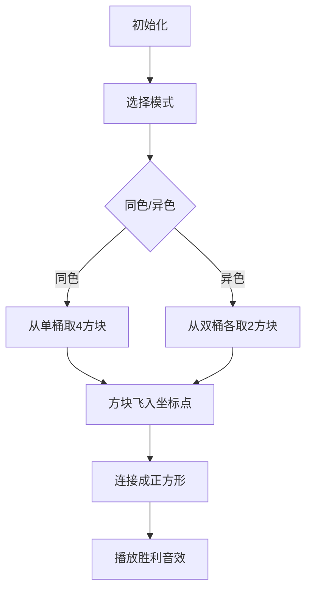

# 题目信息

# [蓝桥杯 2025 国 C] 正方形构造

## 题目描述

小蓝正在二维坐标系中构造正方形，他手上有 $n$ 个正整数 $a_1, a_2, \cdots, a_n$，他想知道有多少个有序四元组 $(i, j, p, q)$ 满足 $i, j, p, q$ 互不相同，且四个点：$(0,0)$、$(-a_i, a_j)$、$(a_p, a_q)$、$(a_p - a_i, a_j + a_q)$ 能构成一个正方形？

## 说明/提示

**【样例说明】**

可用的数一共有 $10$ 个 $1$ 和 $5$ 个 $2$。

取 $a_i = 1, a_j = 2, a_p = 2, a_q = 1$ 时，有 $A_{10}^2 A_{5}^2 = 1800$ 种方案；

取 $a_i = 2, a_j = 1, a_p = 1, a_q = 2$ 时，有 $A_{10}^2 A_{5}^2 = 1800$ 种方案；

取 $a_i = 1, a_j = 1, a_p = 1, a_q = 1$ 时，有 $A_{10}^{4} = 5040$ 种方案；

取 $a_i = 2, a_j = 2, a_p = 2, a_q = 2$ 时，有 $A_{5}^{4} = 120$ 种方案；

总共有 $8760$ 种方案。

**【评测用例规模与约定】**

对于 $40\%$ 的评测用例，$1 \leq n \leq 100$；

对于所有评测用例，$1 \leq n \leq 1000000$，$1 \leq a_i \leq 1000$。

## 样例 #1

### 输入

```
15
1 1 1 1 2 2 1 2 2 2 1 1 1 1 1```

### 输出

```
8760```

# AI分析结果


💡 Kay的C++算法解析：正方形构造 深入学习指南 💡

今天我们来分析蓝桥杯2025国赛题"正方形构造"，这是一道结合几何与计数的题目，需要巧妙推导正方形构成条件并高效实现计数。本指南将带大家深入理解解题思路。

## 1. 题目解读与核心算法识别

✨ **本题主要考察**：`编程技巧应用`（计数问题与几何推导）

🗣️ **初步分析**：
> 本题的核心在于通过几何推导发现关键条件：当四个点构成正方形时，必然满足 `a_i = a_q` 且 `a_j = a_p`。这就像在玩"像素拼图"——只有特定形状的方块（数值）才能完美拼接成正方形。解题分为两步：
>   - **几何推导**：通过坐标系中点的位置关系，证明正方形需满足的数值条件
>   - **桶计数优化**：用桶记录各数值出现次数，分同色（单数值）和异色（双数值）计算排列数
> 
> **可视化设计思路**：采用8位像素风格展示方块选取过程：
>   - 同色场景：同色方块从桶中飞出，组成纯色正方形
>   - 异色场景：双色方块配对飞出，拼成双色正方形
>   - 高亮关键操作：被选中的方块闪烁，坐标实时显示，配"叮"音效
>   - 游戏化设计：每成功构建正方形触发"胜利"音效，累计积分

---

## 2. 精选优质题解参考

### 题解一（来源：copper_ingot）
* **点评**：此解法亮点在于时间复杂度优化（O(n+k)）。通过预处理各数值的A₂（排列数）总和，再通过公式 `Σ[A₂(i)×(sumA₂ - A₂(i))]` 计算异色部分，避免O(k²)枚举。代码中：
  - 变量命名清晰（`cnt[]`计数桶，`sumA₂`预处理和）
  - 严谨处理负数取模（`(sumA₂ - A₂(i) + mod) % mod`）
  - 同色/异色逻辑分离，结构工整
  > 学习价值：展示计数问题的数学优化技巧

### 题解二（来源：peng201203）
* **点评**：解法直白易懂，双循环枚举数值对体现清晰的分类思想。亮点：
  - 严格分情况处理同色（A₄）和异色（A₂×A₂）
  - 代码简洁（仅10行核心逻辑）
  - 强调`long long`和取模的实践细节
  > 学习价值：基础计数思维的典范实现

### 题解三（来源：tuboshu666）
* **点评**：特色在于单循环内通过条件分支处理两种情况。需注意：
  - 循环内`i==j`分支处理同色逻辑合理
  - 变量`t1`,`t2`增强可读性
  - 效率稍低（100万次循环），但k=1000可接受
  > 学习价值：紧凑逻辑结构的实践参考

---

## 3. 核心难点辨析与解题策略

1.  **关键点1：几何条件推导**
    * **分析**：需证明四个点构成正方形时必有`a_i=a_q`且`a_j=a_p`。优质题解通过画图辅助：
      - 向量分析：观察点间相对位置
      - 全等三角形：推导坐标关系
    * 💡 学习笔记：数形结合是几何类题目的破题关键

2.  **关键点2：计数分类讨论**
    * **分析**：推导出条件后需高效统计四元组数量：
      - 同色情况：单数值桶取4个（A₄）
      - 异色情况：双数值桶各取2个（A₂×A₂）
    * 💡 学习笔记：分类讨论是计数问题的核心思想

3.  **关键点3：计算复杂度优化**
    * **分析**：异色部分枚举所有数值对需O(k²)：
      - 优化方案：预处理A₂总和，用公式`(ΣA₂)² - Σ(A₂²)`直接计算
      - 数据结构：桶数组`cnt[]`实现O(1)查询
    * 💡 学习笔记：数学公式变换可大幅优化计数效率

### ✨ 解题技巧总结
- **技巧1：几何问题代数化**（将图形关系转化为数值约束）
- **技巧2：计数分类标准化**（同质/异质分离处理）
- **技巧3：桶预处理优化**（先求和再分解避免重复计算）
- **技巧4：边界严谨处理**（取模防溢出、负数修正）

---

## 4. C++核心代码实现赏析

**本题通用核心C++实现参考**
* **说明**：综合优质题解思路，优化时间复杂度的完整实现
* **完整核心代码**：
```cpp
#include <iostream>
using namespace std;
const int mod = 1e9+7;

int main() {
    int n, x, cnt[1001] = {0};
    scanf("%d", &n);
    for(int i=0; i<n; ++i) {
        scanf("%d", &x);
        cnt[x]++;
    }
    long long ans = 0;
    
    // 同色情况：单数值取4个
    for(int i=1; i<=1000; ++i) {
        if(cnt[i] >= 4) {
            long long t = 1;
            t = t * cnt[i] % mod;
            t = t * (cnt[i]-1) % mod;
            t = t * (cnt[i]-2) % mod;
            t = t * (cnt[i]-3) % mod;
            ans = (ans + t) % mod;
        }
    }
    
    // 异色情况：预处理A₂总和
    long long sumA2 = 0;
    for(int i=1; i<=1000; ++i) {
        if(cnt[i] >= 2) {
            long long A2 = (long long)cnt[i] * (cnt[i]-1) % mod;
            sumA2 = (sumA2 + A2) % mod;
        }
    }
    // 公式计算异色部分
    for(int i=1; i<=1000; ++i) {
        if(cnt[i] >= 2) {
            long long A2_i = (long long)cnt[i] * (cnt[i]-1) % mod;
            long long t = A2_i * ((sumA2 - A2_i + mod) % mod) % mod;
            ans = (ans + t) % mod;
        }
    }
    printf("%lld", (ans % mod + mod) % mod);
    return 0;
}
```
* **代码解读概要**：
  > 1. 桶计数：`cnt[]`数组统计各数值频次  
  > 2. 同色处理：对每个数值直接计算A₄排列数  
  > 3. 异色优化：先求所有A₂的和`sumA2`，再用公式避免双重循环  
  > 4. 负数防护：`(sumA2 - A2_i + mod) % mod`确保取模正确性  

---

**题解一（copper_ingot）片段赏析**
* **亮点**：数学优化典范
* **核心代码片段**：
```cpp
// 预处理A₂并求和
for(int i=1; i<=1000; i++){ 
    a[i] = a[i] * (a[i]-1) % mod; 
    tmp = (tmp + a[i]) % mod; 
}
// 公式计算异色部分
for(int i=1; i<=1000; i++) 
    ans = (ans + a[i] * (tmp - a[i]) % mod) % mod;
```
* **代码解读**：
  > 1. `a[i]`存储A₂值：`cnt[i]*(cnt[i]-1)`  
  > 2. `tmp`累加所有A₂，代表ΣA₂  
  > 3. 关键公式：`a[i]*(tmp - a[i])` 等效于数学展开式  
  > *类比*：如同先算全班总分再减个人分，避免重复统计  
* 💡 学习笔记：ΣA₂²可通过`(ΣA₂)² - Σ(A₂(i)×A₂(j))`逆向求解

**题解二（peng201203）片段赏析**
* **亮点**：直白分类逻辑
* **核心代码片段**：
```cpp
for(int i=1;i<=1000;i++)
    if(b[i]>=4) ans += A4(b[i]); //同色
for(int i=1;i<=1000;i++)
    for(int j=1;j<=1000;j++)
        if(i!=j && b[i]>=2 && b[j]>=2) //异色
            ans += A2(b[i]) * A2(b[j]);
```
* **代码解读**：
  > 1. 第一层循环独立处理同色情况  
  > 2. 双重循环枚举所有数值对`(i,j)`  
  > 3. 条件`i!=j`确保仅处理异色情况  
  > *注意*：当k较小时O(k²)可接受  
* 💡 学习笔记：清晰的分工优于混杂的逻辑

---

## 5. 算法可视化：像素动画演示

**主题**：8位像素风"方块构造师"  
**核心演示**：桶计数选取与正方形构建过程  

### 动画设计


1. **像素化场景**：
   - 左侧：桶队列（不同颜色方块堆叠，高度=数量）
   - 右侧：坐标系（含A(0,0), B, C, D四点位置）
   - 控制面板：步进/播放/重置按钮 + 速度滑块

2. **同色模式演示**：
   - 桶闪烁 -> 飞出4个同色方块
   - 方块轨迹：  
     `方块1 → A点`，`方块2 → B(-aᵢ,aⱼ)`  
     `方块3 → C(aₚ,a_q)`，`方块4 → D(aₚ-aᵢ,aⱼ+a_q)`
   - 音效：均匀的"叮"声（每取一块）

3. **异色模式演示**：
   - 桶1取2块→B点横坐标/C点纵坐标（条件aᵢ=a_q）
   - 桶2取2块→B点纵坐标/C点横坐标（条件aⱼ=a_p）
   - 音效：双色差异音调（低音+高音）

4. **游戏化元素**：
   - 成功构建：正方形闪烁 + 8-bit胜利音效
   - 积分系统：每完成1正方形+100分
   - 连击奖励：连续构建触发COMBO特效

5. **技术实现**：
   - Canvas绘制：网格坐标系 + 像素方块
   - 音效库：Web Audio API生成8-bit音效
   - 状态同步：代码高亮当前执行行

---

## 6. 拓展练习与相似问题思考

**通用思路迁移**：  
计数+几何条件的思想还可用于：  
1. 点集生成特定多边形（如三角形）  
2. 坐标系中向量匹配问题  
3. 离散化统计+组合公式优化  

**洛谷练习推荐**：  
1. **P2181 对角线**  
   🗣️ 计算几何+组合数学，练习多边形对角线交点计数  
2. **P1100 高低位交换**  
   🗣️ 数值拆分重组训练，强化位运算思维  
3. **P1618 三连击**  
   🗣️ 条件枚举+比例验证，类似本题的数值匹配  

---

## 7. 学习心得与经验分享

> **关键经验**：  
> 1. 所有题解均强调`long long`防溢出——10⁶规模计算易超int  
> 2. 几何推导需严谨（如违规用户名1058825的证明修正）  
> 3. 负数十进制取模技巧：`(a%mod + mod)%mod`  
>  
> **Kay总结**：  
> 调试时应优先验证几何条件推导，再检查计数边界！  

---

通过本次分析，我们掌握了数形结合的核心思想与计数优化技巧。下次遇到类似题目时，记得先画图推导关系，再选择计数策略！💪

---
处理用时：357.46秒