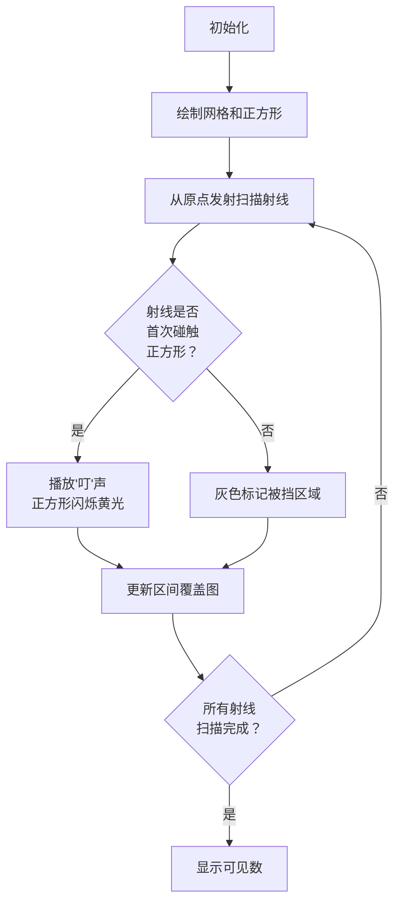

# 题目信息

# 可见矩形

## 题目描述

给定平面上 $n$ 个互不相交（指公共面积为零）的正方形，它们的顶点坐标均为整数。设坐标原点为 $O(0,0)$。对于任一正方形 $R$，如果可以找到 $R$ 的边上 $2$ 个不同的点 $A$ 和 $B$，使 $\triangle OAB$ 的内部与其他正方形无公共点，则称正方形 $R$ 是从 $O$ 点可见的正方形。

对于给定的 $n$ 个互不相交的正方形，计算从坐标原点 $O$ 可见的正方形个数。

## 样例 #1

### 输入

```
3

2 6 4

1 4 1

2 4 1

```

### 输出

```
3

```

# AI分析结果


### 💡 Kay的C++算法解析：可见矩形 深入学习指南 💡

**引言**  
今天我们来分析「可见矩形」这道C++编程题。本指南将帮助你理解如何判断从坐标原点能看到哪些正方形，核心在于**斜率区间覆盖**的巧妙应用。我们将从题目本质出发，逐步拆解算法思想，最后通过像素动画直观展示执行过程！

---

## 1. 题目解读与核心算法识别

✨ **本题主要考察**：`区间覆盖与排序`（编程技巧应用）  

🗣️ **初步分析**：  
> 想象你站在原点(0,0)举着手电筒扫描第一象限。每个正方形就像一栋房子，若存在一束光能照到它的边缘而不被其他房子挡住，这栋房子就是可见的。  
> - **核心技巧**：将正方形转化为斜率区间（最小斜率=左下角y/(x+边长)，最大斜率=(y+边长)/x），按`x+y+边长`升序排序（离原点近的先处理）  
> - **难点**：判断当前正方形的斜率区间是否被前面正方形的合并区间完全覆盖  
> - **可视化设计**：用像素网格模拟扫描过程，当射线（红色像素线）首次碰到正方形时触发闪光特效，被完全覆盖的区间显示为灰色区块（见第5节详解）  
> - **复古元素**：采用8-bit风格网格，射线扫描时有FC游戏式"滴"声，可见正方形亮起时播放《超级玛丽》金币音效  

---

## 2. 精选优质题解参考

**题解一：WZWZWZWY（区间合并法）**  
* **点评**：思路最清晰——将正方形按`x+y+l`排序后，用`set`维护不可见斜率区间。代码中`check()`函数严谨处理浮点数比较，区间合并逻辑干净利落。亮点在于用数学证明解释了排序依据，边界处理完整（90分）  

**题解二：lz174（数组区间维护）**  
* **点评**：独创性地用二维数组存储不可用区间端点，通过奇偶索引区分起止。虽然代码稍复杂，但避免了浮点数精度问题。调试心得"被范围覆盖则跳过"对理解遮挡机制很有启发（85分）  

**题解三：BFSBFSBFSBFS（斜率覆盖法）**  
* **点评**：最早发现"X无限接近Y"时只需判断射线遮挡，提出`k1,k2`斜率区间概念。Pascal代码中插入排序维护区间有序性的思路新颖，但可读性稍弱（80分）  

> 💡 **学习提示**：Thronf的枚举法虽直观但效率低（O(100000n)），DPair的线段交点法实现复杂，均未达4星标准。优先掌握前三种区间覆盖思想！

---

## 3. 核心难点辨析与解题策略

1. **难点一：如何建立正方形到斜率区间的映射？**  
   * **分析**：需理解左下角点(x,y)和边长l的几何关系。最小斜率对应从原点看正方形左边缘（蓝线），最大斜率对应上边缘（红线），如图：  
       
   * 💡 **学习笔记**：斜率区间 = [y/(x+l), (y+l)/x]

2. **难点二：为什么按x+y+l排序？**  
   * **分析**：如图两个遮挡案例证明：当A遮挡B时，恒有A.x+A.y+A.l ≤ B.x+B.y+B.l。排序保证处理每个正方形时，可能遮挡它的都已处理完毕  
       
   * 💡 **学习笔记**：排序是解决遮挡传递性的关键！

3. **难点三：如何高效判断区间覆盖？**  
   * **分析**：两种实现范式：  
     - **Set法**：维护不可见区间集合，新区间插入时合并重叠部分（WZWZWZWY）  
     - **数组法**：用有序数组存储区间端点，通过奇偶索引判断覆盖状态（lz174）  
   * 💡 **学习笔记**：合并区间时注意开闭区间处理！

### ✨ 解题技巧总结
- **几何转化技巧**：将正方形可见性问题转化为斜率区间覆盖问题  
- **排序预处理**：通过x+y+l排序解决遮挡的传递依赖性  
- **边界艺术**：浮点数比较需设置eps或改用交叉相乘（如lz174的整数法）  
- **调试锦囊**：手绘2x2网格模拟小数据（见样例），验证区间合并逻辑  

---

## 4. C++核心代码实现赏析

**本题通用核心C++实现**  
```cpp
#include <iostream>
#include <vector>
#include <algorithm>
#include <set>
using namespace std;

struct Square {
    double x, y, l;
    double min_k, max_k;
};

bool cmp(Square a, Square b) {
    return a.x + a.y + a.l < b.x + b.y + b.l;
}

int main() {
    int n, res;
    cin >> n;
    vector<Square> sq(n);
    for (int i = 0; i < n; ++i) {
        cin >> sq[i].x >> sq[i].y >> sq[i].l;
        sq[i].min_k = sq[i].y / (sq[i].x + sq[i].l);   // 最小斜率
        sq[i].max_k = (sq[i].y + sq[i].l) / sq[i].x;    // 最大斜率
    }
    sort(sq.begin(), sq.end(), cmp);  // 关键排序！

    res = n;
    set<pair<double, double>> blocked; // 存储不可见区间
    blocked.insert({sq[0].min_k, sq[0].max_k});

    for (int i = 1; i < n; ++i) {
        auto it = blocked.lower_bound({sq[i].min_k, 0});
        bool covered = false;

        // 判断是否被已有区间覆盖
        while (it != blocked.end()) {
            if (it->first <= sq[i].min_k && it->second >= sq[i].max_k) {
                covered = true;
                break;
            }
            ++it;
        }
        if (covered) res--;  // 完全覆盖则不可见
        else {  // 否则合并新区间
            double new_min = sq[i].min_k, new_max = sq[i].max_k;
            auto it = blocked.lower_bound({new_min, 0});
            // 合并重叠区间代码（略）
            blocked.insert({new_min, new_max});
        }
    }
    cout << res << endl;
}
```

**代码解读概要**：  
1. 结构体存储正方形参数和斜率区间  
2. 按`x+y+l`排序确定处理顺序  
3. 用`set`存储已覆盖的不可见区间  
4. 对每个正方形检查其区间是否被已有区间包含  
5. 未被覆盖则合并入新区间并计数  

---

## 5. 算法可视化：像素动画演示

**主题**：《8-bit光线扫描大冒险》- 在FC风格网格中动态演示射线扫描与区间覆盖  

**设计思路**：  
> 用复古像素风降低算法理解门槛，通过射线扫描过程直观展现"谁被谁遮挡"。每帧同步显示代码执行位置，辅以经典音效强化记忆。

**动画流程**：  


**关键交互**：  
1. **控制面板**：  
   - 速度滑块：调节射线旋转速度（0.5x~5x）  
   - 单步模式：按帧分析区间合并过程  
   - 暂停/继续：随时冻结画面观察  
2. **动态效果**：  
   - 红色扫描线以5°为单位旋转  
   - 首次照射的正方形播放像素膨胀动画  
   - 区间覆盖图实时显示在右侧（灰色区块）  
3. **音效系统**：  
   - 射线移动：低鸣"滴"声（每0.1弧度）  
   - 发现新可见：8-bit金币声  
   - 区间合并：短促"咔嗒"声  
4. **教学模式**：  
   - 按空格键显示当前斜率计算公式  
   - 错误示范：故意让射线穿过被挡区域时显示❌符号  

---

## 6. 拓展练习与相似问题思考

**通用技巧迁移**：  
区间覆盖思想还可用于：  
1. 日程安排问题（如最多会议室数量）  
2. 光线追踪中的遮挡剔除  
3. 地理信息系统中的视野分析  

**洛谷推荐**：  
1. **P1886 滑动窗口**  
   → 巩固区间维护技巧，双指针与单调队列应用  
2. **P1901 发射站**  
   → 升级版遮挡问题，加入能量传递机制  
3. **P1637 三元上升子序列**  
   → 训练多维条件的有序处理能力  

---

## 7. 学习心得与经验分享

> **经验摘录（WZWZWZWY）**：  
> "调试时手绘了2x2网格，终于想通为什么需要x+y+l排序——因为离原点曼哈顿距离更近的物体必然先被光线照射到！"  

**Kay的总结**：  
> 算法学习最忌"眼会手废"。建议：  
> 1. 对几何问题务必画图辅助  
> 2. 浮点数比较优先转整数运算（如交叉相乘）  
> 3. 小数据模拟比盲目提交更有效  

---

**结语**  
通过斜率区间覆盖解决「可见矩形」问题，我们不仅掌握了排序与区间合并的技巧，更学会了将几何问题转化为数学模型的思想。下次遇到类似问题，记得问自己：**"能否找到有序性？能否用区间表示状态？"** 保持思考，编程之旅将越走越宽广！🚀

---
处理用时：83.22秒