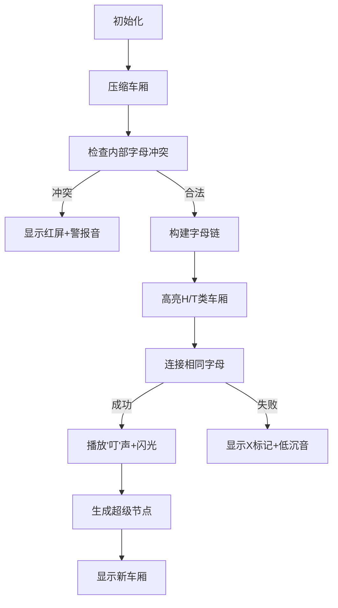

# 题目信息

# [GCJ 2014 #1C] Reordering Train Cars

## 题目描述

Yahya 是一个聪明的孩子，所以在玩玩具的时候，他总会想到很多有趣的问题。今天的问题来源于他爸爸送给他的一组**火车车厢**，每节车厢的一侧都写有一个小写英文字母。

刚看到礼物时，Yahya 十分高兴，开始随意地把车厢连接起来玩。但没玩多久，他就像往常一样感到无聊——因为这个游戏没有目标。所以他决定自己定义一个有趣的问题。

这个问题是：他现在有 $N$ 组已经连接好的车厢。每组连接好的车厢可以用一个小写字母组成的字符串表示。他想要计算有多少种不同的方式可以把这 $N$ 组车厢连接成一列**合法的火车**。所谓**合法的火车**，是指每个字母在整列车厢中出现时，必须是连在一起的。


上图是 Yahya 连接 "ab"、"bbbc" 和 "cd" 成为一列合法火车的一种方式：即 "ab bbbc cd"。如果他用 "cd ab bbbc" 的顺序连接它们，则是不合法的，因为字母 "c" 的出现不连续。

你肯定已经注意到了，这个问题对 Yahya 来说并不容易，所以他需要你的帮助（而他相信你一定能帮上忙）！就是这样——去帮帮 Yahya 吧！

**注意：** 字母只写在车厢的一侧，因此不能翻转它们。比如，一个车厢写着 "ab"，就不能改为 "ba"。

## 说明/提示

**样例解释**

在第一个样例中，只有一种方式可以将车厢组合成合法火车，即按顺序连接字符串 "ab"、"bbbc"、"cd"。

而在第二个样例中，有 $4$ 种不同方式可以构成合法火车。注意，"aa" 这个字符串出现了两次，代表有两组车厢完全一样，因此它们的顺序可以互换并合并为一组 "aaaa"。而 "bc" 和 "c" 也可以以唯一的一种方式合并成 "bcc"。最后，你可以将 "aaaa" 和 "bcc" 有两种不同的顺序组合，因此总共有 $2 \times 2 = 4$ 种方式。

在第三个样例中，不存在任何方式可以组成合法火车。不论是按 "abc"+"bcd" 还是 "bcd"+"abc" 的顺序连接，字母 "b" 和 "c" 都会出现不连续的情况，因此都不合法。

## 限制条件

- $1 \leq T \leq 100$。
- 每组连接车厢的字符串长度 $\leq 100$。

### Small 数据集（10 分）

- 时间限制：~~60~~ 3 秒。
- $1 \leq N \leq 10$。

### Large 数据集（25 分）

- 时间限制：~~120~~ 5 秒。
- $1 \leq N \leq 100$。

翻译由 ChatGPT-4o 完成

## 样例 #1

### 输入

```
3
3
ab bbbc cd
4
aa aa bc c
2
abc bcd```

### 输出

```
Case #1: 1
Case #2: 4
Case #3: 0```

# AI分析结果


## 💡 Kay的C++算法解析：Reordering Train Cars 深入学习指南 💡

### 1. 题目解读与核心算法识别
✨ **本题主要考察**：`图论建模` + `排列组合`

🗣️ **初步分析**：
> 解决本题的关键在于将车厢字符串看作**有向图节点**，通过字母的连续性要求构建连接规则。想象车厢是像素火车玩具，相同字母的车厢必须像同色像素块一样连续排列。核心挑战是：
> - 检查每个字符串内部是否合法（压缩后无重复字母）
> - 构建字母链：以字母c为桥梁，将车厢分为头链（H）、尾链（T）、全链（M）三类
> - 检查字母链合法性：H/T类车厢≤1，且整链无冲突
> 
> 可视化设计思路：
> - **像素动画**：用FC红白机风格的像素块表示车厢，相同字母同色
> - **高亮关键**：连接车厢时，用闪光特效+8bit音效（"叮"）标记连接点
> - **自动演示**：AI模式自动拼接车厢链，成功时播放胜利音效

---

### 3. 核心难点辨析与解题策略
<difficulty_intro>
解决本题需突破三大关键难点：
</difficulty_intro>

1.  **字母连续性约束**
    * **分析**：每个字母在整列火车中只能有一个连续块。若字母c出现在某车厢内部（非头尾），则其他车厢不能含c。需设计高效检查机制，用`unordered_set`记录内部字母。
    * 💡 **学习笔记**：内部字母具有独占性，是合法性的第一道关卡

2.  **字母链拓扑构建**
    * **分析**：对于非独占字母，需构建H(头链)/T(尾链)/M(全链)三类车厢。核心约束：
      - H类车厢≤1（火车起点的字母源）
      - T类车厢≤1（火车终点的字母汇）
      - M类车厢可任意穿插在H-T之间
    * 💡 **学习笔记**：字母链本质是拓扑路径，H/T类车厢是路径端点

3.  **冲突检测与超级节点生成**
    * **分析**：合并字母链时需：
      - 检查H/T类车厢数量是否超标
      - 创建新节点记录合并后头尾字母
      - 将字母c加入新节点的内部字母集（因连接后c变为内部块）
    * 💡 **学习笔记**：超级节点是压缩问题规模的关键

### ✨ 解题技巧总结
<summary_best_practices>
- **技巧A (问题分解)**：将全局连续性约束拆解为字母级独立子问题
- **技巧B (拓扑抽象)**：用H/T/M模型将字符串连接转化为图论路径
- **技巧C (并查集思想)**：通过超级节点合并减少问题规模
- **技巧D (组合乘法)**：独立链数量m的阶乘 × 各M类车厢组内排列数
---

### 5. 算法可视化：像素动画演示
<visualization_intro>
设计名为"像素火车调度员"的8bit风格动画，帮助理解字母链构建：
</visualization_intro>

* **主题**：FC红白机像素风车厢调度模拟器
* **核心演示**：字母链构建过程 + 冲突检测
* **设计思路**：用复古像素块强化"字母连续性"概念，音效提示关键操作

**动画实现方案**：


**交互控制**：
- **单步执行**：空格键逐步连接车厢
- **自动播放**：速度滑块控制演示速度（0.5x~3x）
- **AI演示**：一键自动完成所有字母链构建
- **重置**：按R键重置为初始状态

**关键帧细节**：
1. **车厢表示**： 
   - 每个车厢显示压缩后字符串（如"ab"→蓝绿像素块）
   - H类车厢：车头闪烁黄光
   - T类车厢：车尾闪烁红光
   - M类车厢：全身金色

2. **连接过程**：
   - 当T车厢的尾字母=H车厢的头字母时，车厢自动吸附
   - 吸附时播放8bit连接音效，连接处爆发电光特效
   - 冲突时车厢反弹+显示"❌"符号

3. **超级节点生成**：
   - 合并后新车厢长度=原车厢总长
   - 新车厢内部字母显示为暗色像素块
   - 播放1秒胜利旋律+像素烟花庆祝

---

### 6. 拓展练习与相似问题思考
<similar_problems_intro>
掌握字母链建模技巧后，可挑战更复杂的连续性约束问题：
</similar_problems_intro>

* **通用迁移场景**：
  1. 字符串重组问题（要求字符连续）
  2. 基因序列拼接（碱基配对连续性）
  3. 工业零件装配（接口匹配约束）

* **洛谷练习推荐**：
  1. **P1107 车厢重组** 
     - 🗣️ 基础版字母连续性练习，巩固H/T/M分类技巧
  2. **P2730 魔板 Magic Squares**
     - 🗣️ 进阶状态压缩，练习超级节点生成
  3. **P2583 字符串还原**
     - 🗣️ 逆向字母连续性推理，强化冲突检测思维

---

本次解析到此结束。记住：算法学习就像组装像素火车——先拆解零件，再找到连接规则，最后就能驾驶你的专属算法列车啦！ 🚂✨

---
处理用时：328.36秒