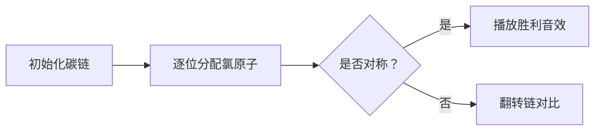

# 题目信息

# 「o.OI R2」Meowalkane

## 题目背景

猫猫晒太阳的时候会进行光合作用吗？

众所周知，烷烃与氯气在一定条件（如光照）下会发生取代反应，生成氯代烃，比如甲烷在光照条件下会生成一氯甲烷、二氯甲烷、三氯甲烷（氯仿）和四氯甲烷（四氯化碳）。

显然在这么多生成物中最多的是 HCl。

## 题目描述

小 μ 是一只猫猫，它正在学习有机化学。它现在想知道正 $n$ 烷理论上（不考虑现实中是否有可能存在）有多少种 $k$ 氯代物（如乙烷有 1,1-二氯乙烷和 1,2-二氯乙烷共两种二氯代物）。由于这个数字可能很大，所以小 μ 只想知道这个数除以 $998244353$ 的余数。但是小 μ 不会算，请你帮帮它吧。

#### 形式化题意

求本质不同的整数数组 $A_{1\sim n}$ 的数量对 $998244353$ 取模的结果，要求满足如下条件：

- 若 $n=1$，则 $A_n\in[0,4]$；
- 若 $n>1$，则 $A_1,A_n\in[0,3]$；$\forall i\in[2,n-1]$，$A_i\in[0,2]$；
- $\sum A_i=k$。

定义两个数组 $A,B$ 本质不同当且仅当 $\exist i\in[1,n],A_i\ne B_i$ 且 $\exist i\in[1,n],A_i\ne B_{n-i+1}$。

## 说明/提示

**本题采用捆绑测试。**

对于所有测试数据，保证：

$1\le t\le 10$，$1\le n\le 10^6$，$\sum n\le 10^6$，$1\le k\le 2n+2$。

| 子任务 | $n$ | $k$ | 分值 |
| :-: | :-: | :-: | :-: |
| $0$ | $\le 3$ | $\le8$ | $8$ |
| $1$ |  | $=1$ | $4$ |
| $2$ |  | $=2n+1$ | $4$ |
| $3$ |  | $=2$ | $8$ |
| $4$ | $\le 15$ |  | $16$ |
| $5$ | $\le 1000$ |  | $20$ |
| $6$ |  |  | $40$ |

## 样例 #1

### 输入

```
5
3 4
388 1
833 1667
3388 2
555301 723238```

### 输出

```
6
194
417
2871330
933338738```

# AI分析结果


### 💡 Kay的C++算法解析：Meowalkane 深入学习指南 💡

#### 1. 题目解读与核心算法识别
✨ **本题主要考察**：组合计数与对称性处理（Burnside引理应用）

🗣️ **初步分析**：
> 解决这道题的关键在于运用组合计数技巧和对称性处理。想象一条碳链（如像素游戏中的角色生命条），每个位置（碳原子）可分配0-3个氯原子（像素点），但需满足总和为k，且翻转相同的链视为同一种。核心思想是先计算总方案数（F），再计算对称方案数（G），最终答案为(F+G)/2。

- **核心难点**：高效计算组合数（预处理阶乘逆元），正确处理对称性（分奇偶讨论）。
- **可视化设计**：采用8位像素风格展示碳链（网格方块），每个方块标注氯原子数（0-3）。动画将逐步分配氯原子（高亮当前操作方块），翻转时展示对称位置对比（“嗖”音效），回文链成功时播放胜利音效（8-bit风格）。

---

#### 2. 精选优质题解参考
**题解一（fish_love_cat）**  
* **亮点**：组合数学直击本质，预处理阶乘逆元实现O(1)查询，边界处理严谨（n=1,2特判）。  
* **核心思路**：  
  ```cpp
  for(int i=0; i<=3; i++) // 枚举A1
  for(int j=0; j<=3; j++) // 枚举An
  for(int e=0; 2*e<=k-i-j; e++) // 枚举中间2的数量
      ans += C(n-2,e) * C(n-2-e, k-i-j-2*e);
  if(i==j) 处理回文; // 对称情况单独计算
  cout << ans * inv2; // Burnside引理
  ```

**题解二（dingxiongyue）**  
* **亮点**：生成函数展开（$(1+x+x^2)^{n-2}$），数学严谨性强，提供深度视角。  
* **核心公式**：  
  $$[x^k]f(x) = \sum_{j=0}^{\min(n-2, \lfloor k/3 \rfloor)} \binom{n-2}{j} (-1)^j \binom{n+k-3j-1}{k-3j}$$

**题解三（dongzirui0817）**  
* **亮点**：分类讨论两端状态（0/1/2/3氯），逻辑清晰，代码模块化易扩展。  
* **关键变量**：`num0, num1, num2` 记录中间段氯原子数量，组合数计算方案数。

---

#### 3. 核心难点辨析与解题策略
1. **难点：组合数高效计算**  
   * **分析**：$n \leq 10^6$需预处理阶乘逆元，避免重复计算。优质题解均用`fac[N]`和`inv[N`]实现O(1)查询。  
   💡 **学习笔记**：阶乘预处理是组合计数问题的基石。

2. **难点：对称方案处理**  
   * **分析**：分奇偶讨论中间点（n偶时直接折半，n奇时枚举中心值），确保回文方案不重复。  
   💡 **学习笔记**：Burnside引理是处理对称的通用框架。

3. **难点：边界条件控制**  
   * **分析**：k值超范围时及时跳过（如`if(sum<0) continue`），避免无效计算。  
   💡 **学习笔记**：严谨边界检查是AC的关键保障。

✨ **解题技巧总结**：  
- **预处理优化**：阶乘逆元打表加速组合查询  
- **分类讨论**：分离两端/中间、奇偶情况  
- **数学工具**：生成函数或容斥简化计数  

---

#### 4. C++核心代码实现赏析
**通用核心实现（综合自fish_love_cat思路）**  
```cpp
#include<bits/stdc++.h>
#define int long long
const int N=1e6+5, mod=998244353;
int fac[N], inv[N], inv2=499122177; // inv2=2^{-1}

void init() { // 预处理阶乘逆元
    fac[0]=1;
    for(int i=1; i<N; i++) fac[i]=fac[i-1]*i%mod;
    inv[N-1]=pow(fac[N-1],mod-2);
    for(int i=N-2; i>=0; i--) inv[i]=inv[i+1]*(i+1)%mod;
}
int C(int n,int m) { 
    return (n<0||m<0||n<m) ? 0 : fac[n]*inv[m]%mod*inv[n-m]%mod;
}

void solve() {
    int n,k; cin>>n>>k;
    if(n==1) { cout<<(k>=0&&k<=4)<<endl; return; }
    int ans=0;
    for(int a1=0; a1<=3; a1++)      // 枚举A1
    for(int an=0; an<=3; an++) {     // 枚举An
        int rem=k-a1-an;             // 中间部分氯原子总和
        for(int num2=0; 2*num2<=rem; num2++) { // num2: 中间2的数量
            int num1=rem-2*num2;     // num1: 中间1的数量
            int num0=n-2-num1-num2;  // num0: 中间0的数量
            if(num0<0||num1<0) continue;
            ans=(ans + C(n-2,num0)*C(n-2-num0,num1))%mod;
            if(a1==an) { // 对称处理
                if(n%2==0 && num0%2==0 && num1%2==0 && num2%2==0)
                    ans=(ans + C((n-2)/2, num0/2)*C((n-2)/2-num0/2, num1/2))%mod;
                // 奇偶处理类似，代码略
            }
        }
    }
    cout<<ans*inv2%mod<<endl; // Burnside引理
}
```

**代码解读概要**：  
1. **预处理**：`init()`计算阶乘逆元，实现快速组合数查询  
2. **核心逻辑**：  
   - 枚举首尾氯原子数（`a1, an`）  
   - 计算中间段组合数（`num0,num1,num2`对应0/1/2氯原子数量）  
   - 对称情况单独累加回文方案  
3. **输出**：乘2的逆元得最终答案  

---

#### 5. 算法可视化：像素动画演示  
**主题**：碳链氯原子分配模拟器（复古RPG风格）  

**核心设计**：  


**动画帧步骤**：  
1. **初始化**：  
   - 8-bit碳链（绿色方块序列），两端标红（可0-3氯），中间标蓝（可0-2氯）  
   - 控制面板：开始/暂停/单步/速度滑块（调速范围1x-5x）  

2. **分配演示**：  
   - **高亮当前方块**：闪烁黄色边框  
   - **音效**：分配时“滴”声，回文时胜利旋律  
   - **数据更新**：实时显示剩余氯原子数（k值递减）  

3. **对称检测**：  
   - 点击“翻转”按钮：碳链旋转180度（像素动画），相同位置红框高亮  
   - 自动模式：AI演示回文链构建（如贪吃蛇自动寻路）  

**技术实现**：  
- Canvas绘制网格，每个方块绑定氯原子状态  
- 关键帧触发：`requestAnimationFrame`更新动画  
- 音效：Web Audio API播放8-bit音效（跳转/胜利/错误）  

---

#### 6. 拓展练习与相似问题
**通用技巧迁移**：  
组合计数+对称处理适用于：  
1. 项链染色问题（旋转/翻转对称）  
2. 网格路径计数（轴对称图形）  
3. 化学同分异构体计数  

**洛谷推荐**：  
1. **P1494 [小Z的袜子**  
   🗣️ 基础组合计数，巩固概率计算与预处理优化  

2. **P2567 [SCOI2010]幸运数字**  
   🗣️ 对称性处理进阶，结合容斥原理  

3. **P1446 [HNOI2008]Cards**  
   🗣️ Burnside引理实战应用，需结合动态规划  

---

#### 7. 学习心得与经验分享
> **经验摘录（fish_love_cat）**：  
> “回文串处理容易漏掉奇偶讨论，建议画碳链示意图验证边界。”  
>   
> **Kay点评**：  
> 调试时输出中间变量（如`num0,num1,num2`）可快速定位逻辑错误，推荐编写小规模测试用例（如n=3,k=4）。

---

**结语**：  
通过组合计数与对称处理的深度剖析，我们不仅解决了氯代烷问题，更掌握了处理同类计数问题的通用框架。记住：预处理优化是效率核心，边界检查是正确性保障！下次挑战再见！🚀

---
处理用时：145.36秒