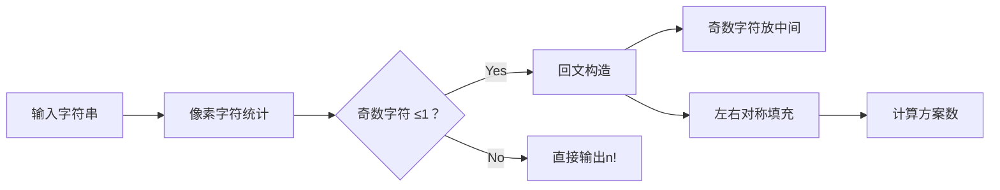

# 题目信息

# [CSP-J2019 江西] 非回文串

## 题目描述

Alice 有 $n$ 个字符，它们都是英文小写字母，从 $1 \sim n$ 编号，分别为 $c_1,c_2, \dots , c_n$。  
Bob 准备将这些字符重新排列，组成一个字符串 $S$。Bob 知道 Alice 有强迫症，所以他打算将 $S$ 组成一个非回文串来折磨 Alice。  

现在 Bob 想知道他共有多少种不同的排列字符的方案，能使得 $S$ 是个非回文串。一种排列字符的方案指的是一个 $1 \sim n$ 的排列 $p_i$，它所组成的 $S = c_{p_1}c_{p_2} \dots c_{p_n}$。

一个字符串是非回文串，当且仅当它的逆序串与原串不同。例如 `abcda` 的逆序串为 `adcba`，与原串不同，故 `abcda` 是非回文串。而 `abcba` 的逆序串与原串相同，是回文串。

由于最后的结果可能很大，你只需要告诉 Bob 总方案数对 $10^9+7$ 取模后的值。

## 说明/提示

【数据范围】  
对于 $20\%$ 的数据，$n \le 8$；  
对于 $50\%$ 的数据，$n \le 20$；  
另有 $30\%$ 的数据，字符只包含 `a` 和 `b`；  
对于 $100\%$ 的数据，$3 \le n \le 2000$。

## 样例 #1

### 输入

```
3
aba```

### 输出

```
4```

## 样例 #2

### 输入

```
8
aabbbbcc```

### 输出

```
39168```

# AI分析结果


# 💡 Kay的C++算法解析：非回文串 深入学习指南 💡

## 1. 题目解读与核心算法识别

✨ **本题主要考察**：组合数学与逆元应用

🗣️ **初步分析**：
> 解决"非回文串"这道题，关键在于运用**组合数学**技巧。想象你在组装一个对称的乐高城堡（回文串），左右两边必须使用完全相同的积木块（字符）。本题需要计算所有不对称城堡（非回文串）的建造方案数。
>
> - **核心思路**：总方案数(n!)减去回文串方案数。回文串需满足：①最多一种字符出现奇数次（放中间）②其余字符成对出现
> - **难点突破**：计算回文串时，需用组合公式处理重复排列：∏(cnt_i!/(cnt_i/2)!)
> - **可视化设计**：像素动画将展示字符频次统计→奇偶性判断→回文串构造（对称填充+中间位）→最终方案计算。关键步骤高亮：奇数字符标记红色，对称填充时左右区块用对比色
> - **复古游戏化**：采用8-bit音效（字符统计："滴"；奇偶判断："叮"；成功构造："胜利旋律"）。控制面板支持步进/自动播放，速度可调

---

## 2. 精选优质题解参考

**题解一（NaCly_Fish）**
* **点评**：思路直击本质，推导出最简公式`n! - (n/2)!*∏(cnt_i!/(cnt_i/2)!)`。代码亮点在于高效预处理阶乘和逆元，边界处理严谨（奇数计数>1时直接返回n!）。变量名`fac`/`ifac`含义明确，O(n)复杂度完美匹配数据范围。

**题解二（旭日临窗）**
* **点评**：通过分步图解阐释组合数学原理（见图），特别强调排列(A)与组合(C)的区别。代码亮点在于模块化设计：`jc()`和`jc1()`分离阶乘计算，`ou()`/`ji()`处理奇偶情况。实践时需注意负数取模修正。

**题解三（无钩七不改名）**
* **点评**：给出最简洁的公式实现，突出核心逻辑。亮点在于高效计算：合并阶乘循环避免重复计算，利用`__builtin_expect`优化分支预测。学习其用`(tt-ans+mod)%mod`处理负数取模的技巧。

---

## 3. 核心难点辨析与解题策略

1.  **字符频次奇偶性判断**
    * **分析**：回文串要求最多一个奇数字符。优质题解统一采用`cnt[i]&1`位运算快速判断，并用`odd`计数器统计（超过1则直接返回n!）
    * 💡 学习笔记：位运算判断奇偶比取模更高效，是竞赛常用技巧

2.  **回文串方案公式推导**
    * **分析**：核心公式包含三部分：①左边排列方案`(n/2)!` ②字符分组方案`∏(cnt_i!/(cnt_i/2)!)` ③奇数字符中间位选择（乘对应cnt_i）。难点在于理解分母`(cnt_i/2)!`消除重复排列
    * 💡 学习笔记：多重集排列公式`n!/(n1!n2!..nk!)`是处理重复字符的关键

3.  **大数取模与逆元应用**
    * **分析**：公式中存在除法取模，需用费马小定理求逆元。题解普遍采用`power(fac[n], p-2)`计算模逆元，SegTree题解还给出了组合数预处理的优化方案
    * 💡 学习笔记：模质数P下的除法→乘逆元，`a/b ≡ a*b^(P-2) mod P`

### ✨ 解题技巧总结
- **正难则反**：当直接计算困难时（如非回文串），转为计算补集（总方案-回文串）
- **组合数学建模**：将字符串对称性转化为多重集排列问题
- **边界防御性编程**：特别注意`n`为偶数时不能有奇数字符，负数取模需`(x+mod)%mod`
- **复杂度优化**：预处理阶乘和逆元避免重复计算

---

## 4. C++核心代码实现赏析

**本题通用核心C++实现参考**
* **说明**：综合优质题解优化，包含费马小定理求逆元与边界处理
* **完整核心代码**：
```cpp
#include <bits/stdc++.h>
using namespace std;
typedef long long ll;
const ll mod = 1e9 + 7;

ll qpow(ll a, ll b) {
    ll res = 1;
    while (b) {
        if (b & 1) res = res * a % mod;
        a = a * a % mod;
        b >>= 1;
    }
    return res;
}

int main() {
    int n; string s;
    cin >> n >> s;
    
    // 预处理阶乘和逆元
    vector<ll> fac(n + 1), ifac(n + 1);
    fac[0] = 1;
    for (int i = 1; i <= n; ++i) fac[i] = fac[i - 1] * i % mod;
    ifac[n] = qpow(fac[n], mod - 2);
    for (int i = n - 1; i >= 0; --i) ifac[i] = ifac[i + 1] * (i + 1) % mod;

    // 统计字符频次
    vector<int> cnt(26, 0);
    for (char c : s) cnt[c - 'a']++;

    // 检查奇数字符数量
    int odd = 0, mid = 1;
    for (int x : cnt) odd += (x & 1);
    if (odd > 1) {
        cout << fac[n];
        return 0;
    }

    // 计算回文串方案
    ll palin = fac[n / 2]; 
    for (int i = 0; i < 26; ++i) {
        if (cnt[i] & 1) mid = cnt[i]; // 记录奇数字符
        palin = palin * fac[cnt[i]] % mod * ifac[cnt[i] / 2] % mod;
    }
    if (odd) palin = palin * mid % mod; // 奇数字符中间位选择

    cout << (fac[n] - palin + mod) % mod;
}
```
* **代码解读概要**：
  1. 预处理阶乘数组`fac`和逆元数组`ifac`实现O(1)查询
  2. `cnt`数组统计26个字母频次，`odd`计数奇数字符
  3. 存在多个奇数字符时直接输出`n!`
  4. 回文串方案 = 左边排列方案 × 字符分组方案 × 奇数字符选择
  5. 最终结果 = `n! - palin`，注意负数取模修正

**题解一（NaCly_Fish）片段赏析**
* **亮点**：高效逆元预处理与变量名自解释
* **核心代码片段**：
```cpp
ifac[n] = power(fac[n], p-2);
for (reg int i = n - 1; i > 1; --i)
    ifac[i] = (ll)ifac[i + 1] * (i + 1) % p;
```
* **代码解读**：逆元预处理采用反向递推`ifac[i] = ifac[i+1]*(i+1)`，比单独用快速幂更高效。`reg int`关键字提示编译器优先使用寄存器变量，优化循环性能。

**题解二（旭日临窗）片段赏析**
* **亮点**：图解辅助理解排列/组合区别
* **核心代码片段**：
```cpp
ans *= jc1(mp[c[i]]); // 计算 cnt_i! / (cnt_i/2)!
ans = ans * jc(n / 2) % mod; 
```
* **学习笔记**：`jc1`函数计算从`(cnt_i/2+1)`到`cnt_i`的连乘，等价于`cnt_i!/(cnt_i/2)!`，避免大数阶乘溢出风险。

---

## 5. 算法可视化：像素动画演示

**主题**：8-bit字符拼图工坊  
**核心演示**：回文串构造过程 → 非回文方案计算  



**动画设计**：
1. **初始化**：FC红白机风格界面，顶部控制面板（开始/步进/速度条）。字符显示为16×16像素块，不同字母用不同颜色
   
2. **字符统计**：
   - 输入字符串逐字符飞入底部统计栏（伴随"滴"声）
   - 奇数字符闪烁红光（如`a:5`），偶数字符显示绿光（`b:4`）

3. **奇偶校验**：
   - 两个以上奇数字符时：弹出"X"图标+警告音
   - 校验通过：显示绿色√+通过音效

4. **回文构造**：
   ```python
   # 伪代码：对称填充算法
   for 每种字符:
      左侧位置 = 从可用槽位选 cnt/2 个  # 组合操作(C)
      填充左侧位置（像素块从统计栏飞入）
      右侧对称位置自动镜像填充（半透明效果）
      播放"叮"声，统计栏数字减少
   ```
   - 奇数字符：单独中心位置高亮金框

5. **方案计算**：
   - 左侧显示公式：`n! - (∏公式)`
   - 每步计算时，对应参数闪烁黄框
   - 完成时显示结果数字，播放胜利旋律

**交互设计**：
- 步进控制：空格键单步，→键自动播放
- 速度条：调整自动播放速度（0.5x~2x）
- 模式切换：对比回文/非回文构造过程

---

## 6. 拓展练习与相似问题思考

**通用技巧迁移**：  
组合数学技巧还可用于：
1. 有限重复元素的排列问题（如P1706）
2. 带约束的字符串构造（如P1157）
3. 概率计算中的方案计数（如P3163）

**洛谷推荐**：
1. **P1706 全排列问题**  
   🗣️ 巩固阶乘与递归枚举，理解排列本质

2. **P1157 组合的输出**  
   🗣️ 学习组合数实现，为复杂排列问题奠基

3. **P3197 越狱**  
   🗣️ 进阶练习补集思想，强化组合公式应用

---

## 7. 学习心得与经验分享

> **旭日临窗的调试经验**：  
> "我在处理负数取模时忘记`+mod`导致WA，建议用`(x+mod)%mod`防御性编程"

> **Kay的总结**：  
> 边界处理和模运算完整性是组合数学题的核心陷阱。建议：
> 1. 单独编写模逆元函数确保复用性
> 2. 测试极端数据：全相同字符、最大n=2000
> 3. 使用`assert((fac[n]-palin)>=0)`调试

--- 

掌握组合数学的核心在于将实际问题转化为数学模型。通过本次分析，希望大家能像拼乐高一样拆解复杂问题！下次挑战再见！🚀

---
处理用时：131.95秒