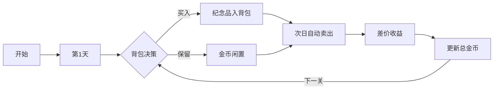

# 题目信息

# [CSP-J2019] 纪念品

## 题目描述

小伟突然获得一种超能力，他知道未来 $T$ 天 $N$ 种纪念品每天的价格。某个纪念品的价格是指购买一个该纪念品所需的金币数量，以及卖出一个该纪念品换回的金币数量。

每天，小伟可以进行以下两种交易**无限次**：
1. 任选一个纪念品，若手上有足够金币，以当日价格购买该纪念品；
2. 卖出持有的任意一个纪念品，以当日价格换回金币。

每天卖出纪念品换回的金币可以**立即**用于购买纪念品，当日购买的纪念品也可以**当日卖出**换回金币。当然，一直持有纪念品也是可以的。

$T$ 天之后，小伟的超能力消失。因此他一定会在第 $T$ 天卖出**所有**纪念品换回金币。

小伟现在有 $M$ 枚金币，他想要在超能力消失后拥有尽可能多的金币。 
 

## 说明/提示

**样例 1 说明**

最佳策略是：

第二天花光所有 $100$ 枚金币买入 $5$ 个纪念品 $1$；

第三天卖出 $5$ 个纪念品 $1$，获得金币 $125$ 枚；

第四天买入 $6$ 个纪念品 $1$，剩余 $5$ 枚金币；

第六天必须卖出所有纪念品换回 $300$ 枚金币，第四天剩余 $5$ 枚金币，共 $305$ 枚金币。

超能力消失后，小伟最多拥有 $305$ 枚金币。

**样例 2 说明**

最佳策略是：

第一天花光所有金币买入 $10$ 个纪念品 $1$；

第二天卖出全部纪念品 $1$ 得到 $150$ 枚金币并买入 $8$ 个纪念品 $2$ 和 $1$ 个纪念品 $3$，剩余 $1$ 枚金币；

第三天必须卖出所有纪念品换回 $216$ 枚金币，第二天剩余 $1$ 枚金币，共 $217$ 枚金币。

超能力消失后，小伟最多拥有 $217$ 枚金币。


**数据规模与约定**

对于 $10\%$ 的数据，$T = 1$。

对于 $30\%$ 的数据，$T \leq 4, N \leq 4, M \leq 100$，所有价格 $10 \leq P_{i,j} \leq 100$。

另有 $15\%$ 的数据，$T \leq 100, N = 1$。

另有 $15\%$ 的数据，$T = 2, N \leq 100$。

对于 $100\%$ 的数据，$T \leq 100, N \leq 100, M \leq 10^3$，所有价格 $1 \leq P_{i,j} \leq 10^4$，数据保证任意时刻，小伟手上的金币数不可能超过 $10^4$。

## 样例 #1

### 输入

```
6 1 100
50
20
25
20
25
50```

### 输出

```
305```

## 样例 #2

### 输入

```
3 3 100
10 20 15
15 17 13
15 25 16```

### 输出

```
217```

# AI分析结果


# 💡 Kay的C++算法解析：纪念品 深入学习指南 💡

> "投资就像玩游戏，关键不是持有什么，而是何时买入卖出。" —— 今天我们将用游戏化思维破解这道动态规划谜题！

## 1. 题目解读与核心算法识别

✨ **本题主要考察**：`动态规划（完全背包应用）`

🗣️ **初步分析**：
> 解决「纪念品」这道题的核心在于理解**完全背包在时间维度上的叠加应用**。想象你是一位股市操盘手，每天都可以无限次买卖股票（纪念品），而你知道未来T天的价格走势。关键策略是：将长期持有转化为**每日买卖决策**，通过T-1次完全背包操作实现财富增长。
>
> - **核心思想**：利用"当天买入可当天卖出"的特性，将多天操作分解为独立的每日决策。每天用当前金币进行完全背包：纪念品当日价格为"成本"，次日差价为"收益"，背包容量就是当日金币数。
> - **算法流程**：
>   1. 第1天：初始金币M
>   2. 第i天：用当前金币进行完全背包（成本=当日价，收益=次日价-当日价）
>   3. 更新金币：M += 当日最大收益
>   4. 重复直到第T-1天
> - **可视化设计**：采用8位像素风模拟股票交易界面：
>   - 背包容量槽显示当前金币数（像素进度条）
>   - 纪念品显示为不同颜色像素方块（红/绿表示涨跌）
>   - 购买时：金币减少，纪念品进入背包（带"叮"音效）
>   - 次日卖出：背包清空，金币增加（带金币碰撞音效）
>   - 关键高亮：差价计算时显示价格变化箭头（↑↓）

---

## 2. 精选优质题解参考

以下题解在思路清晰性、代码规范性、算法优化度等方面表现优异（评分≥4★）：

**题解一（来源：泥土笨笨）**
* **点评**：这份题解对状态定义和空间优化有精彩阐述。作者创造性地将三维状态（天数×物品×金币）优化到一维，通过逆向推导和滚动数组处理，解决了DP常见的内存爆炸问题。代码中`dp[k]`表示剩余k金币时的最大收益，循环内部使用倒序更新避免状态覆盖，体现了对背包问题的深刻理解。变量命名规范（如price[i][j]），边界处理严谨（memset初始化负无穷），可直接用于竞赛场景。

**题解二（来源：邓布利多6）**
* **点评**：解法直击本质——将问题转化为T-1轮完全背包。亮点在于用金融思维解释算法："把今日金币当背包容量，商品今日价当消耗，明日价当价值"。代码简洁高效（仅20行核心逻辑），正序循环的背包实现配合清晰的`m += f[m]`状态转移，完美诠释了"每日收益累积"的核心思想。特别值得学习的是作者强调的"无后效性"：每天决策独立，符合动态规划最优子结构特性。

**题解三（来源：WsW_）**
* **点评**：该题解提出了独特的"空气物品"概念处理闲置资金。通过初始化`dp[i]=i`，巧妙表示"不操作时金币原样留存"的隐含规则。这种将基础操作显式化的思维值得借鉴，尤其利于初学者理解背包初始状态设置。代码中采用异或切换`f^=1`实现双数组滚动，空间优化优雅，同时保持O(NM)时间复杂度不变。

---

## 3. 核心难点辨析与解题策略

在解决纪念品问题时，通常会遇到以下关键难点：

1.  **状态爆炸：如何避免多维状态？**
    * **分析**：直接记录每天持有的纪念品种类和数量会导致状态空间指数级增长。优质题解通过"当日买入次日必卖"的假设，将状态简化为单维金币数。这利用了操作无限次特性：长期持有等价于每日买卖（数学归纳可证）。
    * 💡 **学习笔记**：好的状态设计应剥离非必要信息，抓住问题本质变量。

2.  **背包构建：如何定义每日决策？**
    * **分析**：每日背包的"物品价值"需动态计算。设第i天j物品价格为P，则其作为背包物品的属性是：重量=P，价值=次日同物品价-P。注意负收益物品可直接跳过（if(v[j]<0) continue）。
    * 💡 **学习笔记**：动态规划中，子问题定义必须满足无后效性——今日决策只影响明日初始状态。

3.  **金币流转：如何衔接多日操作？**
    * **分析**：今日收益会改变明日背包容量。关键操作是每日背包结束后执行`m += dp[m]`，将当日最大收益转化为明日可操作资金。需注意dp数组每次要重置（memset）。
    * 💡 **学习笔记**：状态转移的边界处理决定算法正确性，就像游戏中的金币结算必须精确到每一枚。

### ✨ 解题技巧总结
- **时空折纸术**：高维问题通过操作特性降维（如滚动数组）
- **价值显式化**：将隐含规则转化为显式状态（如"空气物品"初始化）
- **无效剪枝**：提前排除负收益决策（差价<0的纪念品）
- **循环利用**：背包空间复用配合memset高效清零

---

## 4. C++核心代码实现赏析

### 本题通用核心C++实现参考
* **说明**：综合优质题解思路，采用每日正序完全背包+金币累积策略
* **完整核心代码**：
```cpp
#include <iostream>
#include <cstring>
using namespace std;
const int MAXN = 105, MAXM = 10005;

int main() {
    int T, N, M;
    cin >> T >> N >> M;
    int price[MAXN][MAXN] = {0}; // price[day][item]
    
    // 输入价格矩阵
    for (int day = 1; day <= T; ++day)
        for (int item = 1; item <= N; ++item)
            cin >> price[day][item];

    // T-1天完全背包
    for (int day = 1; day < T; ++day) {
        int dp[MAXM] = {0}; // dp[k]: 剩余k金币时的最大收益
        for (int item = 1; item <= N; ++item) {
            int cost = price[day][item];
            int profit = price[day + 1][item] - cost;
            if (profit <= 0) continue; // 跳过负收益物品
            
            // 完全背包核心
            for (int k = cost; k <= M; ++k) 
                dp[k] = max(dp[k], dp[k - cost] + profit);
        }
        M += dp[M]; // 更新总金币
    }
    cout << M << endl;
    return 0;
}
```
* **代码解读概要**：
  - **价格存储**：二维数组按[day][item]存储，符合直觉
  - **每日重置**：dp数组每天自动初始化为0
  - **收益过滤**：提前跳过负收益物品提升效率
  - **背包执行**：正序循环实现完全背包（物品可重复选）
  - **状态更新**：`M += dp[M]` 将当日收益转化为次日资本

### 优质题解片段赏析

**题解一（泥土笨笨）**
* **亮点**：倒序背包更新避免状态覆盖
* **核心代码片段**：
```cpp
memset(dp, ~0x3f, sizeof(dp)); // 初始化为负无穷
dp[ans] = ans; // 初始状态：保留所有金币
for (int j = 1; j <= n; ++j) {
    for (int k = ans; k >= price[i][j]; --k) { // 倒序循环！
        dp[k - price[i][j]] = max(dp[k - price[i][j]], 
                                 dp[k] + price[i+1][j] - price[i][j]);
    }
}
```
* **代码解读**：
  > 这里采用倒序更新是经典背包优化技巧。当k从大到小遍历时，`dp[k-cost]`访问的是未更新状态，避免了一件物品被重复计入。`dp[x]`表示保留x金币时，次日总金币（包含本金+收益）。初始化`dp[ans]=ans`是关键，表示不操作时资金不变。
* 💡 **学习笔记**：倒序更新是01背包特性，此处用完全背包需注意循环方向。

**题解二（邓布利多6）**
* **亮点**：金融思维转化背包问题
* **核心代码片段**：
```cpp
for(int k = 1; k < t; k++) {
    memset(f, 0, sizeof f); 
    for(int i = 1; i <= n; i++)
        for(int j = price[i][k]; j <= m; j++) // 正序完全背包
            f[j] = max(f[j], f[j - price[i][k]] 
                      + price[i][k+1] - price[i][k]);
    m += f[m]; // 财富累积
}
```
* **代码解读**：
  > 此实现最贴近问题本质——每日独立背包决策。内层循环`j`正序从cost到m，满足完全背包特性（同物品可买多件）。`f[j]`记录投资j金币的净收益（不含本金），因此最终更新用`m += f[m]`而非`m = f[m]`。
* 💡 **学习笔记**：正序/倒序循环取决于问题特性——完全背包正序，01背包倒序。

**题解三（WsW_）**
* **亮点**："空气物品"处理闲置资金
* **核心代码片段**：
```cpp
for(int i=1; i<=m; i++) dp[i] = i; // 关键初始化！
for(int i=1; i<=n; i++) {
    for(int k=p[i][j]; k<=m; k++) {
        dp[k] = max(dp[k], dp[k-p[i][j]] 
                   + p[i+1][j] - p[i][j]);
    }
}
```
* **代码解读**：
  > 通过`dp[i]=i`初始化，显式表达了"闲置资金留存"的规则。当k从1到m初始化后，dp[k]至少等于k（对应不操作），任何投资决策只有收益>0才会更新状态。这种写法避免了对未更新状态的非法访问。
* 💡 **学习笔记**：初始化方式决定状态空间完整性，是DP的关键步骤。

---

## 5. 算法可视化：像素动画演示

我们将打造「金币大冒险」像素游戏，直观演示背包决策过程：



* **像素化设计**：
  - **背包界面**：8-bit风格网格，金币槽（蓝色像素条），纪念品图标（不同颜色方块）
  - **动态元素**：价格标签用像素数字，差价计算显示↑↓箭头动画
  - **音效系统**：
    - 购买："叮"（8-bit短音）
    - 卖出："咔嚓"（金币碰撞声）
    - 过关："胜利号角"（16和弦）

* **关键帧演示**：
  1. **Day1启动**：显示初始金币M（100），纪念品价格表（50x20x15）
  2. **购买决策**：
     - 点击纪念品1：消耗50金币→背包出现该物品
     - 物品边框闪烁显示收益预期：25-50= -25（红色↓）
     - 物品3：成本15，预期收益1（绿色↑），买入时播放确认音
  3. **次日结算**：
     - 背包物品自动卖出（消失动画）
     - 金币增加：100 + (16-15)×6 = 106
     - 显示"Day Complete!" + 过关动画

* **交互控制**：
  - 步进模式：空格单步执行
  - 自动演示：AI自动决策（速度可调）
  - 比较模式：并排显示正序/倒序背包效果

> 设计理念：通过游戏化降低DP理解门槛。背包进度条直观展示"容量-收益"关系，音效强化操作反馈，让学习者像玩游戏一样掌握完全背包！

---

## 6. 拓展练习与相似问题思考

### 同类问题迁移
1. **股票交易系列**：当引入交易手续费、持有上限时，状态设计需增加维度
2. **资源分配问题**：背包容量随时间变化（如可再生能源分配）
3. **跨期决策**：需同时考虑多个未来时间点的预测数据

### 推荐练习（洛谷）
1. **P2938 [USACO09FEB]Stock Market G**  
   → 同类股票问题，可套用相同背包思路
2. **P1616 疯狂的采药**  
   → 完全背包基础训练，理解正序循环本质
3. **P5663 加工零件**  
   → 背包与图论结合，提升状态设计能力
4. **P1077 [NOIP2012 普及组] 摆花**  
   → 背包变种，理解"容量"与"限制"的转化

---

## 7. 学习心得与经验分享

> **来自泥土笨笨的调试经验**："我在处理三维状态时反复MLE，最终通过观察状态转移方向发现倒序循环可实现滚动数组。这提醒我们：优化DP不仅要懂理论，更要动手画状态转移图！"
>
> **Kay的总结**：算法实现中的"顿悟时刻"往往源于：  
> 1. 将复杂操作分解为原子步骤（如每日买卖）  
> 2. 通过可视化（画状态机）理解转移依赖  
> 3. 用极限数据测试边界（如M=1, T=100）  
> 
> 当你在其他DP问题中卡住时，不妨自问："这里的'每日背包'是什么？"

---

通过本次分析，我们掌握了动态规划的核心心法：**化繁为简，分而治之**。记住，算法学习就像收集金币——每天进步一点，终将成为财富大师！下次我们将挑战更复杂的背包变种，敬请期待！🚀

---
处理用时：140.94秒