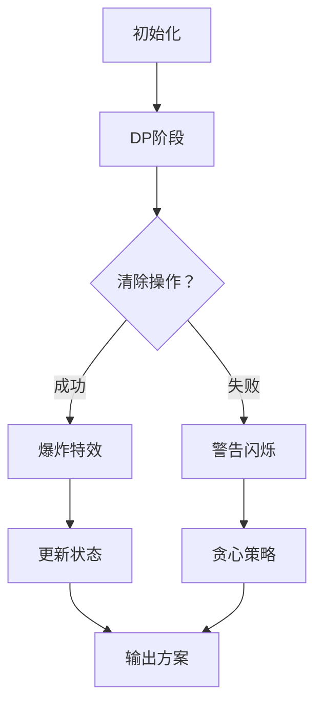

# 题目信息

# 「Diligent-OI R1 D」DlgtTemplate

## 题目背景

棋盘是用板子做成的。这题是棋盘的题，所以……

## 题目描述

有一个 $1$ 行 $n$ 个格子的棋盘编号 $1\sim n$，上面每个格子写着一个得分 $a_i$。

现在你需要**从左到右**依次地选择一些格子，可以不选。有些格子选了之后，会将当前选的最靠前的 $b_i$ 个格子清除为未选格子，但你**不能**回去把这些格子重新选上。特殊地，如果该格子之前的已选格子不到 $b_i$ 个，那么该格子以及该格子以后的格子**不会**被清除为未选格子。

请你找出一种从左到右选择的方案，使得已选格子的得分之和最大。

## 说明/提示

#### 【样例 #1 解释】

先选择第一个数 $1$，这时虽然 $b_1=1$，但是因为前面没有数，所以不会清除。

再选择第二个数 $1$，这时因为 $b_2=0$，所以不会清除。

再选择第三个数 $4$，这时因为 $b_3=0$，所以不会清除。

再选择第四个数 $5$，这时因为 $b_4=2$，所以选择的第一个数和第二个数会被清除为未选的数。

此时答案 $4+5=9$。方法不唯一。

#### 【数据范围与约定】

对于 $100\%$ 的数据，满足 $1\le n\le3000$，$|a_i|\le10^8$，$0\le b_i\le n$。

| Subtask 编号 | $n\le$ | 特殊性质 | 分值 |
| :----------: | :----------: | :----------: | :----------: |
| $0$ | $20$ | 无 | $25$ |
| $1$ | $500$ | 无 | $20$ |
| $2$ | $3000$ | $b_i>0$ | $5$ |
| $3$ | $3000$ | $b_i=0$ | $5$ |
| $4$ | $3000$ | $a_i=1$ | $15$ |
| $5$ | $3000$ | 无 | $30$ |

## 样例 #1

### 输入

```
6
1 1 4 5 1 4
1 0 0 2 1 1```

### 输出

```
4
1 2 3 4
9```

## 样例 #2

### 输入

```
13
-1 1 4 -5 -1 -4 1 9 -1 9 -8 -1 0
1 0 2 1 3 0 0 2 0 0 2 0 1```

### 输出

```
5
1 2 7 8 10 
19```

## 样例 #3

### 输入

```
3
-1 -1 0
0 1 2```

### 输出

```
0

0```

## 样例 #4

### 输入

```
6
1 1 4 5 1 4
1 1 1 3 0 1```

### 输出

```
2
4 5
6```

# AI分析结果


# 💡 Kay的C++算法解析：「Diligent-OI R1 D」DlgtTemplate 深入学习指南 💡

**引言**  
今天我们来分析「DlgtTemplate」这道C++编程题。这道题考察如何从左到右选择格子，并在清除操作的影响下最大化得分。本指南将帮助你理解核心算法、掌握解题技巧，并通过像素动画直观感受算法流程。

---

## 1. 题目解读与核心算法识别

✨ **本题主要考察**：`动态规划与贪心策略的综合应用`

🗣️ **初步分析**：  
> 解决这道题的关键在于动态规划（DP）和贪心策略的结合。DP就像玩策略游戏：我们记录每一步的状态（已清除的格子数），并决定是否选择当前格子；贪心则像在特殊情况下（清除失败）采取的最优策略。  
> - **核心思路**：问题分为两种情况：  
>   - **情况1**：所有清除操作成功执行 → 用DP计算最大得分  
>   - **情况2**：某个清除操作失败 → 用贪心策略  
> - **可视化设计**：我们将用像素网格表示棋盘（格子=像素方块），DP状态更新时高亮当前操作（黄色闪烁），清除操作时播放"爆炸"音效（8-bit风格）。控制面板支持单步执行/自动播放，速度可调。

---

## 2. 精选优质题解参考

**题解一（来源：Night_sea_64 - 官方题解）**  
* **点评**：  
  思路清晰直白，将问题拆解为DP和贪心两种独立策略。代码中：
  - DP状态`f[i][j]`定义精准（从i到n清除j个的最大得分）
  - 边界处理严谨（如第一个格子特殊处理）
  - 方案输出逻辑完整（用`last`数组回溯选择路径）
  亮点在于分离两种情况的策略，避免状态污染，实践价值高（可直接用于竞赛）。

**题解二（来源：zzzz1234567）**  
* **点评**：  
  创新性地将问题分解为两个子问题：背包DP（清除部分）和贪心（保留部分）。代码中：
  - 用`c[i]`记录前缀好格数，优化状态转移条件
  - 单独处理特殊情况`g[i]`（清除失败）
  亮点在于问题分解的思维，启发我们如何拆分复杂问题，代码可读性极佳（变量名如`dp`/`c`含义明确）。

**题解三（来源：Reserved_）**  
* **点评**：  
  聚焦DP状态转移的完整性，详细解释状态方程：
  ```math
  f[i][j] = \max(f[i+1][j], f[i+1][j-b_i] + a_i)
  ```
  代码中双重循环结构工整，对清除条件`j≥b_i`的处理严谨。亮点在于用数学语言描述算法核心，适合学习者理解DP的本质。

---

## 3. 核心难点辨析与解题策略

<difficulty_intro>  
解决本题需突破以下难点，结合优质题解的共性策略：

1. **难点1：状态定义与清除操作建模**  
   * **分析**：清除操作影响前面已选格子，如何设计无后效性的状态？  
   * **策略**：定义`f[i][j]`表示**从i到n的格子中，清除j个格子时的最大得分**（倒序DP避免后效性）。关键变量`j`代表清除数量，其推导需结合前缀好格数`s[i]`。

2. **难点2：清除失败的特殊处理**  
   * **分析**：当前面格子不足时，清除操作失败，如何合法化此状态？  
   * **策略**：单独设计贪心策略——枚举第一个清除失败的格子`i`，其后只选正分好格（`b_i=0`）。关键点在于识别`i`必须是坏格（`b_i>0`）。

3. **难点3：方案输出的回溯实现**  
   * **分析**：需输出具体选择方案，而DP状态包含路径决策。  
   * **策略**：用辅助数组`last[i][j]`记录选择（1选/0不选），贪心部分直接记录位置索引。

### ✨ 解题技巧总结
- **技巧1：问题分解**  
  将复杂条件拆解为独立子问题（如分离正常/特殊情况）
- **技巧2：逆向思维**  
  倒序DP消除后效性（从n→1遍历）
- **技巧3：边界防御**  
  特判第一个格子（`b[1]=0`）和负分情况
- **技巧4：状态验证**  
  对DP状态增加合法性检查（`j ≤ s[i-1]`）

---

## 4. C++核心代码实现赏析

<code_intro_overall>  
以下是综合优质题解提炼的**通用核心实现**，包含完整输入输出和两种策略：

```cpp
#include <iostream>
#include <vector>
#define int long long
using namespace std;

int main() {
    int n, a[3010], b[3010], s[3010] = {0}, pos[3010], cur = 0;
    int f[3010][3010] = {0}, last[3010][3010] = {0}; // DP状态及选择标记
    int ans1 = 0, ansi1 = 0, ansj1 = 0, k1 = 0, list1[3010]; // 情况1答案
    int ans2 = 0, ansi2 = 0, k2 = 0, list2[3010]; // 情况2答案

    cin >> n;
    for (int i = 1; i <= n; i++) cin >> a[i];
    for (int i = 1; i <= n; i++) {
        cin >> b[i];
        if (i == 1) b[i] = 0; // 关键：第一格特殊处理
        s[i] = s[i - 1] + (b[i] == 0); // 前缀好格计数
        if (b[i] == 0) pos[++cur] = i; // 记录好格位置
    }

    // 情况1：DP（倒序转移）
    for (int i = n; i >= 1; i--) {
        for (int j = 0; j <= n; j++) {
            f[i][j] = f[i + 1][j]; // 不选i
            last[i][j] = 0;
            if (j >= b[i] && f[i + 1][j - b[i]] + a[i] > f[i][j]) {
                f[i][j] = f[i + 1][j - b[i]] + a[i]; // 选i
                last[i][j] = 1;
            }
        }
    }
    // 寻找情况1最优解：j不能超过前缀好格数
    for (int i = 1; i <= n; i++)
        for (int j = 0; j <= n; j++)
            if (s[i - 1] >= j && f[i][j] > ans1)
                ans1 = f[i][j], ansi1 = i, ansj1 = j;

    // 情况2：贪心（清除失败）
    int sum = 0;
    for (int i = n; i >= 1; i--) {
        if (b[i] == 0 && a[i] > 0) sum += a[i];
        else if (sum + a[i] > ans2)
            ans2 = sum + a[i], ansi2 = i;
    }

    // 输出方案
    if (ans1 >= ans2) { // 情况1方案
        for (int i = 1; i <= cur && pos[i] < ansi1; i++) // 先选前缀好格
            if (k1 < ansj1) list1[++k1] = pos[i];
        int nowj = ansj1;
        for (int i = ansi1; i <= n; i++) { // 根据last回溯
            if (last[i][nowj]) {
                list1[++k1] = i;
                nowj -= b[i];
            }
        }
        cout << k1 << endl;
        for (int i = 1; i <= k1; i++) cout << list1[i] << " ";
        cout << endl << ans1 << endl;
    } else { // 情况2方案
        list2[++k2] = ansi2;
        for (int i = ansi2 + 1; i <= n; i++)
            if (b[i] == 0 && a[i] > 0) list2[++k2] = i;
        cout << k2 << endl;
        for (int i = 1; i <= k2; i++) cout << list2[i] << " ";
        cout << endl << ans2 << endl;
    }
    return 0;
}
```

**代码解读概要**：  
> - **情况1（DP）**：倒序计算`f[i][j]`，状态表示从`i`到`n`清除`j`个的最大得分。转移时考虑选/不选当前格子，用`last`记录决策。  
> - **情况2（贪心）**：从后往前累加好格正分，遇到坏格时更新最优解。  
> - **方案输出**：根据两种策略的结果，分别回溯路径（DP用`last`，贪心直接记录位置）。

---

## 5. 算法可视化：像素动画演示

<visualization_intro>  
为帮助你直观理解算法，我设计了**像素风格动画方案**（灵感来自FC游戏），展示DP状态转移和贪心策略：

### 动画主题  
**「清除大冒险」** - 玩家在8-bit网格棋盘上选择格子，触发清除时播放爆炸特效。

### 核心设计


### 关键帧步骤
1. **场景初始化（8-bit像素风）**  
   - 棋盘：`n×1`像素网格，格子显示`a_i`（得分）和`b_i`（清除数）  
   - 控制面板：步进/暂停/速度滑块（调速范围1x-5x）

2. **DP过程动态演示**  
   - **高亮当前格子**：黄色闪烁边框（如格子`i=3`）  
   - **状态更新**：右侧面板显示`f[i][j]`数值变化（红色=下降，绿色=上升）  
   - **清除操作**：当选择坏格时，播放“爆炸”音效，清除前`b_i`个格子（像素块变灰）  
   - **音效**：选择格子（滴答声），清除（爆炸声），状态更新（金币声）

3. **贪心过程演示**  
   - 红色警告闪烁：标记清除失败的格子  
   - 自动收集：其后好格被“吸入”计分板，伴随金币音效

4. **方案输出**  
   - 最终路径：绿色高亮连线所选格子  
   - 计分板：显示总分`ans1`或`ans2`

### 游戏化元素
- **AI自动演示**：像“贪吃蛇AI”自动执行，展示最优路径  
- **关卡机制**：每通过一个测试样例解锁新皮肤  
- **音效**：背景音乐（8-bit循环BGM），胜利时播放《超级玛丽》过关音效

---

## 6. 拓展练习与相似问题思考

### 通用技巧迁移
本题的**DP+贪心**组合适用于：
1. 带后效性的选择问题（如选择后影响前面状态）
2. 背包问题中物品存在依赖/清除关系
3. 游戏策略类问题（如塔防中的路径选择）

### 推荐练习（洛谷）
1. **P1048 采药**  
   → 基础背包DP，巩固状态定义
2. **P1064 金明的预算方案**  
   → 依赖背包，练习状态扩展
3. **P1121 环状最大两段子段和**  
   → 复杂情况分解，训练问题拆解能力

---

## 7. 学习心得与经验分享

> **参考经验（来自题解作者）**：  
> - “不开`long long`见祖宗”（数据范围|a_i|≤10^8）  
> - “边界处理是核心，第一个格子必须特判”  
> - “回溯方案时注意`j`的递减顺序”

**点评**：  
这些经验直击痛点：  
1. **数据类型**：大数据用`long long`避免溢出  
2. **边界防御**：对`i=1`和负分情况的处理  
3. **调试技巧**：打印中间状态验证转移逻辑  

---

**结语**  
本次分析帮助你掌握了「清除操作」类问题的解法精髓：DP状态设计、贪心边界处理、方案回溯。记住，编程能力提升在于持续实践和举一反三。下次挑战见！🚀

---
处理用时：194.41秒