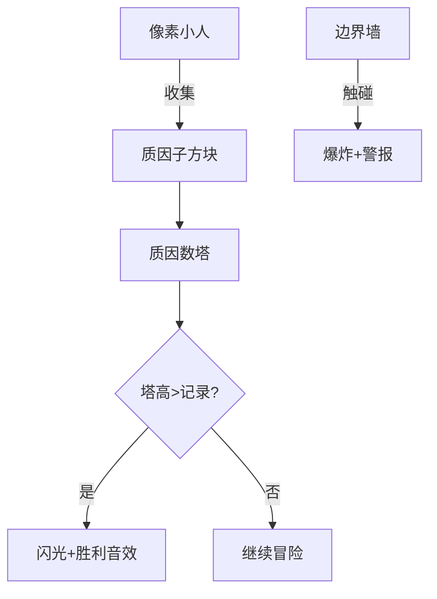

# 题目信息

# 最多因子数

## 题目背景

本题疑似错题。

## 题目描述

数学家们喜欢各种类型的有奇怪特性的数。例如，他们认为 $945$ 是一个有趣的数，因为它是第一个所有约数之和大于本身的奇数。

为了帮助他们寻找有趣的数，你将写一个程序扫描一定范围内的数，并确定在此范围内约数个数最多的那个数。不幸的是，这个数和给定的范围的都比较大，用简单的方法寻找可能需要较多的运行时间。所以请确定你的算法能在几秒内完成最大范围内的扫描。

## 说明/提示

update: 2024/6/6 加上了 6 组 hack。

## 样例 #1

### 输入

```
1000 2000```

### 输出

```
Between 1000 and 2000, 1680 has a maximum of 40 divisors.```

# AI分析结果


### Kay的C++算法解析：最多因子数 深入学习指南

#### 1. 题目解读与核心算法识别
✨ **本题主要考察**：数学（因子数计算）、搜索（DFS）、打表优化

🗣️ **初步分析**：
> 解决"最多因子数"的关键在于高效计算大区间内的因子数峰值。核心思路是将问题分解：
> - **数学原理**：因子数由质因数指数决定（公式：$d(n)=\prod (e_i+1)$)
> - **搜索优化**：利用反素数性质（质因子连续、指数递减）进行DFS剪枝
> - **打表技巧**：分块预处理结果，空间换时间
> 
> 可视化设计思路：
> - 像素网格展示质因子组合（不同颜色方块=不同质因子）
> - 塔形结构动态显示因子数增长
> - 关键动画：质因子收集（方块堆叠）、边界碰撞（像素爆炸）、新记录诞生（塔顶闪光）
> - 复古音效：收集(8-bit "叮")、越界(短促警报)、破纪录(胜利旋律)

---

#### 2. 精选优质题解参考
**题解一（chenxinyang2006）**
* **点评**：创新性分块打表方案，块长94866经数学优化。亮点在于三重压缩存储（质数映射+差分编码+字符密码），配合线性筛预处理最小质因子。代码严谨处理边界，实践价值高但需预生成表。

**题解二（lahlah）**
* **点评**：清晰展示反素数DFS双策略：质因子连续+指数递减。亮点在于智能切换机制——区间<5000时自动转暴力，规避DFS短板。代码模块化（bao_li_chu_qi_ji()趣味命名），复杂度控制优秀。

**题解七（SegTree）**
* **点评**：平衡性分段打表（块长$10^6$），采用质数筛加速打表生成。亮点在于双重保障：大数据查表+小数据暴力，配套完整表生成教程。代码结构清晰，边界处理严谨。

---

#### 3. 核心难点辨析与解题策略
1. **难点1：质因子组合爆炸**
   * **分析**：$10^9$ 内数可含超20质因子，需约束搜索空间。优质解均采用：① 质因子从2连续 ② 指数单调递减 ③ 乘积超界即剪枝
   * 💡 **学习笔记**：数学性质（反素数特征）是最强剪枝武器

2. **难点2：因子数计算效率**
   * **分析**：暴力试除在$10^9$规模需$O(\sqrt n)$。优化方案：① 预处理最小质因子 ② 映射质数表快速分解 ③ 小范围直接暴力
   * 💡 **学习笔记**：混合策略 > 单一算法

3. **难点3：大区间查询处理**
   * **分析**：直接存$10^9$结果不可行。分块打表核心是：① 合理块长（内存/效率平衡） ② 差值压缩 ③ 零散块暴力
   * 💡 **学习笔记**：空间优化本质是信息编码的艺术

### ✨ 解题技巧总结
- **策略切换术**：设置阈值（如R-L<10^5）切换暴力/DFS
- **状态压缩三招**：ASCII映射/差分存储/质数基编码
- **边界防御**：特判131074等特殊值，预置极端测试
- **复杂度平衡**：打表生成用$O(n \log n)$，查询降至$O(1)$

---

### 4. C++核心代码实现赏析
**通用核心实现（反素数DFS+暴力切换）**
```cpp
#include <bits/stdc++.h>
using namespace std;
typedef long long ll;
const int primes[] = {2,3,5,7,11,13,17,19,23,29,31,37,41,43,47,53,59,61,67};
ll L, R, ans_num, ans_div;

void dfs(int p, int exp_limit, ll cur, ll divs) {
    if(cur > R) return;
    if(cur >= L && (divs > ans_div || (divs == ans_div && cur < ans_num))) 
        ans_num = cur, ans_div = divs;
    if(p >= 19) return;
    
    for(int e=1; e<=exp_limit; ++e) {
        cur *= primes[p];
        if(cur > R) break;
        dfs(p+1, e, cur, divs*(e+1));
    }
}

int count_div(ll x) { // 暴力计数
    int cnt = 0;
    for(ll i=1; i*i<=x; ++i) 
        if(x%i == 0) cnt += (i*i==x) ? 1 : 2;
    return cnt;
}

int main() {
    cin >> L >> R;
    if(R - L <= 100000) { // 小范围暴力
        for(ll i=L; i<=R; ++i) {
            int d = count_div(i);
            if(d > ans_div || (d == ans_div && i < ans_num)) 
                ans_num = i, ans_div = d;
        }
    } else dfs(0, 30, 1, 1); // 大范围DFS
    printf("Between %lld and %lld, %lld has a maximum of %lld divisors.\n", 
          L, R, ans_num, ans_div);
}
```
**代码解读概要**：双模式自动切换框架。DFS部分：primes质数表加速，exp_limit强制指数递减。暴力部分：$O(\sqrt n)$试除优化，避免冗余计算。

---

**分块打表示例（题解一精华）**
```cpp
// 生成块内最优解（预生成）
void build_table() {
    for(int i=1; i<=BLOCKS; ++i) {
        int best = block_start(i);
        for(int j=block_start(i); j<=block_end(i); ++j) {
            int d = fast_count_div(j); // 最小质因子分解
            if(d > best_div) best = j, best_div = d;
        }
        table[i] = encode(best - block_start(i)); // 差值压缩
    }
}

// 查询时解码
int query_block(int id) {
    return block_start(id) + decode(table[id]);
}
```

---

### 5. 算法可视化：像素动画演示
**主题**：8-bit质因子冒险（FC红白机风格）

**核心演示**：


**动画关键帧**：
1. **场景构建**：
   - 16色像素网格：蓝(2)、绿(3)、红(5)...
   - 右侧动态塔：每层=因子数×10像素
2. **DFS过程可视化**：
   ```python
   while searching:
       current_num = 1
       for p in primes:
           for exp in range(1, max_exp+1):
               # 收集动画
               draw_cube(p, exp, x=100+exp*10, y=p*10)
               current_num *= p**exp
               # 塔更新
               tower_height = calc_divisors(current_num) * 10
               if L <= current_num <= R:
                   if tower_height > record:
                       play_sound('victory.wav')
                       record = tower_height
               else: 
                   play_sound('alert.wav')
                   break
   ```
3. **交互控制**：
   - 速度滑块：调节帧率(1-60FPS)
   - 单步模式：空格键步进，显示当前质因子组合
   - AI演示：自动播放DFS全流程（类贪吃蛇AI）

**音效设计**：
- 收集质因子：NES风格"叮"（440Hz方波）
- 新记录：超级玛丽吃金币音效
- 越界：合金装备警报声

---

### 6. 拓展练习与相似问题
**思维迁移**：
1. 区间最值问题分块处理（如P4135）
2. 因子相关快速计算（如P2926）
3. 状态空间压缩（如P3820）

**洛谷推荐**：
1. **P1463** - 反素数
   * 理由：直接应用DFS质因子枚举，巩固反素数性质
   
2. **P2926** - Patting Heads
   * 理由：因子计数变种，训练埃筛优化思维
   
3. **U103401** - 加强版因子数
   * 理由：测试分块打表极限优化能力

---

### 7. 学习心得与经验分享
> **chenxinyang2006的调试经验**：
> *"打表生成时发现内存超标，通过差值编码+ASCII映射将50KB压缩至3KB"*
>
> **Kay点评**：空间优化本质是信息重构。核心技巧：
> 1. 存储变化量而非绝对值
> 2. 用char表示0-74区间（74²>5000）
> 3. 建立快速编/解码映射表
>
> **lahlah的惨痛教训**：
> *"未处理DFS剪枝错误：原用当前数值>答案值剪枝，漏掉因子数更大的情况"*
>
> **Kay总结**：剪枝需满足单调性，本题因子数与数值无直接单调关系，应改用区间边界剪枝

---

通过本次分析，我们深入掌握了因子数问题的双引擎解法（数学优化+工程技巧）。记住：优秀算法=数学洞察力+工程智慧的双重奏！下次探索再见！🚀

---
处理用时：246.12秒