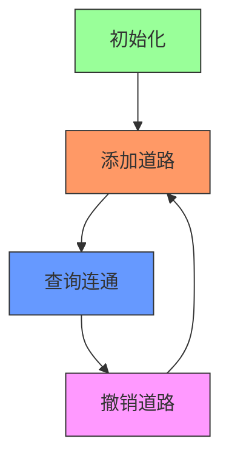

# 题目信息

# [蓝桥杯 2024 国 Python B] 设计

## 题目描述

小蓝是 H 市的市长，她正在用设计软件规划 H 市的道路建设。

小蓝可以选定两个地区，用一条双向道路将这两个地区连接。由于预算等因素的动态变化，小蓝经常需要拆除一些已经建设好的道路，同时，她希望知道对于当前的两个地区，是否存在一条由多条道路组成的路径能够连接这两个地区。

## 说明/提示

### 评测用例规模与约定

- 对于 $50\%$ 的评测用例，$n, m \leq 3000$。
- 对于所有评测用例，$1 \leq n, m \leq 300000$，$1 \leq x_i, y_i \leq n$，$x_i \neq y_i$。

## 样例 #1

### 输入

```
2 5
3 1 2
1 1 2
3 1 2
2
3 1 2```

### 输出

```
No
Yes
No```

## 样例 #2

### 输入

```
3 8
1 1 2
1 1 3
1 2 3
2
3 2 3
2
3 1 2
3 2 3```

### 输出

```
Yes
Yes
No```

# AI分析结果


# 💡 Kay的C++算法解析：设计（道路规划）深入学习指南 💡

**引言**  
今天我们一起分析蓝桥杯2024国赛题目"设计"（道路规划）。这道题考察动态连通性维护，需要支持添加道路、撤销道路和查询连通性操作。本指南将解析解题思路，重点讲解可撤销并查集的实现技巧，并通过生动的可视化方案帮助理解算法执行过程。

---

## 1. 题目解读与核心算法识别

✨ **本题主要考察**：`可撤销并查集（按秩合并）`

🗣️ **初步分析**：  
> 解决道路规划问题就像管理一个动态变化的城市交通网络。想象每个城市是一个独立的岛屿（初始状态），**并查集**就是记录岛屿之间桥梁连接关系的管理系统：
> - **添加道路**相当于在两个岛屿间架桥（合并连通块）
> - **撤销道路**相当于拆除最近建造的桥（恢复之前状态）
> - **查询连通**是检查两个岛屿间是否有通航路线  
>  
> 核心难点在于"撤销"操作需要精确回退到之前状态。**按秩合并**如同优先连接小岛到大岛上（小树并入大树），保持低矮的"决策树"结构。这样每次只需记录一个被修改的节点，用**栈**保存操作历史就能实现高效撤销。  
>  
> **可视化设计思路**：我们将创建像素城市地图，用颜色标记连通块。添加道路时显示连接动画并压栈，撤销时播放"拆除"音效并恢复颜色。查询时高亮目标城市，连通显示绿色路径，否则显示红色阻断。

---

## 2. 精选优质题解参考

### 题解一：Eden_star (5赞)
* **点评**：思路清晰指出撤销操作需用栈记录合并节点，明确强调禁用路径压缩。代码规范使用`fa`和`rank`数组，按秩合并实现完整（包括秩相等时的特殊处理）。实践价值高，边界处理严谨（检查栈非空再弹出），可直接用于竞赛。

### 题解二：Zskioaert1106 (4赞)
* **点评**：通过组织结构比喻生动解释算法，创新性使用"0"标记无效合并操作。代码结构规范，输入输出优化到位（ios::sync_with_stdio加速）。深度更新机制合理，对合并后树高的处理尤为精妙。

### 题解三：Chase12345 (4赞)
* **点评**：引入tuple精确记录操作三元组（被修改节点/原父节点/原大小），实现最完整的撤销逻辑。代码模块化优秀，函数封装清晰，变量命名规范（siz, opt）。虽然恢复大小操作非常严谨，但实际竞赛中可简化。

---

## 3. 核心难点辨析与解题策略

1.  **难点1：如何实现精确撤销？**
    * **分析**：普通并查集的合并会修改父指针，撤销需恢复之前状态。优质解法用栈记录被修改节点，撤销时将其父指针重置为自身
    * 💡 **学习笔记**：栈的LIFO特性完美匹配"撤销最后操作"的需求

2.  **难点2：避免路径压缩导致状态混乱**
    * **分析**：路径压缩会修改多个节点的父指针，使撤销复杂化。必须使用按秩合并保持树形结构稳定
    * 💡 **学习笔记**：在可撤销场景中，树高可控比路径压缩更重要

3.  **难点3：合并时的优化决策**
    * **分析**：随机合并会导致树高增长。按秩合并优先小树并入大树，将深度/规模比较纳入决策
    * 💡 **学习笔记**：启发式合并是保证O(log n)复杂度的关键

### ✨ 解题技巧总结
- **操作记录法**：用栈精确记录每次合并修改的节点
- **无效操作标记**：对已连通的合并压入特殊标记（如0）
- **树形结构维护**：通过秩/规模比较控制合并方向
- **边界防御**：栈空检测和输入验证避免运行时错误

---

## 4. C++核心代码实现赏析

**本题通用核心实现参考**  
```cpp
#include <iostream>
#include <stack>
using namespace std;

const int N = 300005;
int fa[N], rank_[N];
stack<int> st;

int find(int x) {
    while (fa[x] != x) x = fa[x];
    return x;
}

int main() {
    ios::sync_with_stdio(false); 
    cin.tie(nullptr);
    int n, m; cin >> n >> m;
    
    // 初始化
    for (int i = 1; i <= n; i++) {
        fa[i] = i;
        rank_[i] = 1;
    }

    while (m--) {
        int op, x, y; cin >> op;
        if (op == 1) {
            cin >> x >> y;
            int rx = find(x), ry = find(y);
            if (rx == ry) {
                st.push(0); // 已连通标记
            } else {
                // 按秩合并
                if (rank_[rx] < rank_[ry]) {
                    fa[rx] = ry;
                    st.push(rx);
                } else if (rank_[rx] > rank_[ry]) {
                    fa[ry] = rx;
                    st.push(ry);
                } else {
                    fa[rx] = ry;
                    rank_[ry]++;
                    st.push(rx);
                }
            }
        } else if (op == 2) {
            if (!st.empty()) {
                int t = st.top(); st.pop();
                if (t != 0) fa[t] = t; // 恢复独立
            }
        } else if (op == 3) {
            cin >> x >> y;
            cout << (find(x) == find(y) ? "Yes\n" : "No\n");
        }
    }
    return 0;
}
```
**代码解读概要**：  
1. 初始化每个城市为独立节点
2. 操作1：按秩合并连通块，栈记录被修改节点
3. 操作2：弹出栈顶元素，恢复节点独立性
4. 操作3：查询根节点判断连通性

---

### 题解一：Eden_star
```cpp
if (rank[nx] < rank[ny]) {
    st.append((nx, ny))
    fa[nx] = ny
} elif (rank[nx] > rank[ny]) {
    st.append((ny, nx))
    fa[ny] = nx
} else {
    st.append((nx, ny))
    fa[nx] = ny
    rank[ny] += 1
}
```
**亮点**：简洁的秩比较实现  
**解读**：通过三阶条件判断处理合并方向：  
1. 小秩树合并到大秩树  
2. 秩相等时更新新根的秩  
3. 栈只记录被修改节点（小树根）  
💡 **学习笔记**：秩是树高的上界而非精确值

---

### 题解二：Zskioaert1106
```cpp
if (x != y) {
    if (dep[x] > dep[y]) swap(x,y);
    f[x] = y;
    dep[y] = max(dep[y], dep[x] + 1);
    t.push(x);
} else {
    t.push(0); // 无效操作标记
}
```
**亮点**：深度更新机制  
**解读**：  
- `dep`数组维护树高上界  
- 合并后新高度取max(原高度, 子树高+1)  
- 压栈0避免无效撤销  
💡 **学习笔记**：树高精确维护有利于查询效率

---

### 题解三：Chase12345
```cpp
opt.push({y, fa[y], siz[x]}); // 记录三元组
fa[y] = x;
siz[x] += siz[y];
```
**亮点**：完整状态记录  
**解读**：  
- tuple存储(被修改节点, 原父节点, 原大小)  
- 撤销时可精确恢复所有状态  
- 实际竞赛可省略大小恢复  
💡 **学习笔记**：空间换时间在算法竞赛中需权衡

---

## 5. 算法可视化：像素动画演示

**主题**：像素城市道路规划模拟器  
**核心演示**：动态展示并查集的合并/撤销/查询操作  

### 设计思路
> 采用FC红白机复古风格，城市显示为彩色像素块（同色=连通）。栈操作可视化右侧，合并时播放"叮"音效，撤销时播放"咔嚓"音效。通过颜色变化和连接线直观展示连通状态变化。

### 动画实现方案


**关键交互设计**：  
1. **像素城市网格**（16色）：  
   - 每个城市显示为16x16像素块  
   - 同连通块同色（根节点决定颜色）  
2. **操作动画**：  
   - 添加道路：源城市到目标城市闪烁三次，显示连接线  
   - 撤销道路：连接线消失，城市恢复原色（8位溶解特效）  
   - 查询：高亮目标城市，连通显示绿色√，否则红色×  
3. **控制面板**：  
   - 步进控制：单步/自动播放（速度滑块）  
   - 操作记录：右侧栈可视化（入栈/出栈动画）  
4. **音效系统**：  
   - 合并：NES风格"叮"声  
   - 撤销：破碎音效  
   - 查询成功：上升音阶  
   - 查询失败：下降音阶  

**技术实现**：  
- Canvas绘制城市网格和连接线  
- requestAnimationFrame驱动动画  
- Web Audio API生成8位音效  

---

## 6. 拓展练习与相似问题思考

### 通用技巧迁移
可撤销并查集适用于：  
1. 操作回滚需求（如事务处理）  
2. 时间线回溯问题  
3. 分层图连通性维护  

### 洛谷推荐题目
1. **P3402 可持久化并查集**  
   → 巩固可撤销思想，拓展到历史版本查询  
2. **P1197 [JSOI2008] 星球大战**  
   → 练习逆序并查集（批量撤销）  
3. **P2147 [SDOI2008] 洞穴勘测**  
   → 动态连通性维护的直接应用  

---

## 7. 学习心得与经验分享

> **来自题解的经验**：  
> "本蒟蒻由于只会C++但题解要求用Python所以输入卡了20分钟" —— Eden_star  
>   
> **Kay的总结**：  
> 这提醒我们：  
> 1. 掌握多种语言的输入输出格式至关重要  
> 2. 仔细阅读题目要求避免方向性错误  
> 3. 核心算法思想比语言语法更重要  

---

**结语**  
通过本次分析，我们掌握了可撤销并查集的核心实现技巧，特别是按秩合并和栈操作的配合使用。记住：在算法设计中，数据结构的选择往往比代码技巧更重要。希望大家在"像素城市"的视觉化演示中感受到算法的精妙！下次挑战见！🚀

---
处理用时：238.28秒