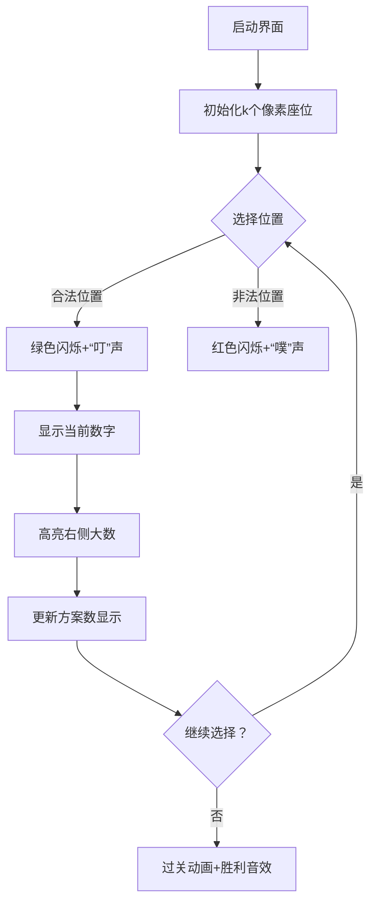

# 题目信息

# [蓝桥杯 2024 国 Java A] 粉刷匠小蓝

## 题目描述

小蓝是一名勤劳的粉刷匠，今天他收到了一份来自蓝桥学院的委托，需要为学院的 $n$ 面墙进行粉刷。这 $n$ 面墙从左到右依次排列，编号从 $1$ 到 $n$。起初，所有墙的颜色均为白色。

学院希望小蓝能将其中一部分墙刷成蓝色，以营造一种冷色调的艺术氛围。为此，学院给小蓝提供了一个长度为 $n$ 的数组 $\{a_1, a_2, \cdots, a_n\}$，来指定每面墙的颜色要求。具体地，如果 $a_i = 0$，则第 $i$ 面墙保持白色；如果 $a_i = 1$，则小蓝需要将第 $i$ 面墙刷成蓝色。

小蓝每次只能刷一面墙，他会将一面墙完整的刷完后再刷另一面墙。为了确保整体墙面的视觉效果，学院还提一个小小的要求：在粉刷过程中，如果要将第 $i$ 面墙刷成蓝色，那么它右侧（第 $i + 1$ 面墙 $\sim$ 第 $n$ 面墙）蓝色的墙的个数必须是偶数（包括 $0$ 个）。

现在，请你计算小蓝共有多少种刷墙顺序可以满足学院的要求？由于答案可能很大，因此你只需要给出答案对 $10^9 + 7$ 取模后的结果即可。

在本题中，不同的刷墙方法只与小蓝刷墙的顺序有关。例如，先刷第 $1$ 面墙再刷第 $2$ 面墙，与先刷第 $2$ 面墙再刷第 $1$ 面墙，被视为两种不同的方法。

## 说明/提示

### 样例说明

在样例 $1$ 中，有 $4$ 面墙，且都需要刷为蓝色。总共有以下 $4$ 种粉刷顺序可以满足学院的要求：

1. $[1,2,3,4]$：先刷第 $1$ 面，再刷第 $2$ 面，然后刷第 $3$ 面，最后刷第 $4$ 面。
2. $[1,3,4,2]$：先刷第 $1$ 面，再刷第 $3$ 面，然后刷第 $4$ 面，最后刷第 $2$ 面。
3. $[2,3,1,4]$：先刷第 $2$ 面，再刷第 $3$ 面，然后刷第 $1$ 面，最后刷第 $4$ 面。
4. $[3,4,1,2]$：先刷第 $3$ 面，再刷第 $4$ 面，然后刷第 $1$ 面，最后刷第 $2$ 面。

在样例 2 中，有 $2$ 面墙，且都要保持白色。只有 $1$ 种刷墙方法可以满足学院的要求，即不刷任何一面墙壁。

### 评测用例规模与约定

- 对于 $20\%$ 的评测用例，$1 \leq n \leq 13$，$a_i = 1$。
- 对于所有评测用例，$1 \leq n \leq 2 \times 10^5$，$0 \leq a_i \leq 1$。

## 样例 #1

### 输入

```
4
1 1 1 1```

### 输出

```
4```

## 样例 #2

### 输入

```
2
0 0```

### 输出

```
1```

# AI分析结果


### 💡 Kay的C++算法解析：粉刷匠小蓝 深入学习指南 💡

<introduction>
今天我们来分析"粉刷匠小蓝"这道C++编程题。本指南将帮助你理解题目核心思路，掌握递推计数技巧，并通过像素动画直观感受算法过程。
</introduction>

---

## 1. 题目解读与核心算法识别

✨ **本题主要考察**：`组合数学与递推计数`  
🗣️ **初步分析**：
> 这道题本质是**计数满足特定条件的排列方案数**。想象你有一排空座位（需要刷的墙），每次只能选择特定位置入座（刷墙）。关键规则是：**每个位置入座时，右边已入座的大号座位必须为偶数个**。  
> - **核心技巧**：通过递推关系求解方案数。设需要刷的墙数为k，则方案数满足递推式：f(k) = f(k-1) × ⌈k/2⌉  
> - **可视化设计**：我们将用像素动画展示座位选择过程（如绿色方块表示可选位置，红色表示不可选），高亮展示每次选择时右边大号座位的奇偶性变化  
> - **复古游戏化**：采用8位像素风格座位图，伴随"叮"声表示合法选择，"噗"声表示非法尝试，过关动画展示最终排列方案  

---

## 2. 精选优质题解参考

**题解（来源：zyl0926）**  
* **点评**：  
  思路清晰地将问题转化为排列计数（通过重新映射墙编号为1~k），准确捕捉到选择位置数⌈k/2⌉的规律。代码实现简洁高效（时间复杂度O(k)），巧妙利用整数除法计算⌈k/2⌉=(k+1)/2。特别注意了乘法溢出问题（使用1ll转换类型），变量命名合理（k计数，ans存结果），边界处理完整（k≤2时直接返回1）。是竞赛场景的优质参考实现。

---

## 3. 核心难点辨析与解题策略

1.  **关键点1：问题抽象与转化**  
    * **分析**：难点在于识别问题本质是排列计数，而非模拟刷墙过程。需将"右侧蓝色墙数量为偶数"转化为排列中"当前位置前大于当前数的元素个数为偶数"  
    * 💡 **学习笔记**：遇到复杂约束时，尝试转化为标准数学模型  

2.  **关键点2：发现位置选择规律**  
    * **分析**：最小数字（映射后）只能放在奇数索引位（前偶数的位置），选择数为⌈k/2⌉。选择后问题规模减1，形成递推结构  
    * 💡 **学习笔记**：从小规模案例找规律（如k=3有2种方案）是破解递推的关键  

3.  **关键点3：递推公式推导**  
    * **分析**：通过位置选择规律得到 f(k)=f(k-1)×⌈k/2⌉，需用动态变量存储结果而非递归，避免栈溢出  
    * 💡 **学习笔记**：递推式中的乘数⌈k/2⌉可通过整数除法 (k+1)/2 高效计算  

### ✨ 解题技巧总结
- **问题转化技巧**：将物理约束（右侧蓝墙数）转化为序列约束（前驱大数个数）  
- **递推优化**：用单变量迭代替代数组存储，空间复杂度O(1)  
- **边界处理**：显式处理k=0,1,2的特殊情况  
- **防溢出技巧**：乘法前用1ll提升为long long类型  

---

## 4. C++核心代码实现赏析

**本题通用核心C++实现参考**  
* **说明**：基于zyl0926题解优化的完整实现  
* **完整核心代码**：
```cpp
#include <iostream>
using namespace std;
const int mod = 1e9+7;

int main() {
    int n, k = 0; 
    cin >> n;
    for (int i = 0, x; i < n; ++i) {
        cin >> x;
        k += x; // 统计需要刷的墙数
    }
    long long ans = 1; // f(0)=f(1)=f(2)=1
    for (int i = 3; i <= k; ++i) 
        ans = ans * ((i+1)/2) % mod; // 递推式 f(k)=f(k-1)*⌈k/2⌉
    cout << ans;
    return 0;
}
```
* **代码解读概要**：  
  1. 读取墙数`n`并统计需刷的墙数`k`  
  2. 初始化`ans=1`（对应k=0,1,2的情况）  
  3. 从`i=3`开始迭代计算：`ans = ans * ⌈i/2⌉ % mod`  
  4. 输出最终方案数  

---

## 5. 算法可视化：像素动画演示

### 动画演示主题
**"像素座位大冒险"** - 用复古游戏风格演示排列生成过程

### 设计思路
> 采用FC红白机像素风格，将数字选择转化为座位选择游戏。通过颜色变化和音效强化位置选择规则（前偶大数），单步演示帮助理解递推本质。

### 动画帧步骤


### 关键交互设计
1. **像素场景**：  
   - 8-bit风格座位排（16色调色板）  
   - 当前数字：像素精灵（如1=蘑菇，2=花朵，3=星星）  
   - 信息栏：显示当前方案数（像素数字）  

2. **动态演示**：  
   - **合法选择**：座位变绿，播放"叮"声（8-bit短音）  
   - **非法选择**：座位变红闪烁，播放"噗"错误音  
   - **右侧大数**：已选大号座位橙色高亮，显示计数气泡  

3. **游戏化元素**：  
   - **AI演示模式**：自动播放从k=1到k=5的递推过程  
   - **关卡机制**：每完成k=3/5/7获得像素奖杯  
   - **背景音乐**：循环播放轻快8-bit旋律  

---

## 6. 拓展练习与相似问题思考

### 通用思路迁移
排列计数递推技巧还可用于：
1. 满足前缀约束的序列生成（如括号匹配）
2. 特殊栈操作序列计数
3. 树形结构拓扑排序方案

### 练习推荐（洛谷）
1. **P1044 栈**  
   → 巩固递推关系 f(n)=f(0)f(n-1)+...+f(n-1)f(0)  
2. **P1754 球迷购票问题**  
   → 练习带限制的排列计数（50元/100元约束）  
3. **P1025 数的划分**  
   → 强化递推边界处理能力  

---

## 7. 学习心得与经验分享
> **关键调试经验**（来自题解）：  
> *"记得*1ll 不然会爆int"*  
> → 在模运算乘法前用`1ll`转换类型，避免中间结果溢出  
> 💡 **Kay总结**：这是竞赛编程的经典陷阱！涉及大数乘法时，要提前预防溢出风险。

---

通过本次分析，相信你已经掌握递推计数的核心思想。记住：将复杂问题分解为可递推的子问题是算法设计的关键技能！下次遇到排列计数问题时，不妨先从小规模案例找规律哦~ 🚀

---
处理用时：173.30秒