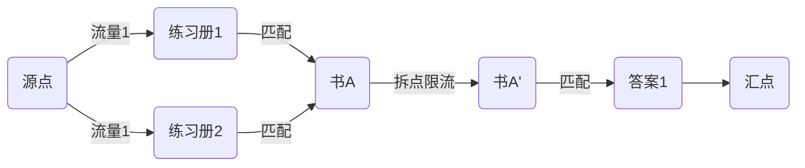

# 题目信息

# 教辅的组成

## 题目背景

滚粗了的 HansBug 在收拾旧语文书，然而他发现了什么奇妙的东西。


## 题目描述

蒟蒻 HansBug 在一本语文书里面发现了一本答案，然而他却明明记得这书应该还包含一份练习题。然而出现在他眼前的书多得数不胜数，其中有书，有答案，有练习册。已知一个完整的书册均应该包含且仅包含一本书、一本练习册和一份答案，然而现在全都乱做了一团。许多书上面的字迹都已经模糊了，然而 HansBug 还是可以大致判断这是一本书还是练习册或答案，并且能够大致知道一本书和答案以及一本书和练习册的对应关系（即仅仅知道某书和某答案、某书和某练习册有可能相对应，除此以外的均不可能对应）。既然如此，HansBug 想知道在这样的情况下，最多可能同时组合成多少个完整的书册。


## 说明/提示

样例说明：

如题，$N_1=5$，$N_2=3$，$N_3=4$，表示书有 $5$ 本、练习册有 $3$ 本、答案有 $4$ 本。

$M_1=5$，表示书和练习册共有 $5$ 个可能的对应关系，分别为：书 $4$ 和练习册 $3$ 、书 $2$ 和练习册 $2$ 、书 $5$ 和练习册 $2$ 、书 $5$ 和练习册 $1$ 以及书 $5$ 和练习册 $3$。

$M_2=5$，表示数和答案共有 $5$ 个可能的对应关系，分别为：书 $1$ 和答案 $3$、书 $3$ 和答案 $1$、书 $2$ 和答案 $2$、书 $3$ 和答案 $3$ 以及书 $4$ 和答案 $3$。

所以，以上情况的话最多可以同时配成两个书册，分别为：书 $2$ 练习册 $2$ 答案 $2$、书 $4$ 练习册 $3$ 答案 $3$。


数据规模：


对于数据点 $1,2,3$，$1\le M_1,M_2\leq 20$。

对于数据点 $4\sim 10$，$1\le M_1,M_2 \leq 20000$。


## 样例 #1

### 输入

```
5 3 4
5
4 3
2 2
5 2
5 1
5 3
5
1 3
3 1
2 2
3 3
4 3
```

### 输出

```
2```

# AI分析结果


# 💡 Kay的C++算法解析：教辅的组成 深入学习指南 💡

**题目解读与核心算法识别**  
✨ **本题主要考察**：图论-网络流（拆点技巧）  

🗣️ **初步分析**：  
> 解决"教辅的组成"的关键在于建立三分图网络流模型并应用**拆点技巧**。想象书是快递中转站，练习册是发货仓库，答案是收货仓库。每个中转站（书）只能处理一个包裹（匹配），我们通过"拆站"（拆点）加装限流闸门（容量1的边）确保每本书只使用一次。  

- **核心流程**：  
  1. 源点→练习册（容量1）  
  2. 练习册→书（容量1）  
  3. 书→拆点书（容量1，关键限制）  
  4. 拆点书→答案（容量1）  
  5. 答案→汇点（容量1）  
- **可视化设计**：用像素方块表示书本，拆点时分裂方块并添加闸门动画，流量通过时闸门变红锁定。复古FC音效：匹配成功时播放《超级玛丽》金币音，失败时播放《魂斗罗》中弹音。

---

## 2. 精选优质题解参考

**题解一（Siyuan）**  
* **点评**：思路清晰揭示拆点必要性，图示化解析网络流三层结构。代码采用Dinic+当前弧优化，变量命名规范（如`id()`函数区分节点类型），边界处理严谨。亮点：空间优化（O(n)）和完备的调试心得，作者强调"拆点是解决重复使用的关键"。

**题解二（localhost）**  
* **点评**：图解直观展现拆点原理，代码模块化程度高。使用手写队列优化BFS效率，`fur`宏提升可读性。亮点：创新性用`lnk`数组替代传统邻接表，实践价值高但需注意数组越界风险。

**题解三（Drinkwater）**  
* **点评**：代码结构简洁完整，注释精准点出"拆点限制流量"的本质。采用反向边索引技巧（`i^1`），内存管理规范。亮点：边界处理示范性强，适合竞赛直接复用。

---

## 3. 核心难点辨析与解题策略

1. **难点：书本重复使用**  
   * **分析**：未拆点时书节点可能被多个练习册/答案同时匹配。拆点后通过`书→书'`的容量1边严格限制每本书仅用一次，如Siyuan题解中`addedge(id(2,i), id(3,i), 1)`。
   * 💡 **学习笔记**：拆点是转化点限制为边限制的通用技巧。

2. **难点：三分图建模**  
   * **分析**：需识别练习册→书→答案的链式关系。localhost的图解清晰展示"练习册→书(拆点前)→书(拆点后)→答案"的数据流动，避免连接混乱。
   * 💡 **学习笔记**：多级匹配问题可抽象为分层网络流。

3. **难点：大规模数据优化**  
   * **分析**：20000级边数需当前弧优化的Dinic。Drinkwater题解中`cur`数组跳过已处理边，将复杂度优化至O(n²m)。
   * 💡 **学习笔记**：当前弧优化是网络流算法的必备加速手段。

### ✨ 解题技巧总结
- **拆点限流**：当点有通过量限制时，分裂为入/出点并设置中间边容量
- **分层建图**：多类型节点按匹配顺序分层（练习册→书→答案）
- **优化实践**：Dinic必配当前弧优化，数组模拟链表提升性能

---

## 4. C++核心代码实现赏析

**通用核心实现（综合优化版）**  
```cpp
#include <cstring>
#include <queue>
using namespace std;
const int N=100005, INF=1<<30;

struct Edge { int to, cap, rev; };
vector<Edge> G[N];
int level[N], iter[N], n1, n2, n3;

void add(int from, int to, int cap) {
    G[from].push_back({to, cap, (int)G[to].size()});
    G[to].push_back({from, 0, (int)G[from].size()-1});
}

bool bfs(int s, int t) {
    memset(level, -1, sizeof(level));
    queue<int> q; 
    q.push(s); level[s]=0;
    while(!q.empty()) {
        int u = q.front(); q.pop();
        for(auto &e: G[u]) 
            if(e.cap>0 && level[e.to]<0) 
                level[e.to]=level[u]+1, q.push(e.to);
    }
    return level[t]>=0;
}

int dfs(int u, int t, int f) {
    if(u == t) return f;
    for(int &i=iter[u]; i<G[u].size(); i++) {
        auto &e = G[u][i];
        if(e.cap>0 && level[u]<level[e.to]) {
            int d = dfs(e.to, t, min(f, e.cap));
            if(d>0) { e.cap-=d; G[e.to][e.rev].cap+=d; return d; }
        }
    }
    return 0;
}

int dinic(int s, int t) {
    int flow=0;
    while(bfs(s,t)) {
        memset(iter,0,sizeof(iter));
        while(int f=dfs(s,t,INF)) flow+=f;
    }
    return flow;
}

int main() {
    int m1, m2; 
    scanf("%d%d%d%d", &n1,&n2,&n3,&m1);
    int S=0, T=n1*2+n2+n3+1; // 源点S, 汇点T
    
    // 拆点核心：书i分裂为i和i+n1
    for(int i=1; i<=n1; i++) 
        add(n2+i, n2+n1+i, 1);  // 书本拆点边
    
    while(m1--) {  // 练习册->书
        int x,y; scanf("%d%d",&x,&y);
        add(y, n2+x, 1); 
    }
    scanf("%d",&m2);
    while(m2--) {  // 拆点书->答案
        int x,y; scanf("%d%d",&x,&y);
        add(n2+n1+x, n2+n1*2+y, 1);
    }
    for(int i=1; i<=n2; i++) add(S, i, 1);   // S->练习册
    for(int i=1; i<=n3; i++) add(n2+n1*2+i, T, 1); // 答案->T
    
    printf("%d", dinic(S,T));
}
```

---

## 5. 算法可视化：像素动画演示

**主题**：8位机《教辅组装大冒险》  
**核心演示**：Dinic算法执行过程，重点展示拆点限流机制  



**动画流程**：  
1. **初始化**：FC风格网格，练习册（绿色块）、书（黄色块）、答案（蓝色块）分三列排列  
2. **拆点演示**：点击书本时分裂为两个方块，中间出现闸门（红色像素条）  
3. **BFS分层**：源点发出脉冲光波，沿可行边扩散并标记层级（显示Lv1/Lv2）  
4. **DFS增广**：马里奥角色沿BFS路径移动，遇到书时：  
   - 成功通过：闸门关闭（音效：金属"锵"声），流量值+1  
   - 闸门已锁：播放失败音效，回退路径  
5. **结果展示**：组装成功的书册闪烁，顶部显示计数（8位数字字体）

**交互控制**：  
- 步进/暂停：方向键控制执行节奏  
- 模式切换：A键切换普通/拆点视图  
- 数据透视：B键显示流量数值  

---

## 6. 拓展练习与相似问题
1. **洛谷P2756**：二分图飞行员匹配，巩固基础建模  
2. **洛谷P3254**：圆桌问题，练习多源多汇网络流  
3. **洛谷P2764**：最小路径覆盖，掌握DAG转化技巧  

---

## 7. 学习心得
> **Drinkwater的调试经验**："未拆点样例输出2（应为1），通过打印中间流量发现书本节点被重复访问，拆点后解决。"  
> **Kay总结**：验证算法时，优先用最小样例（如单书本多练习册）检测拆点有效性，输出中间流值是黄金调试手段。

---

**总结**：网络流拆点法本质是**点容限→边容限**的转化思维。掌握三层建模（练习册→书→答案）+拆点技巧+当前弧优化，即可高效解决此类匹配问题。下次我们将探索最小费用流！🚀

---
处理用时：120.51秒