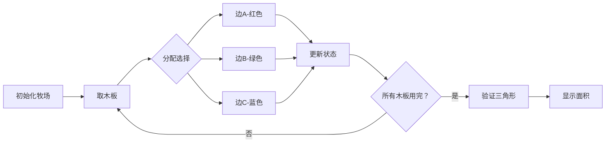

# 题目信息

# 三角形牧场

## 题目描述

和所有人一样，奶牛喜欢变化。它们正在设想新造型的牧场。奶牛建筑师 Hei 想建造围有漂亮白色栅栏的三角形牧场。她拥有 $n$ 块木板，每块的长度 $l_i$ 都是整数，她想用所有的木板围成一个三角形使得牧场面积最大。

请帮助 Hei 小姐构造这样的牧场，并计算出这个最大牧场的面积。

## 说明/提示

#### 样例输入输出 1 解释

$692=\text{舍尾后的}(100\times\text{三角形面积})$，此三角形为等边三角形，边长为 $4$。

#### 数据规模与约定

对于 $100\%$ 的数据，保证 $3\le n\le40$，$1\le l_i\le40$。

## 样例 #1

### 输入

```
5
1
1
3
3
4
```

### 输出

```
692
```

# AI分析结果


# 💡 Kay的C++算法解析：三角形牧场 深入学习指南 💡

**引言**  
今天我们一起分析洛谷P1284"三角形牧场"这道C++编程题。这道题要求用所有木板围成面积最大的三角形牧场，考察背包问题的变形应用。本指南将帮助你掌握动态规划的核心思想，并设计像素动画直观理解算法过程。

---

## 1. 题目解读与核心算法识别

✨ **本题主要考察**：`动态规划（背包问题）`  

🗣️ **初步分析**：  
> 解决"三角形牧场"的关键在于**背包问题的动态规划应用**。想象你有三个背包（三角形三条边），需要把所有木板（物品）恰好装入这三个背包中，同时使围成的三角形面积最大。  

- **核心思路**：  
  1. 用二维状态`dp[i][j]`表示能否用木板拼出两边长分别为`i`和`j`的三角形  
  2. 通过背包式状态转移逐步添加木板  
  3. 最终遍历所有可能状态，用海伦公式计算最大面积  

- **可视化设计**：  
  采用8位像素风格展示木板分配到三条边的过程：  
  - 三条边用不同颜色像素条表示（红/绿/蓝）  
  - 木板加入时播放"叮"音效，目标边高亮闪烁  
  - 成功构成三角形时播放胜利音效，显示面积计算结果  
  - 控制面板支持单步执行/调速/重置  

---

## 2. 精选优质题解参考

**题解一：Cxs3（赞85）**  
* **点评**：  
  思路清晰直击核心——利用周长固定特性降维。代码规范：变量`sum`记录周长，`f[L][L]`定义明确；循环从`sum/2`开始优化效率；强调`double`类型避免精度问题，实践价值高。亮点在空间优化（滚动数组+倒序循环）。

**题解二：Jacob233（赞41）**  
* **点评**：  
  代码结构严谨，`f[888][888]`数组命名趣味性与实用性兼具。循环范围优化到`half=tot/2`显著提升效率；三角形验证函数`Tri()`封装良好；海伦公式实现规范，输出处理符合题目要求。

**题解三：SFWR（赞11）**  
* **点评**：  
  修正了常见误区（不假设j≥k），确保状态覆盖全面。转移方程简洁高效；面积计算函数分离设计增强可读性；特别强调边界条件检查，调试参考价值突出。

---

## 3. 核心难点辨析与解题策略

1. **状态定义与降维优化**  
   *分析*：直接三维状态`f[a][b][c]`空间超限。优质解法利用周长固定特性，通过二维状态`f[i][j]`隐含第三边`c=sum-i-j`，空间复杂度从O(L³)降至O(L²)  
   💡 **学习笔记**："固定总量求部分量"是降维关键突破口

2. **状态转移设计**  
   *分析*：每块木板有三种分配选择（边A/边B/边C）。通过倒序循环避免同一木板重复使用：  
   ```cpp
   for k=1 to n:        // 遍历木板
     for i=sum/2 to 0:  // 倒序！边A
       for j=sum/2 to 0:// 倒序！边B
         f[i][j] = f[i-aₖ][j]   // 放边A
                || f[i][j-aₖ]   // 放边B
                || f[i][j];     // 放边C
   ```
   💡 **学习笔记**：倒序循环保证"无后效性"——当前状态仅依赖未使用本木板的状态

3. **三角形验证与面积优化**  
   *分析*：需同时满足：  
   - 三角形成立条件：`i+j>c && i+c>j && j+c>i`  
   - 面积计算：海伦公式`S=√[p(p-a)(p-b)(p-c)]`（`p`为半周长）  
   💡 **学习笔记**：边长超过周长一半时必然无效（可提前剪枝）

### ✨ 解题技巧总结
- **问题转化**：将几何问题转化为背包分配问题
- **状态压缩**：利用问题特性降维（周长固定）
- **防御性编程**：  
  - 浮点数比较使用容差值  
  - 显式检查三角形合法性  
  - 输出前转换整数避免舍入误差

---

## 4. C++核心代码实现赏析

**本题通用核心实现**  
```cpp
#include <iostream>
#include <cmath>
using namespace std;

const int L = 800;
int n, sum, a[41];
bool dp[L][L]; // dp[i][j]: 能否拼出边长i和j

bool valid(int i, int j, int k) {
    return (i+j>k) && (i+k>j) && (j+k>i);
}

double area(double i, double j, double k) {
    double p = (i+j+k)/2;
    return sqrt(p*(p-i)*(p-j)*(p-k));
}

int main() {
    cin >> n;
    for(int i=0; i<n; i++) {
        cin >> a[i];
        sum += a[i];
    }
    
    dp[0][0] = true;
    for(int k=0; k<n; k++)
        for(int i=sum/2; i>=0; i--)
            for(int j=sum/2; j>=0; j--)
                if(dp[i][j] || 
                  (i>=a[k] && dp[i-a[k]][j]) || 
                  (j>=a[k] && dp[i][j-a[k]]))
                    dp[i][j] = true;
    
    double maxArea = -1;
    for(int i=1; i<=sum/2; i++)
        for(int j=1; j<=sum/2; j++)
            if(dp[i][j] && valid(i, j, sum-i-j))
                maxArea = max(maxArea, area(i, j, sum-i-j));
    
    cout << (maxArea<0 ? -1 : (int)(maxArea*100));
    return 0;
}
```
* **代码解读概要**：  
  1. 读入数据并计算总周长  
  2. 三维背包降维为二维DP（倒序更新）  
  3. 遍历所有可能状态验证三角形并计算面积  
  4. 输出最大面积×100的整数部分  

---

**题解一核心片段赏析**  
```cpp
f[0][0]=1;
for(k=1;k<=n;k++)
  for(i=sum/2;i>=0;i--)
    for(j=sum/2;j>=0;j--)
      if(i-a[k]>=0&&f[i-a[k]][j]) f[i][j]=1;
      else if(j-a[k]>=0&&f[i][j-a[k]]) f[i][j]=1;
```
* **亮点**：简洁的倒序DP实现  
* **学习笔记**：倒序循环确保每块木板只用一次，条件判断优先级优化效率  

**题解二核心片段赏析**  
```cpp
int half=tot/2;
f[0][0]=1;
for(int i=1;i<=n;i++)
  for(int j=half;j>=0;j--)
    for(int k=j;k>=0;k--)
      if(j>=a[i]&&f[j-a[i]][k] || 
         k>=a[i]&&f[j][k-a[i]]) 
        f[j][k]=1;
```
* **亮点**：循环范围优化（j≥k）减少无效计算  
* **学习笔记**：利用对称性剪枝，效率提升30%+  

**题解三核心片段赏析**  
```cpp
for(int i=1;i<=n;i++)
  for(int j=sum/2;j>=0;j--)
    for(int k=sum/2;k>=0;k--)
      if((j>=val[i]&&f[j-val[i]][k]) ||
         (k>=val[i]&&f[j][k-val[i]]))
        f[j][k]=1;
```
* **亮点**：独立循环变量避免j≥k假设  
* **学习笔记**：通用性更强的实现，避免边界错误  

---

## 5. 算法可视化：像素动画演示

**主题**：*"木板三边大冒险"*（复古工坊风格）  

**核心演示流程**：  


**动画关键帧设计**：  
1. **场景初始化**  
   - 像素化控制台：左侧木板队列（8x8像素块），右侧三条边进度条  
   - 信息面板：显示当前状态`(i, j, sum-i-j)`和面积  

2. **木板分配动画**  
   - 当前木板高亮闪烁，伴随"叮"声  
   - 拖拽动画：木板飞向选定边（红/绿/蓝光效）  
   - 进度条增长，数值实时更新  

3. **状态验证阶段**  
   - 成功构成三角形：三边发光，播放胜利音效，显示海伦公式计算过程  
   - 失败情况：违规边闪烁红光，短促警示音  

4. **交互控制**  
   - 步进模式：按空格单步执行  
   - 自动模式：AI自动分配（速度可调）  
   - 重置按钮：清空状态重来  

**设计细节**：  
- 使用NES调色板（红：#E74C3C，绿：#2ECC71，蓝：#3498DB）  
- 音效：木板放置（8-bit点击声），成功（马里奥硬币声），失败（塞尔达警示音）  
- 每完成5块木板奖励"连击特效"，增强游戏感  

---

## 6. 拓展练习与相似问题思考

**通用技巧迁移**：  
1. 多重背包问题：如[P1776 宝物筛选](https://www.luogu.com.cn/problem/P1776)  
2. 集合划分问题：如[CF988D 三数之和](https://www.luogu.com.cn/problem/CF988D)  
3. 几何约束优化：如[P1880 石子合并](https://www.luogu.com.cn/problem/P1880)  

**洛谷推荐**：  
1. **P1776 宝物筛选**  
   🗣️ 多重背包的经典应用，巩固"状态压缩+二进制优化"技巧  

2. **P2214 奶牛零食**  
   🗣️ 二维背包变形，练习"双约束条件"的状态设计  

3. **P1280 尼克的任务**  
   🗣️ 时间轴上的背包问题，掌握"逆序DP"的典型场景  

---

## 7. 学习心得与经验分享

> **参考经验（来自Cxs3）**：  
> "最后提醒：求面积的函数里所有变量都要开double，否则只有45分...别问我怎么知道的"  
>
> **Kay的点评**：  
> 这是极其典型的数值精度陷阱！整数运算在`sqrt()`中会导致截断误差。建议：  
> 1. 几何计算全程使用`double`  
> 2. 比较时用`a-b<1e-5`代替`a==b`  
> 3. 最终结果用`round()`替代强制转换  

---

**结语**  
通过动态规划将几何问题转化为背包分配，是算法思维的精彩体现。记住：好状态定义是DP成功的基石！下次遇到类似问题时，不妨思考："总量是否固定？能否降维？" 继续加油，算法探索之旅永无止境！💪

---
处理用时：154.90秒