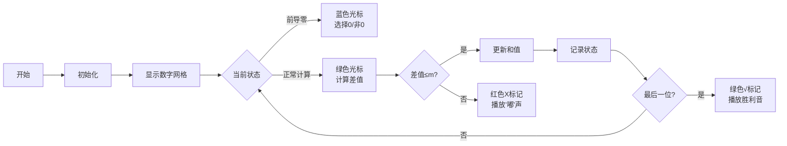

# 题目信息

# [蓝桥杯 2025 国 C] 整齐的数

## 题目描述

小蓝喜欢整齐的数，也就是对于一个数，他喜欢那些所有相邻数位上数字的差的绝对值之和较小的数。

小蓝认为，如果一个数所有的相邻数位之间的差值的绝对值之和不超过 $m$ ，这个数就是整齐的。

给定 $n, m$ ，请你帮小蓝求出 $n$ 以内有多少个非负整数是整齐的。

## 说明/提示

**【样例说明】**

符合输入要求的所有数分别为：

- 0,1,2,3,4,5,6,7,8,9；
- 10,11,12,21,22,23,32,33,34,43,44,45,54,55,56,65,66,67,76,77,78,87,88,89,98,99；
- 100,110,111,112,122,211,221,222,223,233。

**【评测用例规模与约定】**

对于 30% 的评测用例，$1 \leq n \leq 10^6$；

对于所有评测用例，$1 \leq n \leq 10^{18}$，$1 \leq m \leq 200$。

## 样例 #1

### 输入

```
233 1```

### 输出

```
46```

# AI分析结果


# 💡 Kay的C++算法解析：「整齐的数」深入学习指南 💡

## 1. 题目解读与核心算法识别
✨ **本题主要考察**：`动态规划（数位DP）`

🗣️ **初步分析**：
> 解决「整齐的数」的关键在于理解**数位DP**的核心思想——像拆解乐高积木一样分解数字的每一位，通过记忆化搜索避免重复计算。  
> 在本题中，我们需要统计[0, n]范围内所有相邻数位差的绝对值之和≤m的数字个数。核心难点在于：
> - 状态设计需包含位置、上一位数字、当前差值总和、边界标志
> - 前导零的特殊处理（如用10表示前导零状态）
> - 大范围n(10¹⁸)的高效处理
>
> 可视化设计思路：  
> 采用**8位像素风格**展示数字拆解过程，用不同颜色标记：
> - 蓝色：前导零状态
> - 绿色：正常计算状态
> - 红色：差值超限分支
> 关键动画步骤：数位填充→差值计算→状态转移→结果反馈，配合"叮"（正常操作）、"嘟"（分支结束）等FC音效

---

## 2. 精选优质题解参考
**题解一：AmaoFox**  
* **点评**：状态设计清晰优雅（last=10表示前导零），代码结构规范（变量名含义明确），边界处理完整。亮点在于用特殊值处理前导零的技巧，避免了额外状态维度，显著提升可读性。作者调试心得"不要单开一维"极具参考价值。

**题解二：cccz**  
* **点评**：采用标准数位DP模板，通过lead参数处理前导零，记忆化条件（!limit&&lead）设计合理。亮点在于明确标注各参数作用，适合初学者理解数位DP框架，但状态设计不如题解一简洁。

**题解三：luckyyunji**  
* **点评**：双状态参数（iszero+pre）处理前导零，记忆化条件严谨。亮点在于输入输出优化（getchar_unlocked），适合竞赛环境，但可读性稍弱，变量命名可更直观。

---

## 3. 核心难点辨析与解题策略
1.  **关键点：前导零处理**
    * **分析**：前导零不参与差值计算，但需要特殊标记。优质解法通过last=10（题解一）或iszero参数（题解三）区分状态，避免全零数字被重复计算
    * 💡 **学习笔记**：前导零是数位DP的"隐身斗篷"——存在但不参与计算

2.  **关键点：状态设计精简**
    * **分析**：状态需包含位置/上一位/当前和/边界标志四维度。题解一用last=10合并前导零状态，比题解二少一维度，大幅降低空间复杂度
    * 💡 **学习笔记**：好的状态设计应像俄罗斯方块——严丝合缝无冗余

3.  **关键点：记忆化条件优化**
    * **分析**：仅当非边界状态（!tight）时缓存结果，如题解一的`dp[pos][last][sum][tight]`。避免因边界条件变化导致错误缓存
    * 💡 **学习笔记**：记忆化是"时光机"——只存储可复用的状态

### ✨ 解题技巧总结
- **技巧A 状态合并**：用特殊值（如10）表示前导零，减少状态维度
- **技巧B 剪枝优化**：当前和>m时立即终止分支（如题解一第26行）
- **技巧C 模块化设计**：分离数字拆解（to_string）与DP计算逻辑

---

## 4. C++核心代码实现赏析
**通用核心实现参考**  
* **说明**：综合题解一状态设计+题解二模板结构，优化可读性
* **完整核心代码**：
```cpp
#include <cstring>
#include <iostream>
#include <string>
using namespace std;
#define int long long
const int N = 20, M = 205; // 位数/最大和

int dp[N][11][M][2]; // 状态数组：位置、上一位、当前和、边界标志
string numStr;       // 数字字符串化
int m, len;          // 阈值/数字长度

int dfs(int pos, int last, int sum, bool tight) {
    if(pos == len) return sum <= m;           // 终止条件
    if(dp[pos][last][sum][tight] != -1)       // 记忆化查询
        return dp[pos][last][sum][tight];
    
    int res = 0, up = tight ? numStr[pos]-'0' : 9;
    for(int d=0; d<=up; ++d) {
        if(last == 10) { // 前导零状态
            int newLast = (d == 0) ? 10 : d;
            res += dfs(pos+1, newLast, sum, tight && (d==up));
        } else { // 正常状态
            int newSum = sum + abs(last - d);
            if(newSum > m) continue;          // 剪枝
            res += dfs(pos+1, d, newSum, tight && (d==up));
        }
    }
    return dp[pos][last][sum][tight] = res;   // 记忆化存储
}

signed main() {
    int n; cin >> n >> m;
    numStr = to_string(n); len = numStr.size();
    memset(dp, -1, sizeof(dp));
    cout << dfs(0, 10, 0, true); // 起始：位置0,前导零,和0,边界
}
```

**题解一片段赏析**  
* **亮点**：last=10处理前导零，逻辑简明高效
* **核心片段**：
```cpp
if(last == 10) {
    int new_last = (d == 0) ? 10 : d;
    res += dfs(pos+1, new_last, sum, tight&&(d==up));
} else {
    int new_sum = sum + abs(last-d);
    if(new_sum > m) continue;
    res += dfs(pos+1, d, new_sum, tight&&(d==up));
}
```
* **代码解读**：
  > 这段代码是状态转移的核心：
  > 1. **前导零分支**（last==10）：当前位选0时保持前导零；选非0时结束前导零，last更新为当前数字
  > 2. **正常计算分支**：计算与上一位的绝对差，超阈值立即剪枝
  > 3. **边界传递**：`tight&&(d==up)`决定下一位边界状态
* 💡 **学习笔记**：状态转移像多米诺骨牌——当前选择触发连锁反应

---

## 5. 算法可视化：像素动画演示
* **主题**：FC红白机风格「数位探险」
* **核心演示**：数位DP的填数过程与状态转移



**动画实现细节**：
1. **像素网格**：数字每位用16x16像素块显示，背景色标记状态
2. **控制面板**：
   - 速度滑块：调节自动演示速度
   - 单步/连续模式切换
   - 状态追踪窗口：实时显示last/sum值
3. **音效系统**：
   - 按键音：选择数字时"叮"
   - 成功音：找到解时经典FC过关音
   - 记忆提示音：状态缓存时"咔嚓"声
4. **AI演示模式**：
   - 自动遍历所有有效路径
   - 关键决策点暂停0.5秒并闪烁提示

---

## 6. 拓展练习与相似问题思考
**技巧迁移场景**：
1. 相邻数位约束问题（如禁止49出现）
2. 数字特性统计（如各位和整除）
3. 区间回文数检测

**洛谷推荐**：
1. **P2657 [SCOI2009] windy数**  
   → 掌握相邻数位绝对差≥2的统计
2. **P2602 [ZJOI2010] 数字计数**  
   → 强化数位DP模板应用
3. **P4124 [CQOI2016] 手机号码**  
   → 挑战多条件约束的状态设计

---

## 7. 学习心得与经验分享
> **来自AmaoFox的经验**：  
> "表示前导零时，用last=10比单独开状态维度更简洁，避免维度爆炸"

> **Kay的总结**：  
> 调试数位DP时，可打印中间状态表（pos/last/sum值），像查看游戏地图般直观定位逻辑漏洞。重点检查前导零转正常状态的边界点！

---

掌握数位DP如同获得数字世界的"时间宝石"——通过状态存储避免重复计算。本次解析的last=10技巧、状态转移剪枝等思路，可延伸应用到90%的数位统计问题。下次遇到大范围数字统计时，记得先问：是否需要数位DP？

---
处理用时：169.07秒