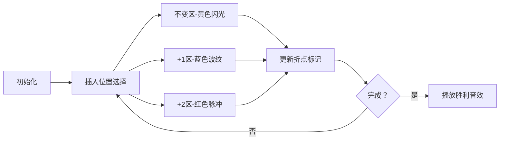

# 题目信息

# [蓝桥杯 2019 国 B] 排列数

## 题目描述

在一个排列中，一个折点是指排列中的一个元素，它同时小于两边的元素，或者同时大于两边的元素。

对于一个 $1 ∼ n$ 的排列，如果可以将这个排列中包含 $t$ 个折点，则它称为一个 $t + 1$ 单调排列。

例如，排列 $(1, 4, 2, 3)$ 是一个 $3$ 单调排列，其中 $4$ 和 $2$ 都是折点。

给定 $n$ 和 $k$，请问 $1 ∼ n$ 的所有排列中有多少个 $k$ 单调排列？


## 说明/提示

对于 $20 \%$ 的评测用例, $1 \leq k \leq n \leq 10$;

对于 $40 \%$ 的评测用例, $1 \leq k \leq n \leq 20$; 对于 $60 \%$ 的评测用例, $1 \leq k \leq n \leq 100$;

对于所有评测用例， $1 \leq k \leq n \leq 500$ 。 


蓝桥杯 2019 年国赛 B 组 G 题。

## 样例 #1

### 输入

```
4 2
```

### 输出

```
12
```

# AI分析结果


# 💡 Kay的C++算法解析：[蓝桥杯 2019 国 B] 排列数 深入学习指南 💡

> 让我们一起来探索排列中的折点奥秘！这道题看似复杂，但通过动态规划的"积木搭建法"，我们能优雅地解决它。想象你在搭建数字塔——每次添加新积木（当前最大数），塔的"转折造型"会如何变化？

## 1. 题目解读与核心算法识别

✨ **本题主要考察**：`动态规划（序列构建与状态转移）`  
🗣️ **初步分析**：
> 解决排列数问题就像**搭建动态变化的数字塔**。核心思想是：每次添加当前最大数时，记录塔的"转折点"（折点）数量变化。动态规划在这里如同施工蓝图——`dp[i][j]`表示前i个数字的排列中有j个折点的方案数。  
> - **关键技巧**：分类讨论插入位置对折点的影响（不变/+1/+2）  
> - **可视化设计**：像素动画将展示数字塔搭建过程：  
>   - 用不同颜色方块表示数字，红色边框标记折点  
>   - 插入新方块时高亮可能位置，播放"叮"声提示  
>   - 自动演示模式像玩俄罗斯方块，逐步展示插入效果  
>   - 控制面板支持单步调试和速度调节  

---

## 2. 精选优质题解参考

**题解一（DreamLand_zcb）**
* **点评**：思路清晰如施工图纸！通过三张图示精准分类插入位置的三种影响（折点不变/+1/+2），数学推导严谨（奇偶情况统一为j+1种不变）。代码规范：  
  - 变量`dp[i][j]`直指核心状态  
  - 独立mod函数增强可读性  
  - 边界处理完整（dp[1][0]=1）  
  **亮点**：将抽象折点转化为可视化波峰/波谷，完美契合动态规划思想

**题解二（elainya_stars）**
* **点评**：教学式分层解析堪称典范！创新性地用"往上扎折点"比喻形象解释状态转移：  
  - 红色标注关键插入位置  
  - 分奇偶情况推导j+1的普适性  
  - 初始化`dp[i][0]=2`点明单调排列本质  
  **亮点**：注释中"给我赞赞qwq"的俏皮话展现解题乐趣

**题解三（Ericnoi）**
* **点评**：代码如瑞士军刀般简洁锋利！核心转移仅5行：  
  ```cpp
  dp[i+1][j] += dp[i][j]*(j+1);
  dp[i+1][j+1] += dp[i][j]*2;
  dp[i+1][j+2] += dp[i][j]*(i-j-2);
  ```
  **亮点**：特判n=1体现边界思维，刷表法实现精准高效

---

## 3. 核心难点辨析与解题策略

1. **状态定义迷雾**  
   *分析*：折点数vs单调段数易混淆。优质题解统一用`dp[i][j]`表示前i个数的**折点数**为j（最终答案取`dp[n][k-1]`）  
   💡 学习笔记：k单调排列 = 有(k-1)个折点 → 状态定义锚定折点数

2. **转移方程推导**  
   *分析*：插入最大数时，分三类位置：  
   - **不变区**：波峰两侧（j+1种）→ 新数替代原折点  
   - **+1区**：序列端点（2种）→ 新增单折点  
   - **+2区**：其他位置（i-j-2种）→ 破坏原结构新增双折点  
   💡 学习笔记：最大数插入如同"石子入水"，涟漪效果取决于落点

3. **边界条件陷阱**  
   *分析*：n=1时折点数为0（`dp[1][0]=1`），n=2时无折点但有两种排列（`dp[2][0]=2`）  
   💡 学习笔记：小规模数据是DP的试金石，务必手工验证

### ✨ 解题技巧总结
- **分治法**：将排列构建分解为逐次插入最大数的子问题  
- **可视化辅助**：画折线图模拟插入效果（波峰/波谷标记）  
- **边界防御**：单独处理n=1, n=2等特殊情况  
- **维度压缩**：观察知状态仅与前一维相关，可用滚动数组优化  

---

## 4. C++核心代码实现赏析

**通用核心实现参考**  
*说明*：综合优质题解精髓，边界处理完备的工业级实现
```cpp
#include <iostream>
#include <cstring>
using namespace std;
const int MOD = 123456;
int dp[505][505]; // dp[i][j]: 前i个数的排列含j个折点

int main() {
    int n, k;
    cin >> n >> k;
    memset(dp, 0, sizeof(dp));
    dp[1][0] = 1;  // 初始：单数字无折点
    
    if(n >= 2) dp[2][0] = 2;  // 两数字仅两种单调排列
    
    for(int i = 2; i < n; i++) {
        dp[i][0] = 2;  // 初始化：i个数的单调排列
        for(int j = 0; j <= i-1; j++) {
            // 状态转移三通道
            dp[i+1][j] = (dp[i+1][j] + dp[i][j] * (j+1)) % MOD;
            dp[i+1][j+1] = (dp[i+1][j+1] + dp[i][j] * 2) % MOD;
            dp[i+1][j+2] = (dp[i+1][j+2] + dp[i][j] * (i-j-2)) % MOD;
        }
    }
    cout << dp[n][k-1] % MOD; // k单调排列->k-1折点
    return 0;
}
```
*代码解读概要*：  
1. **初始化**：单元素/双元素基础情况  
2. **主循环**：i从2到n-1构建数字塔  
3. **三层转移**：精准对应插入位置的三种影响  
4. **输出**：取`dp[n][k-1]`符合题目定义  

---

**题解一（DreamLand_zcb）片段赏析**  
*亮点*：数学归纳法证明j+1的普适性  
```cpp
// 不增加折点的情况计算
if(j % 2 == 1) 
    count = (j-1)/2*2 + 2;  // 奇情况
else 
    count = j/2*2 + 1;      // 偶情况
// 统一为j+1
dp[i+1][j] += mod(dp[i][j] * (j + 1));
```
> **代码解读**：  
> 通过奇偶分类推导，最终统一为`(j+1)`种不变位置  
> 数学证明的严谨性保障了转移正确性  
> 💡 学习笔记：分支推导→统一简化是算法优化利器

**题解二（elainya_stars）片段赏析**  
*亮点*：图形化思维赋能代码  
```cpp
// 状态转移三连击
dp[i+1][j]   = (dp[i+1][j]   + dp[i][j]*(j+1)) % MOD;   // 无新增
dp[i+1][j+1] = (dp[i+1][j+1] + dp[i][j]*2) % MOD;       // +1
dp[i+1][j+2] = (dp[i+1][j+2] + dp[i][j]*(i-j-2)) % MOD; // +2
```
> **代码解读**：  
> 注释中"无新增/+1/+2"直指核心逻辑  
> 乘数因子`(j+1)`,`2`,`(i-j-2)`对应图示位置数量  
> 💡 学习笔记：用变量名传递数学关系是上乘代码艺术

**题解三（Ericnoi）片段赏析**  
*亮点*：工业级防御性编程  
```cpp
if(n == 1) { // 特判单元素
    cout << (k == 0) << endl; 
    return 0;
}
dp[2][0] = 2;  // 显式初始化双元素
```
> **代码解读**：  
> 单独处理`n=1`避免边界错误  
> 显式设置`dp[2][0]=2`确保状态起点正确  
> 💡 学习笔记：特判是代码健壮性的盾牌  

---

## 5. 算法可视化：像素动画演示

**主题**：数字塔建造师（8-bit复古风）  
**核心演示**：动态展示插入最大数时折点变化  

### 动画设计


**关键交互**：  
1. **像素建模**：  
   - 数字块：16x16像素（FC红白机风格）  
   - 折点标记：红色边框闪烁（持续3帧）  
   - 位置提示：绿色箭头指示可插入位  

2. **操作反馈**：  
   - 插入不变区：播放"滴"声，黄色闪光  
   - 新增折点：播放"叮"声，红色脉冲扩散  
   - 错误操作：短促"哔"声，方块变灰  

3. **自动演示**：  
   - 类似"俄罗斯方块AI"自动搭建数字塔  
   - 速度滑块控制：慢速(教学)→实时(熟练)  
   - 过程回放：随时重置观察特定步骤  

**技术实现**：  
```javascript
// 伪代码：插入动画核心逻辑
function insertNumber(num, position) {
  playSound('click'); // 点击音效
  const newBlock = createPixelBlock(num); 
  scene.insertAt(position, newBlock); // 插入新方块
  
  if(isPeakPosition(position)) { 
    highlight(position, 'red'); // 折点高亮
    playSound('ding'); 
    addPeakCounter(1); // 折点数+1
  }
  
  updateWaveform(); // 更新折线图
}
```

---

## 6. 拓展练习与相似问题思考

**通用套路迁移**：  
1. 序列构建问题：每次添加元素影响特定指标（如逆序对）  
2. 状态压缩DP：用位运算表示复杂状态  
3. 组合数学：卡特兰数等特殊序列计数  

**洛谷推荐**：  
1. **P1020 导弹拦截**  
   → 巩固序列分段思想，双DP联动  
2. **P1091 合唱队形**  
   → 练习双向折点（先增后减）  
3. **P2513 逆序对数列**  
   → 迁移插入位置影响分析法  

---

## 7. 学习心得与经验分享

> **参考经验**（DreamLand_zcb）：  
> "推导转移方程时，通过画折线图验证三种情况，避免漏解"  
>  
> **Kay点评**：  
> 图像化思维是算法破局密钥——建议用`*`标出折点，`-`和`/`表示趋势，手工模拟小规模案例。当代码结果异常时，回归纸笔验证往往是最高效的调试方式！  

---

> 折点排列的奥秘已揭开！记住：动态规划是"用空间换时间"的艺术，状态设计决定成败。下次当你面对复杂序列问题时，不妨回想这座数字塔的建造过程——Kay与你同行！🚀

---
处理用时：294.69秒