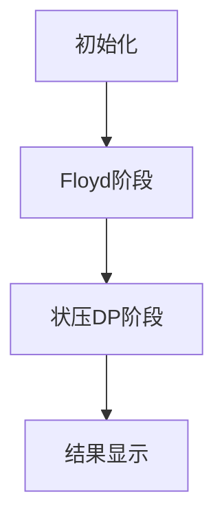

# 题目信息

# [蓝桥杯 2020 国 C] 补给

## 题目描述

小蓝是一个直升飞机驾驶员，他负责给山区的 $n$ 个村庄运送物资。

每个月，他都要到每个村庄至少一次，可以多于一次，将村庄需要的物资运送过去。

每个村庄都正好有一个直升机场，每两个村庄之间的路程都正好是村庄之间的直线距离。

由于直升机的油箱大小有限，小蓝单次飞行的距离不能超过 $D$。每个直升机场都有加油站，可以给直升机加满油。

每个月，小蓝都是从总部出发，给各个村庄运送完物资后回到总部。如果方便，小蓝中途也可以经过总部来加油。

总部位于编号为 $1$ 的村庄。

请问，要完成一个月的任务，小蓝至少要飞行多长距离？

## 说明/提示

对于所有数据，保证，$1\le n\le20,1\le x_i,y_i\le10^4,1\le D\le10^5$。

蓝桥杯 2020 年国赛 C 组 I 题。

## 样例 #1

### 输入

```
4 6
1 1
4 5
8 5
11 1```

### 输出

```
28.00```

# AI分析结果


# 💡 Kay的C++算法解析：补给问题 深入学习指南 💡

**引言**  
今天我们来分析蓝桥杯2020国C的"补给"问题。这道题要求直升机从总部出发访问所有村庄后返回，且单次飞行距离不能超过D。本指南将帮助你掌握核心算法思想和实现技巧，并通过可视化方案直观理解解题过程。

## 1. 题目解读与核心算法识别

✨ **本题主要考察**：状态压缩动态规划 + 全源最短路（Floyd算法）

🗣️ **初步分析**：  
> 解决补给问题的关键在于将复杂路径规划分解为两个阶段：
> 1. **路径预处理**：使用Floyd算法计算任意两点间的最短可行距离（考虑D限制），相当于建立"空中加油站"网络
> 2. **状态压缩DP**：用二进制表示访问状态（类似点亮地图碎片），动态规划寻找最优路径
>
> **核心难点**在于处理距离限制和状态转移的协同：
> - Floyd需处理超过D的边：初始化为∞，通过中转点更新有效距离
> - 状态转移需保证路径连续性：从子集状态推导新状态
>
> **可视化设计**：
> - 像素风格地图：村庄显示为彩色塔楼（总部红色），路径用动态光线连接
> - 关键动画：Floyd更新时高亮中转点k，DP转移时显示状态二进制码和路径扩展
> - 游戏化元素：每完成一个状态转移播放"滴"声，找到最优解时播放胜利音效

## 2. 精选优质题解参考

**题解一（NTT__int128）**  
* **亮点**：状态定义清晰（dp[S][i]），完整处理返回路径，代码规范（变量名dis/dp含义明确）  
* **核心思路**：  
  1. Floyd预处理有效距离（距离>D设为∞）  
  2. 状压DP：dp[状态][当前位置] = min(子状态 + 转移距离)  
  3. 答案计算：所有状态终结点返回总部的距离最小值  

**题解二（___w）**  
* **亮点**：与经典TSP问题对比，强调Floyd处理距离限制的重要性，图示辅助理解  
* **创新点**：将D限制转化为图论问题，证明中转点优化的必要性  

**题解三（OIerGuo）**  
* **亮点**：对初学者友好，详细分解算法步骤，提供调试建议  
* **实践价值**：强调浮点数初始化技巧（避免0x3f），边界处理严谨  

## 3. 核心难点辨析与解题策略

1. **难点：距离限制的处理**  
   * **分析**：两点直线距离>D时需通过中转点间接到达  
   * **解决方案**：Floyd三重循环更新所有点对距离  
   * 💡 **学习笔记**：Floyd本质是动态规划，k为中转维度

2. **难点：状态压缩设计**  
   * **分析**：状态需同时记录访问集合和当前位置  
   * **解决方案**：dp[S][i]表示状态S下停在i的最短距离  
   * 💡 **学习笔记**：状态转移依赖子集枚举（S' = S - {i}）

3. **难点：路径完整性与初始化**  
   * **分析**：需返回起点且避免无效状态  
   * **解决方案**：初始化dp[1][0]=0（只访问总部），答案追加返回距离  
   * 💡 **学习笔记**：状态二进制最低位代表总部（村庄0）

### ✨ 解题技巧总结
- **分层处理**：先预处理路径（Floyd），再规划访问顺序（状压DP）  
- **状态压缩技巧**：用位运算检查访问状态（S>>i & 1）  
- **浮点精度管理**：避免用整数INF初始化double（推荐1e9）  
- **循环优化**：先过滤非法状态再进入内层循环  

## 4. C++核心代码实现赏析

**通用核心实现（综合优化版）**：
```cpp
#include <iostream>
#include <cstring>
#include <cmath>
#include <iomanip>
using namespace std;

const int N = 20;
double dp[1<<N][N], dist[N][N];
double x[N], y[N];
int n, D;

int main() {
    // 输入处理
    cin >> n >> D;
    for (int i = 0; i < n; i++) 
        cin >> x[i] >> y[i];
    
    // 距离初始化
    for (int i = 0; i < n; i++) {
        for (int j = 0; j < n; j++) {
            double d = sqrt(pow(x[i]-x[j],2) + pow(y[i]-y[j],2));
            dist[i][j] = (d <= D) ? d : 1e9;
        }
    }
    
    // Floyd最短路
    for (int k = 0; k < n; k++)
        for (int i = 0; i < n; i++)
            for (int j = 0; j < n; j++)
                dist[i][j] = min(dist[i][j], dist[i][k] + dist[k][j]);
    
    // 状压DP初始化
    memset(dp, 0x7f, sizeof dp); // 正无穷初始化
    dp[1][0] = 0; // 初始状态：只访问总部
    
    // 状态转移
    for (int S = 1; S < (1<<n); S++) {
        for (int i = 0; i < n; i++) {
            if (!(S >> i & 1)) continue; // 跳过未访问点
            for (int j = 0; j < n; j++) {
                if (i == j || !(S >> j & 1)) continue;
                int preS = S ^ (1 << i); // 移除i的状态
                dp[S][i] = min(dp[S][i], dp[preS][j] + dist[j][i]);
            }
        }
    }
    
    // 计算结果（返回总部）
    double ans = 1e9;
    for (int i = 0; i < n; i++) 
        ans = min(ans, dp[(1<<n)-1][i] + dist[i][0]);
    
    cout << fixed << setprecision(2) << ans;
    return 0;
}
```

**关键代码解读**：
1. **Floyd三重循环**：动态更新所有点对的最短可行路径
   ```cpp
   for (int k = 0; k < n; k++)
     for (int i = 0; i < n; i++)
       for (int j = 0; j < n; j++)
         dist[i][j] = min(dist[i][j], dist[i][k] + dist[k][j]);
   ```
   * **学习笔记**：k循环必须在外层，按中转点分阶段更新

2. **状态转移核心**：
   ```cpp
   int preS = S ^ (1 << i); // 前驱状态（去掉当前点i）
   dp[S][i] = min(dp[S][i], dp[preS][j] + dist[j][i]);
   ```
   * **精妙之处**：`preS`通过位运算高效计算子集
   * **实现要点**：确保j在preS中（`S>>j & 1`）

3. **答案构造**：
   ```cpp
   ans = min(ans, dp[(1<<n)-1][i] + dist[i][0]);
   ```
   * **关键细节**：最终状态是`(1<<n)-1`（全访问），需额外返回总部

## 5. 算法可视化：像素动画演示

**动画主题**：像素直升机探险（8-bit复古风格）

### 核心演示流程


**实现细节**：
1. **场景设计**：
   - 256×256像素网格地图（坐标自动缩放）
   - 村庄显示为彩色像素塔：总部（红色），普通村（绿色）
   - 控制面板：开始/暂停/重置，速度滑块（0.5-2倍速）

2. **Floyd可视化**：
   - 当中转点k变化时，高亮k村庄（黄色闪烁）
   - 更新(i,j)路径时，绘制蓝色虚线（实线为直连有效路径）
   - 音效：矩阵更新时播放"滴嘟"声

3. **状压DP动画**：
   - 状态面板：显示当前二进制状态（如000101）
   - 转移过程：从村庄j到i绘制金色飞行轨迹，同步显示dp值更新
   - 游戏化提示：每完成一个状态转移，在状态面板显示"+"动画

4. **结果展示**：
   - 最优路径显示为红色实线
   - 播放8-bit胜利音乐
   - 显示路径总距离（保留2位小数）

**技术实现**：HTML5 Canvas绘制，Web Audio API音效

## 6. 拓展练习与相似问题思考

**通用技巧迁移**：
1. **带约束路径规划**：物流配送中的容量限制（如P1171 售货员难题）
2. **状态压缩应用**：设备调度（P2831 愤怒的小鸟）
3. **最短路+DP组合**：网络延迟优化（P1144 最短路计数）

**推荐练习**：
1. **洛谷 P1433** - 吃奶酪  
   * 🗣️ 经典TSP问题，无距离限制，巩固状压DP基础
   
2. **洛谷 P1171** - 售货员的难题  
   * 🗣️ 增加时间窗口约束，练习状态设计扩展
   
3. **洛谷 P2831** - 愤怒的小鸟  
   * 🗣️ 状压DP解决抛物线覆盖问题，培养抽象建模能力

## 7. 学习心得与经验分享

> **参考经验**（多位作者共识）：  
> 1. "浮点数初始化避免用0x3f，推荐1e9量级"  
> 2. "调试时输出DP表中间状态比想象中更有用"  
> 3. "Floyd的k循环必须放在最外层"  
>
> **Kay的总结**：  
> 调试DP问题时，可添加临时打印语句输出状态转移表。对于浮点数问题，特别注意精度设置（如本题要求保留2位小数）。状压DP的关键在于状态表示和转移方程的设计，建议先用小规模数据手工演算验证。

**结语**：  
通过本指南，你掌握了状态压缩DP和Floyd算法的协同应用。记住：复杂算法往往由简单模块组合而成，分层思考能有效降低解题难度。继续挑战相似问题，你将在动态规划领域获得更大突破！🚁

---
处理用时：162.49秒