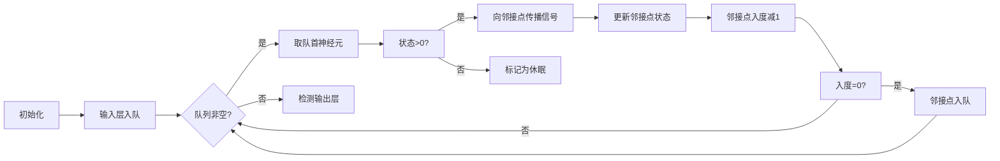

# 题目信息

# [NOIP 2003 提高组] 神经网络

## 题目背景

人工神经网络（Artificial Neural Network）是一种新兴的具有自我学习能力的计算系统，在模式识别、函数逼近及贷款风险评估等诸多领域有广泛的应用。对神经网络的研究一直是当今的热门方向，兰兰同学在自学了一本神经网络的入门书籍后，提出了一个简化模型，他希望你能帮助他用程序检验这个神经网络模型的实用性。


## 题目描述

在兰兰的模型中，神经网络就是一张有向图，图中的节点称为神经元，而且两个神经元之间至多有一条边相连，下图是一个神经元的例子：


神经元（编号为 $i$）


图中，$X_1 \sim X_3$ 是信息输入渠道，$Y_1 \sim Y_2$ 是信息输出渠道，$C_i$ 表示神经元目前的状态，$U_i$ 是阈值，可视为神经元的一个内在参数。

神经元按一定的顺序排列，构成整个神经网络。在兰兰的模型之中，神经网络中的神经元分为几层；称为输入层、输出层，和若干个中间层。每层神经元只向下一层的神经元输出信息，只从上一层神经元接受信息。下图是一个简单的三层神经网络的例子。


兰兰规定，$C_i$ 服从公式：（其中 $n$ 是网络中所有神经元的数目）

$$C_i=\left(\sum\limits_{(j,i) \in E} W_{ji}C_{j}\right)-U_{i}$$

公式中的 $W_{ji}$（可能为负值）表示连接 $j$ 号神经元和 $i$ 号神经元的边的权值。当 $C_i$ 大于 $0$ 时，该神经元处于兴奋状态，否则就处于平静状态。当神经元处于兴奋状态时，下一秒它会向其他神经元传送信号，信号的强度为 $C_i$。

如此．在输入层神经元被激发之后，整个网络系统就在信息传输的推动下进行运作。现在，给定一个神经网络，及当前输入层神经元的状态（$C_i$），要求你的程序运算出最后网络输出层的状态。


## 说明/提示

**【题目来源】**

NOIP 2003 提高组第一题

## 样例 #1

### 输入

```
5 6
1 0
1 0
0 1
0 1
0 1
1 3 1
1 4 1
1 5 1
2 3 1
2 4 1
2 5 1
```

### 输出

```
3 1
4 1
5 1
```

# AI分析结果


# 💡 Kay的C++算法解析：神经网络 深入学习指南 💡

## 1. 题目解读与核心算法识别

✨ **本题主要考察**：`拓扑排序` (有向无环图上的依赖处理)

🗣️ **初步分析**：
> 解决神经网络这道题，关键在于理解并运用`拓扑排序`。简单来说，拓扑排序就像组装乐高积木——必须先把底层积木拼好，才能搭建上层结构。在本题中，`拓扑排序`主要用于**确定神经元状态的计算顺序**，确保在计算每个神经元状态时，所有输入信号（来自上一层神经元）都已准备就绪。
   - 题解普遍采用拓扑排序+BFS/DFS，核心难点在于正确处理输入层阈值、激活状态判断和输出层筛选
   - 核心流程：1) 输入层入队 2) 按拓扑序计算状态 3) 状态>0则激活传播 4) 筛选输出层结果
   - 可视化设计思路：用8位像素网格模拟神经元（红=输入层/蓝=中间层/绿=输出层），队列用像素方块动态展示，激活时播放"叮"音效，状态更新时数值闪烁

---

## 2. 精选优质题解参考

**题解一（来源：Lucaster\_）**
* **点评**：此解思路清晰，完整呈现拓扑排序实现流程。代码规范性强（变量名`c[i]`、`out[i]`含义明确），特别亮点在于区分输入层处理（第23行`if(c[i])`）和状态传播条件判断（第38行`if(c[h]>0`）。实践价值高，可直接用于竞赛，边界处理严谨。作者调试经验（"调了一天"）提醒我们重视拓扑序的完整性验证。

**题解二（来源：zzlzk）**
* **点评**：解题策略直击要害，精准归纳五大坑点（输入层阈值豁免、负状态不传播等）。算法有效性体现在简洁的拓扑排序实现（空间复杂度O(n)），特别是阈值预处理技巧（第15行`c[i]-=u[i]`）。代码中`in[]`/`out[]`数组的运用体现了对图论特性的深刻理解，实践时需注意队列初始化逻辑。

**题解三（来源：ghj1222）**
* **点评**：创新性提出反向建图+记忆化搜索作为拓扑排序替代方案，拓展了解题思路。代码简洁高效（仅50行），亮点在于`DFS`函数设计（第10行）和输出层识别逻辑（第24行）。虽然递归实现稍逊迭代拓扑排序直观，但对理解神经网络的反向传播机制有启发价值。

---

## 3. 核心难点辨析与解题策略

1.  **输入层阈值处理**
    * **分析**：输入层神经元（初始c[i]>0）不适用`c[i]-=u[i]`操作，而非输入层需在计算前预减阈值。优质题解通过初始判断（如`if(c[i]) u[i]=0`）实现差异处理
    * 💡 **学习笔记**：输入层是状态传播的起点，需特殊对待

2.  **状态激活与传播条件**
    * **分析**：神经元仅当`c[i]>0`时激活并传播信号。题解通过条件判断（如`if(c[h]>0)`）避免无效计算，同时用`vis[]`数组防止重复入队
    * 💡 **学习笔记**：负状态神经元相当于"休眠"，切断信号传递链

3.  **输出层识别与结果筛选**
    * **分析**：出度为0的神经元是输出层，但仅输出`c[i]>0`的结果。需综合`out[i]==0`和`c[i]>0`双重判断，最后按编号升序排序（`sort(ans)`）
    * 💡 **学习笔记**：输出层是信号传播终点，但非所有终点都有效

### ✨ 解题技巧总结
-   **拓扑序驱动计算**：用队列维护无入度节点，确保计算顺序符合神经元层级结构
-   **阈值预处理**：非输入层在拓扑开始前统一减阈值，避免传播中重复操作
-   **状态传播优化**：邻接表存储边（非邻接矩阵）大幅提升遍历效率
-   **边界鲁棒性**：显式处理`NULL`输出情况（无有效输出层）

---

## 4. C++核心代码实现赏析

**本题通用核心C++实现参考**
* **说明**：综合优质题解思路，采用拓扑排序+邻接表的标准解法，包含完整输入/计算/输出逻辑
* **完整核心代码**：
```cpp
#include <iostream>
#include <vector>
#include <queue>
#include <algorithm>
using namespace std;

const int N = 105;
struct Edge { int to, w; };
vector<Edge> g[N];  // 邻接表存图
int c[N], u[N], in[N], out[N];
bool isInput[N];    // 标记输入层

int main() {
    int n, p; 
    cin >> n >> p;
    
    // 初始化与输入处理
    for (int i = 1; i <= n; i++) {
        cin >> c[i] >> u[i];
        if (c[i] > 0) isInput[i] = true;  // 输入层标记
        else c[i] -= u[i];                // 非输入层预减阈值
    }

    // 建图 & 度统计
    while (p--) {
        int a, b, w; 
        cin >> a >> b >> w;
        g[a].push_back({b, w});
        in[b]++;      // 入度增加
        out[a]++;     // 出度增加
    }

    // 拓扑排序：输入层入队
    queue<int> q;
    for (int i = 1; i <= n; i++) 
        if (in[i] == 0) q.push(i);

    // BFS传播状态
    while (!q.empty()) {
        int cur = q.front(); q.pop();
        if (!isInput[cur] && c[cur] > 0) // 非输入层激活判断
            for (Edge &e : g[cur]) 
                c[e.to] += e.w * c[cur]; // 状态传播

        for (Edge &e : g[cur]) 
            if (--in[e.to] == 0)         // 更新入度
                q.push(e.to);             // 无入度则入队
    }

    // 输出层筛选
    vector<pair<int, int>> ans;
    for (int i = 1; i <= n; i++)
        if (out[i] == 0 && c[i] > 0)     // 输出层且激活
            ans.push_back({i, c[i]});

    // 结果输出
    if (ans.empty()) cout << "NULL";
    else {
        sort(ans.begin(), ans.end());    // 按编号排序
        for (auto &p : ans) 
            cout << p.first << " " << p.second << endl;
    }
    return 0;
}
```
* **代码解读概要**：
  1. **初始化**：识别输入层（c[i]>0），非输入层预减阈值
  2. **建图**：邻接表存储边关系，动态维护入度/出度
  3. **拓扑排序**：输入层（入度=0）先入队，按层级传播状态
  4. **激活判断**：仅当c[i]>0且非输入层时向下传播
  5. **结果处理**：收集出度为0且激活的神经元，排序输出

---

## 5. 算法可视化：像素动画演示

<visualization_intro>
为直观展示拓扑排序在神经网络的应用，设计"神经元探险家"像素动画。通过8位复古风格呈现神经元状态传播过程，结合音效强化关键操作认知。
</visualization_intro>

* **动画主题**：像素神经元在网格迷宫中激活与信号传递
* **核心演示**：拓扑排序队列操作 + 神经元状态更新过程
* **设计风格**：FC红白机16色调色板（输入层=红色像素块，中间层=蓝色，输出层=绿色）

### 动画帧步骤设计


1.  **场景初始化**：
    - 像素网格划分神经元（32x32像素/神经元）
    - 控制面板：开始/暂停/单步/速度滑块
    - 8-bit背景音乐循环播放

2.  **拓扑排序启动**：
    - 输入层神经元闪烁红光并入队（播放"入队"音效）
    - 队列区显示动态方块序列（黄色边框）

3.  **状态传播演示**：
    - 当前处理神经元高亮闪烁（金色边框）
    - 激活状态时：发出脉冲波纹，沿边传递到邻接点（边亮黄色）
    - 状态更新：神经元上方显示`旧值→新值`（绿色增长/红色衰减）
    - 休眠神经元变灰（播放"失败"音效）

4.  **结果展示**：
    - 有效输出层跳动绿光（播放"胜利"音效）
    - 无输出时显示"NULL"像素文字

### 技术实现要点
- **Canvas绘制**：用`<canvas>`绘制网格/神经元/队列
- **关键变量可视化**：
  ```javascript
  // 伪代码：神经元状态更新动画
  function updateNeuron(id, newVal) {
    let neuron = document.getElementById(`neuron-${id}`);
    neuron.classList.add('blink');  // 添加闪烁动画
    playSound('ding');              // 播放音效
    neuron.innerText = newVal;      // 更新显示值
    setTimeout(() => neuron.classList.remove('blink'), 500);
  }
  ```
- **游戏化元素**：每完成一层传播获得"能量星"，连续激活触发连击音效

---

## 6. 拓展练习与相似问题思考

* **拓扑排序应用场景**：
  1. 课程安排依赖（如先修课要求）
  2. 任务调度系统（依赖任务优先执行）
  3. 电路逻辑门时序分析

* **练习推荐（洛谷）**：
  1. **P1113 杂务** - 基础拓扑排序应用
     * 🗣️ **推荐理由**：巩固拓扑排序实现，理解任务依赖关系
  2. **P1983 车站分级** - 拓扑排序在层次系统中的应用
     * 🗣️ **推荐理由**：学习隐含拓扑关系的建模技巧
  3. **P4017 最大食物链计数** - 拓扑排序+DP
     * 🗣️ **推荐理由**：掌握拓扑排序与动态规划的结合应用

---

## 7. 学习心得与经验分享

> **参考经验 (来自 Lucaster\_)**："我在解决这个问题时，最初在`输入层阈值处理`时卡了很久，后来通过`打印中间状态`才发现输入层不应减阈值。这让我意识到**边界条件的验证必须通过具体测试用例**。"
>
> **点评**：这个调试经验极具代表性。在拓扑排序类问题中，**初始节点的特殊处理**往往是易错点。建议学习者在编码时：
> 1. 制作最小测试样例（如单输入层+单输出层）
> 2. 关键步骤插入状态输出语句
> 3. 使用`assert()`验证不变量

---

> 神经网络问题的拓扑排序解法就分析到这里。记住：理解依赖关系是解决图论问题的钥匙，而清晰的代码结构是避免调试陷阱的盾牌。下次我们继续探索更多算法谜题！🚀

---
处理用时：147.97秒