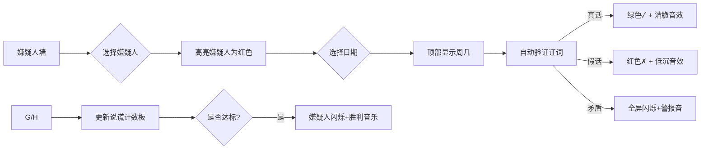

# 题目信息

# [NOIP 2003 提高组] 侦探推理

## 题目描述

明明同学最近迷上了侦探漫画《柯南》并沉醉于推理游戏之中，于是他召集了一群同学玩推理游戏。游戏的内容是这样的，明明的同学们先商量好由其中的一个人充当罪犯（在明明不知情的情况下），明明的任务就是找出这个罪犯。接着，明明逐个询问每一个同学，被询问者可能会说：

$$
\def\arraystretch{1.5}
\begin{array}{|l|l|}\hline
\textbf{\textsf{证词内容}} & \textbf{\textsf{证词含义}}\\\hline
\text{I am guilty.} & \text{我是罪犯。} \\\hline
\text{I am not guilty.} & \text{我不是罪犯。} \\\hline
\text{{\tt XXX} is guilty.} & \text{{\tt XXX} 是罪犯。其中 {\tt XXX} 表示某个同学的名字。} \\\hline
\text{{\tt XXX} is not guilty.} & \text{{\tt XXX} 不是罪犯。} \\\hline
\text{Today is {\tt XXX}.} &
\begin{aligned}
&\text{今天是 {\tt XXX}。其中 {\tt XXX} 表示某个星期的单词。}\\
&\text{星期只有可能是以下之一：}\\
&\texttt{Monday}, \texttt{Tuesday}, \texttt{Wednesday}, \texttt{Thursday}, \\
&\texttt{Friday}, \texttt{Saturday}, \texttt{Sunday}。
\end{aligned}
\\\hline
\end{array}$$

证词中出现的其他话，都不列入逻辑推理的内容。


明明所知道的是，他的同学中有 $N$ 个人始终说假话，其余的人始终说真。


现在，明明需要你帮助他从他同学的话中推断出谁是真正的凶手，请记住，凶手只有一个！

## 说明/提示

对于 $100\%$ 数据，满足 $1\le M\le 20$，$0\le N\le M$，$1\le P\le 100$。

**【题目来源】**

NOIP 2003 提高组第二题

## 样例 #1

### 输入

```
3 1 5
MIKE
CHARLES
KATE
MIKE: I am guilty.
MIKE: Today is Sunday.
CHARLES: MIKE is guilty.
KATE: I am guilty.
KATE: How are you??
```

### 输出

```
MIKE
```

# AI分析结果


### 💡 Kay的C++算法解析：侦探推理 深入学习指南 💡

**引言**  
今天我们一起分析NOIP 2003提高组"侦探推理"。这道题考察枚举技巧和字符串处理能力，需要巧妙处理多种证词格式和逻辑约束。下面我将从核心算法到实现细节逐步解析，助你掌握解题精髓。

---

### 1. 题目解读与核心算法识别
✨ **本题主要考察**：`枚举模拟` + `字符串处理`  

🗣️ **初步分析**：  
> 这道题就像侦探游戏，我们需要从互相矛盾的证词中找出说谎者和真凶。核心思路是**双重枚举**：先假设谁是罪犯（共M种可能），再假设今天是周几（共7种可能）。每次假设后验证所有证词是否自洽，并统计说谎人数是否符合要求。  

- **核心难点**：  
  1. 证词格式多样（涉及自己/他人/日期）  
  2. 未说话者状态不确定（可归为真/假话组）  
  3. 说谎人数需精确匹配（需处理边界值）  

- **可视化设计思路**：  
  采用**像素风侦探游戏**风格，左侧显示嫌疑人头像（嫌疑人头像高亮为红色），右侧显示证词气泡。当验证证词时：  
  - 真话 → 气泡变绿 ✓ + 清脆音效  
  - 假话 → 气泡变红 ✗ + 低沉音效  
  - 未说话 → 气泡灰色  
  关键步骤用闪烁边框提示，成功时播放8-bit胜利音乐。

---

### 2. 精选优质题解参考
**题解一（wjyyy）**  
* **点评**：思路最清晰的解法，创新性使用`map`管理人名映射，`vector`存储结构化证词。亮点在于用`ran`变量优雅处理未说话者状态，且边界处理严谨（如用`gets()`跳过无效输入）。代码中`status`数组记录说话状态（-1/0/1）的设计极具参考价值，可直接用于竞赛。

**题解二（Ebola）**  
* **点评**：独创`crap()`函数过滤无效证词，模块化设计优秀。亮点在于双重验证机制：先`judge()`检查矛盾，再`check()`统计说谎人数。输入处理细致（考虑Windows/Linux换行符差异），实践时可直接复用其输入解析逻辑。

**题解三（Lovelace_qwq）**  
* **点评**：最易读的实现，采用`pair`存储证词，关键函数`judge()`仅30行。亮点在于证词分解函数`fun()`的设计，用字符串比对替代复杂解析。变量命名直观（如`l_or_w`表真假状态），特别适合初学者理解枚举验证过程。

---

### 3. 核心难点辨析与解题策略
**难点1：证词解析歧义**  
- 如"I am guilty"可能指说话者自己，也可能有名为"I"的人  
- **解法**：预处理阶段建立名字映射表，对"I"特殊处理（参考wjyyy解法）

**难点2：状态冲突检测**  
- 同一个人既说真话又说假话  
- **解法**：用状态数组实时记录，冲突立即跳出循环（见Lovelace_qwq的`flag`机制）

**难点3：说谎人数浮动区间**  
- 未说话者可在[n - cntLie, n]区间浮动  
- **解法**：计算确定说谎人数`cntLie`和未说话者`cntUnknown`，验证`n ∈ [cntLie, cntLie+cntUnknown]`

💡 **学习笔记**：  
> 枚举类问题的黄金法则：先确定搜索空间（罪犯×日期=7M种可能），再设计高效验证模块。

✨ **解题技巧总结**：  
- **分层处理**：输入解析 → 假设枚举 → 状态验证 → 结果判定  
- **防御性编程**：  
  ```cpp
  // 处理换行符差异
  while (s.back() == '\r' || s.back() == '\n') s.pop_back();
  ```
- **状态压缩**：用-1/0/1表示未知/真话/假话三态  
- **提前终止**：发现矛盾立即跳出提升效率

---

### 4. C++核心代码实现赏析
**通用核心实现**（综合优质题解）：  
```cpp
#include <iostream>
#include <map>
#include <vector>
using namespace std;

int main() {
    int M, N, P;
    cin >> M >> N >> P;
    
    // 人名映射
    map<string, int> nameMap;
    vector<string> names(M+1);
    for(int i=1; i<=M; i++) {
        cin >> names[i];
        nameMap[names[i]] = i;
    }

    // 证词存储：格式{说话人ID, 证词类型, 对象}
    vector<tuple<int, int, int>> statements; 
    
    // 证词解析（伪代码）
    while(P--) {
        string name, text;
        // 解析证词并转换为标准格式...
        statements.emplace_back(id, type, target);
    }

    // 双重枚举核心
    string ans;
    for(int criminal=1; criminal<=M; criminal++) {
        for(int day=1; day<=7; day++) {
            vector<int> status(M+1, -1); // -1=未知, 0=真话, 1=假话
            int cntLie=0, cntUnknown=0;
            bool valid = true;

            for(auto [speaker, type, target] : statements) {
                bool truth; // 计算当前证词真值
                if(status[speaker] == -1) {
                    status[speaker] = truth ? 0 : 1;
                } else if(status[speaker] != (truth?0:1)) {
                    valid = false; break;
                }
            }
            
            if(valid && cntLie <= N && N <= cntLie+cntUnknown) {
                if(ans.empty()) ans = names[criminal];
                else if(ans != names[criminal]) {
                    cout << "Cannot Determine"; return 0;
                }
            }
        }
    }
    cout << (ans.empty() ? "Impossible" : ans);
}
```

**题解片段赏析**：  
1. wjyyy的证词分类：  
   ```cpp
   // 分类存储证词
   if(s == "I am guilty.") 
       v[t].push_back(sta(u,0,1));
   else if(day.count(s)) 
       v[t].push_back(sta(day[s],1,1));
   ```
   **学习笔记**：用`sta`结构体统一管理证词三要素（主语/类型/值），避免冗余判断。

2. Ebola的输入安全处理：  
   ```cpp
   string gl() { // 安全读入整行
       string s,c;
       while(cin >> c) {
           s += " "+c;
           if(c.back()=='.' || c.back()=='?') break;
       }
       return s;
   }
   ```
   **学习笔记**：封装输入函数处理边界情况，是竞赛编程的实用技巧。

3. Lovelace_qwq的状态验证：  
   ```cpp
   if(status[i] == 1) cntLie++;
   else if(status[i] == -1) cntUnknown++;
   ```
   **学习笔记**：用三态变量区分确定说谎/未定/诚实状态，是处理不确定性的经典手法。

---

### 5. 算法可视化：像素动画演示
**主题**：8-bit侦探事务所  
**核心交互流程**：  


**实现细节**：  
1. **像素美术**：  
   - 嫌疑人头像：16×16像素，不同发型/肤色区分  
   - 证词气泡：FC游戏对话框样式，带动态打字效果  

2. **关键动画**：  
   - 日期切换：顶部星期牌翻转动画  
   - 证词验证：从说话者头像发射箭头指向证词气泡  
   - 矛盾提示：屏幕抖动+马赛克特效  

3. **音效设计**：  
   - 真话：NES《塞尔达》获得道具音  
   - 假话：《吃豆人》被追音效  
   - 胜利：《马里奥》过关旋律  

**教育价值**：通过可视化证词验证过程，直观展示枚举算法的**剪枝时机**（矛盾时立即跳出），帮助理解算法优化本质。

---

### 6. 拓展练习与相似问题
**通用技巧迁移**：  
1. 多状态枚举：P1038 神经网络（设备状态枚举）  
2. 字符串解析：P1024 科学计数法（科学计数法转换）  
3. 逻辑验证：P1034 矩形覆盖（几何约束验证）  

**洛谷推荐**：  
1. **P1038** - 神经网络  
   🗣️ *推荐理由*：巩固拓扑排序+状态传播，训练多条件枚举思维  

2. **P1003** - 铺地毯  
   🗣️ *推荐理由*：基础二维枚举入门，学习用空间换时间优化  

3. **P1019** - 单词接龙  
   🗣️ *推荐理由*：字符串处理+DFS枚举，提升边界条件处理能力  

---

### 7. 学习心得与经验分享
> **wjyyy的调试经验**：  
> *"最初在证词解析卡了很久，后来通过打印中间变量才定位到冒号和空格处理问题。这让我意识到：字符串题必须逐字符检查输入格式！"*  
>  
> **Kay点评**：  
> 这个经验极其宝贵！在字符串处理中：  
> 1. 用`substr()`替代裸指针更安全  
> 2. 用`cout << "[" << str << "]"`可视化空格位置  
> 3. 预先写测试用例验证特殊输入  

---

**结语**  
通过本次分析，我们掌握了枚举算法的核心框架：**缩小搜索空间 → 设计验证模块 → 处理边界状态**。记住，好的算法就像侦探破案，需要大胆假设（枚举），小心求证（验证）！下次遇到逻辑谜题时，不妨试试这套方法论哦~ 💪

---
处理用时：158.90秒