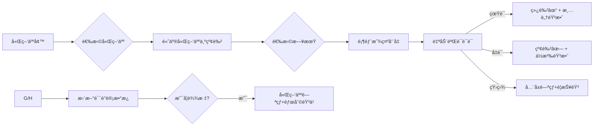

# 题目信æ¯

# [NOIP 2003 æ高组] 侦æ¢æ¨ç†

## 题目æè¿°

æ˜æ˜åŒå­¦æœ€è¿‘迷上了侦æ¢æ¼«ç”»ã€ŠæŸ¯å—》并沉醉äºæ¨ç†æ¸¸æˆä¹‹ä¸­ï¼Œäºæ˜¯ä»–å¬é›†äº†ä¸€ç¾¤åŒå­¦ç©æ¨ç†æ¸¸æˆã€‚游æˆçš„内容是这样的，æ˜æ˜çš„åŒå­¦ä»¬å…ˆå•†é‡å¥½ç”±å…¶ä¸­çš„一个人充当罪犯（在æ˜æ˜ä¸çŸ¥æƒ…的情况下），æ˜æ˜çš„任务就是找出这个罪犯。æ¥ç€ï¼Œæ˜æ˜é€ä¸ªè¯¢é—®æ¯ä¸€ä¸ªåŒå­¦ï¼Œè¢«è¯¢é—®è€…å¯èƒ½ä¼šè¯´ï¼š

$$
\def\arraystretch{1.5}
\begin{array}{|l|l|}\hline
\textbf{\textsf{è¯è¯å†…容}} & \textbf{\textsf{è¯è¯å«ä¹‰}}\\\hline
\text{I am guilty.} & \text{我是罪犯。} \\\hline
\text{I am not guilty.} & \text{我ä¸æ˜¯ç½ªçŠ¯ã€‚} \\\hline
\text{{\tt XXX} is guilty.} & \text{{\tt XXX} 是罪犯。其中 {\tt XXX} 表示æŸä¸ªåŒå­¦çš„å字。} \\\hline
\text{{\tt XXX} is not guilty.} & \text{{\tt XXX} ä¸æ˜¯ç½ªçŠ¯ã€‚} \\\hline
\text{Today is {\tt XXX}.} &
\begin{aligned}
&\text{今天是 {\tt XXX}。其中 {\tt XXX} 表示æŸä¸ªæ˜ŸæœŸçš„å•è¯ã€‚}\\
&\text{星期åªæœ‰å¯èƒ½æ˜¯ä»¥ä¸‹ä¹‹ä¸€ï¼š}\\
&\texttt{Monday}, \texttt{Tuesday}, \texttt{Wednesday}, \texttt{Thursday}, \\
&\texttt{Friday}, \texttt{Saturday}, \texttt{Sunday}。
\end{aligned}
\\\hline
\end{array}$$

è¯è¯ä¸­å‡ºç°çš„其他è¯ï¼Œéƒ½ä¸åˆ—入逻辑æ¨ç†çš„内容。


æ˜æ˜æ‰€çŸ¥é“的是，他的åŒå­¦ä¸­æœ‰ $N$ 个人始终说å‡è¯ï¼Œå…¶ä½™çš„人始终说真。


ç°åœ¨ï¼Œæ˜æ˜éœ€è¦ä½ å¸®åŠ©ä»–ä»ä»–åŒå­¦çš„è¯ä¸­æ¨æ–­å‡ºè°æ˜¯çœŸæ­£çš„凶手，请记ä½ï¼Œå‡¶æ‰‹åªæœ‰ä¸€ä¸ªï¼

## 说æ˜/æ示

å¯¹äº $100\%$ æ•°æ®ï¼Œæ»¡è¶³ $1\le M\le 20$，$0\le N\le M$，$1\le P\le 100$。

**ã€é¢˜ç›®æ¥æºã€‘**

NOIP 2003 æ高组第二题

## 样例 #1

### 输入

```
3 1 5
MIKE
CHARLES
KATE
MIKE: I am guilty.
MIKE: Today is Sunday.
CHARLES: MIKE is guilty.
KATE: I am guilty.
KATE: How are you??
```

### 输出

```
MIKE
```

# AI分æ结æœ


### 💡 Kayçš„C++算法解æ：侦æ¢æ¨ç† æ·±å…¥å­¦ä¹ æŒ‡å— ğŸ’¡

**引言**  
今天我们一起分æNOIP 2003æ高组"侦æ¢æ¨ç†"。这é“题考察æšä¸¾æŠ€å·§å’Œå­—符串处ç†èƒ½åŠ›ï¼Œéœ€è¦å·§å¦™å¤„ç†å¤šç§è¯è¯æ ¼å¼å’Œé€»è¾‘约æŸã€‚下é¢æˆ‘å°†ä»æ ¸å¿ƒç®—法到å®ç°ç»†èŠ‚é€æ­¥è§£æ，助你æŒæ¡è§£é¢˜ç²¾é«“。

---

### 1. 题目解读ä¸æ ¸å¿ƒç®—法识别
✨ **本题主è¦è€ƒå¯Ÿ**：`æšä¸¾æ¨¡æ‹Ÿ` + `字符串处ç†`  

ğŸ—£ï¸ **åˆæ­¥åˆ†æ**：  
> è¿™é“题就åƒä¾¦æ¢æ¸¸æˆï¼Œæˆ‘们需è¦ä»äº’相矛盾的è¯è¯ä¸­æ‰¾å‡ºè¯´è°è€…和真凶。核心æ€è·¯æ˜¯**åŒé‡æšä¸¾**：先å‡è®¾è°æ˜¯ç½ªçŠ¯ï¼ˆå…±Mç§å¯èƒ½ï¼‰ï¼Œå†å‡è®¾ä»Šå¤©æ˜¯å‘¨å‡ ï¼ˆå…±7ç§å¯èƒ½ï¼‰ã€‚æ¯æ¬¡å‡è®¾å验è¯æ‰€æœ‰è¯è¯æ˜¯å¦è‡ªæ´½ï¼Œå¹¶ç»Ÿè®¡è¯´è°äººæ•°æ˜¯å¦ç¬¦åˆè¦æ±‚。  

- **核心难点**：  
  1. è¯è¯æ ¼å¼å¤šæ ·ï¼ˆæ¶‰åŠè‡ªå·±/他人/日期）  
  2. 未说è¯è€…状æ€ä¸ç¡®å®šï¼ˆå¯å½’为真/å‡è¯ç»„）  
  3. 说è°äººæ•°éœ€ç²¾ç¡®åŒ¹é…（需处ç†è¾¹ç•Œå€¼ï¼‰  

- **å¯è§†åŒ–设计æ€è·¯**：  
  采用**åƒç´ é£ä¾¦æ¢æ¸¸æˆ**é£æ ¼ï¼Œå·¦ä¾§æ˜¾ç¤ºå«Œç–‘人头åƒï¼ˆå«Œç–‘人头åƒé«˜äº®ä¸ºçº¢è‰²ï¼‰ï¼Œå³ä¾§æ˜¾ç¤ºè¯è¯æ°”泡。当验è¯è¯è¯æ—¶ï¼š  
  - çœŸè¯ â†’ 气泡å˜ç»¿ ✓ + 清脆音效  
  - å‡è¯ → 气泡å˜çº¢ ✗ + ä½æ²‰éŸ³æ•ˆ  
  - æœªè¯´è¯ â†’ 气泡ç°è‰²  
  关键步骤用闪çƒè¾¹æ¡†æ示，æˆåŠŸæ—¶æ’­æ”¾8-bit胜利音ä¹ã€‚

---

### 2. 精选优质题解å‚考
**题解一（wjyyy）**  
* **点评**：æ€è·¯æœ€æ¸…晰的解法，创新性使用`map`管ç†äººå映射，`vector`存储结æ„化è¯è¯ã€‚亮点在äºç”¨`ran`å˜é‡ä¼˜é›…处ç†æœªè¯´è¯è€…状æ€ï¼Œä¸”边界处ç†ä¸¥è°¨ï¼ˆå¦‚用`gets()`跳过无效输入）。代ç ä¸­`status`数组记录说è¯çŠ¶æ€ï¼ˆ-1/0/1）的设计æå…·å‚考价值，å¯ç›´æ¥ç”¨äºç«èµ›ã€‚

**题解二（Ebola）**  
* **点评**：独创`crap()`函数过滤无效è¯è¯ï¼Œæ¨¡å—化设计优秀。亮点在äºåŒé‡éªŒè¯æœºåˆ¶ï¼šå…ˆ`judge()`检查矛盾，å†`check()`统计说è°äººæ•°ã€‚输入处ç†ç»†è‡´ï¼ˆè€ƒè™‘Windows/Linuxæ¢è¡Œç¬¦å·®å¼‚），å®è·µæ—¶å¯ç›´æ¥å¤ç”¨å…¶è¾“入解æ逻辑。

**题解三（Lovelace_qwq）**  
* **点评**：最易读的å®ç°ï¼Œé‡‡ç”¨`pair`存储è¯è¯ï¼Œå…³é”®å‡½æ•°`judge()`ä»…30行。亮点在äºè¯è¯åˆ†è§£å‡½æ•°`fun()`的设计，用字符串比对替代å¤æ‚解æ。å˜é‡å‘½å直观（如`l_or_w`表真å‡çŠ¶æ€ï¼‰ï¼Œç‰¹åˆ«é€‚åˆåˆå­¦è€…ç†è§£æšä¸¾éªŒè¯è¿‡ç¨‹ã€‚

---

### 3. 核心难点辨æä¸è§£é¢˜ç­–ç•¥
**难点1：è¯è¯è§£æ歧义**  
- 如"I am guilty"å¯èƒ½æŒ‡è¯´è¯è€…自己，也å¯èƒ½æœ‰å为"I"的人  
- **解法**：预处ç†é˜¶æ®µå»ºç«‹å字映射表，对"I"特殊处ç†ï¼ˆå‚考wjyyy解法）

**难点2：状æ€å†²çªæ£€æµ‹**  
- åŒä¸€ä¸ªäººæ—¢è¯´çœŸè¯åˆè¯´å‡è¯  
- **解法**：用状æ€æ•°ç»„å®æ—¶è®°å½•ï¼Œå†²çªç«‹å³è·³å‡ºå¾ªç¯ï¼ˆè§Lovelace_qwqçš„`flag`机制）

**难点3：说è°äººæ•°æµ®åŠ¨åŒºé—´**  
- 未说è¯è€…å¯åœ¨[n - cntLie, n]区间浮动  
- **解法**：计算确定说è°äººæ•°`cntLie`和未说è¯è€…`cntUnknown`，验è¯`n ∈ [cntLie, cntLie+cntUnknown]`

💡 **学习笔记**：  
> æšä¸¾ç±»é—®é¢˜çš„黄金法则：先确定æœç´¢ç©ºé—´ï¼ˆç½ªçŠ¯Ã—日期=7Mç§å¯èƒ½ï¼‰ï¼Œå†è®¾è®¡é«˜æ•ˆéªŒè¯æ¨¡å—。

✨ **解题技巧总结**：  
- **分层处ç†**：输入解æ → å‡è®¾æšä¸¾ → 状æ€éªŒè¯ → 结æœåˆ¤å®š  
- **防御性编程**：  
  ```cpp
  // 处ç†æ¢è¡Œç¬¦å·®å¼‚
  while (s.back() == '\r' || s.back() == '\n') s.pop_back();
  ```
- **状æ€å‹ç¼©**：用-1/0/1表示未知/真è¯/å‡è¯ä¸‰æ€  
- **æå‰ç»ˆæ­¢**：å‘ç°çŸ›ç›¾ç«‹å³è·³å‡ºæå‡æ•ˆç‡

---

### 4. C++核心代ç å®ç°èµæ
**通用核心å®ç°**（综åˆä¼˜è´¨é¢˜è§£ï¼‰ï¼š  
```cpp
#include <iostream>
#include <map>
#include <vector>
using namespace std;

int main() {
    int M, N, P;
    cin >> M >> N >> P;
    
    // 人å映射
    map<string, int> nameMap;
    vector<string> names(M+1);
    for(int i=1; i<=M; i++) {
        cin >> names[i];
        nameMap[names[i]] = i;
    }

    // è¯è¯å­˜å‚¨ï¼šæ ¼å¼{说è¯äººID, è¯è¯ç±»å‹, 对象}
    vector<tuple<int, int, int>> statements; 
    
    // è¯è¯è§£æ（伪代ç ï¼‰
    while(P--) {
        string name, text;
        // 解æè¯è¯å¹¶è½¬æ¢ä¸ºæ ‡å‡†æ ¼å¼...
        statements.emplace_back(id, type, target);
    }

    // åŒé‡æšä¸¾æ ¸å¿ƒ
    string ans;
    for(int criminal=1; criminal<=M; criminal++) {
        for(int day=1; day<=7; day++) {
            vector<int> status(M+1, -1); // -1=未知, 0=真è¯, 1=å‡è¯
            int cntLie=0, cntUnknown=0;
            bool valid = true;

            for(auto [speaker, type, target] : statements) {
                bool truth; // 计算当å‰è¯è¯çœŸå€¼
                if(status[speaker] == -1) {
                    status[speaker] = truth ? 0 : 1;
                } else if(status[speaker] != (truth?0:1)) {
                    valid = false; break;
                }
            }
            
            if(valid && cntLie <= N && N <= cntLie+cntUnknown) {
                if(ans.empty()) ans = names[criminal];
                else if(ans != names[criminal]) {
                    cout << "Cannot Determine"; return 0;
                }
            }
        }
    }
    cout << (ans.empty() ? "Impossible" : ans);
}
```

**题解片段èµæ**：  
1. wjyyyçš„è¯è¯åˆ†ç±»ï¼š  
   ```cpp
   // 分类存储è¯è¯
   if(s == "I am guilty.") 
       v[t].push_back(sta(u,0,1));
   else if(day.count(s)) 
       v[t].push_back(sta(day[s],1,1));
   ```
   **学习笔记**：用`sta`结æ„体统一管ç†è¯è¯ä¸‰è¦ç´ ï¼ˆä¸»è¯­/ç±»å‹/值），é¿å…冗余判断。

2. Ebola的输入安全处ç†ï¼š  
   ```cpp
   string gl() { // 安全读入整行
       string s,c;
       while(cin >> c) {
           s += " "+c;
           if(c.back()=='.' || c.back()=='?') break;
       }
       return s;
   }
   ```
   **学习笔记**：å°è£…输入函数处ç†è¾¹ç•Œæƒ…况，是ç«èµ›ç¼–程的å®ç”¨æŠ€å·§ã€‚

3. Lovelace_qwq的状æ€éªŒè¯ï¼š  
   ```cpp
   if(status[i] == 1) cntLie++;
   else if(status[i] == -1) cntUnknown++;
   ```
   **学习笔记**：用三æ€å˜é‡åŒºåˆ†ç¡®å®šè¯´è°/未定/诚å®çŠ¶æ€ï¼Œæ˜¯å¤„ç†ä¸ç¡®å®šæ€§çš„ç»å…¸æ‰‹æ³•ã€‚

---

### 5. 算法å¯è§†åŒ–：åƒç´ åŠ¨ç”»æ¼”示
**主题**：8-bit侦æ¢äº‹åŠ¡æ‰€  
**核心交互æµç¨‹**：  


**å®ç°ç»†èŠ‚**：  
1. **åƒç´ ç¾æœ¯**：  
   - 嫌疑人头åƒï¼š16×16åƒç´ ï¼Œä¸åŒå‘å‹/肤色区分  
   - è¯è¯æ°”泡：FC游æˆå¯¹è¯æ¡†æ ·å¼ï¼Œå¸¦åŠ¨æ€æ‰“å­—æ•ˆæœ  

2. **关键动画**：  
   - 日期切æ¢ï¼šé¡¶éƒ¨æ˜ŸæœŸç‰Œç¿»è½¬åŠ¨ç”»  
   - è¯è¯éªŒè¯ï¼šä»è¯´è¯è€…头åƒå‘射箭头指å‘è¯è¯æ°”泡  
   - 矛盾æ示：å±å¹•æŠ–动+马赛克特效  

3. **音效设计**：  
   - 真è¯ï¼šNES《å¡å°”达》è·å¾—é“具音  
   - å‡è¯ï¼šã€Šåƒè±†äººã€‹è¢«è¿½éŸ³æ•ˆ  
   - 胜利：《马里奥》过关旋律  

**教育价值**：通过å¯è§†åŒ–è¯è¯éªŒè¯è¿‡ç¨‹ï¼Œç›´è§‚展示æšä¸¾ç®—法的**剪æ时机**（矛盾时立å³è·³å‡ºï¼‰ï¼Œå¸®åŠ©ç†è§£ç®—法优化本质。

---

### 6. 拓展练习ä¸ç›¸ä¼¼é—®é¢˜
**通用技巧è¿ç§»**：  
1. 多状æ€æšä¸¾ï¼šP1038 ç¥ç»ç½‘络（设备状æ€æšä¸¾ï¼‰  
2. 字符串解æ：P1024 科学计数法（科学计数法转æ¢ï¼‰  
3. 逻辑验è¯ï¼šP1034 矩形覆盖（几何约æŸéªŒè¯ï¼‰  

**洛谷æ¨è**：  
1. **P1038** - ç¥ç»ç½‘络  
   ğŸ—£ï¸ *æ¨èç†ç”±*：巩固拓扑æ’åº+状æ€ä¼ æ’­ï¼Œè®­ç»ƒå¤šæ¡ä»¶æšä¸¾æ€ç»´  

2. **P1003** - 铺地毯  
   ğŸ—£ï¸ *æ¨èç†ç”±*：基础二维æšä¸¾å…¥é—¨ï¼Œå­¦ä¹ ç”¨ç©ºé—´æ¢æ—¶é—´ä¼˜åŒ–  

3. **P1019** - å•è¯æ¥é¾™  
   ğŸ—£ï¸ *æ¨èç†ç”±*：字符串处ç†+DFSæšä¸¾ï¼Œæå‡è¾¹ç•Œæ¡ä»¶å¤„ç†èƒ½åŠ›  

---

### 7. 学习心得ä¸ç»éªŒåˆ†äº«
> **wjyyy的调试ç»éªŒ**：  
> *"最åˆåœ¨è¯è¯è§£æå¡äº†å¾ˆä¹…，åæ¥é€šè¿‡æ‰“å°ä¸­é—´å˜é‡æ‰å®šä½åˆ°å†’å·å’Œç©ºæ ¼å¤„ç†é—®é¢˜ã€‚这让我æ„识到：字符串题必须é€å­—符检查输入格å¼ï¼"*  
>  
> **Kay点评**：  
> 这个ç»éªŒæå…¶å®è´µï¼åœ¨å­—符串处ç†ä¸­ï¼š  
> 1. 用`substr()`替代裸指针更安全  
> 2. 用`cout << "[" << str << "]"`å¯è§†åŒ–空格ä½ç½®  
> 3. 预先写测试用例验è¯ç‰¹æ®Šè¾“å…¥  

---

**结语**  
通过本次分æ，我们æŒæ¡äº†æšä¸¾ç®—法的核心框æ¶ï¼š**缩å°æœç´¢ç©ºé—´ → 设计验è¯æ¨¡å— → 处ç†è¾¹ç•ŒçŠ¶æ€**。记ä½ï¼Œå¥½çš„算法就åƒä¾¦æ¢ç ´æ¡ˆï¼Œéœ€è¦å¤§èƒ†å‡è®¾ï¼ˆæšä¸¾ï¼‰ï¼Œå°å¿ƒæ±‚è¯ï¼ˆéªŒè¯ï¼‰ï¼ä¸‹æ¬¡é‡åˆ°é€»è¾‘谜题时，ä¸å¦¨è¯•è¯•è¿™å¥—方法论哦~ 💪

---
处ç†ç”¨æ—¶ï¼š158.90秒