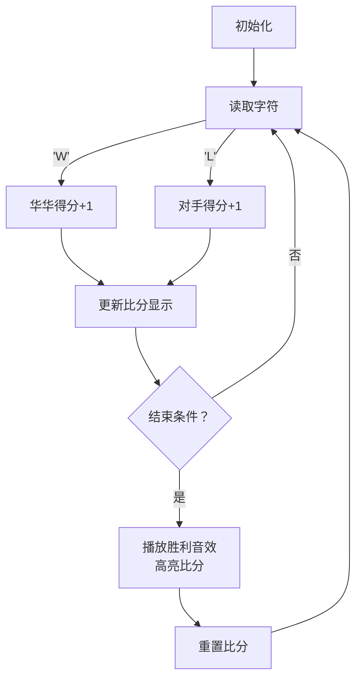

# 题目信息

# [NOIP 2003 普及组] 乒乓球

## 题目背景

国际乒联现在主席沙拉拉自从上任以来就立志于推行一系列改革，以推动乒乓球运动在全球的普及。其中 $11$ 分制改革引起了很大的争议，有一部分球员因为无法适应新规则只能选择退役。华华就是其中一位，他退役之后走上了乒乓球研究工作，意图弄明白 $11$ 分制和 $21$ 分制对选手的不同影响。在开展他的研究之前，他首先需要对他多年比赛的统计数据进行一些分析，所以需要你的帮忙。

## 题目描述

华华通过以下方式进行分析，首先将比赛每个球的胜负列成一张表，然后分别计算在 $11$ 分制和 $21$ 分制下，双方的比赛结果（截至记录末尾）。

比如现在有这么一份记录，（其中 $\texttt W$ 表示华华获得一分，$\texttt L$ 表示华华对手获得一分）：

$$\texttt{WWWWWWWWWWWWWWWWWWWWWWLW}$$

在 $11$ 分制下，此时比赛的结果是华华第一局 $11$ 比 $0$ 获胜，第二局 $11$ 比 $0$ 获胜，正在进行第三局，当前比分 $1$ 比 $1$。而在 $21$ 分制下，此时比赛结果是华华第一局 $21$ 比 $0$ 获胜，正在进行第二局，比分 $2$ 比 $1$。如果一局比赛刚开始，则此时比分为 $0$ 比 $0$。直到分差大于或者等于 $2$，才一局结束。

**注意：当一局比赛结束后，下一局立刻开始**。

你的程序就是要对于一系列比赛信息的输入（$\texttt{WL}$ 形式），输出正确的结果。


## 说明/提示

每行至多 $25$ 个字母，最多有 $2500$ 行。

（注：事实上有一个测试点有 $2501$ 行数据。）

**【题目来源】**

NOIP 2003 普及组第一题

## 样例 #1

### 输入

```
WWWWWWWWWWWWWWWWWWWW
WWLWE
```

### 输出

```
11:0
11:0
1:1

21:0
2:1
```

# AI分析结果


### 💡 Kay的C++算法解析：乒乓球 深入学习指南 💡

#### 引言
今天我们来分析NOIP 2003普及组的"乒乓球"题目。这道题要求根据比赛记录（W/L字符串）分别输出11分制和21分制下的比赛结果。本指南将帮助你掌握模拟算法的核心思想，理解代码实现技巧，并通过有趣的动画演示加深理解。

---

### 1. 题目解读与核心算法识别
✨ **本题主要考察**：`模拟应用`

🗣️ **初步分析**：
> 解决乒乓球计分问题就像在游戏中实时更新比分牌。核心是模拟比赛流程：读取每个球的胜负记录，根据特定规则（11分或21分制）判断何时结束一局。  
> - **核心流程**：遍历输入字符串→更新比分→检查结束条件（得分≥阈值且分差≥2）→输出结果→重置比分
> - **可视化设计**：将比分变化设计成像素乒乓球桌实时记分牌，用不同颜色标记关键操作（得分、局结束），配以经典8-bit音效
> - **游戏化元素**：采用红白机风格界面，球拍击球音效对应得分，胜利时播放经典通关音乐

---

### 2. 精选优质题解参考

**题解一（DengDuck）**
* **点评**：思路清晰直白，用函数封装计分逻辑（`Work(int Lim)`）避免代码重复，完美体现"一次编写多次使用"思想。代码规范（变量名`A/B`直观），利用C++11的`for(char i:S)`遍历语法提升可读性。亮点是将11分/21分制统一处理，显著提升代码复用性和可维护性。

**题解二（qhr2023）**
* **点评**：实现极致简洁（仅17行），三目运算符`i=='W'?a++:b++`高效处理计分。边界处理严谨（`abs(a-b)>=2`），输入输出格式完全符合竞赛要求。亮点是时间复杂度O(n)的最优实现，适合作为竞赛模板代码。

**题解三（lucky_Mrzhao）**
* **点评**：模块化设计优秀，将模拟逻辑封装为`num(int k)`函数。输入处理稳健（`while(cin>>c[++tot])`），详细注释帮助初学者理解。亮点是通过函数参数抽象分制规则，示范了良好的工程实践。

---

### 3. 核心难点辨析与解题策略

1. **难点：输入的多行处理与终止条件**
   * **分析**：输入含多行且以'E'结束。优质题解采用`while(cin>>ch)`循环配合`if(ch=='E')break`，确保跨行读取完整数据
   * 💡 **学习笔记**：`cin`在读取失败时返回0的特性可优雅处理输入终止

2. **难点：比分结算的复合条件判断**
   * **分析**：必须同时满足：①max(得分)≥阈值（11/21） ②|分差|≥2。题解使用`if(max(a,b)>=k && abs(a-b)>=2)`精准实现
   * 💡 **学习笔记**：复合条件需用逻辑与(&&)连接，顺序不影响结果

3. **难点：避免代码重复处理不同分制**
   * **分析**：将计分逻辑封装为带参数的函数（如`Work(int Lim)`），通过参数区分11/21分制
   * 💡 **学习笔记**：函数封装是减少重复代码的核心技巧

#### ✨ 解题技巧总结
- **输入处理技巧**：循环读取字符直到'E'，忽略无关字符
- **状态管理**：用两个整型变量跟踪比分，满足条件后立即重置
- **输出规范**：每局结束输出比分，最后输出未完成局比分，分制间空行分隔
- **代码复用**：抽象通用逻辑为函数，通过参数控制差异

---

### 4. C++核心代码实现赏析

**通用核心实现参考**
```cpp
#include <iostream>
#include <string>
using namespace std;

void simulate(string s, int limit) {
    int a = 0, b = 0;
    for (char ch : s) {
        if (ch == 'W') a++;
        else if (ch == 'L') b++;
        
        if ((a >= limit || b >= limit) && abs(a - b) >= 2) {
            cout << a << ":" << b << endl;
            a = b = 0;
        }
    }
    cout << a << ":" << b << endl << endl;
}

int main() {
    string s, tmp;
    while (cin >> tmp) s += tmp;
    simulate(s, 11);
    simulate(s, 21);
    return 0;
}
```
* **说明**：综合优质题解优化的通用实现，完整包含输入处理与双分制模拟
* **代码解读概要**：
  1. 循环读取输入到字符串`s`
  2. `simulate()`函数封装核心逻辑：遍历字符串更新比分
  3. 复合条件判断是否结束当前局
  4. 最后输出未完成局比分

---

**题解一核心片段**
```cpp
void Work(int Lim) {
    for(char i : S) {
        if(i=='W') A++;
        if(i=='L') B++;
        if(max(A,B)>=Lim && abs(A-B)>=2) {
            cout << A << ":" << B << endl;
            A = B = 0;
        }
    }
    printf("%d:%d\n\n", A, B);
}
```
* **亮点**：函数封装实现逻辑复用
* **代码解读**：
  - `Lim`参数决定11/21分制
  - `max(A,B)>=Lim`检测是否达分数阈值
  - `abs(A-B)>=2`确保分差足够
  - 重置比分前输出结果
* 💡 **学习笔记**：函数参数化是处理相似逻辑的银弹

**题解二核心片段**
```cpp
void solve (int k) {
    int a=0, b=0;
    for (char i : s) {
        i=='W' ? a++ : b++;
        if (max(a, b)>=k && abs(a-b)>=2) {
            cout << a << ':' << b << '\n';
            a=b=0;
        }
    }
    cout << a << ':' << b << "\n\n";
}
```
* **亮点**：三目运算符精简计分代码
* **代码解读**：
  - `i=='W'?a++:b++` 一行完成胜负判断
  - 条件满足时立即输出并重置
  - 最后处理未完成局
* 💡 **学习笔记**：三目运算符可提升简洁性但需保持可读性

---

### 5. 算法可视化：像素动画演示

**主题**：红白机风格乒乓球记分牌  
**核心演示**：实时比分变化与局结束判定  



**交互设计**：
1. **像素风格UI**：
   - 8-bit球桌背景（棕色像素网格）
   - 左侧红队（华华），右侧蓝队（对手）
   - 顶部LED像素字体显示当前比分（黄色）

2. **动态效果**：
   - 得分时对应球拍闪光+「叮」音效
   - 比分数字跳动更新（缩放动画）
   - 局结束：屏幕闪烁+胜利音乐（FC过关音效）

3. **控制面板**：
   - 速度滑块：控制计分速度
   - 单步执行：空格键逐球推进
   - 分制切换：11分/21分制按钮

4. **AI演示模式**：
   - 自动播放完整比赛
   - 关键步骤暂停并显示提示框
   - 结束局时显示"ROUND CLEAR!"像素文字

**技术实现**：
- Canvas绘制球桌/球拍/比分
- Web Audio API实现8-bit音效
- requestAnimationFrame驱动动画

---

### 6. 拓展练习与相似问题

**通用技巧迁移**：
1. 多状态模拟（如电梯运行控制）
2. 条件触发的状态重置（如游戏关卡设计）
3. 实时数据流处理（如传感器数据分析）

**洛谷题目推荐**：
1. **P1563 玩具谜题**  
   → 掌握方向判断与环形数组处理
2. **P1067 多项式输出**  
   → 训练复杂条件判断与格式化输出
3. **P1328 生活大爆炸版石头剪刀布**  
   → 实践状态转移与规则模拟

---

### 7. 学习心得与经验分享

> **经验摘录（DengDuck）**：  
> "将11分/21分制逻辑封装为函数，避免重复代码是本题关键"

> **Kay点评**：  
> 这是函数抽象思想的完美示范。当遇到相似逻辑时，思考：  
> 1. 哪些部分是完全相同的？  
> 2. 哪些是可变参数？  
> 3. 如何设计函数接口？  
> 这种思维可应用于90%的模拟题型

---

### 结语
乒乓球问题教会我们：编程如球赛，需把握核心规则（算法），灵活应对变化（参数化）。记住，优秀的代码如同精彩的乒乓球对决——简洁有力、进退有度！下次见！💪

---
处理用时：116.37秒