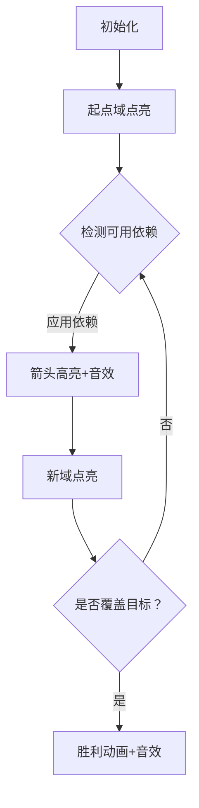

# 题目信息

# 冗余依赖

## 题目描述

在设计关系数据库的表格时，术语“函数依赖”（FD）被用来表示不同域之间的关系。函数依赖是描述一个集合中的域的值与另一个集合中的域的值之间的关系。记号 $X \to Y$ 被用来表示当集合 $X$ 中的域被赋值后，集合 $Y$ 的域就可以确定相应的值。例如，一个数据表格包含“社会治安编号”（$S$）、“姓名”（$N$）、“地址”（$A$）、“电话”（$P$）的域，并且每个人都与某个特定的互不相同的 $S$ 值相对应，根据域 $S$ 就可以确定域 $N$ 、 $A$ 、 $P$ 的值。这就记作 $S \to \{N,A,P\}$。

写一个程序以找出一组依赖中所有的冗余依赖。一个依赖是冗余的是指它可以通过组里的其他依赖得到。例如，如果组里包括依赖 $A \to B$ 、 $B \to C$ 和 $A \to C$，那么第三个依赖是冗余的，因为域 $C$ 可以用前两个依赖得到（域 $A$ 确定了域 $B$ 的值，同样域 $B$ 确定了域 $C$ 的值）。在 $A \to B$ 、 $B \to C$ 、 $C \to A$ 、 $A \to C$ 、 $C \to B$ 和 $B \to A$ 中，所有的依赖都是冗余的。

现在要求你编写一个程序，从给定的依赖关系中找出冗余的。

## 说明/提示

### 样例 1 解释

依赖关系 $3$ 是冗余的。因为 $A\to C$ 可以使用前两个依赖关系 $A\to \{B,D\}$ 和 $\{B, D\}\to C$ 得到。

## 样例 #1

### 输入

```
3
A->BD
BD->C
A->C
```

### 输出

```
FD 3 is redundant using FDs: 1 2
```

## 样例 #2

### 输入

```
6
P->RST
VRT->SQP
PS->T
Q->TR
QS->P
SR->V
```

### 输出

```
FD 3 is redundant using FDs: 1
FD 5 is redundant using FDs: 4 6 2```

# AI分析结果


# 💡 Kay的C++算法解析：冗余依赖 深入学习指南 💡

**引言**  
今天我们一起分析"冗余依赖"这道函数依赖相关的算法题。本指南将帮助大家理解如何识别冗余依赖，掌握闭包计算的核心思想，并学习高效的推导路径搜索技巧。

## 1. 题目解读与核心算法识别

✨ **本题主要考察**：`闭包计算与路径搜索` (算法分类：搜索/BFS/DFS)  

🗣️ **初步分析**：  
> 解决"冗余依赖"的关键在于理解函数依赖的传递性。就像拼图游戏，已知域是拼图块，依赖是连接规则，我们需要用其他拼图块证明目标块是否冗余。  
> - 核心思路：对每个依赖X→Y，排除它后用其他依赖计算X的闭包，若闭包包含Y则冗余  
> - 难点：如何高效计算闭包？如何记录最短推导路径？  
> - 可视化设计：用像素网格表示域（A-Z），依赖显示为箭头。应用依赖时高亮箭头并播放音效，新域亮起。控制面板支持单步/自动播放，胜利时触发8-bit胜利音效  

---

## 2. 精选优质题解参考

### 题解一：无尽 (BFS实现)
* **点评**：  
思路清晰，用BFS自然获得最短路径。变量命名`pred/e`稍隐晦，但队列实现避免了递归溢出。亮点在于路径记录逻辑完整，可直接输出依赖序列。调试代码`if(e[x]+1==84046)`影响可读性。

### 题解二：无名之雾 (DFS实现)
* **点评**：  
代码结构最规范，变量名`head/tail`直观。分预处理和DFS两阶段：先快速筛选冗余依赖，再搜索最短路径。亮点是位运算高效处理集合，剪枝优化控制搜索深度。

---

## 3. 核心难点辨析与解题策略

1. **难点：闭包计算优化**  
   * **分析**：暴力检查所有依赖会导致O(n²)复杂度。优质解用位运算（26位整数表集合）将集合操作转为位运算，判断包含用`(A&B)==B`，合并用`A|=B`
   * 💡 **学习笔记**：位运算使集合操作降为O(1)

2. **难点：推导路径记录**  
   * **分析**：BFS用`pred[]`数组回溯路径，DFS用`lin[]`动态记录路径。无名之雾解法维护全局`best`变量确保输出最短路径
   * 💡 **学习笔记**：BFS天然得最短路径，DFS需主动剪枝优化

3. **难点：避免重复计算**  
   * **分析**：预处理阶段标记已用依赖（`vis[]`），确保每个依赖只应用一次。DFS时及时回溯状态
   * 💡 **学习笔记**：状态回溯是搜索算法的核心技巧

### ✨ 解题技巧总结
- **位运算加速**：用整数二进制位表示集合，使∩/∪/⊆操作转为位运算
- **分层处理**：先筛冗余依赖，再找最短路径，降低问题复杂度
- **剪枝优化**：DFS中比较当前步数`step`与全局`best`，避免无效搜索
- **状态回溯**：DFS递归后重置`vis[i]=0`，确保路径互不干扰

---

## 4. C++核心代码实现赏析

**通用核心实现参考**  
* **说明**：综合无名之雾解法思路，包含位运算优化和DFS最短路径搜索
* **完整核心代码**：
```cpp
#include <iostream>
#include <cstring>
using namespace std;
const int N=101;
int head[N], tail[N], best, n;
bool ff[N], vis[N];
vector<int> path, ans;

// 位运算读取集合
void readSet(int &x) {
    char c; x=0;
    while(cin>>c && c>='A'&&c<='Z') 
        x |= 1<<(c-'A');
}

// DFS搜索最短路径
void dfs(int step, int cur, int goal) {
    if(step>=best) return;         // 剪枝：超过已知最短
    if((cur & goal)==goal) {       // 达成目标
        best=step;
        ans=path; return;
    }
    for(int i=1;i<=n;++i) {
        if(!vis[i] && (cur & head[i])==head[i]) {
            vis[i]=true;
            path.push_back(i);     // 记录路径
            dfs(step+1, cur|tail[i], goal);
            path.pop_back();       // 回溯
            vis[i]=false;
        }
    }
}

int main() {
    cin>>n;
    for(int i=1;i<=n;++i) {
        readSet(head[i]);
        string tmp; cin>>tmp;      // 跳过"-＞"
        readSet(tail[i]);
    }

    // 预处理：标记冗余依赖
    for(int i=1;i<=n;++i) {
        memset(vis,0,sizeof(vis));
        vis[i]=true;
        int cur=head[i], goal=tail[i];
        bool changed;
        do {
            changed=false;
            for(int j=1;j<=n;++j)
                if(!vis[j] && (cur & head[j])==head[j]) {
                    cur |= tail[j];
                    vis[j]=changed=true;
                }
        } while(changed);
        ff[i]=((cur & goal)==goal);
    }

    // DFS搜索输出路径
    for(int i=1;i<=n;++i) {
        if(!ff[i]) continue;
        memset(vis,0,sizeof(vis));
        vis[i]=true;  // 排除当前依赖
        best=1e9; path.clear();
        dfs(0, head[i], tail[i]);

        cout<<"FD "<<i<<" is redundant using FDs:";
        for(int x:ans) cout<<" "<<x;
        cout<<endl;
    }
    return 0;
}
```

**代码解读概要**：  
> 1. 位运算高效处理集合：`readSet`将字母转为位标记  
> 2. 预处理循环扩展闭包：`cur |= tail[j]`实现集合合并  
> 3. DFS搜索路径：`path`记录当前路径，`best`保存最短路径  
> 4. 回溯机制：递归后`pop_back`和`vis[i]=false`确保状态重置  

---

## 5. 算法可视化：像素动画演示

**主题**：8-bit风格"依赖推导之旅"  
**核心演示**：从起点域出发，应用依赖点亮新域，最终覆盖目标域  

### 设计思路
> 采用FC红白机像素风格，用不同颜色方块表示域状态：  
> - 灰色：未知域　黄色：已知域　红色：目标域  
> - 依赖显示为箭头（应用时高亮闪烁）  
> 音效增强操作反馈：选择依赖"叮"，达成目标播放胜利旋律  

### 动画帧步骤


1. **场景初始化**  
   - 26个字母域呈5x6网格排列，初始灰色
   - 控制面板：开始/单步/速度滑块/重置按钮
   - 8-bit背景音乐循环播放

2. **依赖应用演示**  
   - 当依赖左边域全黄时，箭头闪烁蓝色边框
   - 点击"应用"或自动触发：播放"叮"音效，右边域渐变为黄色
   - 左下角显示当前闭包集合（二进制+字母）

3. **路径记录**  
   - 顶部状态栏显示：`应用FD1: A→BD`
   - 依赖序列以FC游戏道具栏样式展示

4. **胜利状态**  
   - 目标域闪烁红光→绿光
   - 播放8-bit胜利音效（↑↑↓↓←→←→BA）
   - 显示最终路径：`FD3冗余 by FD1+FD2`

---

## 6. 拓展练习与相似问题思考

### 通用技巧迁移
闭包计算和推导路径搜索适用于：
1. 关系数据库函数依赖分析
2. 图论可达性判断（如传递闭包）
3. 逻辑推理系统的定理证明

### 推荐练习（洛谷）
1. **P1613 跑路**  
   🗣️ 巩固位运算技巧，用类似思想处理最短路径问题
2. **P2835 刻录光盘**  
   🗣️ 练习传递闭包计算，扩展多依赖场景
3. **P2114 [NOI2014] 起床困难综合症**  
   🗣️ 强化位运算应用，处理复杂状态合并

---

## 7. 学习心得与经验分享
> **无名之雾的调试经验**：  
> *"最初在DFS超时问题上卡了很久，后来通过剪枝优化和状态回溯解决。这提醒我们：搜索算法必须设置明确终止条件"*  
>  
> **Kay点评**：调试搜索算法时，可添加临时输出语句显示递归深度和当前状态，帮助定位性能瓶颈  

---

**结语**  
通过位运算优化和分层处理策略，我们高效解决了冗余依赖问题。记住：将复杂问题分解为预处理+搜索两个阶段是降低难度的关键。下次遇到类似问题，不妨想想今天的"像素推导之旅"！🚀

---
处理用时：234.51秒